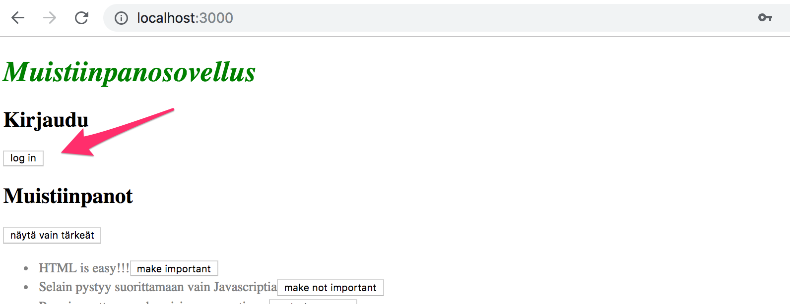
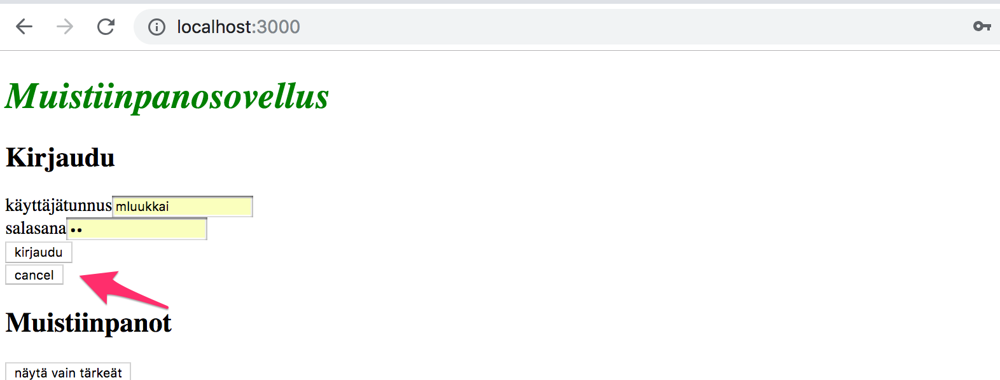
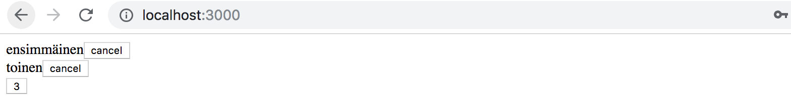
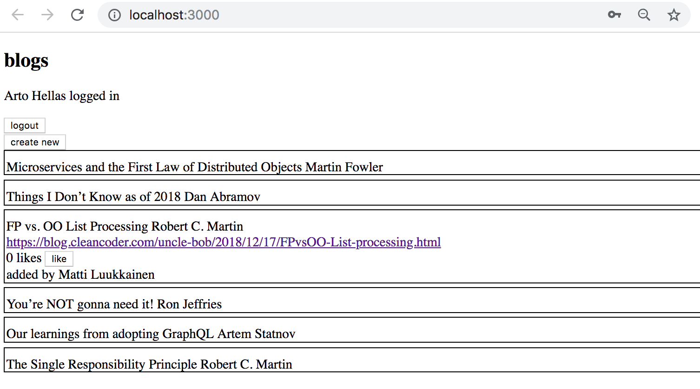
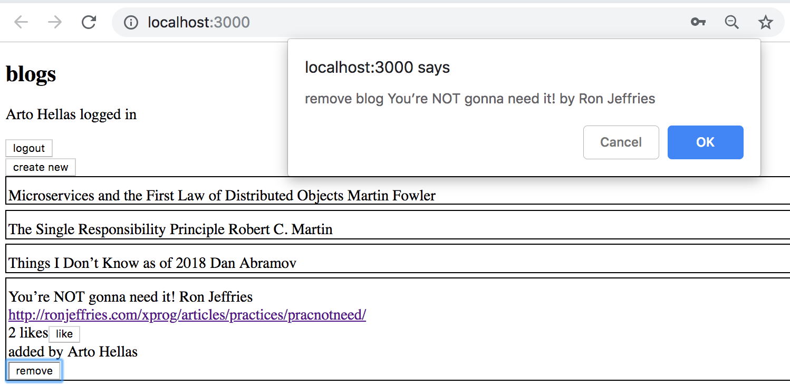
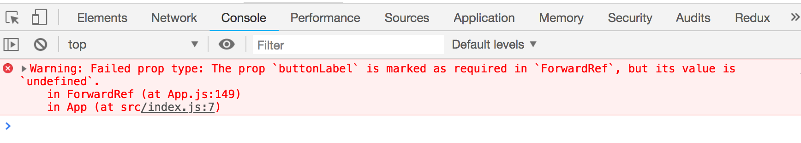
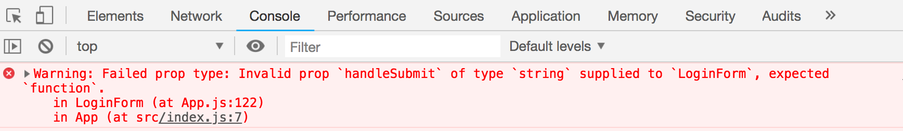

<div class="content">

### Kirjautumislomakkeen näyttäminen vain tarvittaessa

Muutetaan sovellusta siten, että kirjautumislomaketta ei oletusarvoisesti näytetä:



Lomake aukeaa, jos käyttäjä painaa nappia <i>login</i>:



Napilla <i>cancel</i> käyttäjä saa tarvittaessa suljettua lomakkeen.

Aloitetaan eristämällä kirjautumislomake omaksi komponentikseen:

```js
import React from 'react'

const LoginForm = ({
   handleSubmit,
   handleUsernameChange,
   handlePasswordChange,
   username,
   password
  }) => {
  return (
    <div>
      <h2>Kirjaudu</h2>

      <form onSubmit={handleSubmit}>
        <div>
          käyttäjätunnus
          <input
            value={username}
            onChange={handleUsernameChange}
          />
        </div>
        <div>
          salasana
          <input
            type="password"
            value={password}
            onChange={handlePasswordChange}
          />
      </div>
        <button type="submit">kirjaudu</button>
      </form>
    </div>
  )
}

export default LoginForm
```

Tila ja tilaa käsittelevät funktiot on kaikki määritelty komponentin ulkopuolella ja välitetään komponentille propseina.

Huomaa, että propsit otetaan vastaan <i>destrukturoimalla</i>, eli sen sijaan että määriteltäisiin

```js
const LoginForm = (props) => {
  return (
    <div>
      <h2>Kirjaudu</h2>
      <form onSubmit={props.handleSubmit}>
        <div>
          käyttäjätunnus
          <input
            value={props.username}
            onChange={props.handleChange}
            name="username"
          />
        </div>
        // ...
        <button type="submit">kirjaudu</button>
      </form>
    </div>
  )
}
```

jolloin muuttujan _props_ kenttiin on viitattava muuttujan kautta esim. _props.handleSubmit_, otetaan kentät suoraan vastaan omiin muuttujiinsa.

Nopea tapa toiminnallisuuden toteuttamiseen on muuttaa komponentin <i>App</i> käyttämä funktio _loginForm_ seuraavaan muotoon:

```js
const App = () => {
  const [loginVisible, setLoginVisible] = useState(false) // highlight-line

  // ...

  const loginForm = () => {
    const hideWhenVisible = { display: loginVisible ? 'none' : '' }
    const showWhenVisible = { display: loginVisible ? '' : 'none' }

    return (
      <div>
        <div style={hideWhenVisible}>
          <button onClick={() => setLoginVisible(true)}>log in</button>
        </div>
        <div style={showWhenVisible}>
          <LoginForm
            username={username}
            password={password}
            handleUsernameChange={({ target }) => setUsername(target.value)}
            handlePasswordChange={({ target }) => setPassword(target.value)}
            handleSubmit={handleLogin}
          />
          <button onClick={() => setLoginVisible(false)}>cancel</button>
        </div>
      </div>
    )
  }

  // ...
}
```

Komponentin <i>App</i> tilaan on nyt lisätty totuusarvo <i>loginVisible</i> joka määrittelee sen, näytetäänkö kirjautumislomake.

Näkyvyyttä säätelevää tilaa vaihdellaan kahden napin avulla, molempiin on kirjoitettu tapahtumankäsittelijän koodi suoraan:

```js
<button onClick={() => setLoginVisible(true)}>log in</button>

<button onClick={() => setLoginVisible(false)}>cancel</button>
```

Komponenttien näkyvyys on määritelty asettamalla komponentille [inline](/osa2/tyylien_lisaaminen_react_sovellukseen#inline-tyylit)-tyyleinä CSS-määrittely, jossa [display](https://developer.mozilla.org/en-US/docs/Web/CSS/display)-propertyn arvoksi asetetaan <i>none</i> jos komponentin ei haluta näkyvän:

```js
    const hideWhenVisible = { display: loginVisible ? 'none' : '' }
    const showWhenVisible = { display: loginVisible ? '' : 'none' }

<div style="{hideWhenVisible}">
  // nappi
</div>

<div style="{showWhenVisible}">
  // lomake
</div>
```

Käytössä on taas kysymysmerkkioperaattori, eli jos _loginVisible_ on <i>true</i>, tulee napin CSS-määrittelyksi

```css
display: 'none';
```

jos _loginVisible_ on <i>false</i>, ei <i>display</i> saa mitään napin näkyvyyteen liittyvää arvoa.

### Komponentin lapset, eli props.children

Kirjautumislomakkeen näkyvyyttä ympäröivän koodin voi ajatella olevan oma looginen kokonaisuutensa ja se onkin hyvä eristää pois komponentista <i>App</i> omaksi komponentikseen.

Tavoitteena on luoda komponentti <i>Togglable</i>, jota käytetään seuraavalla tavalla:

```js
<Togglable buttonLabel='login'>
  <LoginForm
    username={username}
    password={password}
    handleUsernameChange={({ target }) => setUsername(target.value)}
    handlePasswordChange={({ target }) => setPassword(target.value)}
    handleSubmit={handleLogin}
  />
</Togglable>
```

Komponentin käyttö poikkeaa aiemmin näkemistämme siinä, että käytössä on nyt avaava ja sulkeva tagi, joiden sisällä määritellään toinen komponentti eli <i>LoginForm</i>. Reactin terminologiassa <i>LoginForm</i> on nyt komponentin <i>Togglable</i> lapsi.

<i>Togglablen</i> avaavan ja sulkevan tagin sisälle voi sijoittaa lapsiksi mitä tahansa React-elementtejä, esim.:

```js
<Togglable buttonLabel="paljasta">
  <p>tämä on aluksi piilossa</p>
  <p>toinen salainen rivi</p>
</Togglable>
```

Komponentin koodi on seuraavassa:

```js
import React, { useState } from 'react'

const Togglable = (props) => {
  const [visible, setVisible] = useState(false)

  const hideWhenVisible = { display: visible ? 'none' : '' }
  const showWhenVisible = { display: visible ? '' : 'none' }

  const toggleVisibility = () => {
    setVisible(!visible)
  }

  return (
    <div>
      <div style={hideWhenVisible}>
        <button onClick={toggleVisibility}>{props.buttonLabel}</button>
      </div>
      <div style={showWhenVisible}>
        {props.children}
        <button onClick={toggleVisibility}>cancel</button>
      </div>
    </div>
  )
}

export default Togglable
```

Mielenkiintoista ja meille uutta on [props.children](https://reactjs.org/docs/glossary.html#propschildren), jonka avulla koodi viittaa komponentin lapsiin, eli avaavan ja sulkevan tagin sisällä määriteltyihin React-elementteihin.

Tällä kertaa lapset ainoastaan renderöidään komponentin oman renderöivän koodin seassa:

```js
<div style={showWhenVisible}>
  {props.children}
  <button onClick={toggleVisibility}>cancel</button>
</div>
```

Toisin kuin "normaalit" propsit, <i>children</i> on Reactin automaattisesti määrittelemä, aina olemassa oleva propsi. Jos komponentti määritellään automaattisesti suljettavalla eli _/>_ loppuvalla tagilla, esim.

```js
<Note
  key={note.id}
  note={note}
  toggleImportance={() => toggleImportanceOf(note.id)}
/>
```

on <i>props.children</i> tyhjä taulukko.

Komponentti <i>Togglable</i> on uusiokäytettävä ja voimme käyttää sitä tekemään myös uuden muistiinpanon luomisesta huolehtivan formin vastaavalla tavalla tarpeen mukaan näytettäväksi.

Eristetään ensin muistiinpanojen luominen omaksi komponentiksi

```js
const NoteForm = ({ onSubmit, handleChange, value}) => {
  return (
    <div>
      <h2>Luo uusi muistiinpano</h2>

      <form onSubmit={onSubmit}>
        <input
          value={value}
          onChange={handleChange}
        />
        <button type="submit">tallenna</button>
      </form>
    </div>
  )
}
```

ja määritellään lomakkeen näyttävä koodi komponentin <i>Togglable</i> sisällä

```js
<Togglable buttonLabel="new note">
  <NoteForm
    onSubmit={addNote}
    value={newNote}
    handleChange={handleNoteChange}
  />
</Togglable>
```

Sovelluksen tämänhetkinen koodi on kokonaisuudessaan [githubissa](https://github.com/fullstack-hy2019/part2-notes/tree/part5-4), branchissa <i>part5-4</i>.

### ref eli viite komponenttiin

Ratkaisu on melko hyvä, haluaisimme kuitenkin parantaa sitä erään seikan osalta.

Kun uusi muistiinpano luodaan, olisi loogista jos luomislomake menisi piiloon. Nyt lomake pysyy näkyvillä. Lomakkeen piilottamiseen sisältyy kuitenkin pieni ongelma, sillä näkyvyyttä kontrolloidaan <i>Togglable</i>-komponentin tilassa olevalla muuttujalla <i>visible</i>. Miten pääsemme tilaan käsiksi komponentin ulkopuolelta?

Reactin [ref](https://reactjs.org/docs/refs-and-the-dom.html)-mekanismi tarjoaa eräänlaisen viitteen komponenttiin.

Tehdään komponenttiin <i>App</i> seuraavat muutokset

```js
const App = () => {
  // ...
  const noteFormRef = React.createRef() // highlight-line

  const noteForm = () => (
    <Togglable buttonLabel="new note" ref={noteFormRef}> // highlight-line
      <NoteForm
        onSubmit={addNote}
        value={newNote}
        handleChange={handleNoteChange}
      />
    </Togglable>
  )

  // ...
}
```

Metodilla [createRef](https://reactjs.org/docs/react-api.html#reactcreateref) luodaan ref <i>noteFormRef</i>, joka kiinnitetään muistiinpanojen luomislomakkeen sisältävälle <i>Togglable</i>-komponentille. Nyt siis muuttuja <i>noteFormRef</i> toimii viitteenä komponenttiin.

Komponenttia <i>Togglable</i> laajennetaan seuraavasti

```js
import React, { useState, useImperativeHandle } from 'react' // highlight-line

const Togglable = React.forwardRef((props, ref) => { // highlight-line
  const [visible, setVisible] = useState(false)

  const hideWhenVisible = { display: visible ? 'none' : '' }
  const showWhenVisible = { display: visible ? '' : 'none' }

  const toggleVisibility = () => {
    setVisible(!visible)
  }

// highlight-start
  useImperativeHandle(ref, () => {
    return {
      toggleVisibility
    }
  })
// highlight-end

  return (
    <div>
      <div style={hideWhenVisible}>
        <button onClick={toggleVisibility}>{props.buttonLabel}</button>
      </div>
      <div style={showWhenVisible}>
        {props.children}
        <button onClick={toggleVisibility}>cancel</button>
      </div>
    </div>
  )
})

export default Togglable
```

Komponentin luova funktio on kääritty funktiokutsun [forwardRef](https://reactjs.org/docs/react-api.html#reactforwardref) sisälle, näin komponentti pääsee käsiksi sille määriteltyyn refiin.

Komponentti tarjoaa [useImperativeHandle
](https://reactjs.org/docs/hooks-reference.html#useimperativehandle)-hookin avulla sisäisesti määritellyn funktionsa <i>toggleVisibility</i> ulkopuolelta kutsuttavaksi.

**HUOM** hookin _useImperativeHandle_ vanha nimi on _useImperativeMethod_. Jos käytät Reactin alpha-versiota, on hook siellä vielä vanhalla nimellä!

Voimme nyt piilottaa lomakkeen kutsumalla <i>noteFormRef.current.toggleVisibility()</i> samalla kun uuden muistiinpanon luominen tapahtuu:

```js
const App = () => {
  // ...
  const addNote = (event) => {
    event.preventDefault()
    noteFormRef.current.toggleVisibility() // highlight-line
    const noteObject = {
      content: newNote,
      date: new Date().toISOString(),
      important: Math.random() > 0.5
    }

    noteService
      .create(noteObject).then(returnedNote => {
        setNotes(notes.concat(returnedNote))
        setNewNote('')
      })
  }
  // ...
}
```

Käyttämämme [useImperativeHandle
](https://reactjs.org/docs/hooks-reference.html#useimperativehandle) on siis React hook, jonka avulla funktiona määritellylle komponentille voidaan määrittää funktioita, joita on mahdollista kutsua sen ulkopuolelta.

Käyttämämme kikka komponentin tilan muuttamikseksi toimii, mutta se vaikuttaa hieman ikävältä. Saman olisi saanut aavistuksen siistimmin toteutettua "vanhan Reactin" class-perustaisilla komponenteilla, joihin tutustumme tämän osan lopussa. Tämä on toistaiseksi ainoa tapaus, jossa Reactin hook-syntaksiin nojaava ratkaisu on aavistuksen likaisemman oloinen kuin class-komponenttien tarjoama ratkaisu.

Refeille on myös [muita käyttötarkoituksia](https://reactjs.org/docs/refs-and-the-dom.html) kuin React-komponentteihin käsiksi pääseminen.

Sovelluksen tämänhetkinen koodi on kokonaisuudessaan [githubissa](https://github.com/fullstack-hy2019/part2-notes/tree/part5-5), branchissa <i>part5-5</i>.

### Huomio komponenteista

Kun Reactissa määritellään komponentti

```js
const Togglable = () => ...
  // ...
}
```

ja otetaan se käyttöön seuraavasti,

```js
<div>
  <Togglable buttonLabel="1" ref={togglable1}>
    ensimmäinen
  </Togglable>

  <Togglable buttonLabel="2" ref={togglable2}>
    toinen
  </Togglable>

  <Togglable buttonLabel="3" ref={togglable3}>
    kolmas
  </Togglable>
</div>
```

syntyy <i>kolme erillistä komponenttiolioa</i>, joilla on kaikilla oma tilansa:



<i>ref</i>-attribuutin avulla on talletettu viite jokaiseen komponentin muuttujaan <i>togglable1</i>, <i>togglable2</i> ja <i>togglable3</i>.

</div>

<div class="tasks">

### Tehtäviä

#### 5.5 blogilistan frontend, step5

Tee blogin luomiseen käytettävästä lomakkeesta ainoastaan tarvittaessa näytettävä osan 5 luvun [Kirjautumislomakkeen näyttäminen vain tarvittaessa](/osa5#kirjautumislomakkeen-näyttäminen-vain-tarvittaessa) tapaan. Voit halutessasi hyödyntää osassa 5 määriteltyä komponenttia <i>Togglable</i>.

**HUOM** hookin _useImperativeHandle_ vanha nimi on _useImperativeMethod_. Jos käytät Reactin alpha-versiota, on hook siellä vielä vanhalla nimellä!

#### 5.6* blogilistan frontend, step6

Laajenna blogien listausta siten, että klikkaamalla blogin nimeä, sen täydelliset tiedot aukeavat



Uusi klikkaus blogin nimeen pienentää näkymän.

Napin <i>like</i> ei tässä vaiheessa tarvitse tehdä mitään.

Kuvassa on myös käytetty hieman CSS:ää parantamaan sovelluksen ulkoasua.

Tyylejä voidaan määritellä osan 2 tapaan helposti [inline](/osa2/tyylien_lisaaminen_react_sovellukseen#inline-tyylit)-tyyleinä seuraavasti:

```js
const Blog = ({ blog }) => {
  const blogStyle = {
    paddingTop: 10,
    paddingLeft: 2,
    border: 'solid',
    borderWidth: 1,
    marginBottom: 5
  }

  return (
    <div style={blogStyle}>
      <div onClick={() => console.log('clicked')}>  // highlight-line
        {blog.title} {blog.author}
      </div>
      // ...
  </div>
)}
```

**Huom1:** voit tehdä blogin nimestä klikattavan korostetun koodirivin tapaan.

**Huom2:** vaikka tämän tehtävän toiminnallisuus on melkein samanlainen kuin komponentin <i>Togglable</i> tarjoama toiminnallisuus, ei Togglable kuitenkaan sovi tarkoitukseen sellaisenaan. Helpoin ratkaisu lienee lisätä blogille tila, joka kontrolloi sitä missä muodossa blogi näytetään.

#### 5.7*: blogilistan frontend, step7

Toteuta like-painikkeen toiminnallisuus. Like lisätään backendiin blogin yksilöivään urliin tapahtuvalla _PUT_-pyynnöllä.

Koska backendin operaatio korvaa aina koko blogin, joudut lähettämään operaation mukana blogin kaikki kentät, eli jos seuraavaa blogia liketetään,

```js
{
  _id: "5a43fde2cbd20b12a2c34e91",
  user: {
    _id: "5a43e6b6c37f3d065eaaa581",
    username: "mluukkai",
    name: "Matti Luukkainen"
  },
  likes: 0,
  author: "Joel Spolsky",
  title: "The Joel Test: 12 Steps to Better Code",
  url: "https://www.joelonsoftware.com/2000/08/09/the-joel-test-12-steps-to-better-code/"
},
```

tulee palvelimelle tehdä PUT-pyyntö osoitteeseen <i>/api/blogs/5a43fde2cbd20b12a2c34e91</i> ja sisällyttää pyynnön mukaan seuraava data:

```js
{
  user: "5a43e6b6c37f3d065eaaa581",
  likes: 1,
  author: "Joel Spolsky",
  title: "The Joel Test: 12 Steps to Better Code",
  url: "https://www.joelonsoftware.com/2000/08/09/the-joel-test-12-steps-to-better-code/"
}
```

**Varoitus vielä kerran:** jos huomaat kirjoittavasi sekaisin async/awaitia ja _then_-kutsuja, on 99.9% varmaa, että teet jotain väärin. Käytä siis jompaa kumpaa tapaa, älä missään tapauksessa "varalta" molempia.

#### 5.8*: blogilistan frontend, step8

Järjestä sovellus näyttämään blogit <i>likejen</i> mukaisessa suuruusjärjestyksessä. Järjestäminen onnistuu taulukon metodilla [sort](https://developer.mozilla.org/en-US/docs/Web/JavaScript/Reference/Global_Objects/Array/sort).

#### 5.9*: blogilistan frontend, step9

Lisää nappi blogin poistamiselle. Toteuta myös poiston tekevä logiikka.

Ohjelmasi voi näyttää esim. seuraavalta:



Kuvassa näkyvä poiston varmistus on helppo toteuttaa funktiolla
[window.confirm](https://developer.mozilla.org/en-US/docs/Web/API/Window/confirm).

#### 5.10*: blogilistan frontend, step10

Näytä poistonappi ainoastaan jos kyseessä on kirjautuneen käyttäjän lisäämä blogi.

</div>

<div class="content">

### PropTypes

Komponentti <i>Togglable</i> olettaa, että sille määritellään propsina <i>buttonLabel</i> napin teksti. Jos määrittely unohtuu,

```js
<Togglable> buttonLabel unohtui... </Togglable>
```

sovellus kyllä toimii, mutta selaimeen renderöityy hämäävästi nappi, jolla ei ole mitään tekstiä.

Haluaisimmekin varmistaa että jos <i>Togglable</i>-komponenttia käytetään, on propsille "pakko" antaa arvo.

Komponentin olettamat ja edellyttämät propsit ja niiden tyypit voidaan määritellä kirjaston [prop-types](https://github.com/facebook/prop-types) avulla. Asennetaan kirjasto

```js
npm install --save prop-types
```

<i>buttonLabel</i> voidaan määritellä <i>pakolliseksi</i> string-tyyppiseksi propsiksi seuraavasti:

```js
import PropTypes from 'prop-types'

const Togglable = React.forwardRef((props, ref) => {
  // ..
}

Togglable.propTypes = {
  buttonLabel: PropTypes.string.isRequired
}
```

Jos propsia ei määritellä, seurauksena on konsoliin tulostuva virheilmoitus



Koodi kuitenkin toimii edelleen, eli mikään ei pakota määrittelemään propseja PropTypes-määrittelyistä huolimatta. On kuitenkin erittäin epäprofessionaalia jättää konsoliin <i>mitään</i> punaisia tulosteita.

Määritellään Proptypet myös <i>LoginForm</i>-komponentille:

```js
import PropTypes from 'prop-types'

const LoginForm = ({
   handleSubmit,
   handleUsernameChange,
   handlePasswordChange,
   username,
   password
  }) => {
    // ...
  }

LoginForm.propTypes = {
  handleSubmit: PropTypes.func.isRequired,
  handleUsernameChange: PropTypes.func.isRequired,
  handlePasswordChange: PropTypes.func.isRequired,
  username: PropTypes.string.isRequired,
  password: PropTypes.string.isRequired
}
```

Funktionaalisen komponentin proptypejen määrittely tapahtuu samalla tavalla kuin luokkaperustaisten.

Jos propsin tyyppi on väärä, esim. yritetään määritellä propsiksi <i>handleSubmit</i> merkkijono, seurauksena on varoitus:



### ESlint

Konfiguroimme osassa 3 koodin tyylistä huolehtivan [ESlintin](/osa3/validointi_ja_es_lint) backendiin. Otetaan nyt ESlint käyttöön myös frontendissa.

Create-react-app on asentanut projektille eslintin valmiiksi, joten ei tarvita muuta kun sopiva konfiguraatio tiedoston <i>.eslintrc.js</i>.

**HUOM:** älä suorita komentoa _npm init_. Se asentaa uuden version eslintistä joka on epäsopiva create-react-app:in konfiguraatioiden kanssa!

Aloitamme seuraavaksi testaamisen, ja jotta pääsemme eroon testeissä olevista turhista huomautuksista asennetaan plugin [eslint-jest-plugin](https://www.npmjs.com/package/eslint-plugin-jest)

```js
npm install --save-dev eslint-plugin-jest
```

Luodaan tiedosto <i>.eslintrc.js</i> ja kopioidaan sinne seuraava sisältö:

```js
module.exports = {
    "env": {
        "browser": true,
        "es6": true,
        "jest/globals": true // highlight-line
    },
    // highlight-start
    "extends": [ 
        "eslint:recommended",
        "plugin:react/recommended"
    ],
    // highlight-end
    "parserOptions": {
        "ecmaFeatures": {
            "jsx": true
        },
        "ecmaVersion": 2018,
        "sourceType": "module"
    },
    "plugins": [
        "react", "jest" // highlight-line
    ],
    "rules": {
        "indent": [
            "error",
            2  // highlight-line
        ],
        "linebreak-style": [
            "error",
            "unix"
        ],
        "quotes": [
            "error",
            "single"
        ],
        "semi": [
            "error",
            "never"
        ],
        // highlight-start
        "eqeqeq": "error",
        "no-trailing-spaces": "error",
        "object-curly-spacing": [
            "error", "always"
        ],
        "arrow-spacing": [
            "error", { "before": true, "after": true }
        ],
        "no-console": 0,
        "react/prop-types": 0
        // highlight-end
    }
};
```

Sovelluksen tämänhetkinen koodi on kokonaisuudessaan [githubissa](https://github.com/fullstack-hy2019/part2-notes/tree/part5-6, branchissa <i>part5-6</i>.

</div>

<div class="tasks">

### Tehtäviä

#### 5.11: blogilistan frontend, step11

Määrittele joillekin sovelluksesi komponenteille PropTypet.

#### 5.12: blogilistan frontend, step12

Ota projektiin käyttöön ESlint. Määrittele haluamasi kaltainen konfiguraatio. Korjaa kaikki lint-virheet.

</div>
