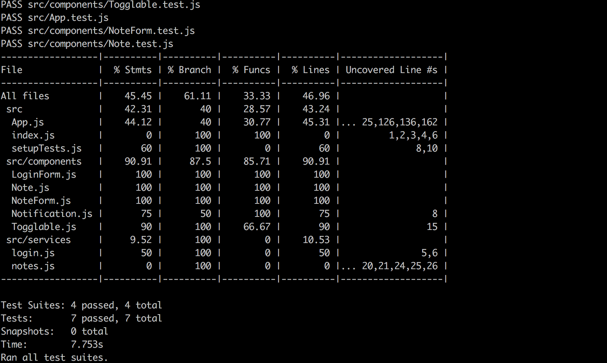
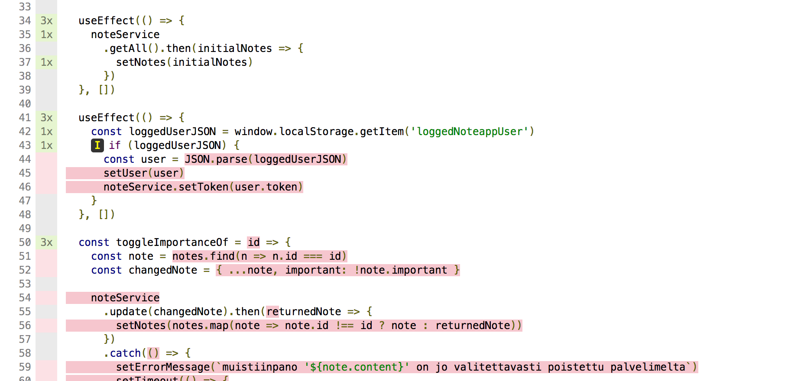

<div class="content">

Reactilla tehtyjen frontendien testaamiseen on monia tapoja. Aloitetaan niihin tutustuminen nyt.

Testit tehdään samaan tapaan kuin edellisessä osassa eli Facebookin [Jest](http://jestjs.io/)-kirjastolla. Jest onkin valmiiksi konfiguroitu create-react-app:illa luotuihin projekteihin.

Tarvitsemme Jestin lisäksi testaamiseen apukirjaston, jonka avulla React-komponentteja voidaan renderöidä testejä varten. Tähän tarkoitukseen ehdottomasti paras vaihtoehto vielä viime syksyyn asti oli AirBnB:n kehittämä [enzyme](https://github.com/airbnb/enzyme)-kirjasto. Enzyme ei kuitenkaan tue kunnolla Reactin hookeja, joten käytämme Enzymen sijaan viime aikoina nopeasti suosiota kasvattanutta kirjastoa [react-testing-library](https://github.com/kentcdodds/react-testing-library). Jestin ilmaisuvoimaa kannattaa myös laajentaa kirjastolla [jest-dom](https://www.npmjs.com/package/jest-dom).

Asennetaan kirjastot komennolla:

```js
npm install --save-dev react-testing-library jest-dom
```

Testataan aluksi muistiinpanon renderöivää komponenttia:

```js
const Note = ({ note, toggleImportance }) => {
  const label = note.important
    ? 'make not important'
    : 'make important'

  return (
    <li className='note'> // highlight-line
      {note.content}
      <button onClick={toggleImportance}>{label}</button>
    </li>
  )
}
```

Huomaa, että muistiinpanon sisältävällä <i>li</i>-elementillä on [CSS](https://reactjs.org/docs/dom-elements.html#classname)-luokka <i>note</i>, pääsemme sen avulla muistiinpanoon käsiksi testistä.


### Komponentin renderöinti testiä varten

Tehdään testi tiedostoon <i>src/components/Note.test.js</i>, eli samaan hakemistoon, missä komponentti itsekin sijaitsee.

Ensimmäinen testi varmistaa, että komponentti renderöi muistiinpanon sisällön:

```js
import React from 'react'
import 'jest-dom/extend-expect'
import { render, cleanup } from 'react-testing-library'
import Note from './Note'

afterEach(cleanup)

test('renders content', () => {
  const note = {
    content: 'Komponenttitestaus tapahtuu react-testing-library:llä',
    important: true
  }

  const component = render(
    <Note note={note} />
  )

  expect(component.container).toHaveTextContent(
    'Komponenttitestaus tapahtuu react-testing-library:llä'
  )
})
```

Alun konfiguroinnin jälkeen testi renderöi komponentin metodin react-testing-library-kirjaston tarjoaman [render](https://testing-library.com/docs/react-testing-library/api#render) avulla:

```js
const component = render(
  <Note note={note} />
)
```

Normaalisti React-komponentit renderöityvät <i>DOM</i>:iin. Nyt kuitenkin renderöimme komponentteja testeille sopivaan muotoon laittamatta niitä DOM:iin. 

_render_ palauttaa olion, jolla on useita kenttiä. Yksi kentistä on <i>container</i>, se sisältää koko komponentin renderöimän HTML:n.

Ekspektaatiossa varmistamme, että komponenttiin on renderöitynyt oikea teksti, eli muistiinpanon sisältö:

```js
expect(component.container).toHaveTextContent(
  'Komponenttitestaus tapahtuu react-testing-library:llä'
)
```

### Testien suorittaminen

Create-react-app:issa on konfiguroitu testit oletusarvoisesti suoritettavaksi ns. watch-moodissa, eli jos suoritat testit komennolla _npm test_, jää konsoli odottamaan koodissa tapahtuvia muutoksia. Muutosten jälkeen testit suoritetaan automaattisesti ja Jest alkaa taas odottamaan uusia muutoksia koodiin.

Jos haluat ajaa testit "normaalisti", se onnistuu komennolla

```js
CI=true npm test
```

**HUOM:** konsoli saattaa herjata virhettä, jos sinulla ei ole asennettuna watchmania. Watchman on Facebookin kehittämä tiedoston muutoksia tarkkaileva ohjelma. Ohjelma nopeuttaa testien ajoa ja ainakin osx sierrasta ylöspäin jatkuva testien vahtiminen aiheuttaa käyttäjillä virheilmoituksia. Näistä ilmoituksista pääsee eroon asentamalla Watchmanin.

Ohjeet ohjelman asentamiseen eri käyttöjärjestelmille löydät Watchmanin sivulta:
https://facebook.github.io/watchman/

### Testien sijainti

Reactissa on (ainakin) [kaksi erilaista](https://medium.com/@JeffLombardJr/organizing-tests-in-jest-17fc431ff850) konventiota testien sijoittamiseen. Sijoitimme testit ehkä vallitsevan tavan mukaan, eli samaan hakemistoon missä testattava komponentti sijaitsee.

Toinen tapa olisi sijoittaa testit "normaaliin" tapaan omaan erilliseen hakemistoon. Valitaanpa kumpi tahansa tapa, on varmaa että se on jonkun mielestä täysin väärä.

Itse en pidä siitä, että testit ja normaali koodi ovat samassa hakemistossa. Noudatamme kuitenkin nyt tätä tapaa, sillä se on oletusarvo create-react-app:illa konfiguroiduissa sovelluksissa.

### Sisällön etsiminen testattavasta komponentista

react-testing-library-kirjasto tarjoaa runsaasti tapoja, miten voimme tutkia testattavan komponentin sisältöä. Laajennetaan testiämme hiukan:

```js
test('renders content', () => {
  const note = {
    content: 'Komponenttitestaus tapahtuu react-testing-library:llä',
    important: true
  }

  const component = render(
    <Note note={note} />
  )

  // tapa 1
  expect(component.container).toHaveTextContent(
    'Komponenttitestaus tapahtuu react-testing-library:llä'
  )

  // tapa 2
  const element = component.getByText('Komponenttitestaus tapahtuu react-testing-library:llä')
  expect(element).toBeDefined()

  // tapa 3
  const div = component.container.querySelector('.note')
  expect(div).toHaveTextContent(
    'Komponenttitestaus tapahtuu react-testing-library:llä'
  )
})
```

Ensimmäinen tapa siis etsii tiettyä tekstiä koko komponentin renderöimästä HTML-koodista. 

Toisena käytimme render-metodin palauttamaan olioon liitettyä [getByText](https://testing-library.com/docs/api-queries#getbytext)-metodia, joka palauttaa sen elementin, jolla on määritelty teksti. Jos elementtiä ei ole, tapahtuu poikkeus. Eli mitään ekspektaatiota ei välttämättä edes tarvittaisi.

Kolmas tapa on etsiä komponentin sisältä tietty elementti metodilla [querySelector](https://developer.mozilla.org/en-US/docs/Web/API/Document/querySelector), joka saa parametrikseen [CSS-selektorin](https://developer.mozilla.org/en-US/docs/Web/CSS/CSS_Selectors).

### Testien debuggaaminen

Testejä tehdessä törmäämme tyypillisesti erittäin moniin ongelmiin. 

Renderin palauttaman olion metodilla [debug](https://testing-library.com/docs/react-testing-library/api#debug) voimme tulostaa komponentin tuottaman HTML:n konsoliin, eli kun muutamme testiä seuraavasti,

```js
test('renders content', () => {
  const note = {
    content: 'Komponenttitestaus tapahtuu react-testing-library:llä',
    important: true
  }

  const component = render(
    <Note note={note} />
  )

  component.debug() // highlight-line

  // ...
})
```

konsoliin tulostuu komponentin generoima HTML:

```js
console.log node_modules/react-testing-library/dist/index.js:64
  <body>
    <div>
      <li
        class="note"
      >
        Komponenttitestaus tapahtuu react-testing-library:llä
        <button>
          make not important
        </button>
      </li>
    </div>
  </body>
```

On myös mahdollista etsiä komponentista pienempi osa, ja tulostaa sen HTML-koodi, tällöin tarvitsemme metodia _prettyDOM_, joka löytyy react-testing-library:n mukana tulevasta kirjastosta <i>dom-testing-library</i>:

```js
import React from 'react'
import 'jest-dom/extend-expect'
import { render, cleanup } from 'react-testing-library'
import { prettyDOM } from 'dom-testing-library' // highlight-line
import Note from './Note'

test('renders content', () => {
  const note = {
    content: 'Komponenttitestaus tapahtuu react-testing-library:llä',
    important: true
  }

  const component = render(
    <Note note={note} />
  )
  const li = component.container.querySelector('li')
  
  console.log(prettyDOM(li)) // highlight-line
})
```

Eli haimme selektorin avulla komponentin sisältä <i>li</i>-elementin ja tulostimme sen HTML:n konsoliin:

```js
console.log src/components/Note.test.js:38
  <li
    class="note"
  >
    Komponenttitestaus tapahtuu react-testing-library:llä
    <button>
      make not important
    </button>
  </li>
```

### setup

react-testing-library:n manuaali kehoittaa kutsumaan jokaisen testin jälkeen metodia
[cleanup](https://testing-library.com/docs/react-testing-library/api#cleanup). Hoidimme asian lisäämällä testitiedostoon [afterEach](https://jestjs.io/docs/en/setup-teardown)-määreen, joka kutsuu metodia:

```js 
import React from 'react'
import 'jest-dom/extend-expect' // highlight-line
import { render, cleanup } from 'react-testing-library'
import { prettyDOM } from 'dom-testing-library'
import Note from './Note'

afterEach(cleanup)  // highlight-line
```

Voisimme toistaa saman kaikkiin testitiedostoihin. Parempi vaihtoehto on kuitenkin [konfiguroida](https://testing-library.com/docs/react-testing-library/setup) cleanup tapahtumaan automaattisesti. Tehdään konfiguraatiota varten tiedosto <i>src/setupTests.js</i> jolla on seuraava sisältö:

```js
import 'jest-dom/extend-expect'
import 'react-testing-library/cleanup-after-each'
```

Nyt pääsemme eroon molemmista ylläolevan testikoodin korostetuista riveistä.

**HUOM** mikäli testejä suoritettaessa ei löydetä tiedostossa <i>src/setupTests.js</i> tehtyjä konfiguraatioita, auttaa seuraavan asetuksen lisääminen tiedostoon package.json:

```
  "jest": {
    ...
    "setupFiles": [
      "<rootDir>/src/setupTests.js"
    ],
    ...
  }
```

### Nappien painelu testeissä

Sisällön näyttämisen lisäksi toinen <i>Note</i>-komponenttien vastuulla oleva asia on huolehtia siitä, että painettaessa noten yhteydessä olevaa nappia, tulee propsina välitettyä tapahtumankäsittelijäfunktiota _toggleImportance_ kutsua.

Testaus onnistuu seuraavasti:

```js
import React from 'react'
import { render, fireEvent } from 'react-testing-library' // highlight-line
import { prettyDOM } from 'dom-testing-library' 
import Note from './Note'

// ...

it('clicking the button calls event handler once', async () => {
  const note = {
    content: 'Komponenttitestaus tapahtuu jestillä ja enzymellä',
    important: true
  }

  const mockHandler = jest.fn()

  const { getByText } = render(
    <Note note={note} toggleImportance={mockHandler} />
  )

  const button = getByText('make not important')
  fireEvent.click(button)

  expect(mockHandler.mock.calls.length).toBe(1)
})
```

Testissä on muutama mielenkiintoinen seikka. Tapahtumankäsittelijäksi annetaan Jestin avulla määritelty [mock](https://facebook.github.io/jest/docs/en/mock-functions.html)-funktio:

```js
const mockHandler = jest.fn()
```

Testi hakee renderöidystä komponentista napin <i>tekstin perusteella</i> ja klikkaa sitä:

```js
const button = getByText('make not important')
fireEvent.click(button)
```

Klikkaaminen tapahtuu metodin [fireEvent](https://testing-library.com/docs/api-events#fireevent) avulla.

Testin ekspektaatio varmistaa, että <i>mock-funktiota</i> on kutsuttu täsmälleen kerran:

```js
expect(mockHandler.mock.calls.length).toBe(1)
```

[Mockoliot ja -funktiot](https://en.wikipedia.org/wiki/Mock_object) ovat testauksessa yleisesti käytettyjä valekomponentteja, joiden avulla korvataan testattavien komponenttien riippuvuuksia, eli niiden tarvitsemia muita komponentteja. Mockit mahdollistavat mm. kovakoodattujen syötteiden palauttamisen sekä niiden metodikutsujen lukumäärän sekä parametrien testauksen aikaisen tarkkailun.

Esimerkissämme mock-funktio sopi tarkoitukseen erinomaisesti, sillä sen avulla on helppo varmistaa, että metodia on kutsuttu täsmälleen kerran.

### Komponentin <i>Togglable</i> testit

Tehdään komponentille <i>Togglable</i> muutama testi. Lisätään komponentin lapset renderöivään div-elementtiin CSS-luokka <i>togglableContent</i>:

```js
const Togglable = React.forwardRef((props, ref) => {
  // ...

  return (
    <div>
      <div style={hideWhenVisible}>
        <button onClick={toggleVisibility}>
          {props.buttonLabel}
        </button>
      </div>
      <div style={showWhenVisible} className="togglableContent"> // highlight-line
        {props.children}
        <button onClick={toggleVisibility}>cancel</button>
      </div>
    </div>
  )
})
```

Testit ovat seuraavassa

```js
import React from 'react'
import { render, fireEvent } from 'react-testing-library'
import Togglable from './Togglable'

describe('<Togglable />', () => {
  let component

  beforeEach(() => {
    component = render(
      <Togglable buttonLabel="show...">
        <div className="testDiv" />
      </Togglable>
    )
  })

  it('renders its children', () => {
    component.container.querySelector('.testDiv')
  })

  it('at start the children are not displayed', () => {
    const div = component.container.querySelector('.togglableContent')

    expect(div).toHaveStyle('display: none')
  })

  it('after clicking the button, children are displayed', () => {
    const button = component.getByText('show...')
    fireEvent.click(button)

    const div = component.container.querySelector('.togglableContent')
    expect(div).not.toHaveStyle('display: none')
  })

})
```

Ennen jokaista testiä suoritettava _beforeEach_ renderöi <i>Togglable</i>-komponentin muuttujaan _component_.

Ensimmäinen testi tarkastaa, että <i>Togglable</i> renderöi sen lapsikomponentin `<div className="testDiv" />`. 

Loput testit varmistavat metodia [toHaveStyle](https://www.npmjs.com/package/jest-dom#tohavestyle) käyttäen, että Togglablen sisältämä lapsikomponentti on alussa näkymättömissä, eli sen sisältävään <i>div</i>-elementtiin liittyy tyyli `{ display: 'none' }`, ja että nappia painettaessa komponentti näkyy, eli näkymättömäksi tekevää tyyliä <i>ei</i> enää ole. 

Nappi etsitään jälleen nappiin liittyvän tekstin perusteella. Nappi oltaisiin voitu etsiä myös CSS-selektorin avulla

```js
const button = component.container.querySelector('button')
```

Komponentissa on kaksi nappia, mutta koska [querySelector](https://developer.mozilla.org/en-US/docs/Web/API/Document/querySelector) palauttaa <i>ensimmäisen</i> löytyvän napin, löytyy napeista oikea.

Lisätään vielä mukaan testi, joka varmistaa että auki togglattu sisältö saadaan piilotettua painamalla komponentin toisena olevaa nappia

```js
it('toggled content can be closed', () => {
  const button = component.querySelector('button')
  fireEvent.click(button)

  const closeButton = component.container.querySelector('button:nth-child(2)')
  fireEvent.click(closeButton)

  const div = component.container.querySelector('.togglableContent')
  expect(div).toHaveStyle('display: none')
})
```

eli määrittelimme selektorin, joka palauttaa toisena olevan napin `button:nth-child(2)`. Testeissä ei kuitenkaan ole viisasta olla riippuvainen komponentin nappien järjestyksestä, joten parempi onkin hakea napit niiden tekstin perusteella:

```js
it('toggled content can be closed', () => {
  const button = component.getByText('show...')
  fireEvent.click(button)

  const closeButton = component.getByText('cancel')
  fireEvent.click(closeButton)

  const div = component.container.querySelector('.togglableContent')
  expect(div).toHaveStyle('display: none')
})
```

Käyttämämme _getByText_ on vain yksi monista [queryistä](https://testing-library.com/docs/api-queries#queries), joita <i>react-testing-library</i> tarjoaa.

Sovelluksen tämänhetkinen koodi on kokonaisuudessaan [githubissa](https://github.com/fullstack-hy2019/part2-notes/tree/part5-7), branchissa <i>part5-7</i>.

</div>

<div class="tasks">

### Tehtäviä

#### 5.13: blogilistan testit, step1

Lisää sovellukseesi tilapäisesti seuraava komponentti

```js
import React from 'react'

const SimpleBlog = ({ blog, onClick }) => (
  <div>
    <div>
      {blog.title} {blog.author}
    </div>
    <div>
      blog has {blog.likes} likes
      <button onClick={onClick}>like</button>
    </div>
  </div>
)

export default SimpleBlog
```

Tee testi, joka varmistaa, että komponentti renderöi blogin titlen, authorin ja likejen määrän.

Lisää komponenttiin tarvittaessa testausta helpottavia CSS-luokkia.

#### 5.14: blogilistan testit, step2

Tee testi, joka varmistaa, että jos komponentin <i>like</i>-nappia painetaan kahdesti, komponentin propsina saamaa tapahtumankäsittelijäfunktiota kutsutaan kaksi kertaa.

#### 5.15*: blogilistan testit, step3

Tee oman sovelluksesi komponentille <i>Blog</i> testit, jotka varmistavat, että oletusarvoisesti blogista on näkyvissä ainoastaan nimi ja kirjoittaja, ja että klikkaamalla niitä saadaan näkyviin myös muut osat blogin tiedoista.

</div>

<div class="content">

### Lomakkeiden testaus

Käytimme jo edellisissä testeissä [fireEvent](https://testing-library.com/docs/api-events#fireevent)-funktiota nappien klikkaamiseen:

```js
const button = component.getByText('show...')
fireEvent.click(button)
```

Käytännössä siis loimme <i>fireEventin</i> avulla tapahtuman <i>click</i> nappia vastaavalle komponentille. Voimme myös simuloida lomakkeisiin kirjoittamista <i>fireEventin</i> avulla.

Tehdään testi komponentille <i>NoteForm</i>. Lomakkeen koodi näyttää seuraavalta

```js
const NoteForm = ({ onSubmit, handleChange, value }) => {
  return (
    <div>
      <h2>Luo uusi muistiinpano</h2>

      <form onSubmit={onSubmit}>
        <input
          value={value}
          onChange={handleChange}
        />
        <button type="submit">tallenna</button>
      </form>
    </div>
  )
}
```

Lomakkeen toimintaperiaatteena on synkronoida syötekentän tila sen ulkopuolella olevan React-komponentin tilaan. Lomakettamme on jossain määrin vaikea testata yksistään.

Teemmekin testejä varten apukomponentin <i>Wrapper</i>, joka renderöi <i>NoteForm</i>:in ja hallitsee lomakkeen tilaa parametrinaan saamansa propsin <i>state</i> avulla:

```js
const Wrapper = (props) => {

  const onChange = (event) => {
    props.state.value = event.target.value
  }

  return (
    <NoteForm
      value={props.state.value}
      onSubmit={props.onSubmit}
      handleChange={onChange}
    />
  )
} 

```

Testi on seuraavassa:

```js
import React from 'react'
import { render, fireEvent } from 'react-testing-library'
import NoteForm from './NoteForm'

const Wrapper = (props) => {
  // ...
}

test('<NoteForm /> updates parent state and calls onSubmit', () => {
  const onSubmit = jest.fn()
  const state = {
    value: ''
  }

  const component = render(
    <Wrapper onSubmit={onSubmit} state={state} />
  )

  const input = component.container.querySelector('input')
  const form = component.container.querySelector('form')

  fireEvent.change(input, { target: { value: 'lomakkeiden testaus on hankalaa' } })
  fireEvent.submit(form)

  expect(onSubmit.mock.calls.length).toBe(1)
  expect(state.value).toBe('lomakkeiden testaus on hankalaa')  
})
```

Testi luo <i>Wrapper</i>-komponentin, jolle se välittää propseina mockatun funktion _onSubmit_ sekä tilaa edustavan olion <i>state</i>.

Wrapper välittää funktion edelleen <i>NoteFormille</i> tapahtuman <i>onSubmit</i> käsittelijäksi ja saamansa propsin <i>state</i> kentän <i>value</i> syötekentän <i>input</i> arvoksi. 

Syötekenttään <i>input</i> kirjoittamista simuloidaan tekemällä syötekenttään tapahtuma <i>change</i> ja määrittelemällä sopiva olio, joka määrittelee syötekenttään 'kirjoitetun' sisällön.

Lomake lähetetään simuloimalla tapahtuma <i>submit</i> lomakkeelle.

Testin ensimmäinen ekspektaatio varmistaa, että lomakkeen lähetys on aikaansaanut tapahtumankäsittelijän kutsumisen. Toinen ekspektaatio tutkii komponentille <i>Wrapper</i> propsina välitettyä muuttujaa <i>state</i>, ja varmistaa, että lomakkeelle kirjoitettu teksti on siirtynyt tilaan. 

### Frontendin integraatiotestaus

Suoritimme edellisessä osassa backendille integraatiotestejä, jotka testasivat backendin tarjoaman API:n läpi backendia ja tietokantaa. Backendin testauksessa tehtiin tietoinen päätös olla kirjoittamatta yksikkötestejä sillä backendin koodi on melko suoraviivaista ja ongelmat tulevatkin esiin todennäköisemmin juuri monimutkaisemmissa skenaarioissa, joita integraatiotestit testaavat hyvin.

Toistaiseksi kaikki frontendiin tekemämme testit ovat olleet yksittäisten komponenttien oikeellisuutta valvovia yksikkötestejä. Yksikkötestaus on toki välillä hyödyllistä, mutta kattavinkaan yksikkötestaus ei riitä antamaan riittävää luotettavuutta sille, että järjestelmä toimii kokonaisuudessaan.

Tehdään nyt sovellukselle yksi integraatiotesti. Integraatiotestaus on huomattavasti komponenttien yksikkötestausta hankalampaa. Erityisesti sovelluksemme kohdalla ongelmia aiheuttaa kaksi seikkaa: sovellus hakee näytettävät muistiinpanot palvelimelta <i>ja</i> sovellus käyttää local storagea kirjautuneen käyttäjän tietojen tallettamiseen.

Local storage ei ole oletusarvoiseti käytettävissä testejä suorittaessa, sillä kyseessä on selaimen tarjoama toiminnallisuus ja testit ajetaan selaimen ulkopuolella. Ongelma on helppo korjata määrittelemällä testien suorituksen ajaksi <i>mock</i> joka matkii local storagea. Tapoja tähän on [monia](https://stackoverflow.com/questions/32911630/how-do-i-deal-with-localstorage-in-jest-tests).

Koska testimme ei edellytä local storagelta juuri mitään toiminnallisuutta, teemme tiedostoon [src/setupTests.js](https://github.com/facebookincubator/create-react-app/blob/ed5c48c81b2139b4414810e1efe917e04c96ee8d/packages/react-scripts/template/README.md#initializing-test-environment) hyvin yksinkertaisen mockin

```js
let savedItems = {}

const localStorageMock = {
  setItem: (key, item) => {
    savedItems[key] = item
  },
  getItem: (key) => savedItems[key],
  clear: savedItems = {}
}

window.localStorage = localStorageMock
```

Toinen ongelmistamme on se, että sovellus hakee näytettävät muistiinpanot palvelimelta. Muistiinpanojen haku tapahtuu heti komponentin <i>App</i> luomisen jälkeen suoritettavassa effect hookissa:


```js
const App = () => {
  // ...

  useEffect(() => {
    noteService
      .getAll().then(initialNotes => {
        setNotes(initialNotes)
      })
  }, [])

// ...
}
```

Jestin [manual mock](https://facebook.github.io/jest/docs/en/manual-mocks.html#content) -konsepti tarjoaa tilanteeseen hyvän ratkaisun. Manual mockien avulla voidaan kokonainen moduuli, tässä tapauksessa _noteService_ korvata testien ajaksi vaihtoehtoisella esim. kovakoodattua dataa tarjoavalla toiminnallisuudella.

Luodaan Jestin ohjeiden mukaisesti hakemistoon <i>src/services</i> alihakemisto <i>\_\_mocks\_\_</i> (alussa ja lopussa kaksi alaviivaa) ja sinne tiedosto <i>notes.js</i> jonka määrittelemä metodi <i>getAll</i> palauttaa kovakoodatun listan muistiinpanoja:

```js
const notes = [
  {
    id: "5a451df7571c224a31b5c8ce",
    content: "HTML on helppoa",
    date: "2019-01-28T16:38:15.541Z",
    important: false,
    user: {
      _id: "5a437a9e514ab7f168ddf138",
      username: "mluukkai",
      name: "Matti Luukkainen"
    }
  },
  {
    id: "5a451e21e0b8b04a45638211",
    content: "Selain pystyy suorittamaan vain javascriptiä",
    date: "2019-01-28T16:38:57.694Z",
    important: true,
    user: {
      _id: "5a437a9e514ab7f168ddf138",
      username: "mluukkai",
      name: "Matti Luukkainen"
    }
  },
  {
    id: "5a451e30b5ffd44a58fa79ab",
    content: "HTTP-protokollan tärkeimmät metodit ovat GET ja POST",
    date: "2019-01-28T16:39:12.713Z",
    important: true,
    user: {
      _id: "5a437a9e514ab7f168ddf138",
      username: "mluukkai",
      name: "Matti Luukkainen"
    }
  }
]

const getAll = () => {
  return Promise.resolve(notes)
}

export default { getAll }
```

Määritelty metodi _getAll_ palauttaa muistiinpanojen listan käärittynä promiseksi metodin [Promise.resolve](https://developer.mozilla.org/en-US/docs/Web/JavaScript/Reference/Global_Objects/Promise/resolve) avulla sillä käytettäessä metodia, oletetaan sen paluuarvon olevan promise:


Olemme valmiina määrittelemään testin. Koska kyseessä on koko sovellusta koskeva testi, tehdään se tiedostoon <i>App.test.js</i>:

```js
import React from 'react'
import { render,  waitForElement } from 'react-testing-library'
jest.mock('./services/notes')
import App from './App'

describe('<App />', () => {
  it('renders all notes it gets from backend', async () => {
    const component = render(
      <App />
    )
    component.rerender(<App />)
    await waitForElement(
      () => component.container.querySelector('.note')
    )

    const notes = component.container.querySelectorAll('.note')
    expect(notes.length).toBe(3) 

    expect(component.container).toHaveTextContent(
      'HTML on helppoa'
    )
    expect(component.container).toHaveTextContent(
      'Selain pystyy suorittamaan vain javascriptiä'
    )
    expect(component.container).toHaveTextContent(
      'HTTP-protokollan tärkeimmät metodit ovat GET ja POST'
    )
  })
})
```

Komennolla <i>jest.mock('./services/notes')</i> otetaan juuri määritelty mock käyttöön. Loogisempi paikka komennolle olisi kenties testien määrittelyt tekevä tiedosto <i>src/setupTests.js</i>.

Testi aloittaa renderöimällä komponentin uudelleen `component.rerender(<App />)`, näin varmistetaan että kaikki efektit suoritetaan. Voi kyllä olla, että komento ei ole enää tarpeen uusimpien Reactin versioiden kanssa.

Koska efektin käynnistämä muistiinpanojen haku palvelimelta on [asynkroninen](https://testing-library.com/docs/api-async) tapahtuma, varmistamme funktion [waitForElement](https://testing-library.com/docs/api-async#waitforelement) avulla, että <i>App</i> ehtii renderöidä muistiinpanot

```js
await waitForElement(() => component.container.querySelector('.note'))
```

Tämän jälkeen teemme varsinaiset expektaatiot, eli varmistetaan että sovelluksessa on kolme CSS-luokalla <i>note</i> merkittyä elementtiä, ja että kaikkien muistiinpanojen sisältö on renderöity.

### Testauskattavuus

[Testauskattavuus](https://github.com/facebookincubator/create-react-app/blob/ed5c48c81b2139b4414810e1efe917e04c96ee8d/packages/react-scripts/template/README.md#coverage-reporting) saadaan helposti selville suorittamalla testit komennolla

```js
CI=true npm test -- --coverage
```



Melko primitiivinen HTML-muotoinen raportti generoituu hakemistoon <i>coverage/lcov-report</i>. HTML-muotoinen raportti kertoo mm. yksittäisen komponenttien testaamattomat koodirivit:



Huomaamme, että parannettavaa jäi vielä runsaasti.

Sovelluksen tämänhetkinen koodi on kokonaisuudessaan [githubissa](https://github.com/fullstack-hy2019/part2-notes/tree/part5-8), branchissa <i>part5-8</i>.

</div>

<div class="tasks">

### Tehtäviä

#### 5.16*: blogilistan testit, step4

Tee sovelluksesi integraatiotesti, joka varmistaa, että jos käyttäjä ei ole kirjautunut järjestelmään, näyttää sovellus ainoastaan kirjautumislomakkeen, eli yhtään blogia ei vielä renderöidä.

Testi voi odottaa komponentin sisällön renderöitymistä funktiolla _waitForElement_

```js
import React from 'react'
import { 
  render, waitForElement 
} from 'react-testing-library' // highlight-line
jest.mock('./services/blogs')
import App from './App'

describe('<App />', () => {
  it('if no user logged, notes are not rendered', async () => {
    const component = render(
      <App />
    )
    component.rerender(<App />)

// highlight-start
    await waitForElement(
      () => component.getByText('kirjaudu')
    ) 
    // highlight-end

    // expectations here
  })
})
```

**VAROITUS** kun tein tehtävää, esiintyi testeissä ajoittain epästabiiliutta sen suhteen, toimiko _waitForElement_ tai joku sitä vastaavista asynkronisten operaatioiden odottamiseen tarkoitetuista metodeista.

#### 5.17*: blogilistan testit, step5

Tee myös testi, joka varmistaa, että kun käyttäjä on kirjautuneena, blogit renderöityvät sivulle.

**Vihje:**

Kirjautuminen kannattaa toteuttaa manipuloimalla testeissä local storagea. Jos määrittelet testeille mock-localstoragen ylläolevaa materiaalia seuraten, voit käyttää testikoodissa local storagea seuraavasti:

```js
const user = {
  username: 'tester',
  token: '1231231214',
  name: 'Teuvo Testaaja'
}

localStorage.setItem('loggedBlogAppUser', JSON.stringify(user))
```

</div>

<div class="content">

### Snapshot-testaus

Jest tarjoaa "perinteisen" testaustavan lisäksi aivan uudenlaisen tavan testaukseen, ns. [snapshot](https://facebook.github.io/jest/docs/en/snapshot-testing.html)-testauksen. Mielenkiintoista snapshot-testauksessa on se, että sovelluskehittäjän ei tarvitse itse määritellä ollenkaan testejä, snapshot-testauksen käyttöönotto riittää.

Periaatteena on verrata komponenttien määrittelemää HTML:ää aina koodin muutoksen jälkeen siihen, minkälaisen HTML:n komponentit määrittelivät ennen muutosta.

Jos snapshot-testi huomaa muutoksen komponenttien määrittelemässä HTML:ssä, voi kyseessä joko olla haluttu muutos tai vahingossa aiheutettu "bugi". Snapshot-testi huomauttaa sovelluskehittäjälle, jos komponentin määrittelemä HTML muuttuu. Sovelluskehittäjä kertoo muutosten yhteydessä, oliko muutos haluttu. Jos muutos tuli yllätyksenä, eli kyseessä oli bugi, sovelluskehittäjä huomaa sen snapshot-testauksen ansiosta nopeasti.

### End to end -testaus

Olemme tehneet sekä backendille että frontendille hieman niitä kokonaisuutena testaavia integraatiotestejä. Eräs tärkeä testauksen kategoria on vielä käsittelemättä, [järjestelmää kokonaisuutena](https://en.wikipedia.org/wiki/System_testing) testaavat "end to end" (eli E2E) -testit.

Web-sovellusten E2E-testaus tapahtuu simuloidun selaimen avulla esimerkiksi [Selenium](http://www.seleniumhq.org)-kirjastoa käyttäen. Toinen vaihtoehto on käyttää ns. [headless browseria](https://en.wikipedia.org/wiki/Headless_browser) eli selainta, jolla ei ole ollenkaan graafista käyttöliittymää. Esim. Chromea on mahdollista suorittaa Headless-moodissa.

E2E testit ovat potentiaalisesti kaikkein hyödyllisin testikategoria, sillä ne tutkivat järjestelmää saman rajapinnan kautta kuin todelliset käyttäjät.

E2E-testeihin liittyy myös ikäviä puolia. Niiden konfigurointi on haastavampaa kuin yksikkö- ja integraatiotestien. E2E-testit ovat tyypillisesti myös melko hitaita ja isommassa ohjelmistossa niiden suoritusaika voi helposti nousta minuutteihin, tai jopa tunteihin. Tämä on ikävää sovelluskehityksen kannalta, sillä sovellusta koodatessa on erittäin hyödyllistä pystyä ajamaan testejä mahdollisimman usein koodin regressioiden varalta.

Palaamme end to end -testeihin kurssin viimeisessä, eli seitsemännessä osassa.

</div>
