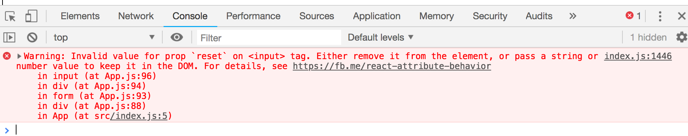
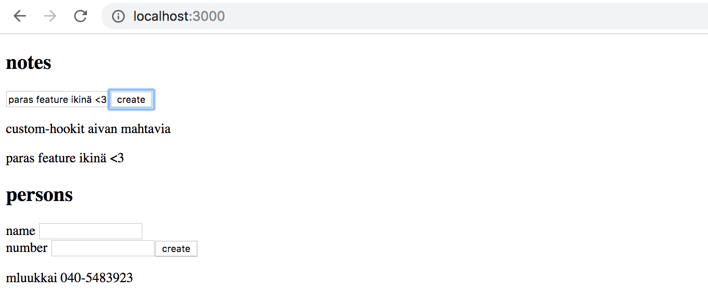

<div class="content">

React tarjoaa yhteensä 10 erilaista [valmista hookia](https://reactjs.org/docs/hooks-reference.html), näistä ylivoimaisesti eniten käytetyt ovat meillekin jo tutut [useState](https://reactjs.org/docs/hooks-reference.html#usestate) ja [useEffect](https://reactjs.org/docs/hooks-reference.html#useeffect). 

### Custom hookit

React tarjoaa mahdollisuuden myös omien eli [custom](https://reactjs.org/docs/hooks-custom.html)-hookien määrittelyyn. Customhookien pääasiallinen tarkoitus on Reactin dokumentaation mukaan mahdollistaa komponenttien logiikan uusiokäyttö.

> <i>Building your own Hooks lets you extract component logic into reusable functions.</i>

Custom hookit ovat tavallisia Javascripfunktioita, jotka voivat kutsua mitä tahansa muita hookeja kunhan vain toimivat [hookien sääntöjen](osa1/monimutkaisempi_tila_reactin_debuggaus#hookien-saannot) puitteissa. Custom hookin nimen täytyy alkaa sanalla _use_.

Teimme [osassa 1](/osa1/komponentin_tila_ja_tapahtumankasittely#tapahtumankasittely) laskurin, jonka arvoa voi kasvattaa, vähentää ja nollata. Sovelluksen koodi on seuraava

```js  
import React, { useState } from 'react'
const App = (props) => {
  const [counter, setCounter] = useState(0)

  return (
    <div>
      <div>{counter}</div>
      <button onClick={() => setCounter(counter + 1)}>
        plus
      </button>
      <button onClick={() => setCounter(counter - 1)}>
        minus
      </button>      
      <button onClick={() => setCounter(0)}>
        zero
      </button>
    </div>
  )
}
```

Eriytetään laskurilogiikka custom hookiksi. Hookin koodi on seuraavassa

```js
const useCounter = () => {
  const [value, setValue] = useState(0)

  const increase = () => {
    setValue(value + 1)
  }

  const decrease = () => {
    setValue(value - 1)
  }

  const zero = () => {
    setValue(0)
  }

  return {
    value, 
    increase,
    decrease,
    zero
  }
}
```

Hook siis käyttää sisäisesti _useState_-hookia luomaan itselleen tilan. Hook palauttaa olion, joka sisältää kenttinään hookin tilan arvon sekä funktiot hookin tallettaman arvon muuttamiseen.

React-komponentti käyttää hookia seuraavaan tapaan:

```js
const App = (props) => {
  const counter = useCounter()

  return (
    <div>
      <div>{counter.value}</div>
      <button onClick={counter.increase}>
        plus
      </button>
      <button onClick={counter.decrease}>
        minus
      </button>      
      <button onClick={counter.zero}>
        zero
      </button>
    </div>
  )
}
```

Näin komponentin _App_ tila ja sen manipulointi on siirretty kokonaisuudessaan hookin _useCounter_ vastuulle. 

Samaa hookia voitaisiin <i>uusiokäyttää</i> sovelluksessa joka laski vasemman ja oikean napin painalluksia:

```js

const App = () => {
  const left = useCounter()
  const right = useCounter()

  return (
    <div>
      {left.value}
      <button onClick={left.increase}>
        left
      </button>
      <button onClick={right.increase}>
        right
      </button>
      {right.value}
    </div>
  )
}
```

Nyt sovellus luo <i>kaksi</i> erillistä laskuria, toisen käsittelyfunktioineen se tallentaa muuttujaan _left_ ja toisen muuttujaan _right_. 

Lomakkeiden käsittely on Reactissa jokseenkin vaivalloista. Seuraavassa sovellus, joka pyytää lomakkeella käyttäjän nimen, syntymäajan ja pituuden:

```js
const App = () => {
  const [name, setName] = useState('')
  const [born, setBorn] = useState('')
  const [length, setLength] = useState('')

  return (
    <div>
      <form>
        nimi: 
        <input
          type='text'
          value={name}
          onChange={(event) => setName(event.target.value)} 
        /> 
        <br/> 
        syntymäaika:
        <input
          type='date'
          value={born}
          onChange={(event) => setBorn(event.target.value)}
        />
        <br /> 
        pituus:
        <input
          type='number'
          value={length}
          onChange={(event) => setLength(event.target.value)}
        />
      </form>
      <div>
        {name} {born} {length} 
      </div>
    </div>
  )
}
```

Jokaista lomakkeen kenttää varten on oma tilansa. Jotta tila pysyy synkroonissa lomakkeelle syötettyjen tietojen kanssa, on jokaiselle <i>input</i>-elementille rekisteröity sopiva <i>onChange</i>-käsittelijä.

Määritellään custom hook _useField_, joka yksinkertaistaa lomakkeen tilan hallintaa:

```js
const useField = (type) => {
  const [value, setValue] = useState('')

  const onChange = (event) => {
    setValue(event.target.value)
  }

  return {
    type,
    value,
    onChange
  }
}
```

Hook-funktio saa parametrina kentän tyypin. Funktio palauttaa kaikki <i>input</i>-kentän tarvitsemat attribuutit eli tyypin, kentän arvon sekä onChange-tapahtumankäsittelijän.

Hookia voidaan käyttää seuraavalla tavalla:

```js
const App = () => {
  const name = useField('text')
  // ...

  return (
    <div>
      <form>
        <input
          type={name.type}
          value={name.value}
          onChange={name.onChange} 
        /> 
        // ...
      </form>
    </div>
  )
}
```

### Spread-attribuutit

Pääsemme itseasiassa helpommalla. Koska oliolla _name_ on nyt täsmälleen ne kentät, mitä <i>input</i>-komponentti odottaa saavansa propsina, voimme välittää propsit hyödyntäen [spread-syntaksia](https://reactjs.org/docs/jsx-in-depth.html#spread-attributes), seuraavasti:

```js
<input {...name} /> 
```

Eli kuten Reactin dokumentaation [esimerkki](https://reactjs.org/docs/jsx-in-depth.html#spread-attributes) sanoo, seuraavat kaksi tapaa välittää propseja komponentille tuottavat saman lopputuloksen:


```js
<Greeting firstName='Arto' lastName='Hellas' />

const person = {
  firstName: 'Arto',
  lastName: 'Hella'
}

<Greeting {...person} />
```

Sovellus pelkistyy muotoon

```js
const App = () => {
  const name = useField('text')
  const born = useField('date')
  const length = useField('number')

  return (
    <div>
      <form>
        nimi: 
        <input  {...name} /> 
        <br/> 
        syntymäaika:
        <input {...born} />
        <br /> 
        pituus:
        <input {...length} />
      </form>
      <div>
        {name.value} {born.value} {length.value}
      </div>
    </div>
  )
}
```

Lomakkeiden käsittely yksinkertaistuu huomattavasti kun ikävät tilan synkronoimiseen liittyvät detaljit on kapseloitu custom hookin vastuulle.

Custom hookit eivät selvästikään ole pelkkä uusiokäytön väline, ne mahdollistavat myös entistä paremman tavan jakaa koodia pienempiin, modulaarisiin osiin.

### Hookien säännöt revisited

Kuten [osassa 1](/osa1/monimutkaisempi_tila_reactin_debuggaus#hookien-saannot)  mainittiin, on hookeja käytettävä tiettyjä [rajoituksia](https://reactjs.org/docs/hooks-rules.html) noudattaen. Seuraavassa vielä hookien käytön säännöt suoraan Reactin dokumentaatiosta kopioituna:

**Don’t call Hooks inside loops, conditions, or nested functions.** Instead, always use Hooks at the top level of your React function. 

**Don’t call Hooks from regular JavaScript functions.** Instead, you can:

- Call Hooks from React function components.
- Call Hooks from custom Hooks

On olemassa [ESlint](https://www.npmjs.com/package/eslint-plugin-react-hooks)-sääntö, jonka avulla voidaa varmistaa, että sovellus käyttää hookeja oikein. Valitettavasti sääntöä ei voi vielä tässä vaiheessa (29.1.2019) käyttää create-react-app:issa sovelluksissa.

### Lisää hookeista

Internetistä alkaa löytyä yhä enenevissä määrin hyödyllistä hookeihin liittyvä materiaalia, esim. seuraavia kannattaa vilkaista

* [Awesome React Hooks Resouces](https://github.com/rehooks/awesome-react-hooks)
* [Why Do React Hooks Rely on Call Order?](https://overreacted.io/why-do-hooks-rely-on-call-order/)
* [Easy to understand React Hook recipes by Gabe Ragland](https://usehooks.com/)

</div>

<div class="tasks">

### Tehtäviä

#### 5.18: blogilista ja hookit step1

Yksinkertaista sovelluksesi kirjautumislomakkeen käyttöä äsken määritellyn _useField_ custom hookin avulla.

Luonteva paikka tallentaa hook on tiedosto <i>/src/hooks/index.js</i>. 

Jos käytät normaalisti käyttämämme default exportin sijaan [nimettyä exportia](https://developer.mozilla.org/en-US/docs/Web/JavaScript/Reference/Statements/export#Description)

```js
import { useState } from 'react'

export const useField = (type) => { // highlight-line
  const [value, setValue] = useState('')

  const onChange = (event) => {
    setValue(event.target.value)
  }

  return {
    type,
    value,
    onChange
  }
}

// moduulissa voi olla monta nimettyä eksportia
export const useAnotherHook = () => { // highlight-line
  // ...
}
```

[importtaus](https://developer.mozilla.org/en-US/docs/Web/JavaScript/Reference/Statements/import) tapahtuu seuraavasti

```js
import  { useField } from './hooks'

const App = () => {
  // ...
  const username = useField('text')
  // ...
}
```

#### 5.19: blogilista ja hookit step2

<i>useField</i>-hookissa on pieni epäkohta. Se ei mahdollista lomakkeen syötekentän tyhjentämistä. Laajenna hookia siten, että se tarjoaa operaation <i>reset</i> kentän tyhjentämiseen. Ota hook käyttöön myös uuden blogin luovassa formissa.

Lisäyksen jälkeen lomakeet toimivat edelleen, mutta riippuen ratkaisustasi konsoliin saattaa ilmestyä ikävä varoitus:



Ei välitetä virheestä vielä tässä tehtävässä.

#### 5.20: blogilista ja hookit step3

Jos ratkaisusi ei aiheuttanut warningia, ei sinun tarvitse tehdä tässä tehtävässä mitään.

Muussa tapauksessa tee sovellukseen korjaus, joka poistaa varoituksen `Invalid value for prop reset' on <input> tag`. 

Warningin syynä on siis se, että edellisen tehtävän laajennuksen jälkeen seuraava

```js
<input {...username}/>
```

tarkoittaa samaa kuin

```js
<input
  value={username.value} 
  type={username.type}
  onChange={username.onChange}
  reset={username.reset} // highlight-line
/>
```

Elementille <i>input</i> ei kuitenkaan kuuluisi antaa propsia <i>reset</i>

Yksinkertainen korjaus olisi tietysti olla käyttämättä spread-syntaksia ja kirjoittaa kaikki lomakkeet seuraavasti

```js
<input
  value={username.value} 
  type={username.type}
  onChange={username.onChange}
/>
```

Tällöin menettäisimme suurelta osin <i>useField</i>-hookin edut. Eli keksi tähän tehtävään spread-syntaksia edelleen käyttävä helppokäyttöinen ratkaisu ongelman kiertämiseen.

#### 5.21*: ultimate hooks

Tämän osan materiaalissa jatkokehitetyn muistiinpanosovelluksen palvelimen kanssa keskusteleva koodi näyttää seuraavalta:

```js
import axios from 'axios'
const baseUrl = '/api/notes'

let token = null

const setToken = newToken => {
  token = `bearer ${newToken}`
}

const getAll = () => {
  const request = axios.get(baseUrl)
  return request.then(response => response.data)
}

const create = async newObject => {
  const config = {
    headers: { Authorization: token },
  }

  const response = await axios.post(baseUrl, newObject, config)
  return response.data
}

const update = (id, newObject) => {
  const request = axios.put(`${ baseUrl } /${id}`, newObject)
  return request.then(response => response.data)
}

export default { getAll, create, update, setToken }
```

Huomaamme, että koodi ei itseasiassa välitä ollenkaan siitä että se käsittelee nimenomaan muistiinpanoja. Muuttujan _baseUrl_ arvoa lukuunottamatta käytännössä sama koodi voi hoitaa blogisovelluksen frontendin ja backendin kommunikointia. 

Eristä kommunikoiva koodi hookiksi _useResource_. Riittää, että kaikkien olioiden haku ja uuden olion luominen onnistuvat.

Voit tehdä tehtävän repositoriosta https://github.com/fullstack-hy2019/custom-hooks löytyvään projektiin. Projektin komponentti <i>App</i> on seuraavassa:

```js
const App = () => {
  const content = useField('text')
  const name = useField('text')
  const number = useField('text')

  const [notes, noteService] = useResource('http://localhost:3005/notes')
  const [persons, personService] = useResource('http://localhost:3005/persons')

  const handleNoteSubmit = (event) => {
    event.preventDefault()
    noteService.create({ content: content.value })
  }
 
  const handlePersonSubmit = (event) => {
    event.preventDefault()
    personService.create({ name: name.value, number: number.value})
  }

  return (
    <div>
      <h2>notes</h2>
      <form onSubmit={handleNoteSubmit}>
        <input {...content} />
        <button>create</button>
      </form>
      {notes.map(n => <p key={n.id}>{n.content}</p>)}

      <h2>persons</h2>
      <form onSubmit={handlePersonSubmit}>
        name <input {...name} /> <br/>
        number <input {...number} />
        <button>create</button>
      </form>
      {persons.map(n => <p key={n.id}>{n.name} {n.number}</p>)}
    </div>
  )
}
```

Custom hook _useResource_ siis palauttaa (tilahookien tapaan) kaksialkioisen taulukon. Taulukon ensimmäinen alkio sisältää resurssin kaikki oliot ja toisena alkiona on olio, jonka kautta resurssia on mahdollista manipuloida, mm lisäämällä uusia olioita. 

Jos toteutit hookin oikein, mahdollistaa sovellus blogien ja puhelinnumeroiden yhtäaikaisen käsittelyn (käynnistä backend porttiin 3005 komennolla _npm run server_)



</div>
