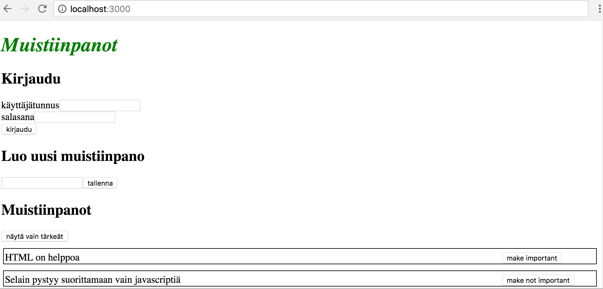
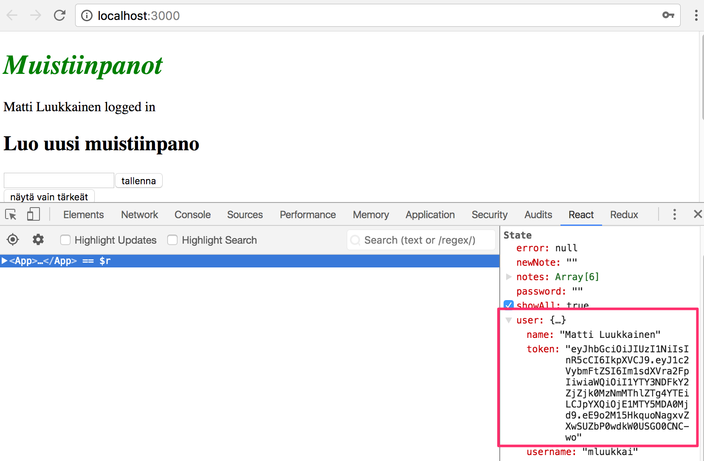
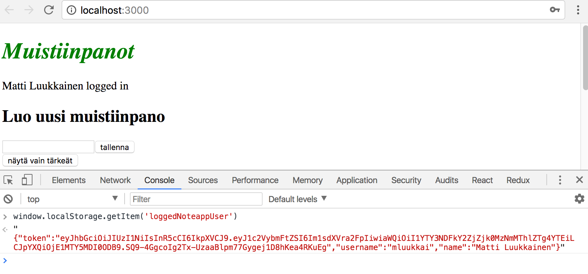
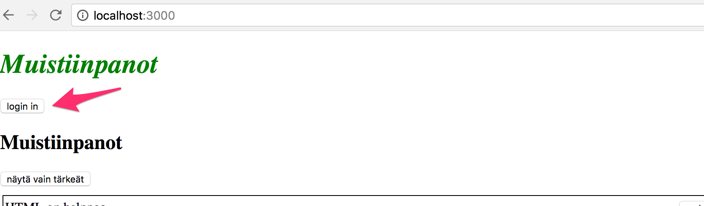
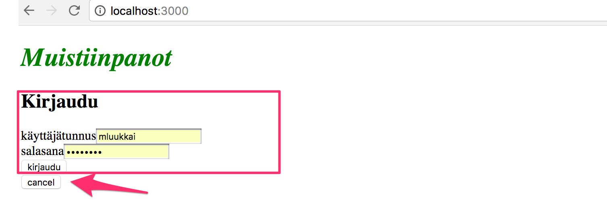
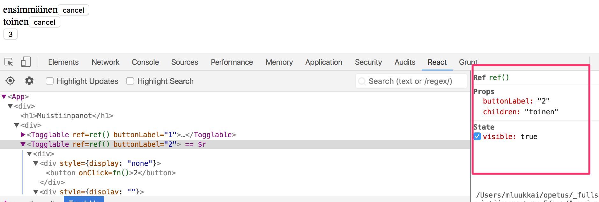
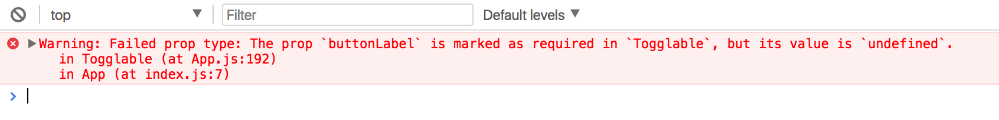
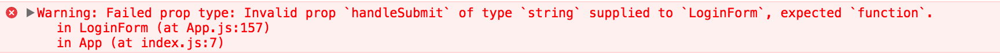

<div class="content">

## Kirjautuminen React-sovelluksesta

Kaksi edellistä osaa keskittyivät lähinnä backendin toiminnallisuuteen. Edellisessä osassa backendiin toteutettua käyttäjänhallintaa ei ole tällä hetkellä tuettuna frontendissa millään tavalla.

Frontend näyttää tällä hetkellä olemassaolevat muistiinpanot ja antaa muuttaa niiden tilaa. Uusia muistiinpanoja ei kuitenkaan voi lisätä, sillä osan 4 muutosten myötä backend edellyttää, että lisäyksen mukana on käyttäjän identiteetin varmistava token.

Toteutetaan nyt osa käyttäjienhallinnan edellyttämästä toiminnallisuudesta frontendiin. Aloitetaan käyttäjän kirjautumisesta. Oletetaan vielä tässä osassa, että käyttäjät luodaan suoraan backendiin.

Sovelluksen yläosaan on nyt lisätty kirjautumislomake, myös uuden muistiinpanon lisäämisestä huolehtiva lomake on siirretty sivun yläosaan:



Komponentin _App_ koodi näyttää seuraavalta:

```react
import React from 'react'
import noteService from './services/notes'

class App extends React.Component {
  constructor(props) {
    super(props)
    this.state = {
      notes: [],
      newNote: '',
      showAll: true,
      error: null,
      username: '',
      password: '',
      user: null
    }
  }

  componentDidMount() {
    noteService.getAll().then(notes =>
      this.setState({ notes })
    )
  }

  addNote = (event) => {
    event.preventDefault()
    const noteObject = {
      content: this.state.newNote,
      date: new Date(),
      important: Math.random() > 0.5
    }

    noteService
      .create(noteObject)
      .then(newNote => {
        this.setState({
          notes: this.state.notes.concat(newNote),
          newNote: ''
        })
      })
  }

  toggleImportanceOf = (id) => {
    // ...
  }

  login = (event) => {
    event.preventDefault()
    console.log('logging in with', this.state.username, this.state.password)
  }

  handleNoteChange = (event) => {
    this.setState({ newNote: event.target.value })
  }

  handlePasswordChange = (event) => {
    this.setState({ password: event.target.value })
  }

  handleUsernameChange = (event) => {
    this.setState({ username: event.target.value })
  }

  toggleVisible = () => {
    this.setState({ showAll: !this.state.showAll })
  }

  render() {
    // ...

    return (
      <div>
        <h1>Muistiinpanot</h1>

        <Notification message={this.state.error} />

        <h2>Kirjaudu</h2>

        <form onSubmit={this.login}>
          <div>
            käyttäjätunnus
            <input
              type="text"
              value={this.state.username}
              onChange={this.handleUsernameChange}
            />
          </div>
          <div>
            salasana
            <input
              type="password"
              value={this.state.password}
              onChange={this.handlePasswordChange}
            />
          </div>
          <button type="submit">kirjaudu</button>
        </form>

        <h2>Luo uusi muistiinpano</h2>

        <form onSubmit={this.addNote}>
          <input
            value={this.state.newNote}
            onChange={this.handleNoteChange}
          />
          <button type="submit">tallenna</button>
        </form>

        <h2>Muistiinpanot</h2>

        // ...

      </div >
    )
  }
}

export default App
```

Sovelluksen tämänhetkinen koodi on kokonaisuudessaan [githubissa](https://github.com/FullStack-HY/part2-notes/tree/part5-1), tagissa _part5-1_.

Kirjautumislomakkeen käsittely noudattaa samaa periaatetta kuin [osassa 2](/osa2#lomakkeet). Lomakkeen kenttiä varten on lisätty komponentin tilaan kentät _username_ ja _password_. Molemmille kentille on rekisteröity muutoksenkäsittelijä (_handleUsernameChange_ ja _handlePasswordChange_), joka synkronoi kenttään tehdyt muutokset komponentin _App_ tilaan. Kirjautumislomakkeen lähettämisestä vastaava metodi _login_ ei tee vielä mitään.

Jos lomakkeella on paljon kenttiä, voi olla työlästä toteuttaa jokaiselle kentälle oma muutoksenkäsittelijä. React tarjoaakin tapoja, miten yhden muutoksenkäsittelijän avulla on mahdollista huolehtia useista syötekentistä. Jaetun käsittelijän on saatava jollain tavalla tieto minkä syötekentän muutos aiheutti tapahtuman. Eräs tapa tähän on lomakkeen syötekenttien nimeäminen.

Lisätään _input_ elementteihin nimet _name_-attribuutteina ja vaihdetaan molemmat käyttämään samaa muutoksenkäsittelijää:

```html
<form onSubmit="{this.login}">
  <div>
    käyttäjätunnus
    <input
      type="text"
      name="username"
      value="{this.state.username}"
      onChange="{this.handleLoginFieldChange}"
    />
  </div>
  <div>
    salasana
    <input
      type="password"
      name="password"
      value="{this.state.password}"
      onChange="{this.handleLoginFieldChange}"
    />
  </div>
  <button type="submit">kirjaudu</button>
</form>
```

Yhteinen muutoksista huolehtiva tapahtumankäsittelijä on seuraava:

```js
handleLoginFieldChange = event => {
  if (event.target.name === 'password') {
    this.setState({ password: event.target.value });
  } else if (event.target.name === 'username') {
    this.setState({ username: event.target.value });
  }
};
```

Tapahtumankäsittelijän parametrina olevan tapahtumaolion _event_ kentän _target.name_ arvona on tapahtuman aiheuttaneen komponentin _name_-attribuutti, eli joko _username_ tai _password_. Koodi haarautuu nimen perusteella ja asettaa tilaan oikean kentän arvon.

Javascriptissa on ES6:n myötä uusi syntaksi [computed property name](https://developer.mozilla.org/en-US/docs/Web/JavaScript/Reference/Operators/Object_initializer), jonka avulla olion kentän voi määritellä muuttujan avulla. Esim. seuraava koodi

```js
const field = 'name';

const object = { [field]: 'Arto Hellas' };
```

määrittelee olion <code>{ name: 'Arto Hellas'}</code>

Näin saamme eliminoitua if-lauseen tapahtumankäsittelijästä ja se pelkistyy yhden rivin mittaiseksi:

```js
handleLoginFieldChange = event => {
  this.setState({ [event.target.name]: event.target.value });
};
```

Kirjautuminen tapahtuu tekemällä HTTP POST -pyyntö palvelimen osoitteeseen _api/login_. Eristetään pyynnön tekevä koodi omaan moduuliin, tiedostoon _services/login.js_.

Käytetään nyt promisejen sijaan _async/await_-syntaksia HTTP-pyynnön tekemiseen:

```js
import axios from 'axios';
const baseUrl = '/api/login';

const login = async credentials => {
  const response = await axios.post(baseUrl, credentials);
  return response.data;
};

export default { login };
```

Kirjautumisen käsittelystä huolehtiva metodi voidaan toteuttaa seuraavasti:

```js
login = async event => {
  event.preventDefault();
  try {
    const user = await loginService.login({
      username: this.state.username,
      password: this.state.password,
    });

    this.setState({ username: '', password: '', user });
  } catch (exception) {
    this.setState({
      error: 'käyttäjätunnus tai salasana virheellinen',
    });
    setTimeout(() => {
      this.setState({ error: null });
    }, 5000);
  }
};
```

Kirjautumisen onnistuessa nollataan kirjautumislomakkeen kentät _ja_ talletetaan palvelimen vastaus (joka sisältää _tokenin_ sekä kirjautuneen käyttäjän tiedot) sovelluksen tilan kenttään _user_.

Jos kirjautuminen epäonnistuu, eli metodin _loginService.login_ suoritus aiheuttaa poikkeuksen, ilmoitetaan siitä käyttäjälle.

Onnistunut kirjautuminen ei nyt näy sovelluksen käyttäjälle mitenkään. Muokataan sovellusta vielä siten, että kirjautumislomake näkyy vain _jos käyttäjä ei ole kirjautuneena_ eli _this.state.user === null_ ja uuden muistiinpanon luomislomake vain _jos käyttäjä on kirjautuneena_, eli (eli _this.state.user_ sisältää kirjautuneen käyttäjän tiedot.

Määritellään ensin komponentin _App_ metodiin render apufunktiot lomakkeiden generointia varten:

```html
const loginForm = () => (
<div>
  <h2>Kirjaudu</h2>

  <form onSubmit="{this.login}">
    <div>
      käyttäjätunnus
      <input
        type="text"
        name="username"
        value="{this.state.username}"
        onChange="{this.handleLoginFieldChange}"
      />
    </div>
    <div>
      salasana
      <input
        type="password"
        name="password"
        value="{this.state.password}"
        onChange="{this.handleLoginFieldChange}"
      />
    </div>
    <button type="submit">kirjaudu</button>
  </form>
</div>
) const noteForm = () => (
<div>
  <h2>Luo uusi muistiinpano</h2>

  <form onSubmit="{this.addNote}">
    <input value="{this.state.newNote}" onChange="{this.handleNoteChange}" />
    <button type="submit">tallenna</button>
  </form>
</div>
)
```

ja renderöidään ne ehdollisesti komponentin _App_ render-metodissa:

```bash
class App extends React.Component {
  // ..
  return (
    <div>
      <h1>Muistiinpanot</h1>

      <Notification message={this.state.error}/>

      {this.state.user === null && loginForm()}

      {this.state.user !== null && noteForm()}


      <h2>Muistiinpanot</h2>

      // ...

    </div>
  )
}
```

Lomakkeiden ehdolliseen renderöintiin käytetään hyväksi aluksi hieman erikoiselta näyttävää, mutta Reactin yhteydessä [yleisesti käytettyä kikkaa](https://reactjs.org/docs/conditional-rendering.html#inline-if-with-logical--operator):

```js
{
  this.state.user === null && loginForm();
}
```

Jos ensimmäinen osa evaluoituu epätodeksi eli on [falsy](https://developer.mozilla.org/en-US/docs/Glossary/Falsy), ei toista osaa eli lomakkeen generoivaa koodia suoriteta ollenkaan.

Voimme suoraviivaistaa edellistä vielä hieman käyttämällä [kysymysmerkkioperaattoria](https://developer.mozilla.org/en-US/docs/Web/JavaScript/Reference/Operators/Conditional_Operator):

```html
return (
  <div>
    <h1>Muistiinpanot</h1>

    <Notification message={this.state.error}/>

    {this.state.user === null ?
      loginForm() :
      noteForm()
    }

    <h2>Muistiinpanot</h2>

    // ...

  </div>
)
```

Eli jos _this.state.user === null_ on [truthy](https://developer.mozilla.org/en-US/docs/Glossary/Truthy), suoritetaan _loginForm_ ja muussa tapauksessa _noteForm_.

Tehdään vielä sellainen muutos, että jos käyttäjä on kirjautunut, renderöidään kirjautuneet käyttäjän nimi:

```html
return (
  <div>
    <h1>Muistiinpanot</h1>

    <Notification message={this.state.error}/>

    {this.state.user === null ?
      loginForm() :
      <div>
        <p>{this.state.user.name} logged in</p>
        {noteForm()}
      </div>
    }

    <h2>Muistiinpanot</h2>

    // ...

  </div>
)
```

Ratkaisu näyttää hieman rumalta, mutta jätämme sen koodiin toistaiseksi.

Sovelluksen tämänhetkinen koodi on kokonaisuudessaan [githubissa](https://github.com/FullStack-HY/part2-notes/tree/part5-2), tagissa _part5-2_. **HUOM** koodissa on parissa kohtaa käytetty vahingossa komponentin kentästä nimeä _new_note_, oikea (seuraaviin tageihin korjattu) muoto on _newNote_,

Sovelluksemme pääkomponentti _App_ on tällä hetkellä jo aivan liian laaja ja nyt tekemämme muutokset ovat ilmeinen signaali siitä, että lomakkeet olisi syytä refaktoroida omiksi komponenteikseen. Jätämme sen kuitenkin harjoitustehtäväksi.

## Muistiinpanojen luominen

Frontend on siis tallettanut onnistuneen kirjautumisen yhteydessä backendilta saamansa tokenin sovelluksen tilaan _this.state.user.token_:



Korjataan uusien muistiinpanojen luominen siihen muotoon, mitä backend edellyttää, eli lisätään kirjautuneen käyttäjän token HTTP-pyynnön Authorization-headeriin.

_noteService_-moduuli muuttuu seuraavasti:

```js
import axios from 'axios';
const baseUrl = '/api/notes';

let token = null;

const getAll = () => {
  const request = axios.get(baseUrl);
  return request.then(response => response.data);
};

const setToken = newToken => {
  token = `bearer ${newToken}`;
};

const create = async newObject => {
  const config = {
    headers: { Authorization: token },
  };

  const response = await axios.post(baseUrl, newObject, config);
  return response.data;
};

const update = (id, newObject) => {
  const request = axios.put(`${baseUrl}/${id}`, newObject);
  return request.then(response => response.data);
};

export default { getAll, create, update, setToken };
```

Moduulille on määritelty vain moduulin sisällä näkyvä muuttuja _token_, jolle voidaan asettaa arvo moduulin exporttaamalla funktiolla _setToken_. Async/await-syntaksiin muutettu _create_ asettaa moduulin tallessa pitämän tokenin _Authorization_-headeriin, jonka se antaa axiosille metodin _post_ kolmantena parametrina.

Kirjautumisesta huolehtivaa tapahtumankäsittelijää pitää vielä viilata sen verran, että se kutsuu metodia <code>noteService.setToken(user.token)</code> onnistuneen kirjautumisen yhteydessä:

```js
login = async event => {
  event.preventDefault();
  try {
    const user = await loginService.login({
      username: this.state.username,
      password: this.state.password,
    });

    noteService.setToken(user.token);
    this.setState({ username: '', password: '', user });
  } catch (exception) {
    // ...
  }
};
```

Uusien muistiinpanojen luominen onnistuu taas!

## Tokenin tallettaminen selaimen local storageen

Sovelluksessamme on ikävä piirre: kun sivu uudelleenladataan, tieto käyttäjän kirjautumisesta katoaa. Tämä hidastaa melkoisesti myös sovelluskehitystä, esim. testatessamme uuden muistiinpanon luomista, joudumme joka kerta kirjautumaan järjestelmään.

Ongelma korjaantuu helposti tallettamalla kirjautumistiedot [local storageen](https://developer.mozilla.org/en-US/docs/Web/API/Storage) eli selaimessa olevaan avain-arvo- eli [key-value](https://en.wikipedia.org/wiki/Key-value_database)-periaatteella toimivaan tietokantaan.

Local storage on erittäin helppokäyttöinen. Metodilla [setItem](https://developer.mozilla.org/en-US/docs/Web/API/Storage/setItem) talletetaan tiettyä _avainta_ vastaava _arvo_, esim:

```js
window.localStorage.setItem('nimi', 'juha tauriainen');
```

tallettaa avaimen _nimi_ arvoksi toisena parametrina olevan merkkijonon.

Avaimen arvo selviää metodilla [getItem](https://developer.mozilla.org/en-US/docs/Web/API/Storage/getItem):

```js
window.localStorage.getItem('nimi');
```

ja [removeItem](https://developer.mozilla.org/en-US/docs/Web/API/Storage/removeItem) poistaa avaimen.

Storageen talletetut arvot säilyvät vaikka sivu uudelleenladattaisiin. Storage on ns. [origin](https://developer.mozilla.org/en-US/docs/Glossary/Origin)-kohtainen, eli jokaisella selaimella käytettävällä web-sovelluksella on oma storagensa.

Laajennetaan sovellusta siten, että se asettaa kirjautuneen käyttäjän tiedot local storageen.

Koska storageen talletettavat arvot ovat [merkkijonoja](https://developer.mozilla.org/en-US/docs/Web/API/DOMString), emme voi tallettaa storageen suoraan Javascript-oliota, vaan ne on muutettava ensin JSON-muotoon metodilla _JSON.stringify_. Vastaavasti kun JSON-muotoinen olio luetaan local storagesta, on se parsittava takaisin Javascript-olioksi metodilla _JSON.parse_.

Kirjautumisen yhteyteen tehtävä muutos on seuraava:

```js
login = async event => {
  event.preventDefault();

  try {
    const user = await loginService.login({
      username: this.state.username,
      password: this.state.password,
    });

    window.localStorage.setItem('loggedNoteappUser', JSON.stringify(user));
    noteService.setToken(user.token);
    this.setState({ username: '', password: '', user });
  } catch (exception) {
    // ...
  }
};
```

Kirjautuneen käyttäjän tiedot tallentuvat nyt local storageen ja niitä voidaan tarkastella konsolista:



Sovellusta on vielä laajennettava siten, että kun sivulle tullaan uudelleen, esim. selaimen uudelleenlataamisen yhteydessä, tulee sovelluksen tarkistaa löytyykö local storagesta tiedot kirjautuneesta käyttäjästä. Jos löytyy, asetetaan ne sovelluksen tilaan ja _noteServicelle_.

Sopiva paikka tähän on _App_-komponentin metodi [componentDidMount](https://reactjs.org/docs/react-component.html#componentdidmount) johon tutustuimme jo [osassa 2](/osa2#komponenttien-lifecycle-metodit).

Kyseessä on siis ns. lifecycle-metodi, jota React-kutsuu heti komponentin ensimmäisen renderöinnin jälkeen. Metodissa on tällä hetkellä jo muistiinpanot palvelimelta lataava koodi. Laajennetaan koodia seuraavasti

```js
componentDidMount() {
  noteService.getAll().then(notes =>
    this.setState({ notes })
  )

  const loggedUserJSON = window.localStorage.getItem('loggedNoteappUser')
  if (loggedUserJSON) {
    const user = JSON.parse(loggedUserJSON)
    this.setState({user})
    noteService.setToken(user.token)
  }
}
```

Nyt käyttäjä pysyy kirjautuneena sovellukseen ikuisesti. Sovellukseen olisikin kenties syytä lisätä _logout_-toiminnallisuus, joka poistaisi kirjautumistiedot local storagesta. Jätämme kuitenkin uloskirjautumisen harjoitustehtäväksi.

Meille riittää se, että sovelluksesta on mahdollista kirjautua ulos kirjoittamalla konsoliin

```js
window.localStorage.removeItem('loggedNoteappUser');
```

tai local storagen tilan kokonaan nollaavan komennon

```js
window.localStorage.clear();
```

Sovelluksen tämänhetkinen koodi on kokonaisuudessaan [githubissa](https://github.com/FullStack-HY/part2-notes/tree/part5-3), tagissa _part5-3_.

## Tehtäviä

Tee nyt tehtävät [5.1-5.4](/tehtävät#osa-5)

## Kirjautumislomakkeen näyttäminen vain tarvittaessa

Muutetaan sovellusta siten, että kirjautumislomaketta ei oletusarvoisesti näytetä:



Lomake aukeaa, jos käyttäjä painaa nappia _login_:



Napilla _cancel_ käyttäjä saa tarvittaessa suljettua lomakkeen.

Aloitetaan eristämällä kirjautumislomake omaksi komponentikseen:

```html
const LoginForm = ({ handleSubmit, handleChange, username, password }) => {
return (
<div>
  <h2>Kirjaudu</h2>

  <form onSubmit="{handleSubmit}">
    <div>
      käyttäjätunnus
      <input value="{username}" onChange="{handleChange}" name="username" />
    </div>
    <div>
      salasana
      <input
        type="password"
        name="password"
        value="{password}"
        onChange="{handleChange}"
      />
    </div>
    <button type="submit">kirjaudu</button>
  </form>
</div>
) }
```

Reactin [suosittelemaan tyyliin](https://reactjs.org/docs/lifting-state-up.html) tila ja tilaa käsittelevät funktiot on kaikki määritelty komponentin ulkopuolella ja välitetään komponentille propseina.

Huomaa, että propsit otetaan vastaan _destrukturoimalla_, eli sen sijaan että määriteltäisiin

```html
const LoginForm = (props) => {
  return (
      <form onSubmit={props.handleSubmit}>
        <div>
          käyttäjätunnus
          <input
            value={props.username}
            onChange={props.handleChange}
            name="username"
          />
        </div>
        // ...
        <button type="submit">kirjaudu</button>
      </form>
    </div>
  )
}
```

jolloin muuttujan _props_ kenttiin on viitattava muuttujan kautta esim. _props.handleSubmit_, otetaan kentät suoraan vastaan omiin muuttujiinsa.

Nopea tapa toiminnallisuuden toteuttamiseen on muuttaa komponentin _App_ käyttämä funktio _loginForm_ seuraavaan muotoon:

```react
const loginForm = () => {
  const hideWhenVisible = { display: this.state.loginVisible ? 'none' : '' }
  const showWhenVisible = { display: this.state.loginVisible ? '' : 'none' }

  return (
    <div>
      <div style={hideWhenVisible}>
        <button onClick={e => this.setState({ loginVisible: true })}>log in</button>
      </div>
      <div style={showWhenVisible}>
        <LoginForm
          username={this.state.username}
          password={this.state.password}
          handleChange={this.handleLoginFieldChange}
          handleSubmit={this.login}
        />
        <button onClick={e => this.setState({ loginVisible: false })}>cancel</button>
      </div>
    </div>
  )
}
```

Komponentin _App_ tilaan on nyt lisätty kenttä _loginVisible_ joka määrittelee sen näytetäänkö kirjautumislomake.

Näkyvyyttä säätelevää tilaa vaihdellaan kahden napin avulla, molempiin on kirjoitettu tapahtumankäsittelijän koodi suoraan:

```react
<button onClick={e => this.setState({ loginVisible: true })}>log in</button>

<button onClick={e => this.setState({ loginVisible: false })}>cancel</button>
```

Komponenttien näkyvyys on määritelty asettamalla komponentille CSS-määrittely, jossa [display](https://developer.mozilla.org/en-US/docs/Web/CSS/display)-propertyn arvoksi asetetaan _none_ jos komponentin ei haluta näkyvän:

```html
const hideWhenVisible = { display: this.state.loginVisible ? 'none' : '' } const
showWhenVisible = { display: this.state.loginVisible ? '' : 'none' } // ...

<div style="{hideWhenVisible}">// nappi</div>

<div style="{showWhenVisible}">// lomake</div>
```

Käytössä on taas kysymysmerkkioperaattori, eli jos _this.state.loginVisible_ on _true_, tulee napin CSS-määrittelyksi

```css
display: 'none';
```

jos _this.state.loginVisible_ on _false_, ei _display_ saa mitään (napin näkyvyyteen liittyvää) arvoa.

Hyödynsimme mahdollisuutta määritellä React-komponenteille koodin avulla [inline](https://react-cn.github.io/react/tips/inline-styles.html)-tyylejä. Palaamme asiaan tarkemmin seuraavassa osassa.

## Komponentin lapset, eli this.props.children

Kirjautumislomakkeen näkyvyyttä ympäröivän koodin voi ajatella olevan oma looginen kokonaisuutensa ja se onkin hyvä eristää pois komponentista _App_ omaksi komponentikseen.

Tavoitteena on luoda komponentti _Togglable_, jota käytetään seuraavalla tavalla:

```html
<Togglable buttonLabel="login">
  <LoginForm
    username={this.state.username}
    password={this.state.password}
    handleChange={this.handleLoginFieldChange}
    handleSubmit={this.login}
  />
</Togglable>
```

Komponentin käyttö poikkeaa aiemmin näkemistämme siinä, että käytössä on nyt avaava ja sulkeva tagi, joiden sisällä määritellään toinen komponentti eli _LoginForm_. Reactin terminologiassa _LoginForm_ on nyt komponentin _Togglable_ lapsi.

_Togglablen_ avaavan ja sulkevan tagin sisälle voi sijoittaa lapsiksi mitä tahansa React-elementtejä, esim.:

```html
<Togglable buttonLabel="paljasta">
  <p>tämä on aluksi piilossa</p>
  <p>toinen salainen rivi</p>
</Togglable>
```

Komponentin koodi on seuraavassa:

```react
class Togglable extends React.Component {
  constructor(props) {
    super(props)
    this.state = {
      visible: false
    }
  }

  toggleVisibility = () => {
    this.setState({visible: !this.state.visible})
  }

  render() {
    const hideWhenVisible = { display: this.state.visible ? 'none' : '' }
    const showWhenVisible = { display: this.state.visible ? '' : 'none' }

    return (
      <div>
        <div style={hideWhenVisible}>
          <button onClick={this.toggleVisibility}>{this.props.buttonLabel}</button>
        </div>
        <div style={showWhenVisible}>
          {this.props.children}
          <button onClick={this.toggleVisibility}>cancel</button>
        </div>
      </div>
    )
  }
}
```

Mielenkiintoista ja meille uutta on [this.props.children](https://reactjs.org/docs/glossary.html#propschildren), jonka avulla koodi viittaa komponentin lapsiin, eli avaavan ja sulkevan tagin sisällä määriteltyihin React-elementteihin.

Tällä kertaa lapset ainoastaan renderöidään komponentin oman renderöivän koodin seassa:

```html
<div style="{showWhenVisible}">
  {this.props.children}
  <button onClick="{this.toggleVisibility}">cancel</button>
</div>
```

Toisin kuin "normaalit" propsit, _children_ on Reactin automaattisesti määrittelemä, aina olemassa oleva propsi. Jos komponentti määritellään automaattisesti suljettavalla eli _/>_ loppuvalla tagilla, esim.

```html
<Note
  key={note.id}
  note={note}
  toggleImportance={this.toggleImportanceOf(note.id)}
/>
```

on _this.props.children_ tyhjä taulukko.

Komponentti _Togglable_ on uusiokäytettävä ja voimme käyttää sitä tekemään myös uuden muistiinpanon luomisesta huolehtivan formin vastaavalla tavalla tarpeen mukaan näytettäväksi.

Eristetään ensin muistiinpanojen luominen omaksi komponentiksi

```react
const NoteForm = ({ onSubmit, handleChange, value}) => {
  return (
    <div>
      <h2>Luo uusi muistiinpano</h2>

      <form onSubmit={onSubmit}>
        <input
          value={value}
          onChange={handleChange}
        />
        <button type="submit">tallenna</button>
      </form>
    </div>
  )
}
```

ja määritellään lomakkeen näyttävä koodi komponentin _Togglable_ sisällä

```html
<Togglable buttonLabel="new note">
  <NoteForm
    onSubmit={this.addNote}
    value={this.state.newNote}
    handleChange={this.handleNoteChange}
  />
</Togglable>
```

## ref eli viite komponenttiin

Ratkaisu on melko hyvä, haluaisimme kuitenkin parantaa sitä erään seikan osalta.

Kun uusi muistiinpano luodaan, olisi loogista jos luomislomake menisi piiloon. Nyt lomake pysyy näkyvillä. Lomakkeen piilottamiseen sisältyy kuitenkin pieni ongelma, sillä näkyvyyttä kontrolloidaan _Togglable_-komponentin tilassa olevalla muuttujalla ja komponentissa määritellyllä metodilla _toggleVisibility_. Miten pääsemme niihin käsiksi komponentin ulkopuolelta?

Koska React-komponentit ovat Javascript-olioita, on niiden metodeja mahdollista kutsua jos komponenttia vastaavaan olioon onnistutaan saamaan viite.

Eräs keino viitteen saamiseen on React-komponenttien attribuutti [ref](https://reactjs.org/docs/refs-and-the-dom.html#adding-a-ref-to-a-class-component).

Muutetaan lomakkeen renderöivää koodia seuraavasti:

```bash
<div>
  <Togglable buttonLabel="new note" ref={component => this.noteForm = component}>
    <NoteForm
      ...
    />
  </Togglable>
</div>
```

Kun komponentti _Togglable_ renderöidään, suorittaa React ref-attribuutin sisällä määritellyn funktion:

```js
component => (this.noteForm = component);
```

parametrin _component_ arvona on viite komponenttiin. Funktio tallettaa viitteen muuttujaan _this.noteForm_ eli _App_-komponentin kenttään _noteForm_.

Nyt mistä tahansa komponentin _App_ sisältä on mahdollista päästä käsiksi uusien muistiinpanojen luomisen sisältävään _Togglable_-komponenttiin.

Voimme nyt piilottaa lomakkeen kutsumalla _this.noteForm.toggleVisibility()_ samalla kun uuden muistiinpanon luominen tapahtuu:

```js
addNote = e => {
  e.preventDefault();
  this.noteForm.toggleVisibility();

  // ..
};
```

Refeille on myös [muita käyttötarkoituksia](https://reactjs.org/docs/refs-and-the-dom.html) kuin React-komponentteihin käsiksi pääseminen.

Sovelluksen tämänhetkinen koodi on kokonaisuudessaan [githubissa](https://github.com/FullStack-HY/part2-notes/tree/part5-4), tagissa _part5-4_.

### Huomio komponenteista

Kun Reactissa määritellään komponentti

```js
class Togglable extends React.Component {
  // ...
}
```

ja otetaan se käyttöön seuraavasti

```react
<div>
  <Togglable buttonLabel="1" ref={component => this.t1 = component}>
    ensimmäinen
  </Togglable>

  <Togglable buttonLabel="2" ref={component => this.t2 = component}>
    toinen
  </Togglable>

  <Togglable buttonLabel="3" ref={component => this.t3 = component}>
    kolmas
  </Togglable>
</div>
```

syntyy _kolme erillistä komponenttiolioa_, joilla on kaikilla oma tilansa:



_ref_-attribuutin avulla on talletettu viite jokaiseen komponenttiin muuttujiin _this.t1_, _this.t2_ ja _this.t3_.

## Tehtäviä

Tee nyt tehtävät [5.5-5.10](/tehtävät#komponenttien-näyttäminen-vain-tarvittaessa)

## PropTypes

Komponentti _Togglable_ olettaa, että sille määritellään propsina _buttonLabel_ napin teksti. Jos määrittely unohtuu

```html
<Togglable> buttonLabel unohtui... </Togglable>
```

Sovellus kyllä toimii, mutta selaimeen renderöityy hämäävästi nappi, jolla ei ole mitään tekstiä.

Haluaisimmekin varmistaa että jos _Togglable_-komponenttia käytetään, on propsille "pakko" antaa arvo.

Kirjaston olettamat ja edellyttämät propsit ja niiden tyypit voidaan määritellä kirjaston [prop-types](https://github.com/facebook/prop-types) avulla. Asennetaan kirjasto

```bash
npm install --save prop-types
```

_buttonLabel_ voidaan määritellä _pakolliseksi_ string-tyyppiseksi propsiksi seuraavasti

```react
import PropTypes from 'prop-types'

class Togglable extends React.Component {
  // ...
}

Togglable.propTypes = {
  buttonLabel: PropTypes.string.isRequired
}
```

Jos propsia ei määritellä, seurauksena on konsoliin tulostuva virheilmoitus



Koodi kuitenkin toimii edelleen, eli mikään ei pakota määrittelemään propseja PropTypes-määrittelyistä huolimatta. On kuitenkin erittäin epäprofessionaalia jättää konsoliin _mitään_ punaisia tulosteita.

Määritellään Proptypet myös _LoginForm_-komponentille:

```react
import PropTypes from 'prop-types'

const LoginForm = ({ handleSubmit, handleChange, username, password }) => {
  return (
    // ...
  )
}

LoginForm.propTypes = {
  handleSubmit: PropTypes.func.isRequired,
  handleChange: PropTypes.func.isRequired,
  username: PropTypes.string.isRequired,
  password: PropTypes.string.isRequired
}
```

Funktionaalisen komponentin proptypejen määrittely tapahtuu samalla tavalla kuin luokkaperustaisten.

Jos propsin tyyppi on väärä, esim. yritetään määritellä propsiksi _handleChange_ merkkijono, seurauksena on varoitus:



Luokkaperustaisille komponenteille PropTypet on mahdollista määritellä myös _luokkamuuttujina_, seuraavalla syntaksilla:

```react
import PropTypes from 'prop-types'

class Togglable extends React.Component {
  static propTypes = {
    buttonLabel: PropTypes.string.isRequired
  }

  // ...
}
```

Muuttujamäärittelyn edessä oleva _static_ määrittelee nyt, että _propTypes_-kenttä on nimenomaan komponentin määrittelevällä luokalla _Togglable_ eikä luokan instansseilla. Oleellisesti ottaen kyseessä on ainoastaan Javascriptin vielä standardoimattoman [ominaisuuden](https://github.com/tc39/proposal-class-fields) mahdollistava syntaktinen oikotie määritellä seuraava:

```js
Togglable.propTypes = {
  buttonLabel: PropTypes.string.isRequired,
};
```

Surffatessasi internetissä saatat vielä nähdä ennen Reactin versiota 0.16 tehtyjä esimerkkejä, joissa PropTypejen käyttö ei edellytä erillistä kirjastoa. Versiosta 0.16 alkaen PropTypejä ei enää määritelty React-kirjastossa itsessään ja kirjaston _prop-types_ käyttö on pakollista.

## Tehtäviä

Tee nyt tehtävä [5.11](/tehtävät#proptypet)

</div>
