<div class="content">

## Muistiinpano-sovelluksen refaktorointia

Jatketaan osan 5 loppupuolella tehdyn muistiinpanosovelluksen yksinkertaistetun [redux-version](/osa5#redux-muistiinpanot) laajentamista.

Sovelluksen tämänhetkinen koodi on [githubissa](https://github.com/FullStack-HY/redux-notes/tree/part5-6) tagissa _part5-6_.

Tehdään koodiin muutamia rakenteellisia muutoksia. Siirretään reducerin määrittelevä tiedosto _noteReducer.js_ hakemistoon _src/reducers_.

Sovelluskehitystä helpottaaksemme laajennetaan reduceria siten, että storelle määritellään alkutila, jossa on pari muistiinpanoa:

```js
const initialState = [
  {
    content: 'reduxin storen toiminnan määrittelee reduceri',
    important: true,
    id: 1,
  },
  {
    content: 'storen tilassa voi olla mielivaltaista dataa',
    important: false,
    id: 2,
  },
];
const noteReducer = (state = initialState, action) => {
  // ...
};

export default noteReducer;
```

Siirretään [action creatorit](https://redux.js.org/advanced/async-actions#synchronous-action-creators), eli sopivia [action](https://redux.js.org/basics/actions)-olioita generoivat apufunktiot reducerin kanssa samaan moduuliin:

```js
const initialState = [
  {
    content: 'reduxin storen toiminnan määrittelee reduceri',
    important: true,
    id: 1,
  },
  {
    content: 'storen tilassa voi olla mielivaltaista dataa',
    important: false,
    id: 2,
  },
];

const noteReducer = (state = initialState, action) => {
  switch (action.type) {
    case 'NEW_NOTE':
      return [...state, action.data];
    case 'TOGGLE_IMPORTANCE':
      const id = action.data.id;
      const noteToChange = state.find(n => n.id === id);
      const changedNote = {
        ...noteToChange,
        important: !noteToChange.important,
      };
      return state.map(note => (note.id !== id ? note : changedNote));
    default:
      return state;
  }
};

const generateId = () => Number((Math.random() * 1000000).toFixed(0));

export const noteCreation = content => {
  return {
    type: 'NEW_NOTE',
    data: {
      content,
      important: false,
      id: generateId(),
    },
  };
};

export const importanceToggling = id => {
  return {
    type: 'TOGGLE_IMPORTANCE',
    data: { id },
  };
};

export default noteReducer;
```

Moduulissa on nyt useita [export](https://developer.mozilla.org/en-US/docs/Web/JavaScript/Reference/Statements/export)-komentoja.

Reducer-funktio palautetaan edelleen komennolla _export default_. Tämän ansiosta reducer importataan (tiedostossa _index.js_) tuttuun tapaan:

```js
import noteReducer from './reducers/noteReducer';
```

Moduulilla voi olla vain _yksi default export_, mutta useita "normaaleja" exporteja, kuten _Action creator_ -funktiot esimerkissämme

```js
export const noteCreation = content => {
  // ...
};

export const importanceToggling = id => {
  // ...
};
```

Normaalisti exportattujen funktioiden käyttöönotto tapahtuu aaltosulkusyntaksilla:

```js
import { noteCreation } from './../reducers/noteReducer';
```

Sovelluksen tämänhetkinen koodi on [githubissa](https://github.com/FullStack-HY/redux-notes/tree/part6-1) tagissä _part6-1_.

## ESlint

Konfiguroimme osassa 3 koodin tyylistä huolehtivan [ESlintin](/osa3#lint) backendiin. Otetaan nyt ESlint käyttöön myös frontendissa.

Create-react-app on asentanut projektille eslintin valmiiksi, joten ei tarvita muuta kun sopiva konfiguraatio tiedoston _.eslintrc.js_.

Tiedoston voi generoida komennolla

```bash
npx eslint --init
```

ja vastailemalla sopivasti kysymyksiin:

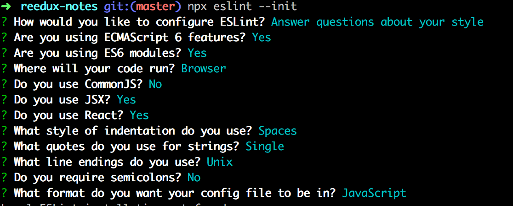

Jotta pääsemme eroon testeissä olevista turhista huomautuksista asennetaan [eslint-jest-plugin](https://www.npmjs.com/package/eslint-plugin-jest)

```bash
npm add --save-dev eslint-plugin-jest
```

ja otetaan se käyttöön manuaalin opastamalla tavalla.

Jos vastailit initialisoinnissa kysymyksiin kuvan osoittamalla tavalla, asentuu projektiin [eslint-plugin-react](https://github.com/yannickcr/eslint-plugin-react). Laajennetaan konfiguraatiota pluginin [manuaalin](https://github.com/yannickcr/eslint-plugin-react#configuration) ohjeen mukaan.

Joudumme asentamaan myös [babel-eslint](https://github.com/babel/babel-eslint)-pluginin, jotta ESlint osaisi tulkita koodissa käyttämäämme _class property_ -syntaksia. Pluginin asennus tapahtuu komennolla

```bash
npm install babel-eslint --save-dev
```

ja se tulee muistaa ottaa käyttöön konfiguraatiossa.

Seuraavassa lopullinen konfiguraatio, mihin on lisätty muutama muukin osassa 3 käyttöönotettu sääntö:

```bash
module.exports = {
    "env": {
        "browser": true,
        "es6": true,
        "jest/globals": true
    },
    "extends": [
        "eslint:recommended",
        "plugin:react/recommended"
    ],
    "parser": "babel-eslint",
    "parserOptions": {
        "ecmaFeatures": {
            "jsx": true
        },
        "ecmaVersion": 2018,
        "sourceType": "module"
    },
    "plugins": [
        "react", "jest"
    ],
    "rules": {
        "indent": [
            "error",
            2
        ],
        "linebreak-style": [
            "error",
            "unix"
        ],
        "quotes": [
            "error",
            "single"
        ],
        "semi": [
            "error",
            "never"
        ],
        "eqeqeq": "error",
        "no-trailing-spaces": "error",
        "object-curly-spacing": [
            "error", "always"
        ],
        "arrow-spacing": [
            "error", { "before": true, "after": true }
        ],
        "no-console": 0,
        "react/prop-types": 0
    }
};
```

## Monimutkaisempi tila storessa

Toteutetaan sovellukseen näytettävien muistiinpanojen filtteröinti, jonka avulla näytettäviä muistiinpanoja voidaan rajata. Filtterin toteutus tapahtuu [radiobuttoneiden](https://developer.mozilla.org/en-US/docs/Web/HTML/Element/input/radio) avulla:

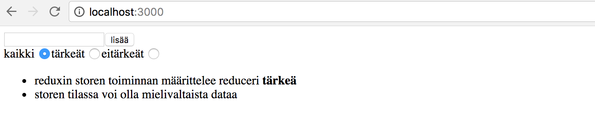

Aloitetaan todella suoraviivaisella toteutuksella:

```react
class App extends React.Component {
  filterSelected = (value) => () => {
    console.log(value)
  }
  render() {
    return (
      <div>
        <NoteForm />
        <div>
          kaikki    <input type="radio" name="filter"
                      onChange={this.filterSelected('ALL')}/>
          tärkeät   <input type="radio" name="filter"
                      onChange={this.filterSelected('IMPORTANT')}/>
          eitärkeät <input type="radio" name="filter"
                      onChange={this.filterSelected('NONIMPORTANT')}/>
        </div>
        <NoteList />
      </div>
    )
  }
}
```

Koska painikkeiden attribuutin _name_ arvo on kaikilla sama, muodostavat ne _nappiryhmän_, joista ainoastaan yksi voi olla kerrallaan valittuna.

Napeille on määritelty muutoksenkäsittelijä, joka tällä hetkellä ainoastaan tulostaa painettua nappia vastaavan merkkijonon konsoliin.

Päätämme toteuttaa filtteröinnin siten, että talletamme muistiinpanojen lisäksi sovelluksen storeen myös _filtterin arvon_. Eli muutoksen jälkeen storessa olevan tilan tulisi näyttää seuraavalta:

```js
{
  notes: [
    { content: 'reduxin storen toiminnan määrittelee reduceri', important: true, id: 1},
    { content: 'storen tilassa voi olla mielivaltaista dataa', important: false, id: 2}
  ],
  filter: 'IMPORTANT'
}
```

Tällä hetkellähän tilassa on ainoastaan muistiinpanot sisältävä taulukko. Uudessa ratkaisussa tilalla on siis kaksi avainta, _notes_ jonka arvona muistiinpanot ovat sekä _filter_, jonka arvona on merkkijono joka kertoo mitkä muistiinpanoista tulisi näyttää ruudulla.

### Yhdistetyt reducerit

Voisimme periaatteessa muokata jo olemassaolevaa reduceria ottamaan huomioon muuttuneen tilanteen. Parempi ratkaisu on kuitenkin määritellä tässä tilanteessa uusi, filtterin arvosta huolehtiva reduceri:

```js
const filterReducer = (state = 'ALL', action) => {
  switch (action.type) {
    case 'SET_FILTER':
      return action.filter;
    default:
      return state;
  }
};
```

Filtterin arvon asettavat actionit ovat siis muotoa

```js
{
  type: 'SET_FILTER',
  filter: 'IMPORTANT'
}
```

Määritellään samalla myös sopiva _action creator_ -funktio. Sijoitetaan koodi moduuliin _src/reducers/filterReducer.js_:

```js
const filterReducer = (state = 'ALL', action) => {
  // ...
};

export const filterChange = filter => {
  return {
    type: 'SET_FILTER',
    filter,
  };
};

export default filterReducer;
```

Saamme nyt muodostettua varsinaisen reducerin yhdistämällä kaksi olemassaolevaa reduceria funktion [combineReducers](https://redux.js.org/api-reference/combinereducers) avulla.

Määritellään yhdistetty reduceri tiedostossa _index.js_:

```react
import React from 'react'
import ReactDOM from 'react-dom'
import { createStore, combineReducers } from 'redux'
import { Provider } from 'react-redux'
import App from './App'
import noteReducer from './reducers/noteReducer'
import filterReducer from './reducers/filterReducer'

const reducer = combineReducers({
  notes: noteReducer,
  filter: filterReducer
})

const store = createStore(reducer)

console.log(store.getState())

ReactDOM.render(
  <Provider store={store}>
    <div> </div>
  </Provider>,
document.getElementById('root'))
```

Koska sovelluksemme hajoaa tässä vaiheessa täysin, komponentin _App_ sijasta renderöidään tyhjä _div_-elementti.

Konsoliin tulostuu storen tila:

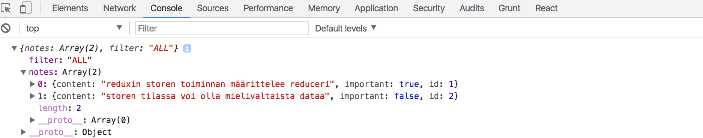

eli store on juuri siinä muodossa missä haluammekin sen olevan!

Tarkastellaan vielä yhdistetyn reducerin luomista

```js
const reducer = combineReducers({
  notes: noteReducer,
  filter: filterReducer,
});
```

Näin tehdyn reducerin määrittelemän storen tila on olio, jossa on kaksi kenttää, _notes_ ja _filter_. Tilan kentän _notes_ arvon määrittelee _noteReducer_, jonka ei tarvitse välittää mitään tilan muista kentistä. Vastaavasti _filter_ kentän käsittely tapahtuu _filterReducer_:in avulla.

Ennen muun koodin muutoksia, kokeillaan vielä konsolista, miten actionit muuttavat yhdistetyn reducerin muodostamaa staten tilaa:

```js
//...
import noteReducer, { noteCreation } from './reducers/noteReducer';
import filterReducer, { filterChange } from './reducers/filterReducer';

const reducer = combineReducers({
  notes: noteReducer,
  filter: filterReducer,
});

const store = createStore(reducer);
store.subscribe(() => console.log(store.getState()));
console.log(store.getState());
store.dispatch(filterChange('IMPORTANT'));
store.dispatch(noteCreation('combineReducers muodostaa yhdistetyn reducerin'));
```

Konsoliin tulostuu storen tila:

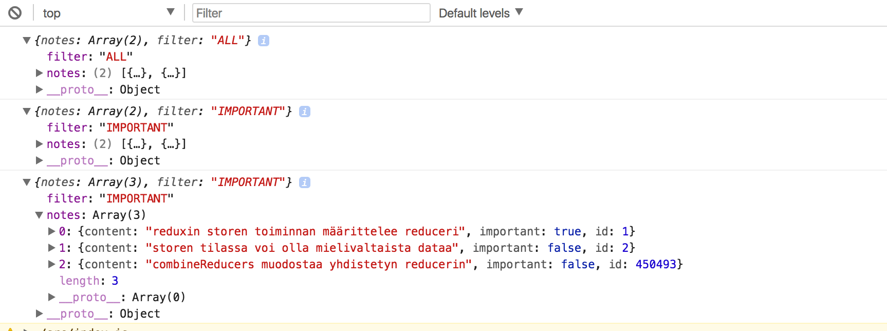

Jo tässä vaiheessa kannattaa laittaa mieleen eräs tärkeä detalji. Jos lisäämme _molempien reducerien alkuun_ konsoliin tulostuksen:

```js
const filterReducer = (state = 'ALL', action) => {
  console.log('ACTION: ', action);
  // ...
};
```

Näyttää konsolin perusteella siltä, että jokainen action kahdentuu:

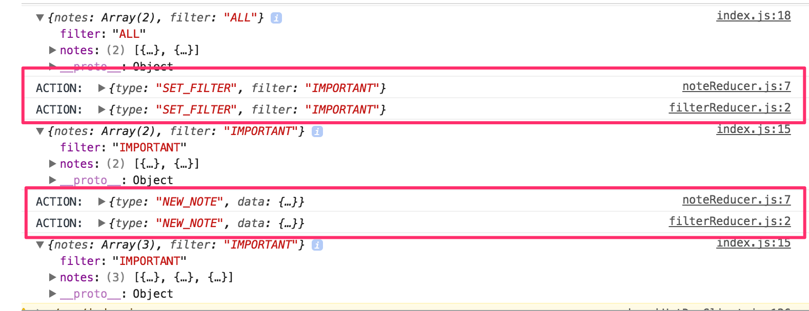

Onko koodissa bugi? Ei. Yhdistetty reducer toimii siten, että jokainen _action_ käsitellään _kaikissa_ yhdistetyn reducerin osissa. Usein tietystä actionista on kiinnostunut vain yksi reduceri, on kuitenkin tilanteita, joissa useampi reduceri muuttaa hallitsemaansa staten tilaa jonkin actionin seurauksena.

### Sovelluksen viimeistely

Viimeistellään nyt sovellus käyttämään yhdistettyä reduceria, eli palautetaan tiedostossa _index.js_ suoritettava renderöinti muotoon

```react
ReactDOM.render(
  <Provider store={store}>
    <App />
  </Provider>,
  document.getElementById('root'))
```

Korjataan sitten bugi, joka johtuu siitä, että koodi olettaa storen tilan olevan mustiinpanot tallettava taulukko:

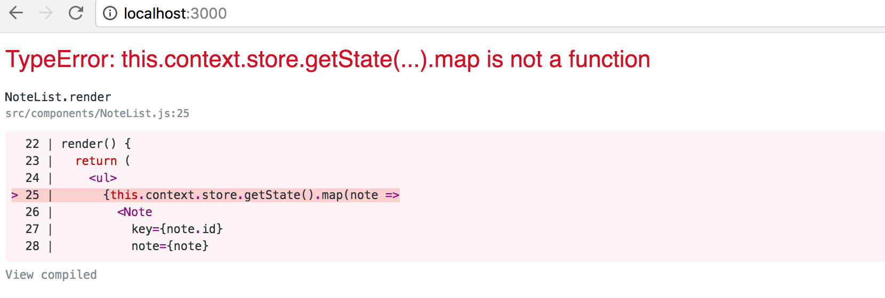

Korjaus on helppo. Viitteen <code>this.context.store.getState()</code> sijaan kaikki muistiinpanot sisältävään taulukkoon viitataan <code>this.context.store.getState().notes</code>.

Ennakoiden tulevaa eriytetään näytettävien muistiinpanojen selvittämisen huolehtiminen funktioon _notesToShow_, joka vielä tässä vaiheessa palauttaa kaikki muistiinpanot:

```react
class NoteList extends React.Component {
  // ...

  render() {
    const notesToShow = () => {
      return this.context.store.getState().notes
    }

    return (
      <ul>
        {notesToShow().map(note =>
          <Note
            key={note.id}
            note={note}
            handleClick={this.toggleImportance(note.id)}
          />
        )}
      </ul>
    )
  }
}
```

Eriytetään näkyvyyden säätelyfiltteri omaksi, tiedostoon sijoitettavaksi _src/components/VisibilityFilter.js_ komponentiksi:

```react
import React from 'react'
import PropTypes from 'prop-types'
import { filterChange } from '../reducers/filterReducer'

class VisibilityFilter extends React.Component {
  componentDidMount() {
    const { store } = this.context
    this.unsubscribe = store.subscribe(() =>
      this.forceUpdate()
    )
  }

  componentWillUnmount() {
    this.unsubscribe()
  }

  filterClicked = (value) => () => {
    this.context.store.dispatch(filterChange(value))
  }

  render() {
    return (
      <div>
        kaikki    <input type="radio" name="filter" onChange={this.filterClicked('ALL')} />
        tärkeät   <input type="radio" name="filter" onChange={this.filterClicked('IMPORTANT')} />
        eitärkeät <input type="radio" name="filter" onChange={this.filterClicked('NONIMPORTANT')} />
      </div>
    )
  }
}

VisibilityFilter.contextTypes = {
  store: PropTypes.object
}

export default VisibilityFilter
```

Toteutus on suoraviivainen, radiobuttonin klikkaaminen muuttaa storen kentän _filter_ tilaa.

Muutetaan vielä komponentin _NoteList_ metodi _notesToShow_ ottamaan huomioon filtteri

```js
const notesToShow = () => {
  const { notes, filter } = this.context.store.getState();
  if (filter === 'ALL') {
    return notes;
  }

  return filter === 'IMPORTANT'
    ? notes.filter(note => note.important)
    : notes.filter(note => !note.important);
};
```

Huomaa miten storen tilan kentät on otettu tuttuun tapaan destrukturoimalla apumuuttujiin

```js
const { notes, filter } = this.context.store.getState();
```

siis on sama kuin kirjoittaisimme

```js
const notes = this.context.store.getState().notes;
const filter = this.context.store.getState().filter;
```

Sovelluksen tämänhetkinen koodi on [githubissa](https://github.com/FullStack-HY/redux-notes/tree/part6-2) tagissä _part6-2_.

Sovelluksessa on vielä pieni kauneusvirhe, vaikka oletusarvosesti filtterin arvo on _ALL_, eli näytetään kaikki muistiinpanot, ei vastaava radiobutton ole valittuna. Ongelma on luonnollisestikin mahdollista korjata, mutta koska kyseessä on ikävä, mutta harmiton feature, jätämme korjauksen myöhemmäksi.

## Tehtäviä

Tee nyt tehtävät [6.1-6.5](/tehtävät/#osa-6)

## Connect

Kaikissa Redux-storea käyttävissä komponenteissa on runsaasti samaa koodia

```js
class ComponentUsingReduxStore extends React.Component {
  componentDidMount() {
    const { store } = this.context;
    this.unsubscribe = store.subscribe(() => this.forceUpdate());
  }

  componentWillUnmount() {
    this.unsubscribe();
  }
}

ComponentUsingReduxStore.contextTypes = {
  store: PropTypes.object,
};
```

Vaikka rivit on helppo copy-pasteta aina uusiin komponentteihin, ei tämä ole tarkoituksenmukaista. Osan 5 luvussa [staten välittäminen propseissa ja contextissa](/osa5#staten-välittäminen-propseissa-ja-contextissa) myös varoiteltiin luottamasta liikaa Reactin Context API:iin, se on kokeellinen ja saattaa poistua tulevissa versioissa. Contextia on siis ainakin tässä vaiheessa käytettävä varovasti.

[React Redux](https://github.com/reactjs/react-redux) -kirjaston määrittelemä funktio [connect](https://github.com/reactjs/react-redux/blob/master/docs/api.md#connectmapstatetoprops-mapdispatchtoprops-mergeprops-options) on paras ratkaisu siihen, miten Redux-store saadaan välitettyä React-componenteille.

Connect voi olla aluksi haastava sisäistää, mutta hieman vaivaa kannattaa ehdottomasti nähdä. Tutustutaan nyt connectin käyttöön. Asensimme jo edellisessä osassa kirjaston, joten voimme aloittaa sen käytön suoraan.

Tutkitaan ensin komponenttia _NoteList_. Funktiota _connect_ käyttämällä "normaaleista" React-komponenteista saadaan muodostettua komponentteja, joiden _propseihin_ on "mäpätty" eli yhdistetty haluttuja osia storen määrittelemästä tilasta.

Muodostetaan ensin komponentista _NoteList_ connectin avulla _yhdistetty komponentti_:

```js
// ...
import { connect } from 'react-redux';

class NoteList extends React.Component {
  // ...
}

const ConnectedNoteList = connect()(NoteList);

export default ConnectedNoteList;
```

Moduuli eksporttaa nyt alkuperäisen komponentin sijaan _yhdistetyn komponentin_, joka toimii toistaiseksi täsmälleen alkuperäisen komponentin kaltaisesti.

Komponentti tarvitsee storesta sekä muistiinpanojen listan, että filtterin arvon. Funktion _connect_ ensimmäisenä parametrina voidaan määritellä funktio [mapStateToProps](https://github.com/reactjs/react-redux/blob/master/docs/api.md#arguments), joka liittää joitakin storen tilan perusteella määriteltyjä asioita connectilla muodostetun _yhdistetyn komponentin_ propseiksi.

Jos määritellään:

```js
const mapStateToProps = state => {
  return {
    notes: state.notes,
    filter: state.filter,
  };
};

const ConnectedNoteList = connect(mapStateToProps)(NoteList);

export default ConnectedNoteList;
```

on komponentin _NoteList_ sisällä mahdollista viitata storen tilaan, esim. muistiinpanoihin suoraan propsin kautta _props.notes_ sen sijaan, että käytettäisiin suoraan contextia muodossa _this.context.store.getState().notes_. Vastaavasti _props.filter_ viittaa storessa olevaan filter-kentän tilaan.

Metodin _render_ sisältö pelkistyy seuraavasti

```js
class NoteList extends React.Component {
  render() {
    const notesToShow = () => {
      const { notes, filter } = this.props;
      if (filter === 'ALL') {
        return notes;
      }

      return filter === 'IMPORTANT'
        ? notes.filter(note => note.important)
        : notes.filter(note => !note.important);
    };

    // ...
  }
}
```

Connect-komennolla, ja _mapStateToProps_-määrittelyllä aikaan saatua tilannetta voidaan visualisoida seuraavasti:

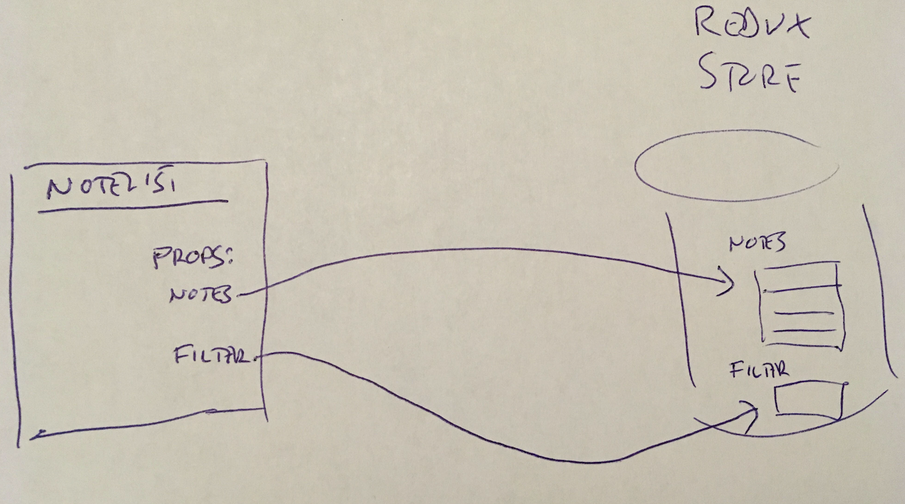

eli komponentin _NoteList_ sisältä on propsien _props.notes_ ja _props.filter_ kautta "suora pääsy" tarkastelemaan Redux storen sisällä olevaa tilaa.

_NoteList_ viittaa edelleen suoraan kontekstin kautta storen metodiin _dispatch_, jota se tarvitsee action creatorin _importanceToggling_ avulla tehdyn actionin dispatchaamiseen:

```js
toggleImportance = (id) => () => {
  this.context.store.dispatch(
    importanceToggling(id)
  )
```

Connect-funktion toisena parametrina voidaan määritellä [mapDispatchToProps](https://github.com/reactjs/react-redux/blob/master/docs/api.md#arguments) eli joukko _action creator_ -funktioita, jotka välitetään yhdistetylle komponentille propseina. Laajennetaan connectausta seuraavasti

```js
const mapStateToProps = state => {
  return {
    notes: state.notes,
    filter: state.filter,
  };
};

const mapDispatchToProps = {
  importanceToggling,
};

const ConnectedNoteList = connect(
  mapStateToProps,
  mapDispatchToProps
)(NoteList);

export default ConnectedNoteList;
```

Nyt komponentti voi dispatchata suoraan action creatorin _importanceToggling_ määrittelemän actionin kutsumalla propsien kautta saamaansa funktiota koodissa:

```js
class NoteList extends React.Component {
  toggleImportance = id => () => {
    this.props.importanceToggling(id);
  };

  // ...
}
```

Storen _dispatch_-funktiota ei enää tarvitse kutsua, sillä _connect_ on muokannut action creatorin _importanceToggling_ sellaiseen muotoon, joka sisältää dispatchauksen.

_mapDispatchToProps_ lienee aluksi hieman haastava ymmärtää, etenkin sen kohta käsiteltävä [vaihtoehtoinen käyttötapa](/osa6/#mapdispatchtopropsin-vaihtoehtoinen-käyttötapa).

Connectin aikaansaamaa tilannetta voidaan havainnollistaa seuraavasti:

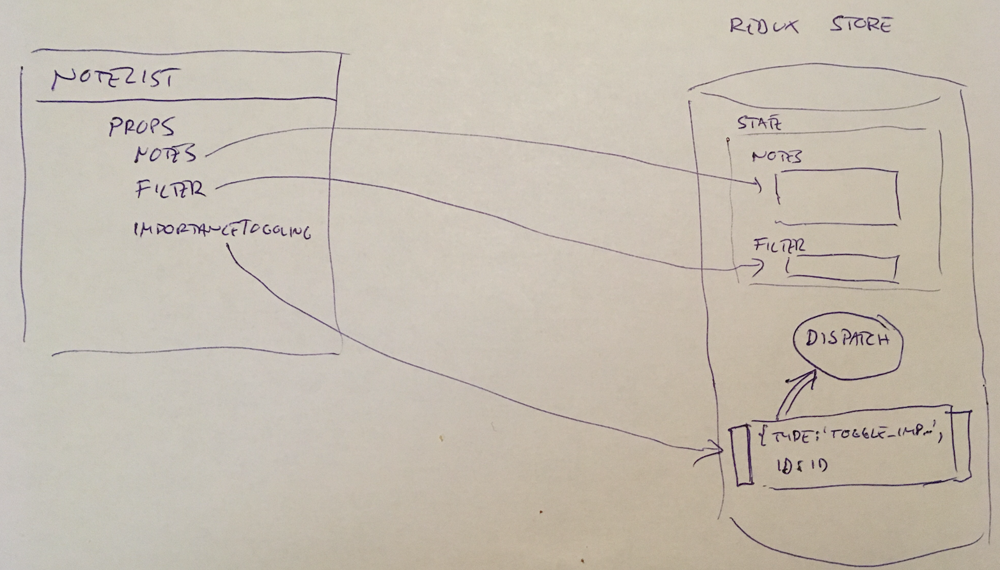

eli sen lisäksi että _NoteList_ pääsee storen tilaan propsien _props.notes_ ja _props.filter_ kautta, se viittaa _props.importanceToggling_:lla funktioon, jonka avulla storeen saadaan dispatchattua _TOGGLE_IMPORTANCE_-tyyppisiä actioneja.

Koska komponentti saa storeen liittyvät asiat propseina, voidaan koodista poistaa metodit _componentDidMount_ ja _componentWillUnMount_ jotka huolehtivat komponentin uudelleenrenderöitymisestä storen tilan muuttuessa. Connect tekee tämän puolestamme.

Komponentti _NoteList_ ei tarvitse storea enää mihinkään, se saa kaiken tarvitsemansa propseina _connect_-funktion ansiosta. Komponentti ei käytä enää suoraan contextia, joten koodi yksinkertaistuu seuraavaan muotoon:

```react
import React from 'react'
import { connect } from 'react-redux'
import { importanceToggling } from './../reducers/noteReducer'
import Note from './Note'

class NoteList extends React.Component {
  render() {
    const notesToShow = () => {
      const { notes, filter } = this.props
      if (filter === 'ALL') {
        return notes
      }

      return filter === 'IMPORTANT'
        ? notes.filter(note => note.important)
        : notes.filter(note => !note.important)
    }

    return (
      <ul>
        {notesToShow().map(note =>
          <Note
            key={note.id}
            note={note}
            handleClick={() => this.props.importanceToggling(note.id)}
          />
        )}
      </ul>
    )
  }
}

const mapStateToProps = (state) => {
  return {
    notes: state.notes,
    filter: state.filter
  }
}

const ConnectedNoteList = connect(
  mapStateToProps,
  { importanceToggling }
)(NoteList)

export default ConnectedNoteList
```

Koodi sisältää pari muutakin oikaisua, mm. apumetodista _toggleImportance_ on hankkiuduttu eroon.
Itseasiassa komponentti on nyt niin yksinkertainen että se voitaisiin määritellä funktionaalisena komponenttina. Emme kuitenkaan tee muutosta nyt.

Otetaan _connect_ käyttöön myös uuden muistiinpanon luomisessa:

```react
import React from 'react'
import { noteCreation } from './../reducers/noteReducer'
import { connect } from 'react-redux'

class NoteForm extends React.Component {

  addNote = (event) => {
    event.preventDefault()
    this.props.noteCreation(event.target.note.value)
    event.target.note.value = ''
  }

  render() {
    return (
      <form onSubmit={this.addNote}>
        <input name="note" />
        <button>lisää</button>
      </form>
    )
  }
}

export default connect(
  null,
  { noteCreation }
)(NoteForm)
```

Koska komponentti ei tarvitse storen tilasta mitään, on funktion _connect_ ensimmäinen parametri _null_.

Sovelluksen tämänhetkinen koodi on [githubissa](https://github.com/FullStack-HY/redux-notes/tree/part6-3) tagissä _part6-3_.

### Provider

Funktion _connect_ käytön edellytyksenä on se, että sovellus on määritelty React redux kirjaston tarjoaman [Provider](https://github.com/reactjs/react-redux/blob/master/docs/api.md#provider-store)-komponentin lapseksi ja että sovelluksen käyttämä store on annettu Provider-komponentin attribuutiksi _store_:

```react
import React from 'react'
import ReactDOM from 'react-dom'
import { createStore, combineReducers } from 'redux'
import { Provider } from 'react-redux'
import App from './App'
import noteReducer from './reducers/noteReducer'
import filterReducer from './reducers/filterReducer'

const reducer = combineReducers({
  notes: noteReducer,
  filter: filterReducer
})

const store = createStore(reducer)

ReactDOM.render(
  <Provider store={store}>
    <App />
  </Provider>,
  document.getElementById('root'))
```

Lisäsimme jo edellisen osan lopussa sovellukseen _Providerin_, joten _connect_ oli tällä kertaa suoraan käytettävissä.

### Huomio propsina välitettyyn action creatoriin viittaamisesta

Tarkastellaan vielä erästä mielenkiintoista seikkaa komponentista _NoteForm_:

```react
import React from 'react'
import { noteCreation } from './../reducers/noteReducer'
import { connect } from 'react-redux'

class NoteForm extends React.Component {

  addNote = (event) => {
    event.preventDefault()
    this.props.noteCreation(event.target.note.value)
    event.target.note.value = ''
  }

  render() {
    // ...
  }
}

export default connect(
  null,
  { noteCreation }
)(NoteForm)
```

Aloittelevalle connectin käyttäjälle aiheuttaa joskus ihmetystä se, että action creatorista _noteCreation_ on komponentin sisällä käytettävissä _kaksi eri versiota_.

Funktioon tulee viitata propsien kautta, eli _this.props.noteCreation_, tällöin kyseessä on _connectin_ muotoilema, _dispatchauksen sisältävä_ versio funktiosta.

Moduulissa olevan import-lauseen

```js
import { noteCreation } from './../reducers/noteReducer';
```

ansiosta komponentin sisältä on mahdollista viitata funktioon myös suoraan, eli _noteCreation_. Näin ei kuitenkaan tule tehdä, sillä silloin on kyseessä alkuperäinen action creator joka _ei sisällä dispatchausta_.

Jos tulostamme funktiot koodin sisällä (emme olekaan vielä käyttäneet kurssilla tätä erittäin hyödyllistä debug-kikkaa)

```react
render() {
  console.log(noteCreation)
  console.log(this.props.noteCreation)
  return (
    <form onSubmit={this.addNote}>
      <input name="note" />
      <button>lisää</button>
    </form>
  )
}
```

näemme eron:

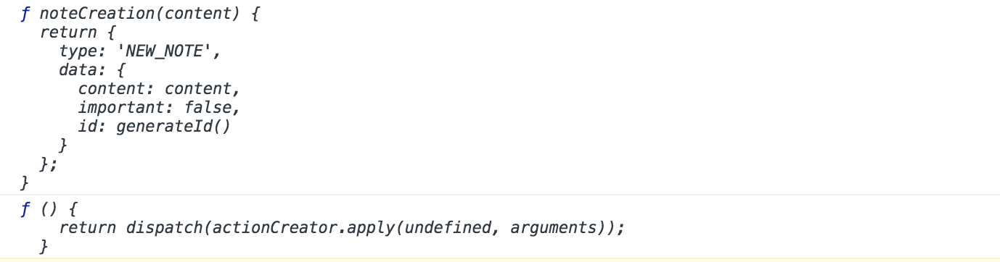

Ensimmäinen funktioista siis on normaali _action creator_, toinen taas connectin muotoilema funktio, joka sisältää storen metodin dispatch-kutsun.

Connect on erittäin kätevä työkalu, mutta abstraktiutensa takia kenties käsitteellisesti haastavin kurssin tähänastisista asioista.

Viimeistään nyt kannattaa katsoa kokonaisuudessaan Egghead.io:ta Reduxin kehittäjän Dan Abramovin loistava tuoriaali [Getting started with Redux](https://egghead.io/courses/getting-started-with-redux). Neljässä viimeisessä videossa käsitellään _connect_-metodia.

Siinä vaiheessa kun videot on tehty, connectin käyttö oli asteen verran nykyistä hankalampaa, sillä esimerkeissä käyttämämme tapa määritellä connectin toinen parametri _mapDispatchToProps_ suoraan _action creator_ -funktioiden avulla ei ollut vielä mahdollinen. Katsotaan seuraavassa luvussa lyhyesti vaihtoehtoista, "hankalampaa" tapaa, sitä näkee usein vanhemmassa React-koodissa, joten sen tunteminen on oleellista.

### mapDispatchToPropsin vaihtoehtoinen käyttötapa

Määrittelimme siis connectin komponentille _NoteForm_ antamat actioneja dispatchaavan funktion seuraavasti:

```js
class NoteForm extends React.Component {
  // ...
}

export default connect(
  null,
  { noteCreation }
)(NoteForm);
```

Eli määrittelyn ansiosta komponentti dispatchaa uuden muistiinpanon lisäyksen suorittavan actionin suoraan komennolla <code>this.props.noteCreation('uusi muistiinpano')</code>.

Parametrin _mapDispatchToProps_ kenttinä ei voi antaa mitä tahansa funktiota, vaan funktion on oltava _action creator_, eli Redux-actionin palauttava funktio.

Kannattaa huomata, että parametri _mapDispatchToProps_ on nyt _olio_, sillä määrittely

```js
{
  noteCreation;
}
```

on lyhempi tapa määritellä olioliteraali

```js
{
  noteCreation: noteCreation;
}
```

eli olio, jonka ainoan kentän _noteCreation_ arvona on funktio _noteCreation_.

Voimme määritellä saman myös "pitemmän kaavan" kautta, antamalla _connectin_ toisena parametrina seuraavanlaisen _funktion_:

```js
class NoteForm extends React.Component {
  // ...
}

const mapDispatchToProps = dispatch => {
  return {
    createTodo: value => {
      dispatch(noteCreation(value));
    },
  };
};

export default connect(
  null,
  mapDispatchToProps
)(NoteForm);
```

Tässä vaihtoehtoisessa tavassa _mapDispatchToProps_ on funktio, jota _connect_ kutsuu antaen sille parametriksi storen _dispatch_-funktion. Funktion paluuarvona on olio, joka määrittelee joukon funktioita, jotka annetaan connectoitavalle komponentille propsiksi. Esimerkkimme määrittelee propsin _createTodo_ olevan funktion

```js
value => {
  dispatch(noteCreation(value));
};
```

eli action creatorilla luodun actionin dispatchaus.

Komponentti siis viittaa funktioon propsin _this.props.createTodo_ kautta:

```react
class NoteForm extends React.Component {

  addNote = (event) => {
    event.preventDefault()
    this.props.createTodo(event.target.note.value)
    event.target.note.value = ''
  }

  render() {
    return (
      <form onSubmit={this.addNote}>
        <input name="note" />
        <button>lisää</button>
      </form>
    )
  }
}
```

Konsepti on hiukan monimutkainen ja sen selittäminen sanallisesti on haastavaa. Kannattaa katsoa huolellisesti Dan Abramovin videot ja koittaa miettiä mistä on kyse.

Useimmissa tapauksissa riittää _mapDispatchToProps_:in yksinkertaisempi muoto. On kuitenkin tilanteita, joissa monimutkaisempi muoto on tarpeen, esim. jos määriteltäessä propseiksi mäpättyjä _dispatchattavia actioneja_ on [viitattava komponentin omiin propseihin](https://github.com/gaearon/redux-devtools/issues/250#issuecomment-186429931).

## Presentational/Container revisited

Komponentti _NoteList_ käyttää apumetodia _notesToShow_, joka päättelee filtterin perusteella näytettävien muistiinpanojen listan:

```js
const notesToShow = () => {
  const { notes, filter } = this.props;
  if (filter === 'ALL') {
    return notes;
  }

  return filter === 'IMPORTANT'
    ? notes.filter(note => note.important)
    : notes.filter(note => !note.important);
};
```

Komponentin on tarpeetonta sisältää kaikkea tätä logiikkaa. Eriytetään se komponentin ulkopuolelle _connect_-metodin parametrin _mapStateToProps_ yhteyteen. Muutetaan komponentti samalla funktionaaliseksi:

```react
import React from 'react'
import { connect } from 'react-redux'
import { importanceToggling } from './../reducers/noteReducer'
import Note from './Note'

const NoteList = (props) => (
  <ul>
    {props.visibleNotes.map(note =>
      <Note
        key={note.id}
        note={note}
        handleClick={() => props.importanceToggling(note.id)}
      />
    )}
  </ul>
)

const notesToShow = (notes, filter) => {
  if (filter === 'ALL') {
    return notes
  }
  return filter === 'IMPORTANT'
    ? notes.filter(note => note.important)
    : notes.filter(note => !note.important)
}

const mapStateToProps = (state) => {
  return {
    visibleNotes: notesToShow(state.notes, state.filter)
  }
}

export default connect(
  mapStateToProps,
  { importanceToggling }
)(NoteList)
```

_mapStateToProps_ ei siis tällä kertaa mäppää propsiksi suoraan storessa olevaa asiaa, vaan storen tilasta funktion _notesToShow_ avulla muodostetun sopivasti filtteröidyn datan.

Uudistettu _NoteList_ keskittyy lähes ainoastaan muistiinpanojen renderöimiseen, se on hyvin lähellä sitä minkä sanotaan olevan [presentational](https://medium.com/@dan_abramov/smart-and-dumb-components-7ca2f9a7c7d0)-komponentti, joita Dan Abramovin [sanoin](https://medium.com/@dan_abramov/smart-and-dumb-components-7ca2f9a7c7d0) kuvailee seuraavasti:

- Are concerned with how things look.
- May contain both presentational and container components inside, and usually have some DOM markup and styles of their own.
- Often allow containment via this.props.children.
- Have no dependencies on the rest of the app, such Redux actions or stores.
- Don’t specify how the data is loaded or mutated.
- Receive data and callbacks exclusively via props.
- Rarely have their own state (when they do, it’s UI state rather than data).
- Are written as functional components unless they need state, lifecycle hooks, or performance optimizations.

Connect-metodin avulla muodostettu _yhdistetty komponentti_

```js
const notesToShow = (notes, filter) => {
  if (filter === 'ALL') {
    return notes;
  }
  return filter === 'IMPORTANT'
    ? notes.filter(note => note.important)
    : notes.filter(note => !note.important);
};

const mapStateToProps = state => {
  return {
    visibleNotes: notesToShow(state.notes, state.filter),
  };
};

connect(
  mapStateToProps,
  { importanceToggling }
)(NoteList);
```

taas on selkeästi _container_-komponentti, joita Dan Abramov [luonnehtii](https://medium.com/@dan_abramov/smart-and-dumb-components-7ca2f9a7c7d0) seuraavasti:

- Are concerned with how things work.
- May contain both presentational and container components inside but usually don’t have any DOM markup of their own except for some wrapping divs, and never have any styles.
- Provide the data and behavior to presentational or other container components.
- Call Redux actions and provide these as callbacks to the presentational components.
- Are often stateful, as they tend to serve as data sources.
- Are usually generated using higher order components such as connect from React Redux, rather than written by hand.

Komponenttien presentational vs. container -jaottelu on eräs hyväksi havaittu tapa strukturoida React-sovelluksia. Jako voi olla toimiva tai sitten ei, kaikki riippuu kontekstista.

Abramov mainitsee jaon [eduiksi](https://medium.com/@dan_abramov/smart-and-dumb-components-7ca2f9a7c7d0) muunmuassa seuraavat

- Better separation of concerns. You understand your app and your UI better by writing components this way.
- Better reusability. You can use the same presentational component with completely different state sources, and turn those into separate container components that can be further reused.
- Presentational components are essentially your app’s “palette”. You can put them on a single page and let the designer tweak all their variations without touching the app’s logic. You can run screenshot regression tests on that page.

Abramov mainitsee termin [high order component](https://reactjs.org/docs/higher-order-components.html). Esim. _NoteList_ on normaali komponentti, React-reduxin _connect_ metodi taas on _high order komponentti_, eli käytännössä funktio, joka haluaa parametrikseen komponentin muuttuakseen "normaaliksi" komponentiksi.

High order componentit eli HOC:t ovatkin yleinen tapa määritellä geneeristä toiminnallisuutta, joka sitten erikoistetaan esim. renderöitymisen määrittelyn suhteen parametrina annettavan komponentin avulla. Kyseessä on funktionaalisen ohjelmoinnin etäisesti olio-ohjelmoinnin perintää muistuttava käsite.

HOC:it ovat oikeastaan käsitteen [High Order Function](https://en.wikipedia.org/wiki/Higher-order_function) (HOF) yleistys. HOF:eja ovat sellaiset funkiot, jotka joko ottavat parametrikseen funktioita tai palauttavat funkioita. Olemme oikeastaan käyttäneet HOF:eja läpi kurssin, esim. lähes kaikki taulukoiden käsittelyyn tarkoitetut metodit, kuten _map, filter ja find_ ovat HOF:eja, samoin jo monta kertaa käyttämämme funktioita palauttavat (eli kahden nuolen) funktiot, esim.

```js
filterClicked = value => () => {
  this.props.filterChange(value);
};
```

Sovelluksen tämänhetkinen koodi on [githubissa](https://github.com/FullStack-HY/redux-notes/tree/part6-4) tagissa _part6-4_.

Mukana on myös edellisestä unohtunut _VisibilityFilter_-komponentin _connect_-funktiota käyttävä versio, jota on myös paranneltu siten, että nappi _kaikki_ on oletusarvoisesti valittuna. Koodissa on pieni ikävä copypaste mutta kelvatkoon.

## Tehtäviä

Tee nyt tehtävät [6.6-6.9](/tehtävät#connect)

## Redux-sovelluksen kommunikointi palvelimen kanssa

Laajennetaan sovellusta siten, että muistiinpanot talletetaan backendiin. Käytetään osasta 2 tuttua [json-serveriä](/osa2#datan-haku-palvelimelta).

Tallennetaan projektin juuren tiedostoon _db.json_ tietokannan alkutila:

```json
{
  "notes": [
    {
      "content": "reduxin storen toiminnan määrittelee reduceri",
      "important": true,
      "id": 1
    },
    {
      "content": "storen tilassa voi olla mielivaltaista dataa",
      "important": false,
      "id": 2
    }
  ]
}
```

Asennetaan projektiin json-server

```bash
npm install json-server --save
```

ja lisätään tiedoston _package.json_ osaan _scripts_ rivi

```bash
"scripts": {
  "server": "json-server -p3001 db.json",
  // ...
}
```

Käynnistetään json-server komennolla _npm run server_.

Tehdään sitten tuttuun tapaan _axiosia_ hyödyntävä backendistä dataa hakeva metodi tiedostoon _services/notes.js_

```js
import axios from 'axios';

const getAll = async () => {
  const response = await axios.get('http://localhost:3001/notes');
  return response.data;
};

export default { getAll };
```

Asennetaan myös axios projektiin

```bash
npm install axios --save
```

Muutetaan _nodeReducer_:issa tapahtuva muistiinpanojen tilan alustusta, siten että oletusarvoisesti mustiinpanoja ei ole:

```js
const noteReducer = (state = [], action) => {
  // ...
};
```

Nopea tapa saada storen tila alustettua palvelimella olevan datan perusteella on hakea muistiinpanot tiedostossa _index.js_ ja dispatchata niille yksitellen action _NEW_NOTE_:

```js
// ...
import noteService from './services/notes';

const reducer = combineReducers({
  notes: noteReducer,
  filter: filterReducer,
});

const store = createStore(reducer);

noteService.getAll().then(notes =>
  notes.forEach(note => {
    store.dispatch({ type: 'NEW_NOTE', data: note });
  })
);

// ...
```

Lisätään reduceriin tuki actionille _INIT_NOTES_, jonka avulla alustus voidaan tehdä dispatchaamalla yksittäinen action. Luodaan myös sitä varten oma action creator -funktio _noteInitialization_:

```js
// ...
const noteReducer = (state = [], action) => {
  console.log('ACTION:', action);
  switch (action.type) {
    case 'NEW_NOTE':
      return [...state, action.data];
    case 'INIT_NOTES':
      return action.data;
    // ...
  }
};

export const noteInitialization = data => {
  return {
    type: 'INIT_NOTES',
    data,
  };
};

// ...
```

_index.js_ yksinkertaistuu:

```js
import noteReducer, { noteInitialization } from './reducers/noteReducer';
// ...

noteService.getAll().then(notes => store.dispatch(noteInitialization(notes)));
```

> **HUOM:** miksi emme käyttäneet koodissa promisejen ja _then_-metodilla rekisteröidyn tapahtumankäsittelijän sijaan awaitia?
>
> await toimii ainoastaan _async_-funktioiden sisällä, ja _index.js_:ssä oleva koodi ei ole funktiossa, joten päädyimme tilanteen yksinkertaisuuden takia tällä kertaa jättämään _async_:in käyttämättä.

Päätetään kuitenkin siirtää muistiinpanojen alustus _App_-komponentin metodiin _[componentDidMount](https://reactjs.org/docs/react-component.html#componentdidmount)_, se on luonteva paikka alustuksille, sillä metodi suoritetaan heti sovelluksemme ensimmäisen renderöinnin jälkeen.

Jotta saamme action creatorin _noteInitialization_ käyttöön komponentissa _App_ tarvitsemme jälleen _connect_-metodin apua:

```react
import React from 'react'
import NoteForm from './components/NoteForm.js'
import NoteList from './components/NoteList.js'
import VisibilityFilter from './components/VisibilityFilter'
import { connect } from 'react-redux'
import { noteInitialization } from './reducers/noteReducer'
import noteService from './services/notes'

class App extends React.Component {
  componentDidMount = async () => {
    const notes = await noteService.getAll()
    this.props.noteInitialization(notes)
  }

  render() {
    return (
      <div>
        <NoteForm />
        <VisibilityFilter />
        <NoteList />
      </div>
    )
  }
}

export default connect(
  null,
  { noteInitialization }
)(App)
```

Näin funktio _noteInitialization_ tulee komponentin _App_ propsiksi _this.props.noteInitialization_ ja sen kutsumiseen ei tarvita _dispatch_-metodia koska _connect_ hoitaa asian puolestamme.

Pääsimme nyt myös käyttämään aina mukavaa async/awaitia. Palvelimen kanssa kommunikointi tapahtuu joka tapauksessa funktiossa, joten sen määrittely asyncina on vaivatonta:

```js
componentDidMount = async () => {
  const notes = await noteService.getAll();
  this.props.noteInitialization(notes);
};
```

Voimme toimia samoin myös uuden muistiinpanon luomisen suhteen. Laajennetaan palvelimen kanssa kommunikoivaa koodia:

```js
const url = 'http://localhost:3001/notes';

const getAll = async () => {
  const response = await axios.get(url);
  return response.data;
};

const createNew = async content => {
  const response = await axios.post(url, { content, important: false });
  return response.data;
};

export default {
  getAll,
  createNew,
};
```

Komponentin _NoteForm_ metodi _addNote_ muuttuu hiukan:

```react
import React from 'react'
import { noteCreation } from './../reducers/noteReducer'
import { connect } from 'react-redux'
import noteService from '../services/notes'

class NoteForm extends React.Component {

  addNote = async (event) => {
    event.preventDefault()
    const content = event.target.note.value
    event.target.note.value = ''
    const newNote = await noteService.createNew(content)
    this.props.noteCreation(newNote)
  }

  render() {
    //...
  }
}

export default connect(
  null,
  {noteCreation}
)(NoteForm)
```

Koska backend generoi muistiinpanoille id:t, muutetaan action creator _noteCreation_ muotoon

```js
export const noteCreation = data => {
  return {
    type: 'NEW_NOTE',
    data,
  };
};
```

Muistiinpanojen tärkeyden muuttaminen olisi mahdollista toteuttaa samalla periaatteella, eli tehdä palvelimelle ensin asynkroninen metodikutsu ja sen jälkeen dispatchata sopiva action.

Sovelluksen tämänhetkinen koodi on [githubissa](https://github.com/FullStack-HY/redux-notes/tree/part6-5) tagissä _part6-5_.

## Tehtäviä

Tee nyt tehtävät [6.10-6.12](/tehtävät#redux-ja-backend)

### Asynkroniset actionit ja redux thunk

Lähestymistapamme on ok, mutta siinä mielessä ikävä, että palvelimen kanssa kommunikointi tapahtuu komponenttien metodeissa. Olisi parempi, jos kommunikointi voitaisiin abstrahoida komponenteilta siten, että niiden ei tarvitsisi kuin kutsua sopivaa _action creatoria_, esim. _App_ alustaisi sovelluksen tilan seuraavasti:

```js
class App extends React.Component {
  componentDidMount() {
    this.props.initializeNotes();
  }
  // ...
}
```

ja _NoteForm_ loisi uuden muistiinpanon seuraavasti:

```js
class NoteForm extends React.Component {
  addNote = async event => {
    event.preventDefault();
    const content = event.target.note.value;
    event.target.note.value = '';
    this.props.createNote(content);
  };
}
```

Molemmat komponentit käyttäisivät ainoastaan propsina saamaansa funktiota, välittämättä siitä että taustalla tapahtuu todellisuudessa palvelimen kanssa tapahtuvaa kommunikointia.

Asennetaan nyt [redux-thunk](https://github.com/gaearon/redux-thunk)-kirjasto, joka mahdollistaa _asynkronisten actionien_ luomisen. Asennus tapahtuu komennolla:

```bash
npm install --save redux-thunk
```

redux-thunk-kirjasto on ns. _redux-middleware_ joka täytyy ottaa käyttöön storen alustuksen yhteydessä. Eriytetään samalla storen määrittely omaan tiedostoon _store.js_:

```js
import { createStore, combineReducers, applyMiddleware } from 'redux';
import thunk from 'redux-thunk';

import noteReducer from './reducers/noteReducer';
import filterReducer from './reducers/filterReducer';

const reducer = combineReducers({
  notes: noteReducer,
  filter: filterReducer,
});

const store = createStore(reducer, applyMiddleware(thunk));

export default store;
```

Tiedosto _src/index.js_ on muutoksen jälkeen seuraava

```react
import React from 'react'
import ReactDOM from 'react-dom'
import { Provider } from 'react-redux'
import App from './App'
import store from './store'

ReactDOM.render(
  <Provider store={store}>
    <App />
  </Provider>,
  document.getElementById('root')
)
```

redux-thunkin ansiosta on mahdollista määritellä _action creatoreja_ siten, että ne palauttavat funktion, jonka parametrina on redux-storen _dispatch_-metodi. Tämän ansiosta on mahdollista tehdä asynkronisia action creatoreja, jotka ensin odottavat jonkin toimenpiteen valmistumista ja vasta sen jälkeen dispatchaavat varsinaisen actionin.

Voimme nyt määritellä muistiinpanojen alkutilan palvelimelta hakevan action creatorin _initializeNotes_ seuraavasti:

```js
export const initializeNotes = () => {
  return async dispatch => {
    const notes = await noteService.getAll();
    dispatch({
      type: 'INIT_NOTES',
      data: notes,
    });
  };
};
```

Sisemmässä funktiossaan, eli _asynkronisessa actionissa_ operaatio hakee ensin palvelimelta kaikki muistiinpanot ja sen jälkeen _dispatchaa_ muistiinpanot storeen lisäävän actionin.

Komponentti _App_ voidaan nyt määritellä seuraavasti:

```react
class App extends React.Component {
  componentDidMount () {
    this.props.initializeNotes()
  }

  render() {
    return (
      <div>
        <NoteForm />
        <NoteList />
        <VisibilityFilter />
      </div>
    )
  }
}

export default connect(
  null, { initializeNotes }
)(App)
```

Ratkaisu on elegantti, muistiinpanojen alustuslogiikka on eriytetty kokonaan React-komponenttien ulkopuolelle.

Uuden muistiinpanon lisäävä action creator _createNew_ on seuraavassa

```js
export const createNew = content => {
  return async dispatch => {
    const newNote = await noteService.createNew(content);
    dispatch({
      type: 'NEW_NOTE',
      data: newNote,
    });
  };
};
```

Periaate on jälleen sama, ensin suoritetaan asynkroninen operaatio, ja sen valmistuttua _dispatchataan_ storen tilaa muuttava action.

Lomake muuttuu seuraavasti:

```react
class NoteForm extends React.Component {

  addNote = async (event) => {
    event.preventDefault()
    const content = event.target.note.value
    event.target.note.value = ''
    this.props.createNew(content)
  }

  render() {
    return (
      <form onSubmit={this.addNote}>
        <input name='note' />
        <button>lisää</button>
      </form>
    )
  }
}

export default connect(
  null, { createNew }
)(NoteForm)
```

Sovelluksen tämänhetkinen koodi on [githubissa](https://github.com/FullStack-HY/redux-notes/tree/part6-6) tagissä _part6-6_.

### Redux DevTools

Chromeen on asennettavissa [Redux DevTools](https://chrome.google.com/webstore/detail/redux-devtools/lmhkpmbekcpmknklioeibfkpmmfibljd), jonka avulla Redux-storen tilaa ja sitä muuttavia actioneja on mahdollisuus seurata selaimen konsolista.

Selaimen lisäosan lisäksi debugatessa tarvitaan kirjastoa [redux-devtools-extension](https://www.npmjs.com/package/redux-devtools-extension). Asennetaan se komennolla

```js
npm install --save redux-devtools-extension
```

Storen luomistapaa täytyy hieman muuttaa, että kirjasto saadaan käyttöön:

```react
// ...
import { createStore, combineReducers, applyMiddleware } from 'redux'
import thunk from 'redux-thunk'
import { composeWithDevTools } from 'redux-devtools-extension'

import noteReducer from './reducers/noteReducer'
import filterReducer from './reducers/filterReducer'

const reducer = combineReducers({
  notes: noteReducer,
  filter: filterReducer
})

const store = createStore(
  reducer,
  composeWithDevTools(
    applyMiddleware(thunk)
  )
)

export default store
```

Kun nyt avaat konsolin, välilehti _redux_ näyttää seuraavalta:

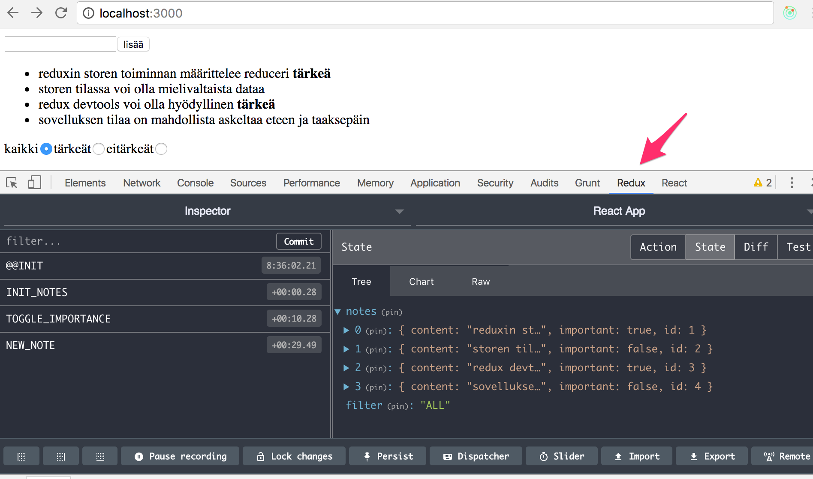

Konsolin avulla on myös mahdollista dispatchata actioneja storeen

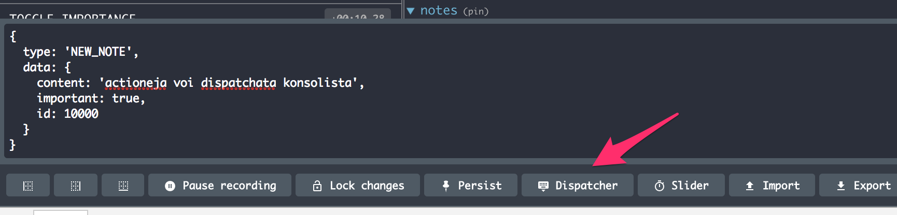

Storen tietyn hetkisen tilan lisäksi on myös mahdollista tarkastella, mikä on kunkin actionin tilalle aiheuttama muutos:

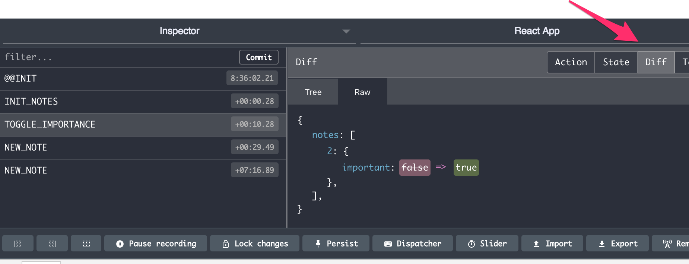

## tehtäviä

Tee nyt tehtävät [6.13-6.15](/tehtävät#thunk)

## React router

Palataan jälleen Reduxittoman Reactin pariin.

On erittäin tyypillistä, että web-sovelluksissa on navigaatiopalkki, jonka avulla on mahdollista vaihtaa sovelluksen näkymää. Muistiinpanosovelluksemme voisi sisältää pääsivun:

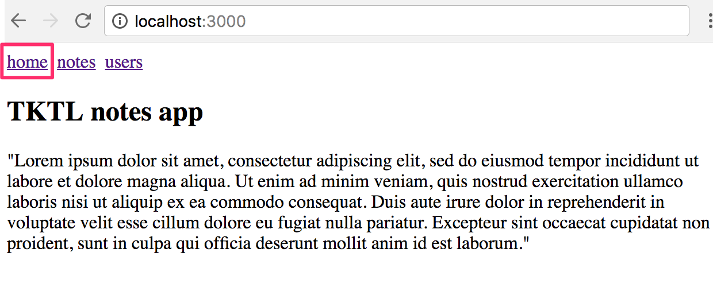

ja omat sivunsa muistiinpanojen ja käyttäjien tietojen näyttämiseen:


[Vanhan koulukunnan websovelluksessa](/osa0#perinteinen-web-sovellus) sovelluksen näyttämän sivun vaihto tapahtui siten että selain teki palvelimelle uuden HTTP GET -pyynnön ja renderöi sitten palvelimen palauttaman näkymää vastaavan HTML-koodin.

Single page appeissa taas ollaan todellisuudessa koko ajan samalla sivulla, ja selaimessa suoritettava Javascript-koodi luo illuusion eri "sivuista". Jos näkymää vaihdettaessa tehdään HTTP-kutsuja, niiden avulla haetaan ainoastaan JSON-muotoista dataa jota uuden näkymän näyttäminen ehkä edellyttää.

Navigaatiopalkki ja useita näkymiä sisältävä sovellus on erittäin helppo toteuttaa Reactilla.

Seuraavassa on eräs tapa:

```react
const Home = () => (
  <div> <h2>TKTL notes app</h2> </div>
)

const Notes = () => (
  <div> <h2>Notes</h2> </div>
)

const Users = () => (
  <div> <h2>Users</h2> </div>
)

class App extends React.Component {
  constructor() {
    super()
    this.state = {
      page: 'home'
    }
  }

  toPage = (page) => (event) => {
    event.preventDefault()
    this.setState({ page })
  }

  render() {
    const content = () => {
      if (this.state.page === 'home') {
        return <Home />
      } else if (this.state.page === 'notes') {
        return <Notes />
      } else if (this.state.page === 'users') {
        return <Users />
      }
    }

    return (
      <div>
        <div>
          <a href="" onClick={ this.toPage('home') }>home</a> &nbsp;
          <a href="" onClick={ this.toPage('notes') }>notes</a> &nbsp;
          <a href="" onClick={ this.toPage('users') }>users</a>
        </div>

        {content()}
      </div>
    )
  }
}
```

Eli jokainen näkymä on toteutettu omana komponenttinaan ja sovelluksen tilassa pidetään tieto siitä, minkä näkymää vastaava komponentti menupalkin alla näytetään.

**Huom:** navigointivalikossa oleva _&amp;nbsp;_ tarkoittaa _a_-tagien väliin sjijoitettavaa välilyöntiä. CSS:n käyttö olisi luonnollisesti parempi tapa sivun ulkoasun muotoilulle mutta nyt tyydymme quick'n'dirty-ratkaisuun.

Menetelmä ei kuitenkaan ole optimaalinen. Kuten kuvista näkyy, sivuston osoite pysyy samana vaikka välillä ollaankin eri näkymässä. Jokaisella näkymällä tulisi kuitenkin olla oma osoitteensa, jotta esim. bookmarkien tekeminen olisi mahdollista. Sovelluksessamme ei myöskään selaimen _back_-painike toimi loogisesti, eli _back_ ei vie edelliseksi katsottuun sovelluksen näkymään vaan jonnekin ihan muualle. Jos sovellus kasvaisi suuremmaksi ja sinne haluttaisiin esim. jokaiselle käyttäjälle sekä muistiinpanolle oma yksittäinen näkymänsä, itse koodattu _reititys_ eli sivuston navigaationhallinta menisi turhan monimutkaiseksi.

Reactissa on onneksi valmis komponentti [React router](https://github.com/ReactTraining/react-router) joka tarjoaa erinomaisen ratkaisun React-sovelluksen navigaation hallintaan.

Muutetaan ylläoleva sovellus käyttämään React routeria. Asennetaan React router komennolla

```bash
npm install --save react-router-dom
```

React routerin tarjoama reititys saadaan käyttöön muuttamalla sovellusta seuraavasti:

```react
import { BrowserRouter as Router, Route, Link } from 'react-router-dom'

class App extends React.Component {

  render() {
    return (
      <div>
        <Router>
          <div>
            <div>
              <Link to="/">home</Link> &nbsp;
              <Link to="/notes">notes</Link> &nbsp;
              <Link to="/users">users</Link>
            </div>
            <Route exact path="/" render={() => <Home />} />
            <Route path="/notes" render={() => <Notes />} />
            <Route path="/users" render={() => <Users />} />
          </div>
        </Router>
      </div>
    )
  }
}
```

Reititys, eli komponenttien ehdollinen, selaimen _urliin perustuva_ renderöinti otetaan käyttöön sijoittamalla komponentteja _Router_-komponentin lapsiksi, eli _Router_-tagien sisälle.

Huomaa, että vaikka komponenttiin viitataan nimellä _Router_ kyseessä on [BrowserRouter](https://reacttraining.com/react-router/web/api/BrowserRouter), sillä
importtaus tapahtuu siten, että importattava olio uudelleennimetään:

```js
import { BrowserRouter as Router ... } from 'react-router-dom'
```

Manuaalin mukaan

> _BrowserRouter_ is a _Router_ that uses the HTML5 history API (pushState, replaceState and the popstate event) to keep your UI in sync with the URL.

Normaalisti selain lataa uuden sivun osoiterivillä olevan urlin muuttuessa. [HTML5 history API](https://css-tricks.com/using-the-html5-history-api/):n avulla _BrowserRouter_ kuitenkin mahdollistaa sen, että selaimen osoiterivillä olevaa urlia voidaan käyttää React-sovelluksen sisäiseen "reitittämiseen", eli vaikka osoiterivillä oleva url muuttuu, sivun sisältöä manipuloidaan ainoastaan Javascriptillä ja selain ei lataa uutta sisältöä palvelimelta. Selaimen toiminta back- ja forward-toimintojen ja bookmarkien tekemisen suhteen on kuitenkin loogista, eli toimii kuten perinteisillä web-sivuilla.

Routerin sisälle määritellään selaimen osoiteriviä muokkaavia _linkkejä_ komponentin [Link](https://reacttraining.com/react-router/web/api/Link) avulla. Esim.

```bash
<Link to="/notes">notes</Link>
```

luo sovellukseen linkin, jonka teksti on _notes_ ja jonka klikkaaminen vaihtaa selaimen osoiteriville urliksi _/notes_.

Selaimen urliin perustuen renderöitävät komponentit määritellään komponentin [Route](https://reacttraining.com/react-router/web/api/Route) avulla. Esim.

```bash
<Route path="/notes" render={() => <Notes />} />
```

määrittelee, että jos selaimen osoiteena on _/notes_, renderöidään komponentti _Notes_.

Sovelluksen juuren, eli osoitteen _/_ määritellään renderöivän komponentti _Home_:

```bash
<Route exact path="/" render={() => <Home />} />
```

joudumme käyttämään routen _path_ attribuutin edessä määrettä _exact_, muuten _Home_ renderöityy kaikilla muillakin poluilla, sillä juuri _/_ on kaikkien muiden polkujen _alkuosa_.

### parametroitu route

Tarkastellaan sitten hieman modifioitua versiota edellisestä esimerkistä. Esimerkin koodi kokonaisuudessaan on [täällä](https://github.com/FullStack-HY/FullStack-Hy.github.io/wiki/router-esimerkki).

Sovellus sisältää nyt viisi eri näkymää, joiden näkyvyyttä kontrolloidaan routerin avulla. Edellisestä esimerkistä tuttujen komponenttien _Home_, _Notes_ ja _Users_ lisäksi mukana on kirjautumisnäkymää vastaava _Login_ ja yksittäisen muistiinpanon näkymää vastaava _Note_.

_Home_ ja _Users_ ovat kuten aiemmassa esimerkissä. _Notes_ on hieman monimutkaisempi, se renderöi propseina saamansa muistiinpanojen listan siten, että jokaisen muistiinpanon nimi on klikattavissa

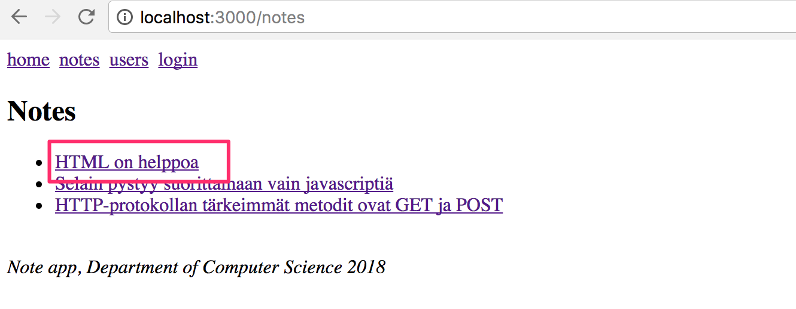

Nimen klikattavuus on toteutettu komponentilla _Link_ ja esim. muistiinpanon, jonka id on 3 nimen klikkaaminen aiheuttaa selaimen osoitteen arvon päivittymisen muotoon _notes/3_:

```react
const Notes = ({notes}) => (
  <div>
    <h2>Notes</h2>
    <ul>
      {notes.map(note=>
        <li key={note.id}>
          <Link to={`/notes/${note.id}`}>{note.content}</Link>
        </li>
      )}
    </ul>
  </div>
)
```

Kun selain siirtyy muistiinpanon yksilöivään osoitteeseen, esim. _notes/3_, renderöidään komponentti _Note_:

```react
const Note = ({note}) => {
  return(
  <div>
    <h2>{note.content}</h2>
    <div>{note.user}</div>
    <div><strong>{note.important ? 'tärkeä' : ''}</strong></div>
  </div>
)}
```

Tämä tapahtuu laajentamalla komponentissa _App_ olevaa reititystä seuraavasti:

```bash
<div>
  <Router>
    <div>
      <div>
        <Link to="/">home</Link> &nbsp;
        <Link to="/notes">notes</Link> &nbsp;
        <Link to="/users">users</Link> &nbsp;
      </div>

      <Route exact path="/" render={() => <Home />} />
      <Route exact path="/notes" render={() =>
        <Notes notes={this.state.notes} />}
      />
      <Route exact path="/notes/:id" render={({match}) =>
        <Note note={noteById(match.params.id)} />}
      />
    </div>
  </Router>
</div>
```

Kaikki muistiinpanon renderöivään routeen on lisätty määre _exact path="/notes"_ sillä muuten se renderöityisi myös _/notes/3_-muotoisten polkujen yhteydessä.

Yksittäisen muistiinpanon näkymän renderöivä route määritellään "expressin tyyliin" merkkaamalla reitin parametrina oleva osa merkinnällä _:id_

```react
<Route exact path="/notes/:id" />
```

Renderöityvän komponentin määrittävä _render_-attribuutti pääsee käsiksi id:hen parametrinsa [match](https://reacttraining.com/react-router/web/api/match) avulla seuraavasti:

```react
render={({match}) => <Note note={noteById(match.params.id)} />}
```

Muuttujassa _match.params.id_ olevaa id:tä vastaava muistiinpano selvitetään apufunktion _noteById_ avulla

```react
const noteById = (id) =>
  this.state.notes.find(note => note.id === Number(id))
```

renderöityvä _Note_-komponentti saa siis propsina urlin yksilöivää osaa vastaavan muistiinpanon.

### history

Sovellukseen on myös toteutettu erittäin yksinkertainen kirjautumistoiminto. Jos sovellukseen ollaan kirjautuneena, talletetaan tieto kirjautuneesta käyttäjästä komponentin _App_ tilaan _this.state.user_.

Mahdollisuus _Login_-näkymään navigointiin renderöidään menuun ehdollisesti

```bash
<Router>
  <div>
    <div>
      <Link to="/">home</Link> &nbsp;
      <Link to="/notes">notes</Link> &nbsp;
      <Link to="/users">users</Link> &nbsp;
      {this.state.user
        ? <em>{this.state.user} logged in</em>
        : <Link to="/login">login</Link>
      }
    </div>
  ...
  </div>
</Router>
```

eli jos käyttäjä on kirjaantunut, renderöidäänkin linkin _Login_ sijaan kirjautuneen käyttäjän käyttäjätunnus:

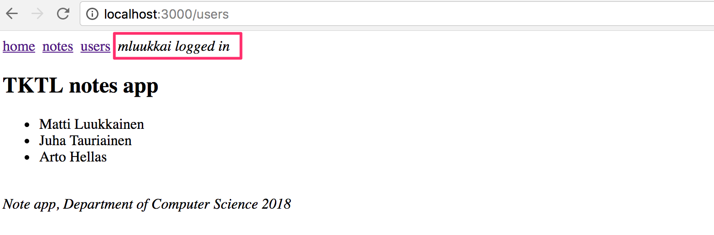

Kirjautumisen toteuttamiseen liittyy eräs mielenkiintoinen seikka. Kirjaantumislomakkeelle mennään selaimen osoitteen ollessa _/login_. Toiminnallisuuden määrittelevä Route on seuraavassa

```bash
<Route path="/login" render={({history}) =>
  <Login history={history} onLogin={this.login} />}
/>
```

Routen render-attribuutissa määritelty metodi ottaa nyt vastaan olion [history](https://reacttraining.com/react-router/web/api/history), joka tarjoaa mm. mahdollisuuden manipuloida selaimen osoiterivin arvoa ohjelmallisesti.

Renderöitävälle _Login_-näkymälle annetaan parametriksi _history_-olio ja kirjautumisen komponentin _App_ tilaan synkronoiva funktio _this.login_:

```bash
<Login history={history} onLogin={this.login}/>}
```

Komponentin koodi seuraavassa

```react
const Login = ({onLogin, history}) => {
  const onSubmit = (event) => {
    event.preventDefault()
    onLogin(event.target.username.value)
    history.push('/')
  }
  return (
    <div>
      <h2>login</h2>
      <form onSubmit={onSubmit}>
        <div>
          username: <input />
        </div>
        <div>
          password: <input type="password" />
        </div>
        <button type="submit">login</button>
      </form>
    </div>
  )
}
```

Kirjautumisen yhteydessä funktiossa _onSubmit_ kutsutaan [history](https://reacttraining.com/react-router/web/api/history)-olion metodia _push_. Käytetty komento <code>history.push('/')</code> saa aikaan sen, että selaimen osoiteriville tulee osoitteeksi _/_ ja sovellus renderöi osoitetta vastaavan komponentin _Home_.

### redirect

Näkymän _Users_ routeen liittyy vielä eräs mielenkiintoinen detalji:

```bash
<Route path="/users" render={() =>
  this.state.user
    ? <Users />
    : <Redirect to="/login" />
  }/>
```

Jos käyttäjä ei ole kirjautuneena, ei renderöidäkään näkymää _Users_ vaan sen sijaan _uudelleenohjataan_ käyttäjä _Redirect_-komponentin avulla kirjautumisnäkymään

```react
<Redirect to="/login" />
```

Todellisessa sovelluksessa olisi kenties parempi olla kokonaan näyttämättä navigaatiovalikossa kirjautumista edellyttäviä näkymiä jos käyttäjä ei ole kirjautunut sovellukseen.

Seuraavassa vielä komponentin _App_ koodi kokonaisuudessaan:

```react
class App extends React.Component {
  constructor() {
    super()
    this.state = {
      notes: [
        {
          id: 1,
          content: 'HTML on helppoa',
          important: true,
          user: 'Matti Luukkainen'
        },
        // ...
      ],
      user: null
    }
  }

  login = (user) => {
    this.setState({user})
  }

  render() {
    const noteById = (id) =>
      this.state.notes.find(note => note.id === Number(id))

    return (
      <div>
        <Router>
          <div>
            <div>
              <Link to="/">home</Link> &nbsp;
              <Link to="/notes">notes</Link> &nbsp;
              <Link to="/users">users</Link> &nbsp;
              {this.state.user
                ? <em>{this.state.user} logged in</em>
                : <Link to="/login">login</Link>
              }
            </div>

            <Route exact path="/" render={() => <Home />} />
            <Route exact path="/notes" render={() => <Notes notes={this.state.notes}/>} />
            <Route exact path="/notes/:id" render={({match}) =>
              <Note note={noteById(match.params.id)} />}
            />
            <Route path="/users" render={() =>
              this.state.user
                ? <Users />
                : <Redirect to="/login" />
              }/>
            <Route path="/login" render={({history}) =>
              <Login history={history} onLogin={this.login} />}
            />
          </div>
        </Router>
        <div>
          <em>Note app, Department of Computer Science 2018</em>
        </div>
      </div>
    )
  }
}
```

Render-metodissa määritellään myös kokonaan _Router_:in ulkopuolella oleva nykyisille web-sovelluksille tyypillinen _footer_-elementti, eli sivuston pohjalla oleva osa, joka on näkyvillä riippumatta siitä mikä komponentti sovelluksen reititetyssä osassa näytetään.

**Huom:** edellä olevassa esimerkissä käytetään React Routerin versiota 4.2.6. Jos ja kun etsit esimerkkejä internetistä, kannattaa varmistaa, että niissä käytetään Routerista vähintään versiota 4.0. Nelosversio ei ole ollenkaan alaspäinyhteensopiva kolmosen kanssa, eli vanhaa React Routeria käyttävä koodi on täysin käyttökelvotonta Routerin versiota 4 käytettäessä.

## tehtäviä

Tee nyt tehtävät [6.16-6.18](/tehtävät#router)

## Inline-tyylit

Osan 2 [lopussa](/osa2#tyylien-lisääminen) lisäsimme React-sovellukseen tyylejä vanhan koulukunnan tapaan yhden koko sovelluksen tyylit määrittelevän CSS-tiedoston avulla.

Olemme jo muutamaan kertaan määritelleet komponenteille [inline](https://react-cn.github.io/react/tips/inline-styles.html)-tyylejä, eli määritelleet CSS:ää suoraan komponentin muun koodin seassa.

Edellisessä osassa piilotimme inline-tyylin avulla napin ruudusta tietyissä tapauksissa:

```react
const hideWhenVisible = { display: this.state.visible ? 'none' : '' }

<div style={hideWhenVisible}>
  <button onClick={this.toggleVisibility}>{this.props.buttonLabel}</button>
</div>
```

eli jos _this.state.visible_ oli arvoltaan tosi, liitetään _div_-komponenttiin sen näkymättömäksi asettava tyyli

```CSS
{ display: 'none' }
```

Periaate inline-tyylien määrittelyssä on siis erittäin yksinkertainen. Mihin tahansa React-komponenttiin tai elementtiin voi liittää attribuutin _style_, jolle annetaan arvoksi Javascript-oliona määritelty joukko _CSS_-sääntöjä.

CSS-säännöt määritellään hieman eri tavalla kuin normaaleissa CSS-tiedostoissa. Jos haluamme asettaa jollekin elementille vihreän, kursivoidun ja 16 pikselin korkuisen fontin, eli CSS-syntaksilla ilmaistuna

```CSS
{
  color: green;
  font-style: italic;
  font-size: 16px;
}
```

tulee tämä muotilla Reactin inline-tyylin määrittelevänä oliona seuraavasti

```js
const footerStyle = {
  color: 'green',
  fontStyle: 'italic',
  fontSize: 16,
};
```

Jokainen CSS-sääntö on olion kenttä, joten ne erotetaan Javascript-syntaksin mukaan pilkuilla. Pikseleinä ilmaistut numeroarvot voidaan määritellä kokonaislukuina. Merkittävin ero normaaliin CSS:ään on väliviivan sisältämien CSS-ominaisuuksien kirjoittaminen _camelCase_-muodossa.

Voimme muotoilla edellisen luvun footer-elementin olion _footerStyle_ avulla seuraavasti:

```bash
<div style={footerStyle}>
  <br />
  <em>Note app, Department of Computer Science 2018</em>
</div>
```

Inline-tyyleillä on tiettyjä rajoituksia, esim. ns. [pseudo-selektoreja](https://developer.mozilla.org/en-US/docs/Web/CSS/Pseudo-classes) ei ole mahdollisuutta käyttää (ainakaan helposti).

Inline-tyylit ja muutamat seuraavassa osassa katsomamme tavat lisätä tyylejä Reactiin ovat periaatteessa täysin vastoin vanhoja hyviä periaatteita, joiden mukaan Web-sovellusten ulkoasujen määrittely eli CSS tulee erottaa sisällön (HTML) ja toiminnallisuuden (Javascript) määrittelystä. Vanha koulukunta pyrkiikin siihen että sovelluksen CSS, HTML ja Javascript on kaikki kirjoitettu omiin tiedostoihinsa.

Itseasiassa Reactin filosofia on täysin päinvastainen. Koska CSS:n, HTML:n ja Javascriptin erottelu eri tiedostoihin ei ole kuitenkaan osoittautunut erityisen skaalautuvaksi ratkaisuksi suurissa järjestelmissä, on Reactissa periaatteena tehdä erottelu (eli jakaa sovelluksen koodi eri tiedostoihin) noudattaen _sovelluksen loogisia toiminnallisia kokonaisuuksia_.

Toiminnallisen kokonaisuuden strukturointiyksikkö on React-komponentti, joka määrittelee niin sisällön rakenteen kuvaavan HTML:n, toiminnan määrittelevät Javascript-funktiot kuin komponentin tyylinkin yhdessä paikassa, siten että komponenteista tulee mahdollisimman riippumattomia ja yleiskäyttöisiä.

## tehtäviä

Tee nyt tehtävät [6.19 ja 6.20](/tehtävät#inline-tyylit)

## Valmiit käyttöliittymätyylikirjastot

Eräs lähestymistapa sovelluksen tyylien määrittelyyn on valmiin "UI frameworkin", eli suomeksi ehkä käyttöliittymätyylikirjaston käyttö.

Ensimmäinen laajaa kuuluisuutta saanut UI framework oli Twitterin kehittämä [Bootstrap](https://getbootstrap.com/), joka lienee edelleen UI frameworkeista eniten käytetty. Viime aikoina UI frameworkeja on noussut kuin sieniä sateella. Valikoima on niin iso, ettei tässä kannata edes yrittää tehdä tyhjentävää listaa.

Monet UI-frameworkit sisältävät web-sovellusten käyttöön valmiiksi määriteltyjä teemoja sekä "komponentteja", kuten painikkeita, menuja, taulukkoja. Termi komponentti on edellä kirjotettu hipsuissa sillä kyse ei ole samasta asiasta kuin React-komponentti. Useimmiten UI-frameworkeja käytetään sisällyttämällä sovellukseen frameworkin määrittelemät CSS-tyylitiedostot sekä Javascript-koodi.

Monesta UI-frameworkista on tehty React-ystävällisiä versiota, joissa UI-frameworkin avulla määritellyistä "komponenteista" on tehty React-komponentteja. Esim. Bootstrapista on olemassa parikin React-versiota [reactstrap](http://reactstrap.github.io/) ja [react-bootstrap](https://react-bootstrap.github.io/).

Katsotaan seuraavaksi kahta UI-framworkia bootstrapia ja [semantic ui](https://semantic-ui.com/):ta.
Lisätään molempien avulla samantapaiset tyylit luvun [React-router](/osa6/#react-router) sovellukseen.

### react bootstrap

Aloitetaan bootstrapista, käytetään kirjastoa [react-bootstrap](https://react-bootstrap.github.io/).

Asennetaan kirjasto suorittamalla komento

```bash
npm install --save react-bootstrap
```

Lisätään sitten sovelluksen _public/index.html_ tiedoston _head_-tagin sisään bootstrapin css-määrittelyt lataava rivi:

```html
<head>
  <link
    rel="stylesheet"
    href="https://maxcdn.bootstrapcdn.com/bootstrap/3.3.7/css/bootstrap.min.css"
    integrity="sha384-BVYiiSIFeK1dGmJRAkycuHAHRg32OmUcww7on3RYdg4Va+PmSTsz/K68vbdEjh4u"
    crossorigin="anonymous"
  />
  // ...
</head>
```

Kun sovellus ladataan uudelleen, näyttää se jo aavistuksen tyylikkäämmältä:

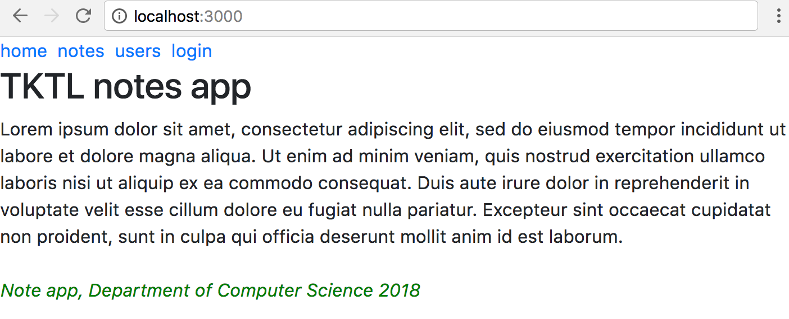

Bootstrapissa koko sivun sisältö renderöidään yleensä [container](https://getbootstrap.com/docs/4.0/layout/overview/#containers):ina, eli käytännössä koko sovelluksen ympäröivä _div_-elementti merkitään luokalla _container_:

```react
// ...

class App extends React.Component {
  // ...
  render() {
    return (
      <div className="container">
        // ...
      </div>
    )
  }
}
```

Sovelluksen ulkoasu muuttuu siten, että sisältö ei ole enää yhtä kiinni selaimen reunoissa:

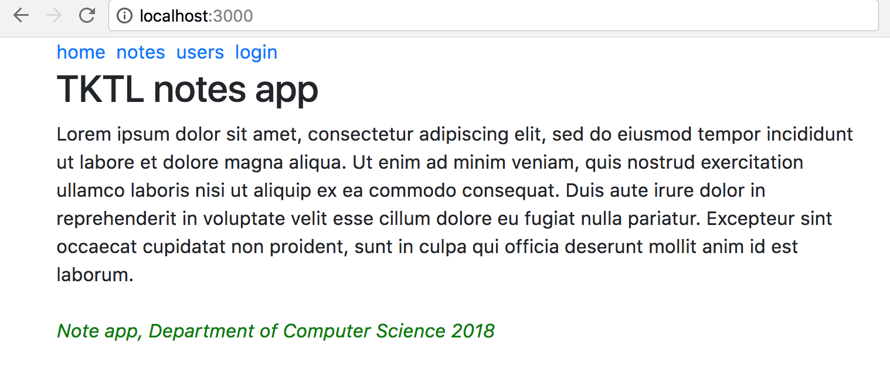

Muutetaan seuraavaksi komponenttia _Notes_ siten, että se renderöi muistiinpanojen listan [taulukkona](https://getbootstrap.com/docs/4.0/content/tables/). React bootstrap tarjoaa valmiin komponentin [Table](https://react-bootstrap.github.io/components/table/), joten CSS-luokan käyttöön ei ole tarvetta.

```react
const Notes = ({notes}) => (
  <div>
    <h2>Notes</h2>
    <Table striped>
      <tbody>
        {notes.map(note=>
          <tr key={note.id}>
            <td>
              <Link to={`/notes/${note.id}`}>{note.content}</Link>
            </td>
            <td>
              {note.user}
            </td>
          </tr>
        )}
      </tbody>
    </Table>
  </div>
)
```

Ulkoasu on varsin tyylikäs:

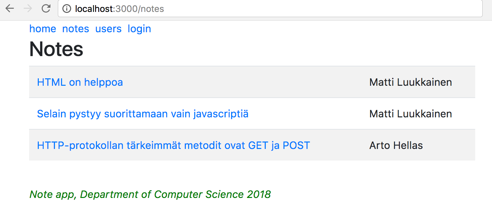

Huomaa, että koodissa käytettävät React bootstrapin komponentit täytyy importata, eli koodiin on lisättävä:

```js
import { Table } from 'react-bootstrap';
```

#### Lomake

Parannellaan seuraavaksi näkymän _Login_ kirjautumislomaketta Bootstrapin [lomakkeiden](https://getbootstrap.com/docs/4.0/components/forms/) avulla.

React bootstrap tarjoaa valmiit [komponentit](https://react-bootstrap.github.io/components/forms/) myös lomakkeiden muodostamiseen (dokumentaatio tosin ei ole paras mahdollinen):

```react
const Login = ({onLogin, history}) => {
  // ...
  return (
    <div>
      <h2>login</h2>
      <form onSubmit={onSubmit}>
        <FormGroup>
          <ControlLabel>username:</ControlLabel>
          <FormControl
            type="text"
            name="username"
          />
          <ControlLabel>password:</ControlLabel>
          <FormControl
            type="password"
          />
          <Button bsStyle="success" type="submit">login</Button>
        </FormGroup>
      </form>
    </div>
)}
```

Importoitavien komponenttien määrä kasvaa:

```js
import {
  Table,
  FormGroup,
  FormControl,
  ControlLabel,
  Button,
} from 'react-bootstrap';
```

Lomake näyttää parantelun jälkeen seuraavalta:

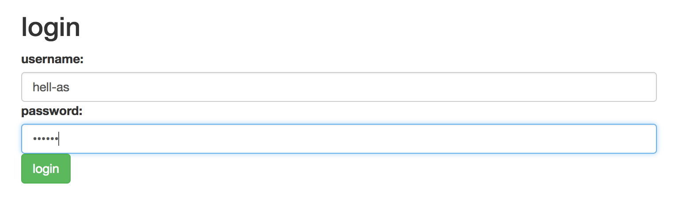

#### Notifikaatio

Toteutetaan sovellukseen kirjautumisen jälkeinen _notifikaatio_:

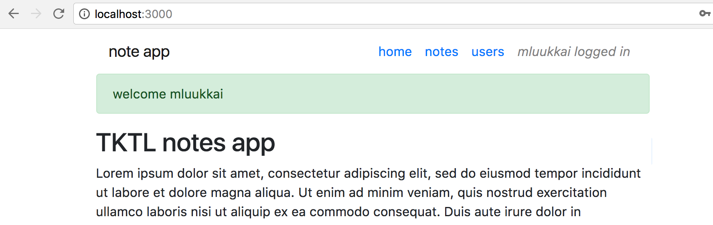

Asetetaan notifikaatio kirjautumisen yhteydessä komponentin _App_ tilan kenttään _message_:

```js
login = user => {
  this.setState({ user, message: `welcome ${user}` });
  setTimeout(() => {
    this.setState({ message: null });
  }, 10000);
};
```

ja renderöidään viesti Bootstrapin [Alert](https://getbootstrap.com/docs/4.0/components/alerts/)-komponentin avulla. React bootstrap tarjoaa tähän jälleen valmiin [React-komponentin](https://react-bootstrap.github.io/components/alerts/):

```react
{(this.state.message &&
  <Alert color="success">
    {this.state.message}
  </Alert>
)}
```

#### Navigaatiorakenne

Muutetaan vielä lopuksi sovelluksen navigaatiomenu käyttämään Bootstrapin [Navbaria](https://getbootstrap.com/docs/4.0/components/navbar/). Tähänkin React bootstrap tarjoaa [valmiit komponentit](https://react-bootstrap.github.io/components/navbar/#navbars-mobile-friendly), dokumentaatio on hieman kryptistä, mutta trial and error johtaa lopulta toimivaan ratkaisuun:

```bash
<Navbar inverse collapseOnSelect>
  <Navbar.Header>
    <Navbar.Brand>
      Anecdote app
    </Navbar.Brand>
    <Navbar.Toggle />
  </Navbar.Header>
  <Navbar.Collapse>
    <Nav>
      <NavItem href="#">
        <Link to="/">home</Link>
      </NavItem>
      <NavItem href="#">
        <Link to="/notes">notes</Link>
      </NavItem>
      <NavItem href="#">
        <Link to="/users">users</Link>
      </NavItem>
      <NavItem>
        {this.state.user
          ? <em>{this.state.user} logged in</em>
          : <Link to="/login">login</Link>
        }
      </NavItem>
    </Nav>
  </Navbar.Collapse>
</Navbar>
```

Ulkoasu on varsin tyylikäs

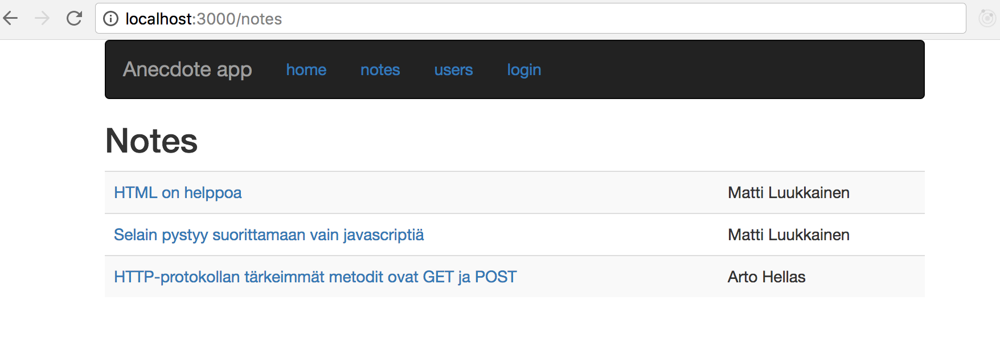

Jos selaimen kokoa kaventaa, huomaamme että menu "kollapsoituu" ja sen saa näkyville vain klikkaamalla:

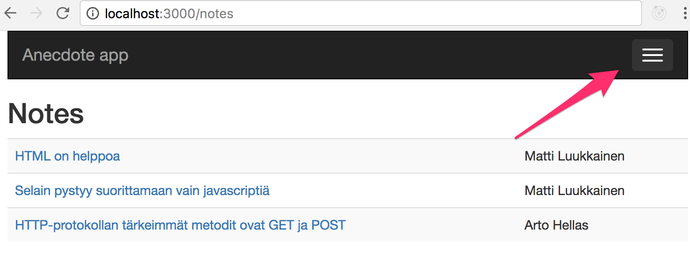

Bootstrap ja valtaosa tarjolla olevista UI-frameworkeista tuottavat [responsiivisia](https://en.wikipedia.org/wiki/Responsive_web_design) näkymiä, eli sellaisia jotka renderöityvät vähintään kohtuullisesti monen kokoisilla näytöillä.

Chromen konsolin avulla on mahdollista simuloida sovelluksen käyttöä erilaisilla mobiilipäätteillä

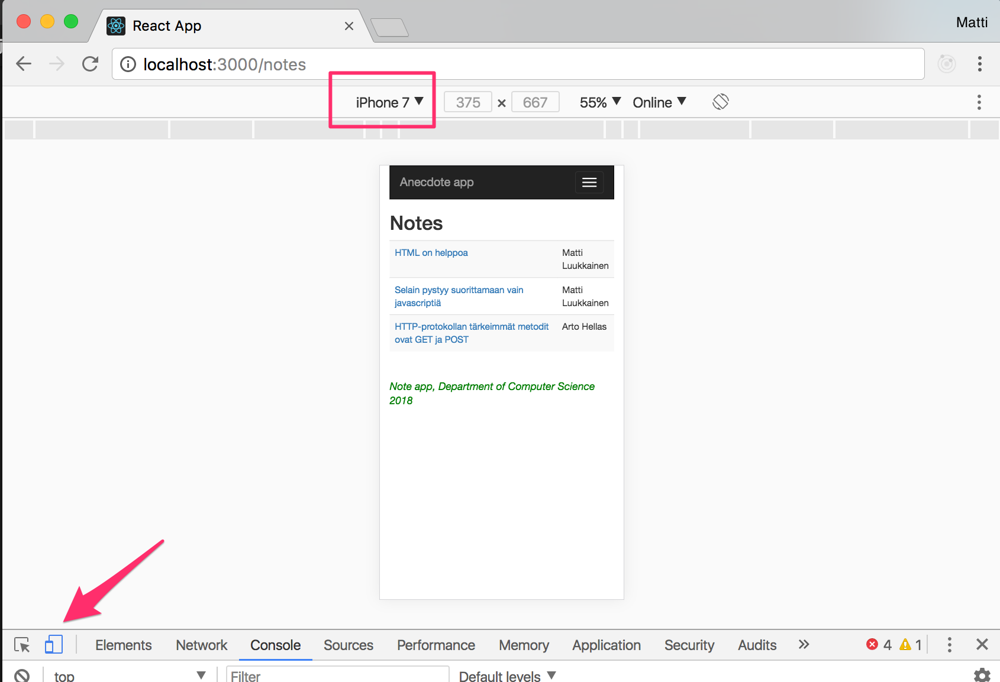

Sovellus toimii hyvin, mutta konsoliin vilkaisu paljastaa erään ikävän detaljin:

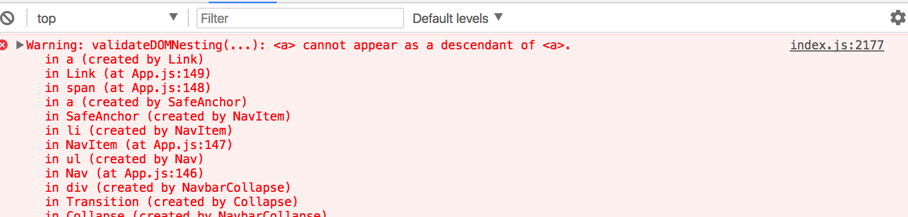

Syy valituksiin on navigaatiorakenteessa

```bash
<NavItem href="#">
  <Link to="/">home</Link>
</NavItem>
```

Nämä sisäkkäiset komponentit sisältävät molemmat _a_-tagin ja React hermostuu tästä.

Ongelma on ikävä ja sen kiertäminen on toki mahdollista, katso esim.
<https://serverless-stack.com/chapters/adding-links-in-the-navbar.html>

Esimerkin sovelluksen koodi kokonaisuudessaan [täällä](https://github.com/FullStack-HY/FullStack-Hy.github.io/wiki/bootstrap).

### Semantic UI

Olen käyttänyt bootstrapia vuosia, mutta siirryin hiljattain [Semantic UI](https://semantic-ui.com/):n käyttäjäksi. Kurssin tehtävien [palautusovellus](https://studies.cs.helsinki.fi/fs-stats) on tehty Semanticilla ja kokemukset ovat olleet rohkaisevia, erityisesti semanticin [React-tuki](https://react.semantic-ui.com) on ensiluokkainen ja dokumentaatiokin huomattavasti parempi kuin bootstrapissa.

Lisätään nyt [React-router](/osa6/#react-router)-sovellukselle edellisen luvun tapaan tyylit semanticilla.

Aloitetaan asentamalla [semantic-ui-react](https://react.semantic-ui.com)-kirjasto:

```bash
npm install --save semantic-ui-react
```

Lisätään sitten sovelluksen tiedostoon _public/index.html_ head-tagin sisään semanticin css-määrittelyt lataava rivi (joka löytyy [tästä](https://react.semantic-ui.com/usage#content-delivery-network-cdn)):

```html
<head>
  <link rel="stylesheet" href="//cdnjs.cloudflare.com/ajax/libs/semantic-ui/2.2.12/semantic.min.css"></link>
  // ...
</head>
```

Sijoitetaan koko sovelluksen renderöimä sisältö Semanticin komponentin [Container](https://react.semantic-ui.com/elements/container) sisälle.

Semanticin dokumentaatio sisältää jokaisesta komponentista useita esimerkkikoodinpätkiä, joiden avulla komponenttien käytön periaatteet on helppo omaksua:

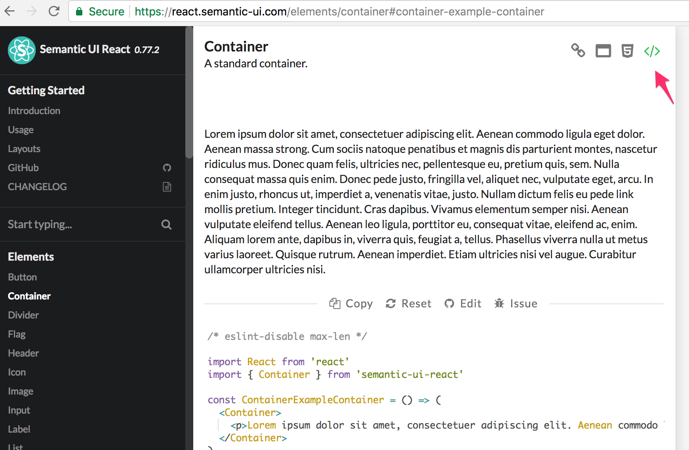

Muutetaan komponentin App uloin _div_-elementti _Containeriksi_:

```bash
import { Container } from 'semantic-ui-react'

// ...

class App extends React.Component {
  // ...
  render() {
    return (
      <Container>
        // ...
      </Container>
    )
  }
}
```

Sivun sisältö ei ole enää reunoissa kiinni:

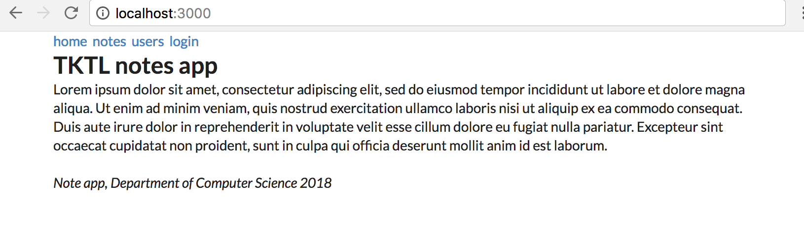

Edellisen luvun tapaan, renderöidään muistiinpanot taulukkona, komponentin [Table](https://react.semantic-ui.com/collections/table) avulla. Koodi näyttää seuraavalta

```react
import { Table } from 'semantic-ui-react'

const Notes = ({ notes }) => (
  <div>
    <h2>Notes</h2>
    <Table striped celled>
      <Table.Body>
        {notes.map(note =>
          <Table.Row key={note.id}>
            <Table.Cell>
              <Link to={`/notes/${note.id}`}>{note.content}</Link>
            </Table.Cell>
            <Table.Cell>
              {note.user}
            </Table.Cell>
          </Table.Row>
        )}
      </Table.Body>
    </Table>
  </div>
)
```

Muistiinpanojen lista näyttää seuraavalta:


#### Lomake

Otetaan kirjautumissivulla käyttöön Semanticin [Form](https://react.semantic-ui.com/collections/form)-komponentti:

```
import { Form, Button } from 'semantic-ui-react'

const Login = ({ onLogin, history }) => {
  const onSubmit = (event) => {
    // ...
  }
  return (
    <div>
      <h2>login</h2>
      <Form onSubmit={onSubmit}>
        <Form.Field>
          <label>username</label>
          <input name='username' />
        </Form.Field>
        <Form.Field>
          <label>password</label>
          <input type='password' />
        </Form.Field>
        <Button type='submit'>login</Button>
      </Form>
    </div>
  )
}
```

Ulkoasu näyttää seuraavalta:

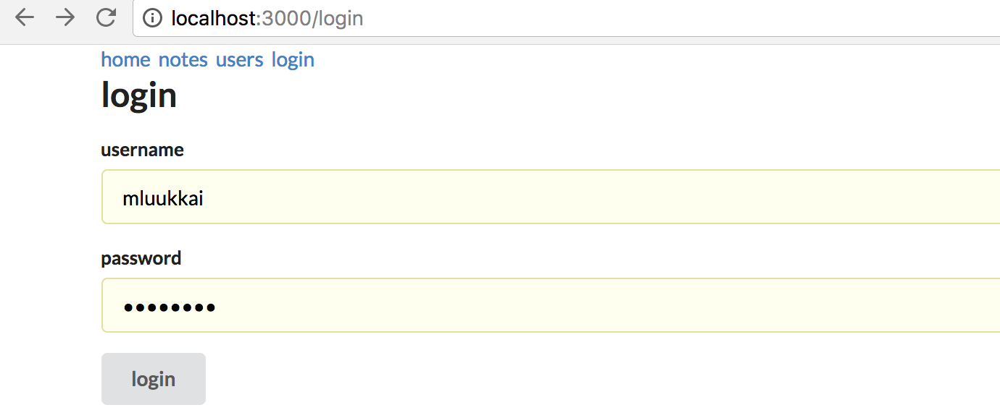

#### Notifikaatio

Edellisen luvun tapaan, toteutetaan sovellukseen kirjautumisen jälkeinen _notifikaatio_:

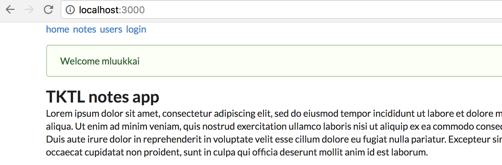

Kuten edellisessä luvussa, asetetaan notifikaatio kirjautumisen yhteydessä komponentin _App_ tilan kenttään _message_:

```js
login = user => {
  this.setState({ user, message: `welcome ${user}` });
  setTimeout(() => {
    this.setState({ message: null });
  }, 10000);
};
```

ja renderöidään viesti käyttäen komponenttia [Message](https://react.semantic-ui.com/collections/message):

```react
{(this.state.message &&
  <Message success>
    {this.state.message}
  </Message>
)}
```

#### Navigaatiorakenne

Navigaatiorakenne toteutetaan komponentin [Menu](https://react.semantic-ui.com/collections/menu) avulla:

```bash
<Menu inverted>
  <Menu.Item link>
    <Link to="/">home</Link>
  </Menu.Item>
  <Menu.Item link>
    <Link to="/notes">notes</Link>
  </Menu.Item>
  <Menu.Item link>
    <Link to="/users">users</Link>
  </Menu.Item>
  <Menu.Item link>
    {this.state.user
      ? <em>{this.state.user} logged in</em>
      : <Link to="/login">login</Link>
    }
  </Menu.Item>
</Menu>
```

Lopputulos näyttää seuraavalta:

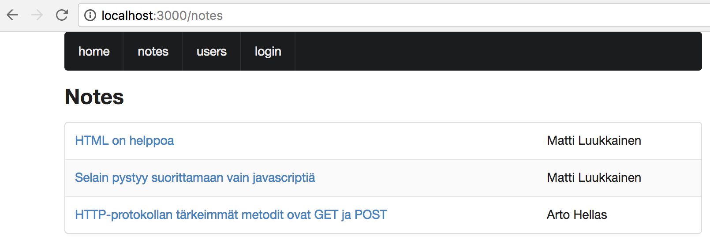

Bootstrapin yhteydessä esiintynyttä sisäkkäisen _a_-tagien ongelmaa ei semanticin kanssa ole.

Esimerkin sovelluksen koodi kokonaisuudessaan [täällä](https://github.com/FullStack-HY/FullStack-Hy.github.io/wiki/semantic-ui).

### Loppuhuomioita

Ero react-bootstrapin ja semantic-ui-reactin välillä ei ole suuri. On makuasia kummalla tuotettu ulkoasu on tyylikkäämpi. Oma vuosia kestäneen bootstrapin käytön jälkeinen siirtymiseni semanticiin johtuu semanticin saumattomammasta React-tuesta, laajemmasta valmiiden komponenttien valikoimasta ja paremmasta sekä selkeämmästä dokumentaatiosta. Semantic UI projektin kehitystyön jatkuvuuden suhteen on kuitenkin viime aikoina ollut ilmoilla muutamia [kysymysmerkkejä](https://github.com/Semantic-Org/Semantic-UI/issues/6109), ja tilannetta kannattaakin seurata.

Esimerkissä käytettiin UI-frameworkeja niiden React-integraatiot tarjoavien kirjastojen kautta.

Sen sijaan että käytimme kirjastoa [React bootstrap](https://react-bootstrap.github.io/), olisimme voineet aivan yhtä hyvin käyttää Bootstrapia suoraan, liittämällä HTML-elementteihin CSS-luokkia. Eli sen sijaan että määrittelimme esim. taulukon komponentin _Table_ avulla

```bash
<Table striped>
  // ...
</Table>
```

olisimme voineet käyttää normaalia HTML:n taulukkoa _table_ ja CSS-luokkaa

```bash
<table className="table striped">
  // ...
</table>
```

Taulukon määrittelyssä React bootstrapin tuoma etu ei ole suuri.

Tiiviimmän ja ehkä paremmin luettavissa olevan kirjoitusasun lisäksi toinen etu React-kirjastoina olevissa UI-frameworkeissa on se, että kirjastojen mahdollisesti käyttämä Javascript-koodi on sisällytetty React-komponentteihin. Esim. osa Bootstrapin komponenteista edellyttää toimiakseen muutamaakin ikävää [Javascript-riippuvuutta](https://getbootstrap.com/docs/4.0/getting-started/introduction/#js) joita emme mielellään halua React-sovelluksiin sisällyttää.

React-kirjastoina tarjottavien UI-frameworkkien ikävä puoli verrattuna frameworkin "suoraan käyttöön" on React-kirjastojen API:n mahdollinen epästabiilius ja osittain huono dokumentaatio. Tosin [react-semanticin](https://react.semantic-ui.com) suhteen tilanne on paljon parempi kuin monien muiden UI-frameworkien sillä kyseessä on virallinen React-integraatio.

Kokonaan toinen kysymys on se kannattaako UI-frameworkkeja ylipäätän käyttää. Kukin muodostakoon oman mielipiteensä, mutta CSS:ää taitamattomalle ja puutteellisilla design-taidoilla varustetulle ne ovat varsin käyttökelpoisia työkaluja.

### Muita UI-frameworkeja

Luetellaan tässä kaikesta huolimatta muitakin UI-frameworkeja. Jos oma suosikkisi ei ole mukana, tee pull request

- <http://www.material-ui.com/>
- <https://bulma.io/>
- <https://ant.design/>
- <https://foundation.zurb.com/>

Alun perin tässä osassa oli tarkoitus käyttää [Material UI](http://www.material-ui.com/):ta, mutta kirjasto on juuri nyt kiivaan kehityksen alla ennen version 1.0 julkaisemista ja osa dokumentaation esimerkeistä ei toiminut uusimmalla versiolla. Voikin olla viisainta odotella Materialin kanssa versiota 1.0.

## Tehtäviä

Tee nyt tehtävät [6.21-6.23](/tehtävät#ui-framework)

</div>
