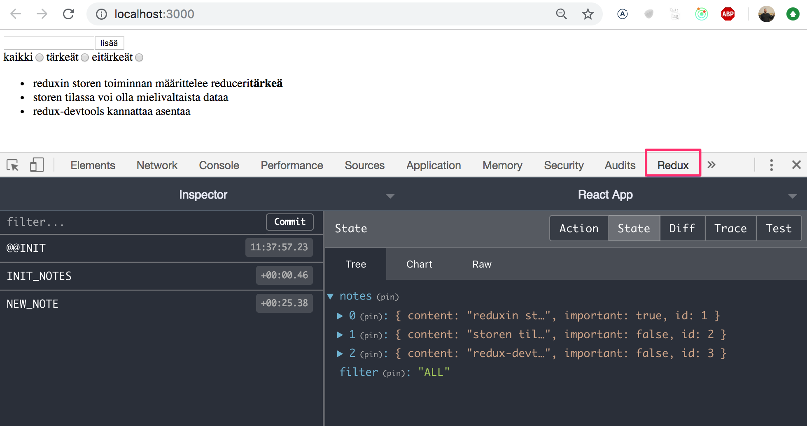
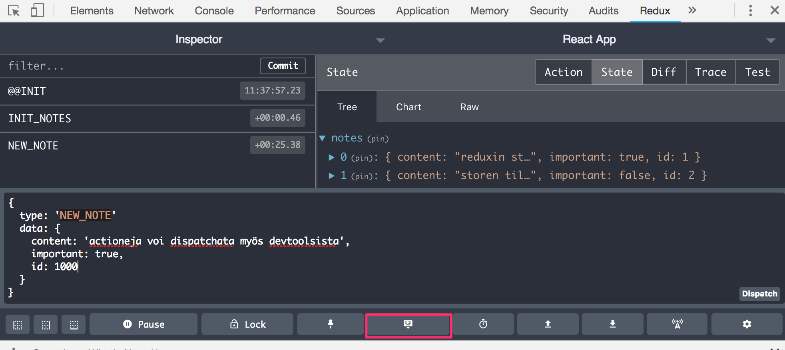
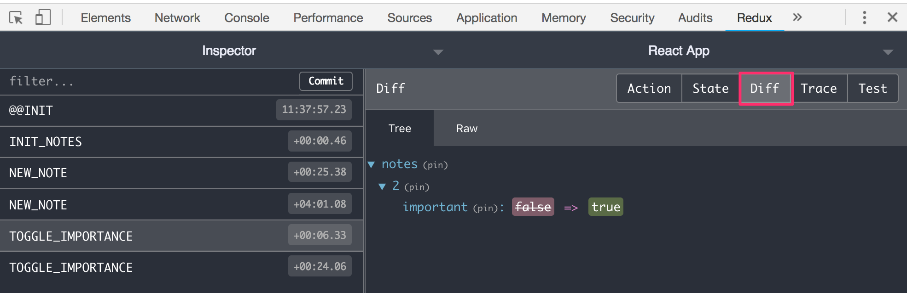

<div class="content">

Laajennetaan sovellusta siten, että muistiinpanot talletetaan backendiin. Käytetään osasta 2 tuttua [json-serveriä](/osa2/palvelimella_olevan_datan_hakeminen).

Tallennetaan projektin juuren tiedostoon <i>db.json</i> tietokannan alkutila:

```json
{
  "notes": [
    {
      "content": "reduxin storen toiminnan määrittelee reduceri",
      "important": true,
      "id": 1
    },
    {
      "content": "storen tilassa voi olla mielivaltaista dataa",
      "important": false,
      "id": 2
    }
  ]
}
```

Asennetaan projektiin json-server

```js
npm install json-server --save
```

ja lisätään tiedoston <i>package.json</i> osaan <i>scripts</i> rivi

```js
"scripts": {
  "server": "json-server -p3001 db.json",
  // ...
}
```

Käynnistetään json-server komennolla _npm run server_.

Tehdään sitten tuttuun tapaan <i>axiosia</i> hyödyntävä backendistä dataa hakeva metodi tiedostoon <i>services/notes.js</i>

```js
import axios from 'axios'

const baseUrl = 'http://localhost:3001/notes'

const getAll = async () => {
  const response = await axios.get(baseUrl)
  return response.data
}

export default { getAll }
```

Asennetaan myös axios projektiin

```js
npm install axios --save
```

Muutetaan <i>nodeReducer</i>:issa tapahtuva muistiinpanojen tilan alustusta, siten että oletusarvoisesti mustiinpanoja ei ole:

```js
const noteReducer = (state = [], action) => {
  // ...
};
```

Nopea tapa saada storen tila alustettua palvelimella olevan datan perusteella on hakea muistiinpanot tiedostossa <i>index.js</i> ja dispatchata niille yksitellen action <i>NEW\_NOTE</i>:

```js
// ...
import noteService from './services/notes' // highlight-line

const reducer = combineReducers({
  notes: noteReducer,
  filter: filterReducer,
});

const store = createStore(reducer);

// highlight-start
noteService.getAll().then(notes =>
  notes.forEach(note => {
    store.dispatch({ type: 'NEW_NOTE', data: note })
  })
)
// highlight-end

// ...
```

Lisätään reduceriin tuki actionille <i>INIT\_NOTES</i>, jonka avulla alustus voidaan tehdä dispatchaamalla yksittäinen action. Luodaan myös sitä varten oma action creator -funktio _initializeNotes_:

```js
// ...
const noteReducer = (state = [], action) => {
  console.log('ACTION:', action)
  switch (action.type) {
    case 'NEW_NOTE':
      return [...state, action.data]
    case 'INIT_NOTES':   // highlight-line
      return action.data // highlight-line
    // ...
  }
};

export const initializeNotes = (notes) => {
  return {
    type: 'INIT_NOTES',
    data: notes,
  };
};

// ...
```

<i>index.js</i> yksinkertaistuu:

```js
import noteReducer, { initializeNotes } from './reducers/noteReducer'
// ...

noteService.getAll().then(notes =>
  store.dispatch(initializeNotes(notes))
)
```

> **HUOM:** miksi emme käyttäneet koodissa promisejen ja _then_-metodilla rekisteröidyn tapahtumankäsittelijän sijaan awaitia?
>
> await toimii ainoastaan <i>async</i>-funktioiden sisällä, ja <i>index.js</i>:ssä oleva koodi ei ole funktiossa, joten päädyimme tilanteen yksinkertaisuuden takia tällä kertaa jättämään <i>async</i>:in käyttämättä.

Päätetään kuitenkin siirtää muistiinpanojen alustus <i>App</i>-komponentiin, eli kuten yleensä dataa palvelimelta haettaessa, käytetään <i>effect hookia</i>.

Jotta saamme action creatorin <i>initializeNotes</i> käyttöön komponentissa <i>App</i> tarvitsemme jälleen _connect_-metodin apua:

```js
import React, { useEffect } from 'react' // highlight-line
import { connect } from 'react-redux'  // highlight-line
import NewNote from './components/NewNote'
import Notes from './components/Notes'
import VisibilityFilter from './components/VisibilityFilter'
import noteService from './services/notes'
import { initializeNotes } from './reducers/noteReducer'

const App = (props) => {
// highlight-start
  useEffect(() => {
    noteService
      .getAll().then(notes => props.initializeNotes(notes))
  },[])
// highlight-end

  return (
    <div>
      <NewNote />
      <VisibilityFilter />
      <Notes />
    </div>
  )
}

export default connect(null, { initializeNotes })(App) // highlight-line
```

Näin funktio <i>initializeNotes</i> tulee komponentin <i>App</i> propsiksi <i>props.initializeNotes</i> ja sen kutsumiseen ei tarvita _dispatch_-metodia koska _connect_ hoitaa asian puolestamme.

Voimme toimia samoin myös uuden muistiinpanon luomisen suhteen. Laajennetaan palvelimen kanssa kommunikoivaa koodia:

```js
const url = 'http://localhost:3001/notes'

const getAll = async () => {
  const response = await axios.get(url)
  return response.data
}

// highlight-start
const createNew = async (content) => {
  const object = { content, important: false }
  const response = await axios.post(url, object)
  return response.data
}
// highlight-end

export default {
  getAll,
  createNew,
}
```

Komponentin <i>NewNote</i> metodi _addNote_ muuttuu hiukan:

```js
import React from 'react'
import { connect } from 'react-redux'
import { createNote } from '../reducers/noteReducer'
import noteService from '../services/notes'  // highlight-line

const NewNote = (props) => {
  const addNote = async (event) => {
    event.preventDefault()
    const content = event.target.note.value // highlight-line
    event.target.note.value = '' //highlight-line
    const newNote = await noteService.createNew(content) // highlight-line
    props.createNote(newNote) // highlight-line
  }

  return (
    // ...
  )
}

export default connect(null, { createNote } )(NewNote)
```

Koska backend generoi muistiinpanoille id:t, muutetaan action creator _noteCreation_ muotoon

```js
export const createNote = (data) => {
  return {
    type: 'NEW_NOTE',
    data,
  }
}
```

Muistiinpanojen tärkeyden muuttaminen olisi mahdollista toteuttaa samalla periaatteella, eli tehdä palvelimelle ensin asynkroninen metodikutsu ja sen jälkeen dispatchata sopiva action.

Sovelluksen tämänhetkinen koodi on [githubissa](https://github.com/fullstack-hy2019/redux-notes/tree/part6-5) branchissa <i>part6-5</i>.

</div>

<div class="tasks">

### Tehtäviä

#### 6.16 anekdootit ja backend, step1

Hae sovelluksen käynnistyessä anekdootit json-serverillä toteutetusta backendistä.

Backendin alustavan sisällön saat esim. [täältä](https://github.com/fullstack-hy2019/misc/blob/master/anecdotes.json).

#### 6.17 anekdootit ja backend, step2

Muuta uusien anekdoottien luomista siten, että anekdootit talletetaan backendiin.

</div>

<div class="content">

### Asynkroniset actionit ja redux thunk

Lähestymistapamme on ok, mutta siinä mielessä ikävä, että palvelimen kanssa kommunikointi tapahtuu komponenttien funktioissa. Olisi parempi, jos kommunikointi voitaisiin abstrahoida komponenteilta siten, että niiden ei tarvitsisi kuin kutsua sopivaa <i>action creatoria</i>, esim. <i>App</i> alustaisi sovelluksen tilan seuraavasti:

```js
const App = (props) => {

  useEffect(() => {
    props.initializeNotes(notes)
  },[])
  // ...
}
```

ja <i>NoteForm</i> loisi uuden muistiinpanon seuraavasti:

```js
const NewNote = (props) => {
  const addNote = (event) => {
    event.preventDefault()
    const content = event.target.note.value
    props.createNote(content)
    event.target.note.value = ''
  }
```

Molemmat komponentit käyttäisivät ainoastaan propsina saamaansa funktiota, välittämättä siitä että taustalla tapahtuu todellisuudessa palvelimen kanssa tapahtuvaa kommunikointia.

Asennetaan nyt [redux-thunk](https://github.com/gaearon/redux-thunk)-kirjasto, joka mahdollistaa <i>asynkronisten actionien</i> luomisen. Asennus tapahtuu komennolla:

```js
npm install --save redux-thunk
```

redux-thunk-kirjasto on ns. <i>redux-middleware</i> joka täytyy ottaa käyttöön storen alustuksen yhteydessä. Eriytetään samalla storen määrittely omaan tiedostoon <i>src/store.js</i>:

```js
import { createStore, combineReducers, applyMiddleware } from 'redux'
import thunk from 'redux-thunk';

import noteReducer from './reducers/noteReducer'
import filterReducer from './reducers/filterReducer'

const reducer = combineReducers({
  notes: noteReducer,
  filter: filterReducer,
})

const store = createStore(reducer, applyMiddleware(thunk))

export default store
```

Tiedosto <i>src/index.js</i> on muutoksen jälkeen seuraava

```js
import React from 'react'
import ReactDOM from 'react-dom'
import { Provider } from 'react-redux'
import App from './App'
import store from './store'

ReactDOM.render(
  <Provider store={store}>
    <App />
  </Provider>,
document.getElementById('root'))
```

redux-thunkin ansiosta on mahdollista määritellä <i>action creatoreja</i> siten, että ne palauttavat funktion, jonka parametrina on redux-storen <i>dispatch</i>-metodi. Tämän ansiosta on mahdollista tehdä asynkronisia action creatoreja, jotka ensin odottavat jonkin toimenpiteen valmistumista ja vasta sen jälkeen dispatchaavat varsinaisen actionin.

Voimme nyt määritellä muistiinpanojen alkutilan palvelimelta hakevan action creatorin <i>initializeNotes</i> seuraavasti:

```js
export const initializeNotes = () => {
  return async dispatch => {
    const notes = await noteService.getAll()
    dispatch({
      type: 'INIT_NOTES',
      data: notes,
    })
  }
}
```

Sisemmässä funktiossaan, eli <i>asynkronisessa actionissa</i> operaatio hakee ensin palvelimelta kaikki muistiinpanot ja sen jälkeen <i>dispatchaa</i> muistiinpanot storeen lisäävän actionin.

Komponentti <i>App</i> voidaan nyt määritellä seuraavasti:

```js
const App = (props) => {

  useEffect(() => {
    props.initializeNotes()
  },[])

  return (
    <div>
      <NewNote />
      <VisibilityFilter />
      <Notes />
    </div>
  )
}

export default connect(
  null, { initializeNotes }
)(App)
```

Ratkaisu on elegantti, muistiinpanojen alustuslogiikka on eriytetty kokonaan React-komponenttien ulkopuolelle.

Uuden muistiinpanon lisäävä action creator _createNew_ on seuraavassa

```js
export const createNew = content => {
  return async dispatch => {
    const newNote = await noteService.createNew(content)
    dispatch({
      type: 'NEW_NOTE',
      data: newNote,
    })
  }
}
```

Periaate on jälleen sama, ensin suoritetaan asynkroninen operaatio, ja sen valmistuttua <i>dispatchataan</i> storen tilaa muuttava action.

Komponentti <i>NewNote</i> muuttuu seuraavasti:

```js
const NewNote = (props) => {
  const addNote = async (event) => {
    event.preventDefault()
    const content = event.target.note.value
    event.target.note.value = ''
    rops.createNote(content)
  }

  return (
    <form onSubmit={addNote}>
      <input name="note" />
      <button type="submit">lisää</button>
    </form>
  )
}

export default connect(
  null, { createNote }
)(NewNote)
```

Sovelluksen tämänhetkinen koodi on [githubissa](https://github.com/fullstack-hy2019/redux-notes/tree/part6-6) brachissa <i>part6-6</i>.

### Redux DevTools

Chromeen on asennettavissa [Redux DevTools](https://chrome.google.com/webstore/detail/redux-devtools/lmhkpmbekcpmknklioeibfkpmmfibljd), jonka avulla Redux-storen tilaa ja sitä muuttavia actioneja on mahdollisuus seurata selaimen konsolista.

Selaimen lisäosan lisäksi debugatessa tarvitaan kirjastoa [redux-devtools-extension](https://www.npmjs.com/package/redux-devtools-extension). Asennetaan se komennolla

```js
npm install --save redux-devtools-extension
```

Storen luomistapaa täytyy hieman muuttaa, että kirjasto saadaan käyttöön:

```js
// ...
import { createStore, combineReducers, applyMiddleware } from 'redux'
import thunk from 'redux-thunk'
import { composeWithDevTools } from 'redux-devtools-extension' // highlight-line

import noteReducer from './reducers/noteReducer'
import filterReducer from './reducers/filterReducer'

const reducer = combineReducers({
  notes: noteReducer,
  filter: filterReducer
})

const store = createStore(
  reducer,
  // highlight-start
  composeWithDevTools(
    applyMiddleware(thunk)
  )
  // highlight-end
)

export default store
```

Kun nyt avaat konsolin, välilehti <i>redux</i> näyttää seuraavalta:



Konsolin avulla on myös mahdollista dispatchata actioneja storeen



Storen tietyn hetkisen tilan lisäksi on myös mahdollista tarkastella, mikä on kunkin actionin tilalle aiheuttama muutos:



### Redux ja komponenttien tila

Kurssi on ehtinyt pitkälle, ja olemme vihdoin päässeet siihen pisteeseen missä käytämme Reactia "oikein", eli React keskittyy pelkästään näkymien muodostamiseen ja sovelluksen tila sekä sovelluslogiikka on eristetty kokonaan React-komponenttien ulkopuolelle, Reduxiin ja action reducereihin.

Entä _useState_-hookilla saatava komponenttien oma tila, onko sillä roolia jos sovellus käyttää Reduxia tai muuta komponenttien ulkoista tilanhallintaratkaisua? Jos sovelluksessa on monimutkaisempia lomakkeita, saattaa niiden lokaali tila olla edelleen järkevä toteuttaa funktiolla _useState_ saatavan tilan avulla. Lomakkeidenkin tilan voi toki tallettaa myös reduxiin, mutta jos lomakkeen tila on oleellinen ainoastaan lomakkeen täyttövaiheessa (esim. syötteen muodon validoinnin kannalta), voi olla viisaampi jättää tilan hallinta suoraan lomakkeesta huolehtivan komponentin vastuulle.

</div>

<div class="tasks">

### tehtäviä

#### 6.18 anekdootit ja backend, step4

Muuta redux-storen alustus tapahtumaan <i>redux-thunk</i>-kirjaston avulla toteutettuun asynkroniseen actioniin.

#### 6.19 anekdootit ja backend, step5

Muuta myös uuden anekdootin luominen tapahtumaan <i>redux-thunk</i>-kirjaston avulla toteutettuihin asynkronisiin actioneihin.


#### 6.20 anekdootit ja backend, step3

Äänestäminen ei vielä talleta muutoksia backendiin. Korjaa tilanne <i>redux-thunk</i>-kirjastoa hyödyntäen.

#### 6.21 anekdootit ja backend, step6

Notifikaatioiden tekeminen on nyt hieman ikävää, sillä se edellyttää kahden actionin tekemistä ja _setTimeout_-funktion käyttöä:

```js
props.setNotification(`you voted '${anecdote.content}'`)
setTimeout(() => {
  props.clearNotification()
}, 5000)
```

Tee asynkrooninen action creator, joka mahdollistaa notifikaation antamisen seuraavasti:

```js
props.setNotification(`you voted '${anecdote.content}'`, 10)
```

eli ensimmäisenä parametrina on renderöitävä teksti ja toisena notifikaation näyttöaika sekunneissa.

Ota paranneltu notifikaatiotapa käyttöön sovelluksessasi.

</div>
