<div class="content">

Osassa 2 on jo katsottu kahta tapaa tyylien lisäämiseen eli vanhan koulukunnan [yksittäistä CSS](/osa2#tyylien-lisääminen)-tiedostoa, [inline-tyylejä](/osa6#inline-tyylit). Katsotaan tässä osassa vielä muutamaa tapaa.

### Valmiit käyttöliittymätyylikirjastot

Eräs lähestymistapa sovelluksen tyylien määrittelyyn on valmiin "UI frameworkin", eli suomeksi ehkä käyttöliittymätyylikirjaston käyttö.

Ensimmäinen laajaa kuuluisuutta saanut UI framework oli Twitterin kehittämä [Bootstrap](https://getbootstrap.com/), joka lienee edelleen UI frameworkeista eniten käytetty. Viime aikoina UI frameworkeja on noussut kuin sieniä sateella. Valikoima on niin iso, ettei tässä kannata edes yrittää tehdä tyhjentävää listaa.

Monet UI-frameworkit sisältävät web-sovellusten käyttöön valmiiksi määriteltyjä teemoja sekä "komponentteja", kuten painikkeita, menuja, taulukkoja. Termi komponentti on edellä kirjotettu hipsuissa sillä kyse ei ole samasta asiasta kuin React-komponentti. Useimmiten UI-frameworkeja käytetään sisällyttämällä sovellukseen frameworkin määrittelemät CSS-tyylitiedostot sekä Javascript-koodi.

Monesta UI-frameworkista on tehty React-ystävällisiä versiota, joissa UI-frameworkin avulla määritellyistä "komponenteista" on tehty React-komponentteja. Esim. Bootstrapista on olemassa parikin React-versiota [reactstrap](http://reactstrap.github.io/) ja [react-bootstrap](https://react-bootstrap.github.io/).

Katsotaan seuraavaksi kahta UI-framworkia bootstrapia ja [semantic ui](https://semantic-ui.com/):ta.
Lisätään molempien avulla samantapaiset tyylit luvun [React-router](/osa7/react_router) sovellukseen.

### react bootstrap

Aloitetaan bootstrapista, käytetään kirjastoa [react-bootstrap](https://react-bootstrap.github.io/).

Asennetaan kirjasto suorittamalla komento

```js
npm install --save react-bootstrap
```

Lisätään sitten sovelluksen tiedostoon <i>public/index.html</i> tagin <i>head</i> sisään bootstrapin css-määrittelyt lataava rivi:

```js
<head>
<link
  rel="stylesheet"
  href="https://maxcdn.bootstrapcdn.com/bootstrap/4.2.1/css/bootstrap.min.css"
  integrity="sha384-GJzZqFGwb1QTTN6wy59ffF1BuGJpLSa9DkKMp0DgiMDm4iYMj70gZWKYbI706tWS"
  crossorigin="anonymous"
/>
  // ...
</head>
```

Kun sovellus ladataan uudelleen, näyttää se jo aavistuksen tyylikkäämmältä:

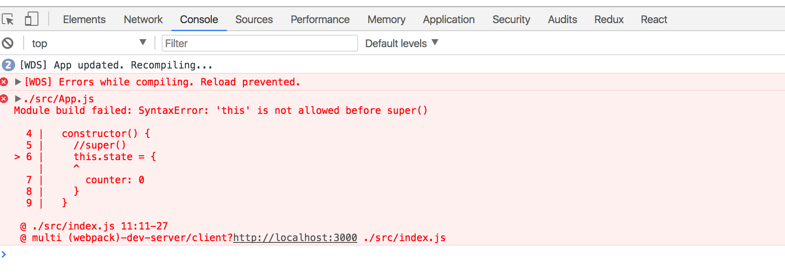

Bootstrapissa koko sivun sisältö renderöidään yleensä [container](https://getbootstrap.com/docs/4.1/layout/overview/#containers):ina, eli käytännössä koko sovelluksen ympäröivä _div_-elementti merkitään luokalla _container_:

```js
const App = () => {
  // ...

  return (
    <div class="container"> // highlight-line
      // ...
    </div>
  )
}
```

Sovelluksen ulkoasu muuttuu siten, että sisältö ei ole enää yhtä kiinni selaimen reunoissa:

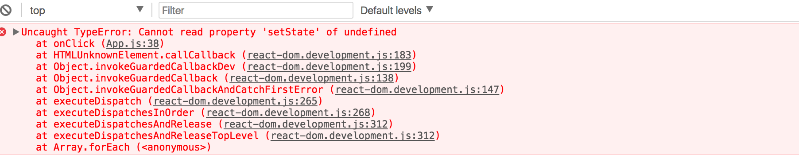

Muutetaan seuraavaksi komponenttia <i>Notes</i> siten, että se renderöi muistiinpanojen listan [taulukkona](https://getbootstrap.com/docs/4.1/content/tables/). React bootstrap tarjoaa valmiin komponentin [Table](https://react-bootstrap.github.io/components/table/), joten CSS-luokan käyttöön ei ole tarvetta.

```js
const Notes = (props) => (
  <div>
    <h2>Notes</h2>
    <Table striped>
      <tbody>
        {props.notes.map(note =>
          <tr key={note.id}>
            <td>
              <Link to={`/notes/${note.id}`}>
                {note.content}
              </Link>
            </td>
            <td>
              {note.user}
            </td>
          </tr>
        )}
      </tbody>
    </Table>
  </div>
)
```

Ulkoasu on varsin tyylikäs:

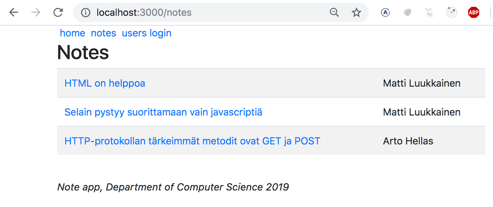

Huomaa, että koodissa käytettävät React bootstrapin komponentit täytyy importata, eli koodiin on lisättävä:

```js
import { Table } from 'react-bootstrap'
```

#### Lomake

Parannellaan seuraavaksi näkymän <i>Login</i> kirjautumislomaketta Bootstrapin [lomakkeiden](https://getbootstrap.com/docs/4.1/components/forms/) avulla.

React bootstrap tarjoaa valmiit [komponentit](https://react-bootstrap.github.io/components/forms/) myös lomakkeiden muodostamiseen (dokumentaatio tosin ei ole paras mahdollinen):

```js
let Login = (props) => {
  // ...
  return (
    <div>
      <h2>login</h2>
      <Form onSubmit={onSubmit}>
        <Form.Group>
          <Form.Label>username:</Form.Label>
          <Form.Control
            type="text"
            name="username"
          />
          <Form.Label>password:</Form.Label>
          <Form.Control
            type="password"
          />
          <Button variant="primary" type="submit">
            login
          </Button>
        </Form.Group>
      </Form>
    </div>
)}
```

Importoitavien komponenttien määrä kasvaa:

```js
import { Table, Form, Button } from 'react-bootstrap'
```

Lomake näyttää parantelun jälkeen seuraavalta:

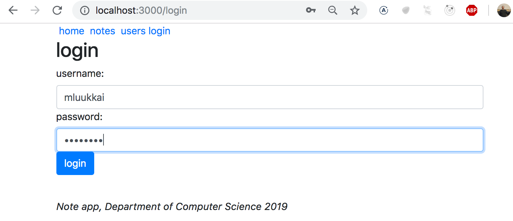

#### Notifikaatio

Toteutetaan sovellukseen kirjautumisen jälkeinen <i>notifikaatio</i>:


Asetetaan notifikaatio kirjautumisen yhteydessä komponentin <i>App</i> tilan muuttujaan _message_:

```js
const App = () => {
  const [notes, setNotes] = useState([
    // ...
  ])

  const [user, setUser] = useState(null)
  const [message, setMessage] = useState(null) // highlight-line

  const login = (user) => {
    setUser(user)
    // highlight-start
    setMessage(`welcome ${user}`)
    setTimeout(() => {
      setMessage(null)
    }, 10000)
    // highlight-end
  }
  // ...
}
```

ja renderöidään viesti Bootstrapin [Alert](https://getbootstrap.com/docs/4.1/components/alerts/)-komponentin avulla. React bootstrap tarjoaa tähän jälleen valmiin [React-komponentin](https://react-bootstrap.github.io/components/alerts/):

```js
<div className="container">
  <Router>
    <div>
    // highlight-start
      {(message &&
        <Alert variant="success">
          {message}
        </Alert>
      )}
      // highlight-end
    //...
)}
```

#### Navigaatiorakenne

Muutetaan vielä lopuksi sovelluksen navigaatiomenu käyttämään Bootstrapin [Navbaria](https://getbootstrap.com/docs/4.1/components/navbar/). Tähänkin React bootstrap tarjoaa [valmiit komponentit](https://react-bootstrap.github.io/components/navbar/#navbars-mobile-friendly), dokumentaatio on hieman kryptistä, mutta trial and error johtaa lopulta toimivaan ratkaisuun:

```js
<Navbar collapseOnSelect expand="lg" bg="dark" variant="dark">
  <Navbar.Toggle aria-controls="responsive-navbar-nav" />
  <Navbar.Collapse id="responsive-navbar-nav">
    <Nav className="mr-auto">
      <Nav.Link href="#" as="span">
        <Link style={padding} to="/">home</Link>
      </Nav.Link>
      <Nav.Link href="#" as="span">
        <Link style={padding} to="/notes">notes</Link>
      </Nav.Link>
      <Nav.Link href="#" as="span">
        <Link style={padding} to="/users">users</Link>
      </Nav.Link>
      <Nav.Link href="#" as="span">
        {user
          ? <em>{user} logged in</em>
          : <Link to="/login">login</Link>
        }
    </Nav.Link>
    </Nav>
  </Navbar.Collapse>
</Navbar>
```

Ulkoasu on varsin tyylikäs

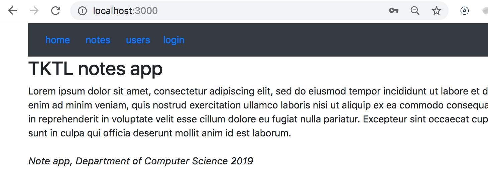

Jos selaimen kokoa kaventaa, huomaamme että menu "kollapsoituu" ja sen saa näkyville vain klikkaamalla:

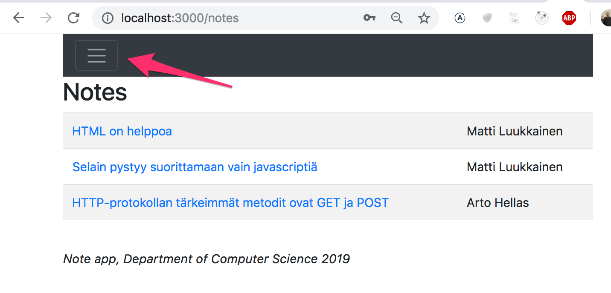

Bootstrap ja valtaosa tarjolla olevista UI-frameworkeista tuottavat [responsiivisia](https://en.wikipedia.org/wiki/Responsive_web_design) näkymiä, eli sellaisia jotka renderöityvät vähintään kohtuullisesti monen kokoisilla näytöillä.

Chromen developer-konsolin avulla on mahdollista simuloida sovelluksen käyttöä erilaisilla mobiilipäätteillä

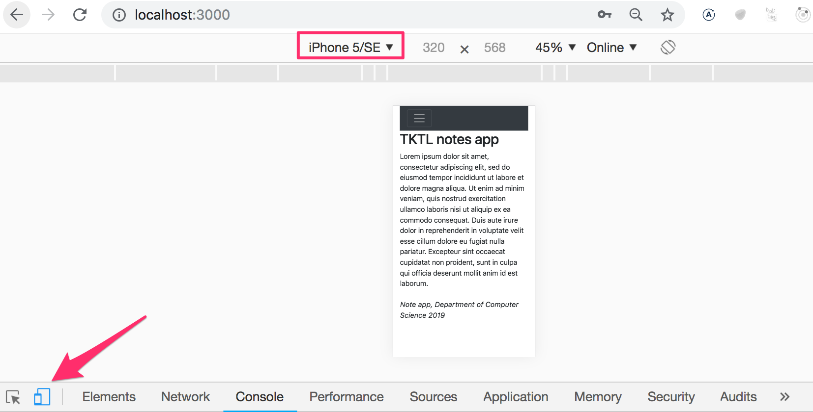


Esimerkin sovelluksen koodi kokonaisuudessaan [täällä](https://github.com/fullstack-hy2019/misc/blob/master/notes-bootstrap.js)

### Semantic UI

Olen käyttänyt bootstrapia vuosia, mutta reilu vuosi sitten siirryin [Semantic UI](https://semantic-ui.com/):n käyttäjäksi. Kurssin tehtävien [palautusovellus](https://studies.cs.helsinki.fi/courses) on tehty Semanticilla ja kokemukset ovat olleet rohkaisevia, erityisesti semanticin [React-tuki](https://react.semantic-ui.com) on ensiluokkainen ja dokumentaatiokin huomattavasti parempi kuin bootstrapissa.

Lisätään nyt [React-router](/osa6/#react-router)-sovellukselle edellisen luvun tapaan tyylit semanticilla.

Aloitetaan asentamalla [semantic-ui-react](https://react.semantic-ui.com)-kirjasto:

```js
npm install --save semantic-ui-react
```

Lisätään sitten sovelluksen tiedostoon <i>public/index.html</i> head-tagin sisään semanticin css-määrittelyt lataava rivi (joka löytyy [tästä](https://react.semantic-ui.com/usage#content-delivery-network-cdn)):

```js
<head>
  <link
    rel="stylesheet"
    href="//cdn.jsdelivr.net/npm/semantic-ui@2.4.2/dist/semantic.min.css"
  />
  // ...
</head>
```

Sijoitetaan koko sovelluksen renderöimä sisältö Semanticin komponentin [Container](https://react.semantic-ui.com/elements/container) sisälle.

Semanticin dokumentaatio sisältää jokaisesta komponentista useita esimerkkikoodinpätkiä, joiden avulla komponenttien käytön periaatteet on helppo omaksua:

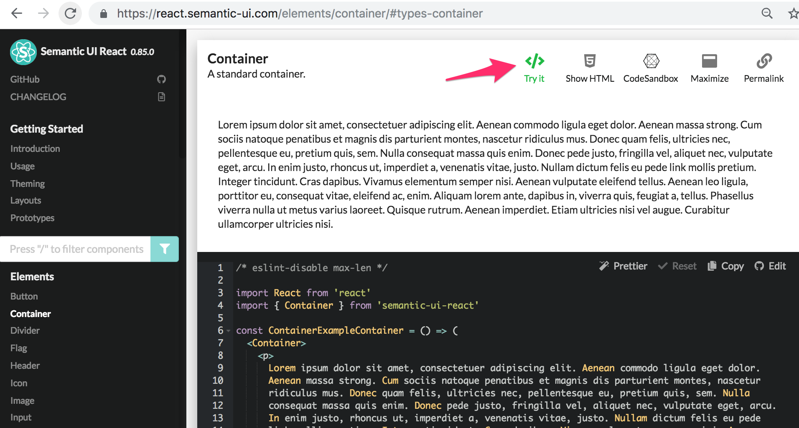

Muutetaan komponentin App uloin <i>div</i>-elementti komponentiksi <i>Container</i>:

```js
import { Container } from 'semantic-ui-react'

// ...

const App = () => {
  // ...
  return (
    <Container>
      // ...
    </Container>
  )
}
```

Sivun sisältö ei ole enää reunoissa kiinni:

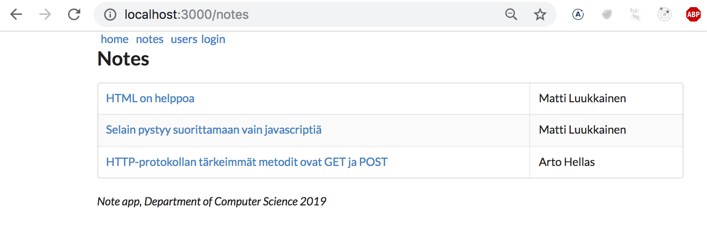

Edellisen luvun tapaan, renderöidään muistiinpanot taulukkona, komponentin [Table](https://react.semantic-ui.com/collections/table) avulla. Koodi näyttää seuraavalta

```js
import { Table } from 'semantic-ui-react'

const Notes = (props) => (
  <div>
    <h2>Notes</h2>
    <Table striped celled>
      <Table.Body>
        {props.notes.map(note =>
          <Table.Row key={note.id}>
            <Table.Cell>
              <Link to={`/notes/${note.id}`}>
                {note.content}
              </Link>
            </Table.Cell>
            <Table.Cell>
              {note.user}
            </Table.Cell>
          </Table.Row>
        )}
      </Table.Body>
    </Table>
  </div>
```

Muistiinpanojen lista näyttää seuraavalta:


#### Lomake

Otetaan kirjautumissivulla käyttöön Semanticin [Form](https://react.semantic-ui.com/collections/form)-komponentti:

```js
import { Form, Button } from 'semantic-ui-react'

let Login = (props) => {
  const onSubmit = (event) => {
    // ...
  }

  return (
    <Form onSubmit={onSubmit}>
      <Form.Field>
        <label>username</label>
        <input name='username' />
      </Form.Field>
      <Form.Field>
        <label>password</label>
        <input type='password' />
      </Form.Field>
      <Button type='submit'>login</Button>
    </Form>
  )
}
```

Ulkoasu näyttää seuraavalta:

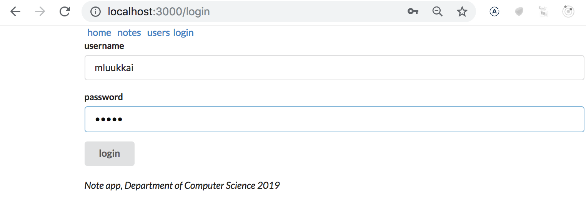

#### Notifikaatio

Edellisen luvun tapaan, toteutetaan sovellukseen kirjautumisen jälkeinen <i>notifikaatio</i>:


Kuten edellisessä luvussa, asetetaan notifikaatio kirjautumisen yhteydessä komponentin <i>App</i> tilan muuttujaan _message_:

```js
const App = () => {
  // ...
  const [message, setMessage] = useState(null)

  const login = (user) => {
    setUser(user)
    setMessage(`welcome ${user}`)
    setTimeout(() => {
      setMessage(null)
    }, 10000)
  }

  // ...
}
```

ja renderöidään viesti käyttäen komponenttia [Message](https://react.semantic-ui.com/collections/message):

```js
<Container>
  {(message &&
    <Message success>
      {message}
    </Message>
  )}
  // ...
</Conteiner>
```

#### Navigaatiorakenne

Navigaatiorakenne toteutetaan komponentin [Menu](https://react.semantic-ui.com/collections/menu) avulla:

```js
<Router>
  <div>
    <Menu inverted>
      <Menu.Item link>
        <Link to="/">home</Link>
      </Menu.Item>
      <Menu.Item link>
        <Link to="/notes">notes</Link>
      </Menu.Item>
      <Menu.Item link>
        <Link to="/users">users</Link>
      </Menu.Item>
      <Menu.Item link>
        {user
          ? <em>{user} logged in</em>
          : <Link to="/login">login</Link>
        }
      </Menu.Item>
    </Menu>
    // ...
  </div>
</Router>
```

Lopputulos näyttää seuraavalta:

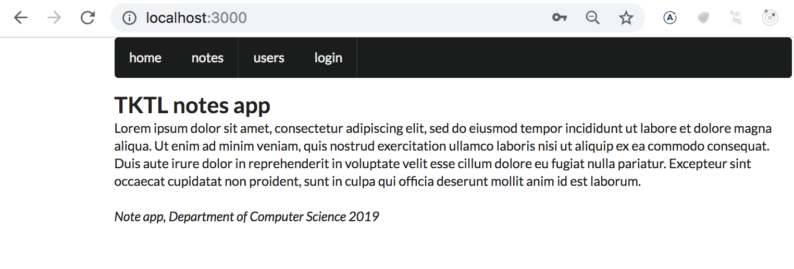

Esimerkin sovelluksen koodi kokonaisuudessaan [täällä](https://github.com/fullstack-hy2019/misc/blob/master/notes-semantic.js).

### Loppuhuomioita

Ero react-bootstrapin ja semantic-ui-reactin välillä ei ole suuri. On makuasia kummalla tuotettu ulkoasu on tyylikkäämpi. Oma vuosia kestäneen bootstrapin käytön jälkeinen siirtymiseni semanticiin johtuu semanticin saumattomammasta React-tuesta, laajemmasta valmiiden komponenttien valikoimasta ja paremmasta sekä selkeämmästä dokumentaatiosta. Semantic UI projektin kehitystyön jatkuvuuden suhteen on kuitenkin viime aikoina ollut ilmoilla muutamia [kysymysmerkkejä](https://github.com/Semantic-Org/Semantic-UI/issues/6109), ja tilannetta kannattaakin seurata.

Esimerkissä käytettiin UI-frameworkeja niiden React-integraatiot tarjoavien kirjastojen kautta.

Sen sijaan että käytimme kirjastoa [React bootstrap](https://react-bootstrap.github.io/), olisimme voineet aivan yhtä hyvin käyttää Bootstrapia suoraan, liittämällä HTML-elementteihin CSS-luokkia. Eli sen sijaan että määrittelimme esim. taulukon komponentin <i>Table</i> avulla

```js
<Table striped>
  // ...
</Table>
```

olisimme voineet käyttää normaalia HTML:n taulukkoa <i>table</i> ja CSS-luokkaa

```js
<table className="table striped">
  // ...
</table>
```

Taulukon määrittelyssä React bootstrapin tuoma etu ei ole suuri.

Tiiviimmän ja ehkä paremmin luettavissa olevan kirjoitusasun lisäksi toinen etu React-kirjastoina olevissa UI-frameworkeissa on se, että kirjastojen mahdollisesti käyttämä Javascript-koodi on sisällytetty React-komponentteihin. Esim. osa Bootstrapin komponenteista edellyttää toimiakseen muutamaakin ikävää [Javascript-riippuvuutta](https://getbootstrap.com/docs/4.1/getting-started/introduction/#js) joita emme mielellään halua React-sovelluksiin sisällyttää.

React-kirjastoina tarjottavien UI-frameworkkien ikävä puoli verrattuna frameworkin "suoraan käyttöön" on React-kirjastojen API:n mahdollinen epästabiilius ja osittain huono dokumentaatio. Tosin [react-semanticin](https://react.semantic-ui.com) suhteen tilanne on paljon parempi kuin monien muiden UI-frameworkien sillä kyseessä on virallinen React-integraatio.

Kokonaan toinen kysymys on se kannattaako UI-frameworkkeja ylipäätän käyttää. Kukin muodostakoon oman mielipiteensä, mutta CSS:ää taitamattomalle ja puutteellisilla design-taidoilla varustetulle ne ovat varsin käyttökelpoisia työkaluja.

### Muita UI-frameworkeja

Luetellaan tässä kaikesta huolimatta muitakin UI-frameworkeja. Jos oma suosikkisi ei ole mukana, tee pull request

- <http://www.material-ui.com/>
- <https://bulma.io/>
- <https://ant.design/>
- <https://foundation.zurb.com/>

### Styled components

Tapoja liittää tyylejä React-sovellukseen on jo näkemiämme lisäksi [muitakin](https://blog.bitsrc.io/5-ways-to-style-react-components-in-2019-30f1ccc2b5b).

Mielenkiintoisen näkökulman tyylien määrittelyyn tarjoaa ES6:n [tagged template literal](https://developer.mozilla.org/en-US/docs/Web/JavaScript/Reference/Template_literals) -syntaksia hyödyntävä [styled components](https://www.styled-components.com/) -kirjasto.

Tehdään styled-componentsin avulla esimerkkisovellukseemme muutama tyylillinen muutos. Tehdään ensin kaksi tyylimäärittelyyn käytettävää komponenttia:

```js
import styled from 'styled-components'

const Button = styled.button`
  background: Bisque;
  font-size: 1em;
  margin: 1em;
  padding: 0.25em 1em;
  border: 2px solid Chocolate;
  border-radius: 3px;
`

const Input = styled.input`
  margin: 0.25em;
`
```

Koodi luo HTML:n elementeistä <i>button</i> ja <i>input</i> tyyleillä rikastetut versiot ja sijoitetaan ne muuttujiin <i>Button</i> ja <i>Input</i>:

Tyylien määrittelyn syntaksi on varsin mielenkiintoinen, css-määrittelyt asetetaan backtick-hipsujen sisään.

Määritellyt komponentit toimivat kuten normaali <i>button</i> ja <i>input</i> ja sovelluksessa käytetään niitä  normaaliin tapaan:

```js
const Login = (props) => {
  // ...
  return (
    <div>
      <h2>login</h2>
      <form onSubmit={onSubmit}>
        <div>
          username:
          <Input /> // highlight-line
        </div>
        <div>
          password:
          <Input type='password' /> // highlight-line
        </div>
        <Button type="submit" primary=''>login</Button> // highlight-line
      </form>
    </div>
  )
}
```

Määritellään vielä seuraavat tyylien lisäämiseen tarkoitetut komponentit, jotka ovat kaikki rikastettuja versioita <i>div</i>-elementistä:

```js
const Page = styled.div`
  padding: 1em;
  background: papayawhip;
`

const Navigation = styled.div`
  background: BurlyWood;
  padding: 1em;
`

const Footer = styled.div`
  background: Chocolate;
  padding: 1em;
  margin-top: 1em;
`
```

Otetaan uudet komponentit käyttöön sovelluksessa:

```js
const App = () => {
  // ...

  return (
    <Page> // highlight-line
      <Router>
        <div>
          <Navigation> // highlight-line
            <Link style={padding} to="/">home</Link>
            <Link style={padding} to="/notes">notes</Link>
            <Link style={padding} to="/users">users</Link>
            {user
              ? <em>{user} logged in</em>
              : <Link to="/login">login</Link>
            }
          </Navigation>

          <Route exact path="/" render={() => <Home />} />
          <Route exact path="/notes" render={() =>
            <Notes notes={notes} />}
          />
          <Route exact path="/notes/:id" render={({ match }) =>
            <Note note={noteById(match.params.id)} />}
          />
          <Route path="/users" render={() =>
            user ? <Users /> : <Redirect to="/login" />
          } />
          <Route path="/login" render={() =>
            <Login onLogin={login} />}
          />
        </div>
      </Router>
      <Footer> // highlight-line
        <em>Note app, Department of Computer Science 2019</em>
      </Footer>
    </Page>
  )
}
```

Lopputulos on seuraavassa:

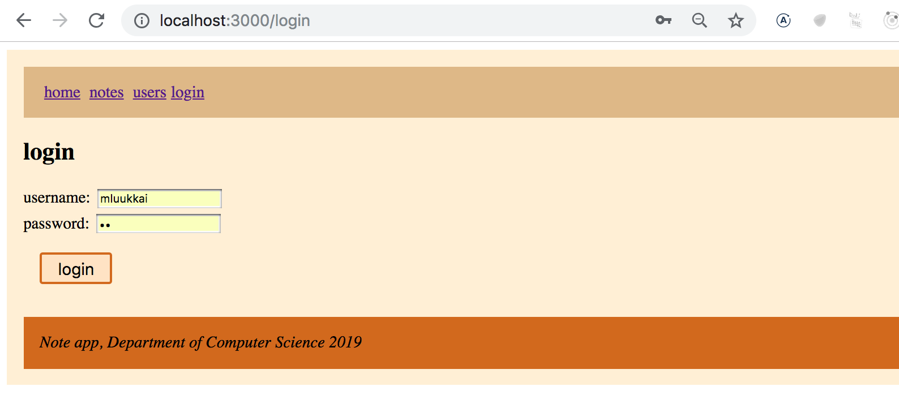

Styled components on nostanut tasaisesti suosiotaan viime aikoina ja tällä hetkellä näyttääkin, että se on melko monien mielestä paras tapa React-sovellusten tyylien määrittelyyn.

</div>

<div class="tasks">

### Tehtäviä

Tämän luvun asioihin liittyvät tehtävät ovat osan lopun [blogilistaa laajentavassa tehtäväsarjassa](/osa7/tehtavia_blogilistan_laajennus).

</div>


<!--

### Komponenttikohtainen CSS ja CSS-moduulit

Tapoja liittää tyylejä React-sovellukseen on jo näkemiämme lisäksi [muitakin](https://blog.bitsrc.io/5-ways-to-style-react-components-in-2019-30f1ccc2b5b). Katsotaan vielä lyhyestä muutamaa tapaa.

On melko yleistä, että React-sovelluksen CSS määritellään useassa eri tiedostossa. Koko sovellusta koskeva CSS saattaa tiedostossa <i>index.js</i> ja sen lisäksi eri komponentteja koskevat määrittelyt tehdään komponenttikohtaisiin tiedostoihin.

Voisimme määritellä esimerkkisovelukselle fontin ja taustavärin tiedostossa <i>index.css</i>

```css
body {
  font-family: -apple-system, BlinkMacSystemFont, "Segoe UI", "Roboto", "Oxygen",
    "Ubuntu", "Cantarell", "Fira Sans", "Droid Sans", "Helvetica Neue",
    sans-serif;
  background: lightgrey;
}
```

ja importata tyylit sovellukseen

```js
import React from 'react'
import ReactDOM from 'react-dom'
import App from './App'
import './index.css'

ReactDOM.render(<App />, document.getElementById('root'));
```

Tämän lisäksi voisimme määritellä komponentille <i>Login</i> oman tyylimäärityksen

```css
button {
  background: Bisque;
  font-size: 1em;
  margin: 1em;
  padding: 0.25em 1em;
  border: 2px solid Chocolate;
  border-radius: 3px;
}

input {
  margin: 0.25em;
}
```

ja importata sen komponentin koodissa

```js
import React from 'react'
import { withRouter } from 'react-router-dom'
import './login.css' // highlight-line

const Login = (props) => {
  // ...
}


export default withRouter(Login)
```

Yksi CSS:n keskeisistä ongelmista on se, että CSS-määrittelyt ovat <i>globaaleja</i>. Suurissa tai jo keskikokoisissakin sovelluksissa tämä aiheuttaa ongelmia, sillä tiettyihin komponentteihin vaikuttavat monissa paikoissa määritellyt tyylit ja lopputulos voi olla vaikeasti ennakoitavissa.

Oletetaan, että nyt haluaisimme lisätä komponenttiin <i>Note</i> painikkeen jolla on oma tyylinsä. Määritellään tyyli tiedostoon <i>note.css</i>

```css
button {
  font-size: 2em;
  margin: 1em;
  padding: 0.25em 1em;
  border: 2px solid black;
  border-radius: 1px;
}
```

ja importataan se komponentin koodista

```css
import React from 'react'
import './note.css' // highlight-line

const Note = ({ note }) => {
  return (
    <div>
      <h2>{note.content}</h2>
      <div>{note.user}</div>
      <div><strong>{note.important ? 'tärkeä' : ''}</strong></div>
      <button>merkitse tärkeäksi</button> // highlight-line
    </div>
  )
}
```

Lopputulos ei kuitenkaan ole haluamamme kaltainen. Koska molemmat komponentit asettavat tyylit button-elementille, käykin niin että myöhemmin määritelty ylikirjoittaa aiemmin määritellyn, ja molempien tyyli on sama.

Perinteinen tapa kiertää ongelma on ollut käyttää monimutkaisempia CSS-luokan nimiä, esim. _Login_button_ ja _Note_button_, tämä muuttuu kuitenkin jossain vaiheessa varsin hankalaksi.

[CSS-moduulit](https://github.com/css-modules/css-modules) tarjoaa tähän erään ratkaisun.

Lyhyesti ilmaisten periaatteena on tehdä CSS-määrittelyistä lähtökohtaisesti lokaaleja, vain yhden komponentin kontekstissa voimassa olevia, joka taas mahdollistaa luontevien CSS-luokkanimien käytön. Käytännössä tämä lokaalius toteutetaan generoimalla konepellin alla CSS-luokille uniikit luokkanimet.

Muutetaan tyylejä käyttäviä komponentteja hiukan:

```js
import styles from './Hello.css'

const Hello = ({ counter }) => (
  <p className={styles.content}>
    hello webpack {counter} clicks!
  </p>
)

export default Hello
```

Erona siis edelliseen on se, että tyyliit "sijoitetaan muuttujaan" _styles_

```js
import styles from './Hello.css';
```

Nyt tyylitiedoston määrittelelyihin voi viitata muuttujan _styles_ kautta, ja CSS-luokan liittäminen tapahtuu seuraavasti

```js
<p className={styles.content}>
```

-->
