<div class="content">

## Tehtävät

Melkein kaikki osan 7 [tehtävistä](/tehtävät#osa7) ovat koko kurssin sisältöä kertaavia, voit aloittaa tehtävien tekemisen vaikka heti, vain muutama tehtävistä edellyttää tämän osan teorian läpikäyntiä.

## Webpack

React on ollut jossain määrin kuuluisa siitä, että sovelluskehityksen edellyttämien työkalujen konfigurointi on ollut hyvin hankalaa. Kiitos [create-react-app](https://github.com/facebookincubator/create-react-app):in, sovelluskehitys Reactilla on kuitenkin nykyään tuskatonta, parempaa työskentelyflowta on tuskin ollut koskaan Javascriptillä tehtävässä selainpuolen sovelluskehityksessä.

Emme voi kuitenkaan turvautua ikuisesti create-react-app:in magiaan ja nyt onkin aika selvittää mitä kaikkea taustalla on. Avainasemassa React-sovelluksen toimintakuntoon saattamisessa on [webpack](https://webpack.js.org/)-niminen työkalu.

### bundlaus

Olemme toteuttaneet sovelluksia jakamalla koodin moduuleihin, joita on _importattu_ niitä tarvitseviin paikkoihin. Vaikka ES6-moduulit ovatkin Javascript-standardissa määriteltyjä, ei mikään selain vielä osaa käsitellä moduuleihin jaettua koodia.

Selainta varten moduuleissa oleva koodi _bundlataan_, eli siitä muodostetaan yksittäinen, kaiken koodin sisältävä tiedosto. Kun veimme Reactilla toteutetun frontendin tuotantoon osan 3 luvussa [Frontendin tuotantoversio](/osa3#frontendin-tuotantoversio), suoritimme bundlauksen komennolla _npm run build_. Konepellin alla kyseinen npm-skripti suorittaa bundlauksen webpackia hyväksi käyttäen. Tuloksena on joukko hakemistoon _build_ sijoitettavia tiedostoja:

<pre>
├── asset-manifest.json
├── favicon.ico
├── index.html
├── manifest.json
├── service-worker.js
└── static
    ├── css
    │   ├── main.1b1453df.css
    │   └── main.1b1453df.css.map
    └── js
        ├── main.54f11b10.js
        └── main.54f11b10.js.map
</pre>

Hakemiston juuressa oleva sovelluksen "päätiedosto" _index.html_ lataa _script_-tagin avulla bundlatun Javascript-tiedoston:

```html
<!DOCTYPE html>
<html lang="en">
  <head>
    <meta charset="utf-8" />
    <title>React App</title>
    <link href="/static/css/main.1b1453df.css" rel="stylesheet" />
  </head>
  <body>
    <div id="root"></div>
    <script type="text/javascript" src="/static/js/main.54f11b10.js"></script>
  </body>
</html>
```

Kuten esimerkistä näemme, create-react-app:illa tehdyssä sovelluksessa bundlataan Javascriptin lisäksi sovelluksen CSS-määrittelyt tiedostoon _static/css/main.1b1453df.css_

Käytännössä bundlaus tapahtuu siten, että sovelluksen Javascriptille määritellään alkupiste, usein tiedosto _index.js_, ja bundlauksen yhteydessä webpack ottaa mukaan kaiken koodin mitä alkupiste importtaa, sekä importattujen koodien importtaamat koodit, jne.

Koska osa importeista on kirjastoja, kuten React, Redux ja Axios, bundlattuun javascript-tiedostoon tulee myös kaikkien näiden sisältö.

> Vanha tapa jakaa sovelluksen koodi moneen tiedostoon perustui siihen, että _index.html_ latasi kaikki sovelluksen tarvitsemat erilliset Javascript-tiedostot script-tagien avulla. Tämä on kuitenkin tehotonta, sillä jokaisen tiedoston lataaminen aiheuttaa pienen overheadin ja nykyään pääosin suositaankin koodin bundlaamista yksittäiseksi tiedostoksi.

Tehdään nyt React-projektille sopiva webpack-konfiguraatio kokonaan käsin.

Luodaan projektia varten hakemisto ja sen sisälle seuraavat hakemistot (dist ja src) sekä tiedostot:

<pre>
├── dist
├── package.json
├── src
│   └── index.js
└── webpack.config.js
</pre>

Tiedoston _package.json_ sisältö voi olla esim. seuraava:

```json
{
  "name": "webpack-osa7",
  "version": "0.0.1",
  "description": "practising webpack",
  "scripts": {},
  "license": "MIT"
}
```

Asennetaan webpack komennolla

```bash
npm install --save-dev webpack webpack-cli
```

Webpackin toiminta konfiguroidaan tiedostoon _webpack.config.js_, laitetaan sen alustavaksi sisällöksi seuraava

```bash
const path = require('path')

const config = {
  entry: './src/index.js',
  output: {
    path: path.resolve(__dirname, 'dist'),
    filename: 'main.js'
  }
}
module.exports = config
```

Määritellään sitten npm-skripti _build_ jonka avulla bundlaus suoritetaan

```bash
// ...
"scripts": {
  "build": "webpack --mode=development"
},
// ...
```

Lisätään hieman koodia tiedostoon _src/index.js_:

```js
const hello = name => {
  console.log(`hello ${name}`);
};
```

Kun nyt suoritamme komennon _npm run build_ webpack bundlaa koodin. Tuloksena on hakemistoon _dist_ sijoitettava tiedosto _main.js_:

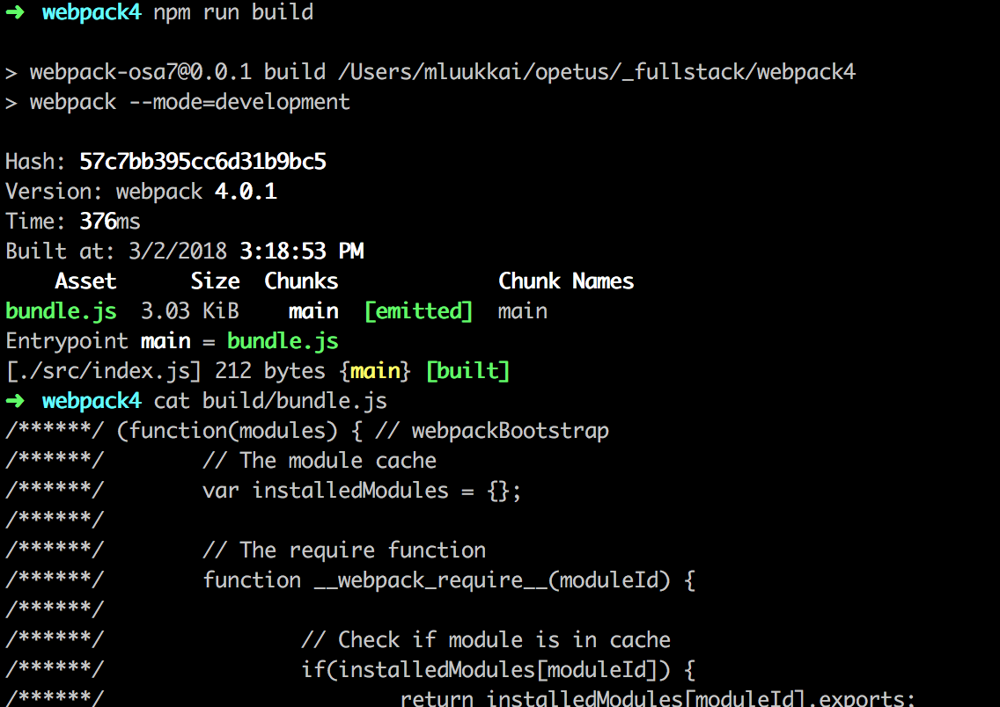

Tiedostossa on paljon erikoisen näköistä tavaraa. Lopussa on mukana myös kirjoittamamme koodi.

Lisätään hakemistoon _src_ tiedosto _App.js_ ja sille sisältö

```js
const App = () => {
  return null;
};

export default App;
```

Importataan ja käytetään modulia _App_ tiedostossa _index.js_

```js
import App from './App';

const hello = name => {
  console.log(`hello ${name}`);
};

App();
```

Kun nyt suoritamme bundlauksen komennolla _npm run build_ huomaamme webpackin havainneen molemmat tiedostot:

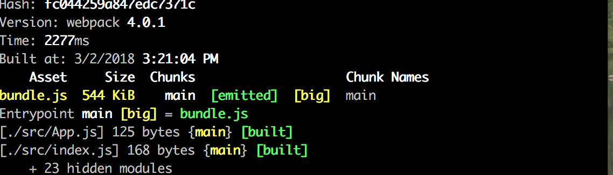

Kirjoittamamme koodi löytyy melko kryptisesti muotoiltuna bundlen lopussa:

```js
/***/ "./src/App.js":
/*!********************!*\
  !*** ./src/App.js ***!
  \********************/
/*! exports provided: default */
/***/ (function(module, __webpack_exports__, __webpack_require__) {

"use strict";
eval("__webpack_require__.r(__webpack_exports__);\nconst App = () => {\n  return null;\n};\n\n/* harmony default export */ __webpack_exports__[\"default\"] = (App);\n\n//# sourceURL=webpack:///./src/App.js?");

/***/ }),

/***/ "./src/index.js":
/*!**********************!*\
  !*** ./src/index.js ***!
  \**********************/
/*! no exports provided */
/***/ (function(module, __webpack_exports__, __webpack_require__) {

"use strict";
eval("__webpack_require__.r(__webpack_exports__);\n/* harmony import */ var _App__WEBPACK_IMPORTED_MODULE_0__ = __webpack_require__(/*! ./App */ \"./src/App.js\");\n\n\nconst hello = name => {\n  console.log(`hello ${name}`);\n};\n\nObject(_App__WEBPACK_IMPORTED_MODULE_0__[\"default\"])();\n\n//# sourceURL=webpack:///./src/index.js?");
```

### Konfiguraatiotiedosto

Katsotaan nyt tarkemmin konfiguraation _webpack.config.js_ tämänhetkistä sisältöä:

```js
const path = require('path');

const config = {
  entry: './src/index.js',
  output: {
    path: path.resolve(__dirname, 'dist'),
    filename: 'main.js',
  },
};
module.exports = config;
```

Konfiguraatio on Javascriptia ja tapahtuu eksporttaamalla määrittelyt sisältävä olio Noden moduulisyntaksilla.

Tämän hetkinen minimaalinen määrittely on aika ilmeinen, kenttä [entry](https://webpack.js.org/concepts/#entry) kertoo sen tiedoston, mistä bundlaus aloitetaan.

Kenttä [output](https://webpack.js.org/concepts/#output) taas kertoo minne muodostettu bundle sijoitetaan. Kohdehakemisto täytyy määritellä _absoluuttisena polkuna_, se taas onnistuu helposti [path.resolve](https://nodejs.org/docs/latest-v8.x/api/path.html#path_path_resolve_paths)-metodilla. [\_\_dirname](https://nodejs.org/docs/latest/api/globals.html#globals_dirname) on Noden globaali muuttuja, joka viittaa nykyiseen hakemistoon.

### Webpack 4

Helmikuun viimeisten päivien aikana julkaistu Webpackin versio 4 on vähentänyt välttämättömän konfiguroinnin määrää määrittelemällä Webpackille joukon oletusarvoisia konfiguraatioita.

Konfiguraatiossamme _entryllä_ ja _outputilla_ on niiden oletusarvo, eli voisimme myös jättää ne määrittelemättä, ja tiedoston _webpack.config.js_ sisällöksi kävisi:

```js
const config = {};
module.exports = config;
```

Jätämme kuitenkin _entryn_ ja _outputin_ määrittelyt tiedostoon.

### Reactin bundlaaminen

Muutetaan sitten sovellus minimalistiseksi React-sovellukseksi. Asennetaan tarvittavat kirjastot

```bash
npm install --save react react-dom
```

Liitetään tavanomaiset loitsut tiedostoon _index.js_

```js
import React from 'react';
import ReactDOM from 'react-dom';
import App from './App';

ReactDOM.render(<App />, document.getElementById('root'));
```

ja muutetaan _App.js_ muotoon

```react
import React from 'react'

const App = () => (
  <div>hello webpack</div>
)

export default App
```

Tarvitsemme sovellukselle myös "pääsivuna" toimivan tiedoston _dist/index.html_ joka lataa _script_-tagin avulla bundlatun Javascriptin:

```html
<!DOCTYPE html>
<html lang="en">
  <head>
    <meta charset="utf-8" />
    <title>React App</title>
  </head>
  <body>
    <div id="root"></div>
    <script type="text/javascript" src="./main.js"></script>
  </body>
</html>
```

Kun bundlaamme sovelluksen, törmäämme kuitenkin ongelmaan


### Loaderit

Webpack mainitsee että saatamme tarvita _loaderin_ tiedoston _App.js_ käsittelyyn. Webpack ymmärtää itse vain Javascriptia ja vaikka se saattaa meiltä matkan varrella olla unohtunutkin, käytämme Reactia ohjelmoidessamme [JSX](https://facebook.github.io/jsx/):ää näkymien renderöintiin, eli esim. seuraava

```react
const App = () => (
  <div>hello webpack</div>
)
```

ei ole "normaalia" Javascriptia, vaan JSX:n tarjoama syntaktinen oikotie määritellä _div_-tagiä vastaava React-elementti.

[Loaderien](https://webpack.js.org/concepts/loaders/) avulla on mahdollista kertoa webpackille miten tiedostot tulee käsitellä ennen niiden bundlausta.

Määritellään projektiimme Reactin käyttämän JSX:n normaaliksi Javascriptiksi muuntava loaderi:

```js
const config = {
  entry: './src/index.js',
  output: {
    path: path.resolve(__dirname, 'dist'),
    filename: 'main.js',
  },
  module: {
    rules: [
      {
        test: /\.js$/,
        loader: 'babel-loader',
        query: {
          presets: ['react'],
        },
      },
    ],
  },
};
```

Loaderit määritellään kentän _module_ alle sijoitettavaan taulukkoon _rules_.

Yksittäisen loaderin määrittely on kolmiosainen:

```js
{
  test: /\.js$/,
  loader: 'babel-loader',
  query: {
    presets: ['react']
  }
}
```

Kenttä _test_ määrittelee että käsitellään _.js_-päätteisiä tiedostoja, _loader_ kertoo että käsittely tapahtuu [babel-loader](https://github.com/babel/babel-loader):illa. Kenttä _query_ taas antaa loaderille sen toimintaa ohjaavia parametreja.

Asennetaan loader ja sen tarvitsemat kirjastot _kehitysaikaiseksi riippuvuudeksi_:

```bash
npm install --save-dev babel-core babel-loader babel-preset-react
```

Nyt bundlaus onnistuu.

Jos katsomme bundlattua koodia, huomaamme, että komponentti _App_ on muuttunut muotoon

```js
const App = () =>
  react__WEBPACK_IMPORTED_MODULE_0___default.a.createElement(
    'div',
    null,
    'hello webpack'
  );
```

Eli JSX-syntaksin sijaan komponentit luodaan pelkällä Javascriptilla käyttäen Reactin funktiota [createElement](https://reactjs.org/docs/react-without-jsx.html).

Sovellusta voi nyt kokeilla avaamalla tiedoston dist/index.html* selaimen \_open file* -toiminnolla:

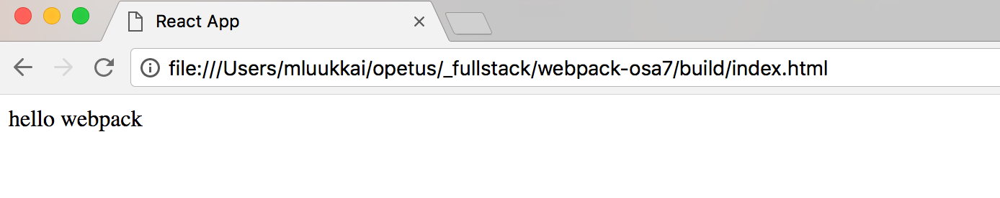

Tässä on jo melkein kaikki mitä tarvitsemme React-sovelluskehitykseen.

### Transpilaus

Prosessista, joka muuttaa Javascriptia muodosta toiseen käytetään englanninkielistä termiä [transpiling](https://en.wiktionary.org/wiki/transpile), joka taas on termi, joka viittaa koodin kääntämiseen (compile) sitä muuntamalla (transform). Suomenkielisen termin puuttuessa käytämme prosessista tällä kurssilla nimitystä _transpilaus_.

Edellisen luvun konfiguraation avulla siis _transpiloimme_ JSX:ää sisältävän Javascriptin normaaliksi Javascriptiksi tämän hetken johtavan työkalun [babelin](https://babeljs.io/) avulla.

Kuten osassa 1 jo mainittiin, läheskään kaikki selaimet eivät vielä osaa Javascriptin uusimpien versioiden ES6:n ja ES7:n ominaisuuksia ja tämän takia koodi yleensä transpiloidaan käyttämään vanhempaa Javascript-syntaksia ES5:ttä.

Babelin suorittama transpilointiprosessi määritellään _pluginien_ avulla. Käytännössä useimmiten käytetään valmiita [presetejä](https://babeljs.io/docs/plugins/), eli useamman sopivan pluginin joukkoja.

Tällä hetkellä sovelluksemme transpiloinnissa käytetään presetiä [react](https://babeljs.io/docs/plugins/preset-react/):

```js
{
  test: /\.js$/,
  loader: 'babel-loader',
  query: {
    presets: ['react']
  }
}
```

Otetaan käyttöön preset [env](https://babeljs.io/docs/plugins/preset-env/), joka sisältää kaiken hyödyllisen, minkä avulla uusimman standardin mukainen koodi saadaan transpiloitua ES5-standardin mukaiseksi koodiksi:

```js
{
  test: /\.js$/,
  loader: 'babel-loader',
  query: {
    presets: ['env', 'react']
  }
}
```

Preset asennetaan komennolla

```js
npm install babel-preset-env --save-dev
```

Kun nyt transpiloimme koodin, muuttuu se vanhan koulukunnan Javascriptiksi. Komponentin _App_ määrittely näyttää seuraavalta:

```js
var App = function App() {
  return _react2.default.createElement('div', null, 'hello webpack');
};
```

Muuttujan määrittely tapahtuu avainsanan _var_ avulla, sillä ES5 ei tunne avainsanaa _const_. Myöskään nuolifunktiot eivät ole käytössä, joten funktiomäärittely käyttää avainsanaa _function_.

### CSS

Lisätään sovellukseemme hieman CSS:ää. Tehdään tiedosto _src/index.css_

```css
.container {
  margin: 10;
  background-color: #dee8e4;
}
```

Määritellään tyyli käytettäväksi komponentissa _App_

```react
const App = () => (
  <div className="container">
    hello webpack
  </div>
)
```

ja importataan se tiedostossa _index.js_

```js
import './index.css';
```

Transpilointi hajoaa, ja CSS:ää varten onkin otettava käyttöön [css](https://webpack.js.org/loaders/css-loader/)- ja [style](https://webpack.js.org/loaders/style-loader/)-loaderit:

```js
{
  rules: [
    {
      test: /\.js$/,
      loader: 'babel-loader',
      query: {
        presets: ['env', 'react'],
      },
    },
    {
      test: /\.css$/,
      loaders: ['style-loader', 'css-loader'],
    },
  ];
}
```

[css-loaderin](https://webpack.js.org/loaders/css-loader/) tehtävänä on ladata _CSS_-tiedostot, ja [style-loader](https://webpack.js.org/loaders/style-loader/) generoi koodiin CSS:t sisältävän _style_-elementin.

Näin konfiguroituna CSS-määrittelyt sisällytetään sovelluksen Javascriptin sisältävään tiedostoon _main.js_. Sovelluksen päätiedostossa _index.html_ ei siis ole tarvetta erikseen ladata CSS:ää.

CSS voidaan tarpeen vaatiessa myös generoida omaan tiedostoonsa esim. [mini-css-extract-pluginin](https://github.com/webpack-contrib/mini-css-extract-plugin) avulla.

Kun loaderit asennetaan

```bash
npm install style-loader css-loader --save-dev
```

bundlaus toimii taas ja sovellus saa uudet tyylit.

### Webpack-dev-server

Sovelluskehitys onnistuu jo, mutta development workflow on suorastaan hirveä (alkaa jo muistuttaa Javalla tapahtuvaa sovelluskehitystä...), muutosten jälkeen koodin on bundlattava ja selain uudelleenladattava jos haluamme testata koodia.

Ratkaisun tarjoaa [webpack-dev-server](https://webpack.js.org/guides/development/#using-webpack-dev-server). Asennetaan se komennolla

```bash
npm install --save-dev webpack-dev-server
```

Määritellään dev-serverin käynnistävä npm-skripti:

```bash
{
  // ...
  "scripts": {
    "build": "webpack --mode=development",
    "start": "webpack-dev-server --mode=development"
  },
  // ...
}
```

Lisätään tiedostoon _webpack.config.js_ kenttä _devServer_

```js
const config = {
  entry: './src/index.js',
  output: {
    path: path.resolve(__dirname, 'dist'),
    filename: 'main.js',
  },
  devServer: {
    contentBase: path.resolve(__dirname, 'dist'),
    compress: true,
    port: 3000,
  },
  // ...
};
```

Komento _npm start_ käynnistää nyt dev-serverin porttiin, eli sovelluskehitys tapahtuu avaamalla tuttuun tapaan selain osoitteeseen <http://localhost:3000>. Kun teemme koodiin muutoksia, reloadaa selain automaattisesti itsensä.

Päivitysprosessi on nopea, dev-serveriä käytettäessä webpack ei bundlaa koodia normaaliin tapaan tiedostoksi _main.js_, bundlauksen tuotos on olemassa ainoastaan keskusmuistissa.

Laajennetaan koodia muuttamalla komponentin _App_ määrittelyä seuraavasti:

```react
class App extends React.Component {
  constructor() {
    super()
    this.state = {
      counter: 0
    }
  }

  render() {
    return (
      <div className="container">
        <p>hello webpack {this.state.counter} clicks</p>
        <button onClick={()=>this.setState({counter: this.state.counter+1})}>click</button>
      </div>
    )
  }
}
```

Kannattaa huomata, että virheviestit eivät renderöidy selaimeen kuten create-react-app:illa tehdyissä sovelluksissa, eli on seurattava tarkasti konsolia:


Sovellus toimii hyvin ja kehitys on melko sujuvaa.

### Sourcemappaus

Erotetaan napin klikkauksenkäsittelijä omaksi funktioksi:

```react
class App extends React.Component {
  constructor() {
    super()
    this.state = {
      counter: 0
    }
  }

  onClick() {
    this.setState({ counter: this.state.counter + 1 })
  }

  render() {
    return (
      <div className="container">
        <p>hello webpack {this.state.counter} clicks</p>
        <button onClick={this.onClick}>click</button>
      </div>
    )
  }
}
```

Sovellus ei enää toimi, ja konsoli kertoo virheestä


Tiedämme tietenkin nyt että virhe on metodissa onClick, mutta jos olisi kyse suuremmasta sovelluksesta, on virheilmoitus sikäli hyvin ikävä, että sen ilmoittama paikka:

<pre>
App.js:38 Uncaught TypeError: Cannot read property 'setState' of undefined
    at onClick (App.js:38)
</pre>

ei vastaa alkuperäisen koodin virheen sijaintia. Jos klikkaamme virheilmoitusta, huomaamme, että näytettävä koodi on jotain ihan muuta kuin kirjoittamamme koodi:

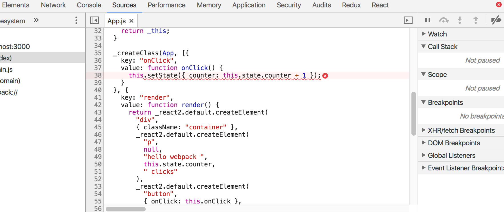

Haluamme tietenkin, että virheilmoitusten yhteydessä näytetään kirjoittamamme koodi.

Korjaus on onneksi hyvin helppo, pyydetään webpackia generoimaan bundlelle ns. [source map](https://webpack.js.org/configuration/devtool/), jonka avulla bundlea suoritettaessa tapahtuva virhe on mahdollista _mäpätä_ alkuperäisen koodin vastaavaan kohtaan.

Source map saadaan generoitua lisäämällä konfiguraatioon kenttä _devtool_ ja sen arvoksi 'source-map':

```js
const config = {
  entry: './src/index.js',
  output: {
    // ...
  },
  devServer: {
    // ...
  },
  devtool: 'source-map',
  // ..
};
```

Konfiguraatioiden muuttuessa webpack tulee käynnistää uudelleen, on tosin mahdollista konfiguroida webpack tarkkailemaan konfiguraatioiden muutoksia, mutta emme tee sitä.

Nyt virheilmoitus on hyvä

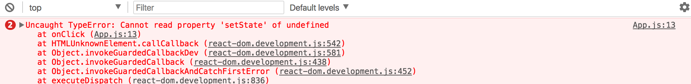

Source mapin käyttö mahdollistaa myös chromen debuggerin luontevan käytön


Kyseinen virhe on siis jo [osasta 1](/osa1#metodien-käyttö-ja-this) tuttu this:in kadottaminen. Korjataan ongelma määrittelemällä metodi uudelleen meille jo kovin tutulla syntaksilla:

```js
onClick = () => {
  this.setState({ counter: this.state.counter + 1 });
};
```

Tästä aiheutuu kuitenkin virheilmoitus

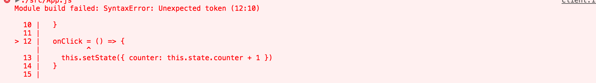

Virhe johtuu siitä, että käyttämämme syntaksi ei ole vielä mukana Javascriptin uusimmassa standardissa ES7. Saamme syntaksin käyttöön asentamalla [transform-class-properties](https://babeljs.io/docs/plugins/transform-class-properties/)-pluginin komennolla

```bash
npm install babel-plugin-transform-class-properties --save-dev
```

ja kehottamalla _babel-loader_:ia käyttämään pluginia:

```js
{
  test: /\.js$/,
  loader: 'babel-loader',
  query: {
    presets: ['env', 'react'],
    plugins: [require('babel-plugin-transform-class-properties')]
  }
}
```

### Koodin minifiointi

Kun sovellus viedään tuotantoon, on siis käytössä tiedostoon _main.js_ webpackin generoima koodi. Vaikka sovelluksemme sisältää omaa koodia vain muutaman rivin, on tiedoston _main.js_ koko 557450 tavua, sillä se sisältää myös kaiken React-kirjaston koodin. Tiedoston koollahan on sikäli väliä, että selain joutuu lataamaan tiedoston kun sovellusta aletaan käyttämään. Nopeilla internetyhteyksillä 557450 tavua ei sinänsä ole ongelma, mutta jos mukaan sisällytetään enemmän kirjastoja, alkaa sovelluksen lataaminen pikkuhiljaa hidastua etenkin mobiilikäytössä.

Jos tiedoston sisältöä tarkastelee, huomaa että sitä voisi optimoida huomattavasti koon suhteen esim. poistamalla kommentit. Tiedostoa ei kuitenkaan kannata lähteä optimoimaan käsin, sillä tarkoitusta varten on olemassa monia työkaluja.

Javascript-tiedostojen optimointiprosessista käytetään nimitystä _minifiointi_. Alan johtava työkalu tällä hetkellä lienee [UglifyJS](http://lisperator.net/uglifyjs/).

Webpackin versiosta 4 alkaen pluginia ei ole tarvinnut konfiguroida erikseen, riittää että muutetaan tiedoston _package.json_ määrittelyä siten, että koodin bundlaus tapahtuu _production_-moodissa:

```json
{
  "name": "webpack-osa7",
  "version": "0.0.1",
  "description": "practising webpack",
  "scripts": {
    "build": "webpack --mode=production",
    "start": "webpack-dev-server --mode=development"
  },
  "license": "MIT",
  "dependencies": {
    // ...
  },
  "devDependencies": {
    // ...
  }
}
```

Kun sovellus bundlataan uudelleen, pienenee tuloksena oleva _main.js_ mukavasti

```bash
-rw-r--r--  1 mluukkai  984178727  101944 Mar  3 21:29 main.js
```

Minifioinnin lopputulos on kuin vanhan liiton c-koodia, kommentit ja jopa turhat välilyönnit ja rivinvaihdot on poistettu ja muuttujanimet ovat yksikirjaimisia:

```js
function h(){if(!d){var e=u(p);d=!0;for(var t=c.length;t;){for(s=c,c=[];++f<t;)s&&s[f].run();f=-1,t=c.length}s=null,d=!1,function(e){if(o===clearTimeout)return clearTimeout(e);if((o===l||!o)&&clearTimeout)return o=clearTimeout,clearTimeout(e);try{o(e)}catch(t){try{return o.call(null,e)}catch(t){return o.call(this,e)}}}(e)}}a.nextTick=function(e){var t=new Array(arguments.length-1);if(arguments.length>1)
```

### Sovelluskehitys- ja tuotantokonfiguraatio

Lisätään sovellukselle backend. Käytetään jo tutuksi käynyttä muistiinpanoja tarjoavaa palvelua.

Talletetaan seuraava sisältö tiedostoon _db.json_

```json
{
  "notes": [
    {
      "important": true,
      "content": "HTML on helppoa",
      "id": "5a3b8481bb01f9cb00ccb4a9"
    },
    {
      "important": false,
      "content": "Mongo osaa tallettaa oliot",
      "id": "5a3b920a61e8c8d3f484bdd0"
    }
  ]
}
```

Tarkoituksena on konfiguroida sovellus webpackin avulla siten, että paikallisesti sovellusta kehitettäessä käytetään backendina portissa 3001 toimivaa json-serveriä.

Bundlattu tiedosto laitetaan sitten käyttämään todellista, osoitteessa <https://radiant-plateau-25399.herokuapp.com/api/notes> olevaa backendia.

Asennetaan _axios_, käynnistetään json-server ja muokataan komponenttia _App_ seuraavasti:

```react
class App extends React.Component {
  constructor() {
    super()
    this.state = {
      counter: 0,
      noteCount: 0
    }
  }

  componentDidMount() {
    axios.get('http://localhost:3001/notes').then(result => {
      this.setState({ noteCount: result.data.length })
    })
  }

  onClick = () => {
    this.setState({ counter: this.state.counter + 1 })
  }

  render() {
    return (
      <div className="container">
        <p>hello webpack {this.state.counter} clicks</p>
        <button onClick={this.onClick}>click</button>
        <p>{this.state.noteCount} notes in server</p>
      </div>
    )
  }
}
```

Koodissa on nyt kovakoodattuna sovelluskehityksessä käytettävän palvelimen osoite. Miten saamme osoitteen hallitusti muutettua osoittamaan internetissä olevaan backendiin bundlatessamme koodin?

Muutetaan _webpack.config.js_ oliosta [funktioksi](https://webpack.js.org/configuration/configuration-types/#exporting-a-function):

```js
const path = require('path');

const config = (env, argv) => {
  return {
    entry: './src/index.js',
    output: {
      // ...
    },
    devServer: {
      // ...
    },
    devtool: 'source-map',
    module: {
      // ...
    },
    plugins: [
      // ...
    ],
  };
};

module.exports = config;
```

Määrittely on muuten täysin sama, mutta aiemmin eksportattu olio on nyt määritellyn funktion paluuarvo. Funktio saa parametrit _env_ ja _argv_, joista jälkimmäisen avulla saamme selville npm-skriptissä määritellyn _moden_.

Webpackin [DefinePlugin](https://webpack.js.org/plugins/define-plugin/):in avulla voimme määritellä globaaleja _vakioarvoja_, joita on mahdollista käyttää bundlattavassa koodissa. Määritellään nyt vakio _BACKEND_URL_, joka saa eri arvon riippuen siitä ollaanko kehitysympäristössä vai tehdäänkö tuotantoon sopivaa bundlea:

```bash
const path = require('path')
const webpack = require('webpack')

const config = (env, argv) => {
  console.log('argv', argv.mode)

  const backend_url = argv.mode === 'production'
    ? 'https://radiant-plateau-25399.herokuapp.com/api/notes'
    : 'http://localhost:3001/notes'

  return {
    entry: './src/index.js',
    output: {
      path: path.resolve(__dirname, 'dist'),
      filename: 'main.js'
    },
    devServer: {
      contentBase: path.resolve(__dirname, "dist"),
      compress: true,
      port: 3000
    },
    devtool: 'source-map',
    module: {
      // ...
    },
    plugins: [
      new webpack.DefinePlugin({
        BACKEND_URL: JSON.stringify(backend_url)
      })
    ]
  }

}

module.exports = config
```

Määriteltyä vakiota käytetään koodissa seuraavasti:

```js
componentDidMount() {
  axios.get(BACKEND_URL)
    .then(result => {
      this.setState({noteCount: result.data.length})
    })
}
```

Jos kehitys- ja tuotantokonfiguraatio eriytyvät paljon, saattaa olla hyvä idea [eriyttää konfiguraatiot](https://webpack.js.org/guides/production/) omiin tiedostoihinsa.

Tuotantoversiota eli bundlattua sovellusta on mahdollista kokeilla lokaalisti suorittamalla komento

```bash
npx static-server
```

hakemistossa _dist_ jolloin sovellus käynnistyy oletusarvoisesti osoitteeseen <http://localhost:9080>.

### Polyfill

Sovelluksemme on valmis ja toimii muiden selaimien kohtuullisen uusilla versiolla, mutta Internet Explorerilla sovellus ei toimi. Syynä tähän on se, että _axiosin_ ansiosta koodissa käytetään [Promiseja](https://developer.mozilla.org/en-US/docs/Web/JavaScript/Reference/Global_Objects/Promise), mikään IE:n versio ei kuitenkaan niitä tue:

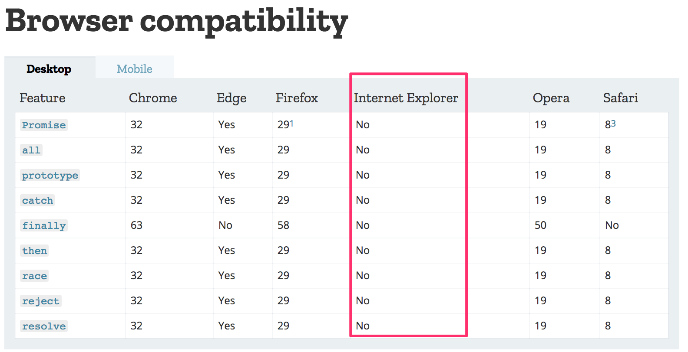

On paljon muutakin standardissa määriteltyjä asioita, joita IE ei tue, esim. niinkin harmiton komento kuin taulukoiden [find](https://developer.mozilla.org/en-US/docs/Web/JavaScript/Reference/Global_Objects/Array/find) ylittää IE:n kyvyt:

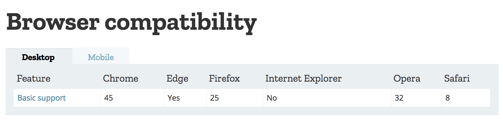

Tälläisessä tilanteessa normaali koodin transpilointi ei auta, sillä transpiloinnissa koodia käännetään uudemmasta Javascript-syntaksista vanhempaan, selaimien paremmin tukemaan syntaksiin. Promiset ovat syntaktisesti täysin IE:n ymmärrettävissä, IE:ltä vain puuttuu toteutus promisesta, samoin on tilanne taulukoiden suhteen, IE:llä taulukoiden _find_ on arvoltaan _undefined_.

Jos haluamme sovelluksen IE-yhteensopivaksi, tarvitsemme [polyfilliä](https://remysharp.com/2010/10/08/what-is-a-polyfill), eli koodia, joka lisää puuttuvan toiminnallisuuden vanhempiin selaimiin.

Polyfillaus on mahdollista hoitaa [Webpackin ja Babelin avulla](https://babeljs.io/docs/usage/polyfill/) tai asentamalla yksi monista tarjolla olevista polyfill-kirjastoista.

Esim. kirjaston [promise-polyfill](https://www.npmjs.com/package/promise-polyfill) tarjoaman polyfillin käyttö on todella helppoa, koodiin lisätään seuraava:

```js
import PromisePolyfill from 'promise-polyfill';

if (!window.Promise) {
  window.Promise = PromisePolyfill;
}
```

Jos globaalia _Promise_-olioa ei ole olemassa, eli selain ei tue promiseja, sijoitetaan polyfillattu promise globaaliin muuttujaan. Jos polyfillattu promise on hyvin toteutettu, muun koodin pitäisi toimia ilman ongelmia.

Kattavahko lista olemassaolevista polyfilleistä löytyy [täältä](https://github.com/Modernizr/Modernizr/wiki/HTML5-Cross-browser-Polyfills).

Selaimien yhteensopivuus käytettävien API:en suhteen kannattaakin tarkistaa esim. [https://caniuse.com](https://caniuse.com)-sivustolta tai [Mozillan sivuilta](https://developer.mozilla.org/en-US/).

### Eject

Create-react-app käyttää taustalla webpackia. Jos peruskonfiguraatio ei riitä, on projektit mahdollista [ejektoida](https://github.com/facebook/create-react-app/blob/master/packages/react-scripts/template/README.md#npm-run-eject), jolloin kaikki konepellin alla oleva magia häviää, ja konfiguraatiot tallettuvat hakemistoon _config_ ja muokattuun _package.json_-tiedostoon.

Jos create-react-app:illa tehdyn sovelluksen ejektoi, paluuta ei ole, sen jälkeen kaikesta konfiguroinnista on huolehdittava itse. Konfiguraatiot eivät ole triviaaleimmasta päästä ja create-react-appin ja ejektoinnin sijaan parempi vaihtoehto saattaa joskus olla tehdä itse koko webpack-konfiguraatio.

Ejektoidun sovelluksen konfiguraatioiden lukeminen on suositeltavaa ja sangen opettavaista!

## Lisää tyyleistä

Osissa 2 ja 6 on jo katsottu muutamaa tapaa tyylien lisäämiseen eli vanhan koulukunnan [yksittäistä CSS](/osa2#tyylien-lisääminen)-tiedostoa, [inline-tyylejä](/osa6#inline-tyylit) ja [UI-frameworkien](/osa6#valmiit-käyttöliittymätyylikirjastot) kuten Bootstrapin käyttöä.

Tapoja on [monia muitakin](https://survivejs.com/react/advanced-techniques/styling-react/), katsotaan vielä lyhyestä kahta tapaa.

### CSS-moduulit

Yksi CSS:n keskeisistä ongelmista on se, että CSS-määrittelyt ovat _globaaleja_. Suurissa tai jo keskikokoisissakin sovelluksissa tämä aiheuttaa ongelmia, sillä tiettyihin komponentteihin vaikuttavat monissa paikoissa määritellyt tyylit ja lopputulos voi olla vaikeasti ennakoitavissa.

Laitoksen [kurssilistasivun](https://www.cs.helsinki.fi/courses) alaosassa on itseasiassa eräs ilmentymä tälläisestä ikävästä bugista

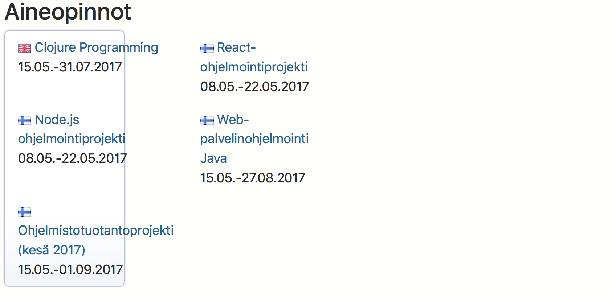

Sivulla on monessa paikassa määriteltyjä tyylejä, osa määrittelyistä tulee Drupal-sisällönhallintajärjestelmän oletuskonfiguraatiosta, osa on Drupaliin laitoksella tehtyjä lisäyksiä, osa taas tulee sivun yläosan olemassaolevaa opetustarjontaa näyttävistä syksyllä lisätyistä komponenteista. Vika on niin hankala korjata, ettei kukaan ole viitsinyt sitä tehdä.

Demonstroidaan vastaavankaltaista ongelmatilannetta esimerkkisovelluksessamme.

Muutetaan esimerkkitiedostoamme siten, että komponentista _App_ irrotetaan osa toiminnallisuudesta komponentteihin _Hello_ ja _NoteCount_:

```react
import './Hello.css'

const Hello = ({ counter }) => (
  <p className="content">
    hello webpack {counter} clicks!
  </p>
)

export default Hello
```

```react
import './NoteCount.css'

const NoteCount = ({ noteCount }) => (
  <p className="content">
    {noteCount} notes in server
  </p>
)

export default NoteCount
```

Molemmat komponentit määrittelevät oman tyylitiedostonsa:

_Hello.css_

```CSS
.content {
  background-color: yellow;
}
```

_NoteCount.css_:

```CSS
.content {
  background-color: blue;
}
```

Koska molemmat komponentit käyttävät samaa CSS-luokan nimeä _content_, käykin niin että myöhemmin määritelty ylikirjoittaa aiemmin määritellyn, ja molempien tyyli on sama:

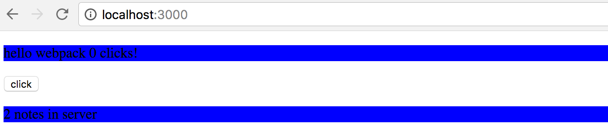

Perinteinen tapa kiertää ongelma on ollut käyttää monimutkaisempia CSS-luokan nimiä, esim. _Hello_container_ ja _NoteCount_container_, tämä muuttuu kuitenkin jossain vaiheessa varsin hankalaksi.

[CSS-moduulit](https://github.com/css-modules/css-modules) tarjoaa tähän erään ratkaisun.

Lyhyesti ilmaisten periaatteena on tehdä CSS-määrittelyistä lähtökohtaisesti lokaaleja, vain yhden komponentin kontekstissa voimassa olevia, joka taas mahdollistaa luontevien CSS-luokkanimien käytön. Käytännössä tämä lokaalius toteutetaan generoimalla konepellin alla CSS-luokille uniikit luokkanimet.

CSS-moduulit voidaan toteuttaa suoraan Webpackin css-loaderin avulla seuraten [sivun](https://www.triplet.fi/blog/practical-guide-to-react-and-css-modules/) ohjetta.

Muutetaan tyylejä käyttäviä komponentteja hiukan:

```react
import styles from './Hello.css'

const Hello = ({ counter }) => (
  <p className={styles.content}>
    hello webpack {counter} clicks!
  </p>
)

export default Hello
```

Erona siis edelliseen on se, että tyyliit "sijoitetaan muuttujaan" _styles_

```js
import styles from './Hello.css';
```

Nyt tyylitiedoston määrittelelyihin voi viitata muuttujan _styles_ kautta, ja CSS-luokan liittäminen tapahtuu seuraavasti

```react
<p className={styles.content}>
```

Vastaava muutos tehdään komponentille _NoteCount_.

Muutetaan sitten Webpackin konfiguraatiossa olevaa _css-loaderin_ määrittelyä siten että se enabloi [CSS-modulit](https://github.com/webpack-contrib/css-loader#modules):

```js
{
  test: /\.css$/,
  loaders: [
    'style-loader',
    'css-loader?modules&importLoaders=1&localIdentName=[name]__[local]___[hash:base64:5]&sourceMap&-minimize'
  ]
}
```

Nyt molemmat komponentit saavat omat tyylinsä. Konsolista tarkastelemalla huomaamme, että komponenttien luokille on generoitunut webpackin css-loaderin generoimat uniikit nimet:

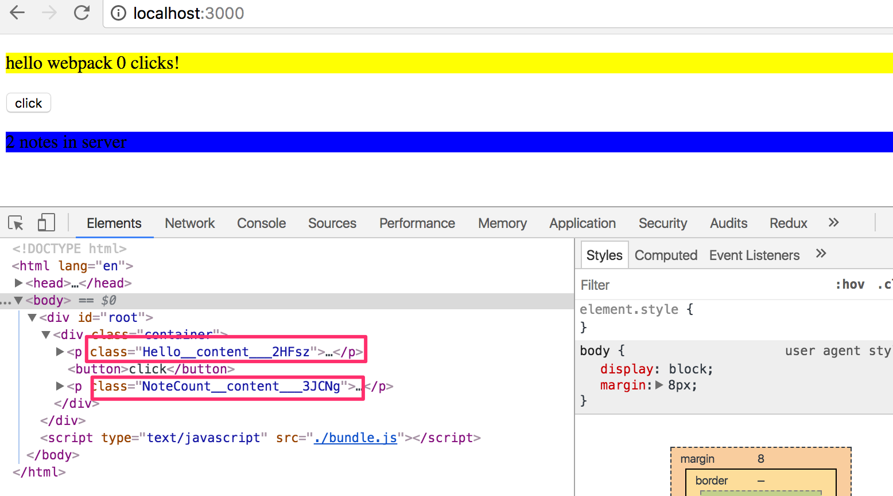

CSS-luokan nimen muotoileva osa on _css-loaderin_ yhteydessä oleva

<pre>
localIdentName=[name]\_\_[local]\_\_\_[hash:base64:5]
</pre>

Jos olet aikeissa käyttää CSS-moduuleja, kannattaa vilkaista mitä kirjasto [react-css-modules](https://github.com/gajus/react-css-modules) tarjoaa.

### Styled components

Mielenkiintoisen näkökulman tyylien määrittelyyn tarjoaa ES6:n [tagged template literal](https://developer.mozilla.org/en-US/docs/Web/JavaScript/Reference/Template_literals) -syntaksia hyödyntävä [styled components](https://www.styled-components.com/) -kirjasto.

Tehdään styled-componentsin avulla esimerkkisovellukseemme muutama tyylillinen muutos:

```bash
import styled from 'styled-components'

const Button = styled.button `
  font-size: 1em;
  margin: 1em;
  padding: 0.25em 1em;
  border: 2px solid black;
  border-radius: 3px;
`

const Hello = ({ className, counter }) => (
  <p className={className}>
    hello webpack {counter} clicks
  </p>
)

const StyledHello = styled(Hello) `
  color: blue;
  font-weight: bold;
`

class App extends React.Component {
  //...

  render() {
    return (
      <div>
        <StyledHello counter={this.state.counter} />
        <Button onClick={this.onClick}>click</Button>
      </div>
    )
  }
}
```

Heti alussa luodaan HTML:n _button_-elementistä jalostettu versio ja sijoitetaan se muuttujaan _Button_:

```js
const Button = styled.button`
  font-size: 1em;
  margin: 1em;
  padding: 0.25em 1em;
  border: 2px solid black;
  border-radius: 3px;
`;
```

Tyylien määrittelyn syntaksi on varsin mielenkiintoinen.

Määritelty komponentti toimii kuten normaali _button_ ja sovellus renderöi sen normaaliin tapaan:

```html
<button onClick="{this.onClick}">click</button>
```

Seuraavaksi koodi määrittelee normaalin React-komponentin

```react
const Hello = ({ className, counter }) => (
  <p className={className}>
    hello webpack {counter} clicks
  </p>
)
```

ja lisää tälle tyylit metodin _styled_ avulla:

```js
const StyledHello = styled(Hello)`
  color: blue;
  font-weight: bold;
`;
```

Muuttujaan _StyledHello_ sijoitettua tyyleillä jalostettua komponenttia käytetään kuten alkuperäistä:

```bash
<StyledHello counter={this.state.counter} />
```

Sovelluksen ulkoasu seuraavassa:

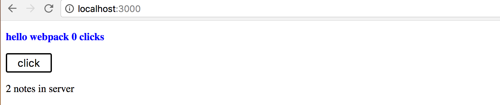

## Sovelluksen end to end -testaus

Palataan vielä hetkeksi testauksen pariin. Aiemmissa osissa teimme sovelluksille yksikkötestejä sekä integraatiotestejä. Katsotaan nyt erästä tapaa tehdä [järjestelmää kokonaisuutena](https://en.wikipedia.org/wiki/System_testing) tutkivia _End to End (E2E) -testejä_.

Web-sovellusten E2E-testaus tapahtuu simuloidun selaimen avulla esimerkiksi [Selenium](http://www.seleniumhq.org/)-kirjastoa käyttäen. Toinen vaihtoehto on käyttää ns. [headless browseria](https://en.wikipedia.org/wiki/Headless_browser) eli selainta, jolla ei ole ollenkaan graafista käyttöliittymää.

Chrome-selain on jo hetken sisältänyt [headless](https://developers.google.com/web/updates/2017/04/headless-chrome)-moodin. Käytetään nyt headless chromea sille Node API:n tarjoavan [Puppeteer](https://github.com/GoogleChrome/puppeteer)-kirjaston avulla.

Tehdään muutama testi osan 3 muistiinpanosovelluksen ["Full stack"-versiolle](/osa3#sovellus-internettiin), joka sisältää sekä backendin että frontin samassa projektissa.

Asennetan puppeteer komennolla

```bash
npm install puppeteer --save-dev
```

Ennen testejä, tehdään kokeiluja varten tiedosto _puppeteer.js_ ja sille seuraava sisältö

```js
const puppeteer = require('puppeteer');

const main = async () => {
  const browser = await puppeteer.launch();
  const page = await browser.newPage();
  await page.goto('http://localhost:3000');
  await page.screenshot({ path: 'kuva.png' });

  await browser.close();
};

main();
```

Kun koodi suoritetaan komennolla _node puppeteer.js_ menee _headless chrome_ osoitteeseen http://localhost:3000 ja tallettaa sivulta ottamansa screenshotin tiedostoon _kuva.png_:

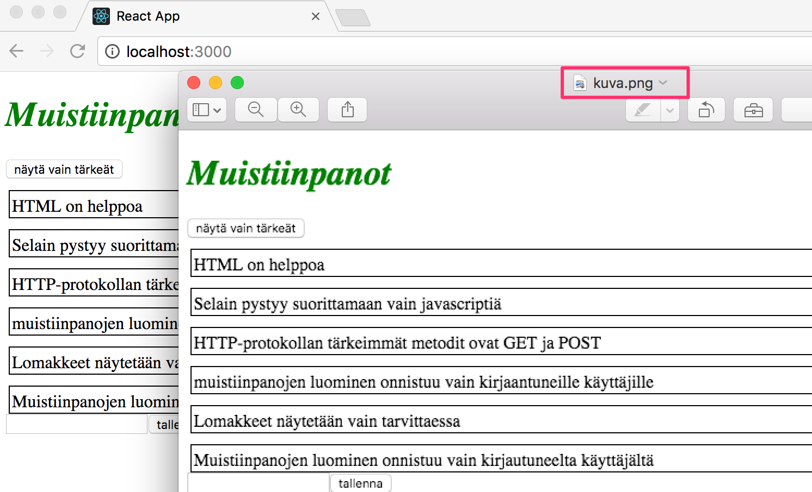

Muutetaan koodia vielä siten, että se kirjottaa sivulla olevaan _input_-elementtiin

```js
const main = async () => {
  const browser = await puppeteer.launch();
  const page = await browser.newPage();
  await page.goto('http://localhost:3000');
  await page.type('input', 'Headless Chrome');
  await page.screenshot({ path: 'kuva.png' });
  await browser.close();
};
```

Screenshot todistaa että näin on todellakin tapahtunut:

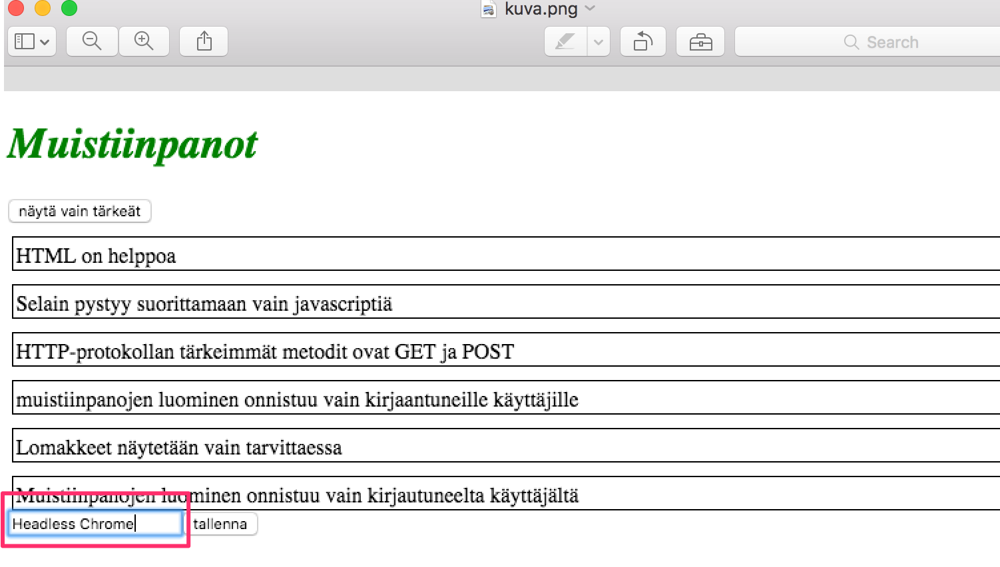

Debugatessa voi olla joskus avuksi myös käynnistää selain normaalimoodissa, ja hidastaa testien suoritusta:

```js
const main = async () => {
  const browser = await puppeteer.launch({
    headless: false,
    slowMo: 250, // jokainen operaatio kestää nyt 0.25 sekuntia
  });
  // ...
};
```

Tehdään sitten muutama testi. Toimiakseen hyvin Jestin kanssa vaaditaan hieman konfiguraatiota, joka onnistuu Jestin dokumentaation [ohjetta](https://facebook.github.io/jest/docs/en/puppeteer.html#content) noudattaen.

Tehdään ensimmäinen testi

```js
describe('note app', () => {
  it('renders main page', async () => {
    const page = await global.__BROWSER__.newPage();
    await page.goto('http://localhost:3000');
    const textContent = await page.$eval('body', el => el.textContent);

    expect(textContent.includes('Muistiinpanot')).toBe(true);
  });
});
```

Konfiguraatioiden ansiosta viite selaimeen on muuttujassa <code>global.**BROWSER**</code>

Selaimelta pyydetään aluksi [page](https://github.com/GoogleChrome/puppeteer/blob/master/docs/api.md#class-page)-olio, ja sen metodilla [\$eval](https://github.com/GoogleChrome/puppeteer/blob/master/docs/api.md#pageevalselector-pagefunction-args-1) haetaan sivun elementissä _body_ oleva tekstuaalinen sisältö.

Tehdään toinen testi, refaktoroidaan samalla testin yhteinen koodi [beforeEach](https://facebook.github.io/jest/docs/en/setup-teardown.html)-metodiin:

```js
describe('note app', () => {
  let page;
  beforeEach(async () => {
    page = await global.__BROWSER__.newPage();
    await page.goto('http://localhost:3000');
  });

  it('renders main page', async () => {
    const textContent = await page.$eval('body', el => el.textContent);
    expect(textContent.includes('Muistiinpanot')).toBe(true);
  });

  it('renders a note', async () => {
    const textContent = await page.$eval('body', el => el.textContent);
    expect(textContent.includes('HTML on helppoa')).toBe(true);
  });
});
```

Testi ei yllättäen mene läpi. Jos testissä tulostetaan konsoliin olion page metodilla [content](https://github.com/GoogleChrome/puppeteer/blob/master/docs/api.md#pagecontent) palauttama sivun koko sisältö, huomataan että sivulla ei todellakaan ole yhtään muistiinpanoa:

```html
<body>
  <noscript>
    You need to enable JavaScript to run this app.
  </noscript>
  <div id="root"><div><h1>Muistiinpanot</h1><div><button>näytä vain tärkeät</button></div><div class="notes"></div><form><input value=""><button>tallenna</button></form></div></div>
  <script type="text/javascript" src="/static/js/main.js"></script>
</body></html>
```

Syynä tälle on se, että puppeteer on ollut liian nopea, ja sivu ei ole _ehtinyt_ renderöityä.

Koska muistiinpanot sisältävällä _div_-elementillä on CSS-luokka _wrapper_, testi saadaan menemään läpi _odottamalla_ koko kyseisten elementtien renderöitymistä metodin [waitForSelector](https://github.com/GoogleChrome/puppeteer/blob/master/docs/api.md#pagewaitforselectorselector-options) avulla:

```js
it('renders a note', async () => {
  await page.waitForSelector('.wrapper');
  const textContent = await page.$eval('body', el => el.textContent);
  expect(textContent.includes('HTML on helppoa')).toBe(true);
});
```

Muutetaan testi hieman parempaan muotoon

```js
it('renders a note', async () => {
  await page.waitForSelector('.wrapper');

  const notes = await page.evaluate(() => {
    const elements = [...document.querySelectorAll('.wrapper')];
    return elements.map(e => e.textContent);
  });

  expect(notes.length > 0).toBe(true);
  expect(notes.join().includes('HTML on helppoa')).toBe(true);
});
```

Jestin [issueista](https://github.com/GoogleChrome/puppeteer/issues/303) löydetyn neuvon avulla testi hakee sivun kaikkien muistiinpanojen sisällöt ja tekee ekspektaatiot niiden avulla.

Lopuksi tehdään testi, joka luo uuden muistiinpanon

```js
it('allows new notes to be added', async () => {
  const id = Math.random() * 10000;
  const note = `jestin lisäämä muistiinpano ${id}`;
  await page.type('input', note);
  await page.click('form button');

  await page.waitForSelector('.notification'); // ilman tätä testi ei mene läpi

  const notes = await page.evaluate(() => {
    const elements = [...document.querySelectorAll('.wrapper')];
    return elements.map(e => e.textContent);
  });
  expect(notes.join().includes(note)).toBe(true);
});
```

Lomakkeen täyttäminen on helppoa. Koska sivulla on useita painikkeita, on käytetty CSS-selektoria _form button_ joka hakee sivulta lomakkeen sisällä olevan napin.

Napin painalluksen jälkeen syntyy jälleen potentiaalinen ajoitusongelma jos uuden muistiinpanon sivulle renderöitymistä testataan liian nopeasti. Ongelma on kierretty sillä, että sovellusta on muutettu siten, että se näyttää ruudulla CSS-luokalla _notification_ merkityssä _div_-elementissä uuden muistiinpanon lisäämisestä kertovan ilmoituksen.

Testausasetelmamme kaipaisi vielä paljon hiomista. Testejä vartan olisi mm. oltava oma tietokanta, jonka tilan testien pitäisi pystyä nollaamaan hallitusti. Nyt testit luottavat siihen että sovellus on käynnissä portissa 3001. Olisi parempi jos testit itse käynnistäisivät ja sammuttaisivat palvelimen.

Lisää aiheesta [Puppeteerin Github-sivujen](https://github.com/GoogleChrome/puppeteer) lisäksi esimerkiksi seuraavassa <https://www.valentinog.com/blog/ui-testing-jest-puppetteer/>

## Tyypitys

Javascriptin muuttujien [dynaaminen tyypitys](https://developer.mozilla.org/en-US/docs/Glossary/Dynamic_typing) aiheuttaa välillä ikäviä bugeja. Osassa 5 käsittelimme lyhyesti [PropTypejä](/osa5/#proptypes), eli mekanismia, jonka avulla React-komponenteille välitettävile propseille on mahdollista tehdä tyyppitarkastuksia.

Viime aikoina on ollut havaittavissa nousevaa kiinnostusta [staattiseen tyypitykseen](https://en.wikipedia.org/wiki/Type_system#Static_type_checking).

Javascriptistä on olemassa useita staattisesti tyypitettyjä versioita, suosituimmat näistä ovat Facebookin kehittämä [flow](https://flow.org/) ja Microsofin [typescript](https://www.typescriptlang.org/).

Flown käyttöönottaminen create-react-app:illa toteutettuun sovellukseen on [helppoa](https://github.com/facebookincubator/create-react-app/blob/master/packages/react-scripts/template/README.md#adding-flow). Tiedostossa _.flowconfig_ kannattaa ignoroida hakemistoissa _node_modules_ ja _dist_ olevat tiedostot

```bash
[ignore]
.*/node_modules/.*
.*/dist/.*
```

Flow tarkastaa ainoastaan ne tiedostot, joiden alussa on kommentissa oleva merkintä _@flow_:

```js
// @flow

function sum(n: number, m: number): number {
  return n + m;
}

sum('1', 2);
```

Tyyppitarkastus tapahtuu komennolla _npm run flow_. Flow huomauttaa virheestä:

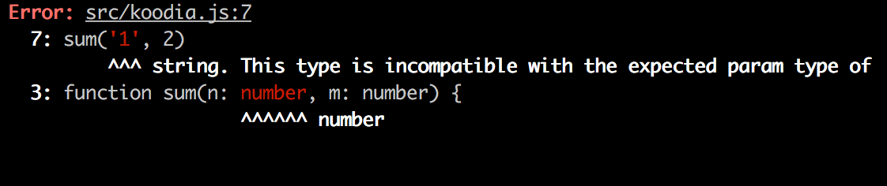

Koodi kuitenkin yllättäen toimii, jos koodiin lisätään konsoliin tehtävä tulostus

```js
const summa = sum('1', 2);
console.log(summa);
```

tulostuu luku 12.

Flow suorittaa koodille ainoastaan tyyppitarkastuksen, [babel](https://babeljs.io/docs/plugins/preset-flow/) kääntää flow-tyyppejä sisältävän koodin normaaliksi Javascriptiksi ja tyyppien tarjoma suoja onkin voimassa ainoastaan jos ohjelmoija suorittaa tyyppitarkastuksia.

Kaikissa tapauksissa tyyppejä ei edes ole tarvetta määritellä, joissain tapauksissa flow osaa päätellä itse mikä muuttujien tyypin tulee olla. Esim. seuraavassa tapauksessa

```js
function square(n) {
  return n * n;
}

square('5');
```

flow osaa varoittaa ongelmasta ilman tyyppien määrittelyä

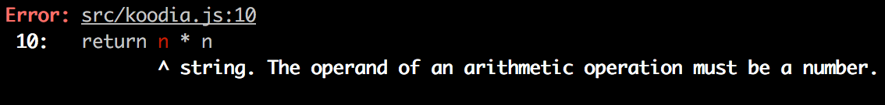

Flown hyvä puoli on keveys, vanhoihinkin projekteihin on helppo ruveta vähitellen lisäämään tyyppejä Flowlla.

Typescript on jossain määrin laajempi ratkaisu ja sen käyttö vaatii Flowia enemmän konfigurointia. Typescript-koodi kirjoitetaan _.ts_-päätteisiin tiedostoihin ja se tulee kääntää Javascriptiksi. Käännös pystytään toki hoitamaan helposti [webpackilla](https://github.com/s-panferov/awesome-typescript-loader). Toisin kun flown yhteydessä, Typescriptillä tehdyssä koodissa oleva virheellinen tyyppien käyttö johtaa siihen, että koodi ei käänny.

Internetistä löytyy runsaasti Flowta ja Typescriptiä vertailevia artikkeleja, ks esim.:

- <https://blog.mariusschulz.com/2017/01/13/typescript-vs-flow>
- <https://michalzalecki.com/typescript-vs-flow/>
- <https://github.com/niieani/typescript-vs-flowtype>

## Muutamia huomioita liittyen Reactiin, Reduxiin ja Nodeen

### React-sovelluksen koodin organisointi

Noudatimme useimmissa sovelluksissa periaatetta, missä komponentit sijoitettiin hakemistoon _components_, reducerit hakemistoon _reducers_ ja palvelimen kanssa kommunikoiva koodi hakemistoon _services_. Tälläinen organisoimistapa riittää pienehköihin sovelluksiin, mutta komponenttien määrän kasvaessa tarvitaan muunlaisia ratkaisuja. Yhtä oikeaa tapaa ei ole, artikkeli [The 100% correct way to structure a React app (or why there’s no such thing)](https://hackernoon.com/the-100-correct-way-to-structure-a-react-app-or-why-theres-no-such-thing-3ede534ef1ed)
tarjoaa näkökulmia aiheeseen.

### Frontti ja backend samassa repositoriossa

Olemme kurssilla tehneet frontendin ja backendin omiin repositorioihinsa. Kyseessä on varsin tyypillinen ratkaisu. Teimme tosin deploymentin [kopioimalla](/osa3#staattisten-tiedostojen-tarjoaminen-backendistä) frontin bundlatun koodin backendin repositorion sisälle. Toinen, ehkä järkevämpi tilanne olisi ollut deployata frontin koodi erikseen, create-react-appilla tehtyjen sovellusten osalta se on todella helppoa oman [buildpackin](https://github.com/mars/create-react-app-buildpack) ansiosta.

Joskus voi kuitenkin olla tilanteita, missä koko sovellus halutaan samaan repositorioon. Tällöin yleinen ratkaisu on sijoittaa _package.json_ ja _webpack.config.js_ hakemiston juureen ja frontin sekä backendin koodi omiin hakemistoihinsa, esim. _client_ ja _server_.

Erään hyvän lähtökohdan yksirepositorioisen koodin organisoinnille antaa [MERN](http://mern.io/)-projektin ylläpitämä [MERN starter](https://github.com/Hashnode/mern-starter).

### Palvelimella tapahtuvat muutokset

Jos palvelimella olevassa tilassa tapahtuu muutoksia, esim. blogilistapalveluun lisätään uusia blogeja muiden käyttäjien toimesta, tällä kurssilla tekemämme React-frontendit eivät huomaa muutoksia ennen sivujen uudelleenlatausta. Vastaava tilanne tulee eteen, jos frontendistä käynnistetään jotain kauemmin kestävää laskentaa backendiin, miten laskennan tulokset saadaan heijastettua frontediin?

Eräs tapa on suorittaa frontendissa [pollausta](<https://en.wikipedia.org/wiki/Polling_(computer_science)>), eli toistuvia kyselyitä backendin APIin esim. [setInterval](https://developer.mozilla.org/en-US/docs/Web/API/WindowOrWorkerGlobalScope/setInterval)-komennon avulla.

Edistyneempi tapa on käyttää [WebSocketeja](https://developer.mozilla.org/en-US/docs/Web/API/WebSockets_API), joiden avulla on mahdollista muodostaa kaksisuuntainen kommunikaatiokanava selaimen ja palvelimen välille. Tällöin frontendin ei tarvitse pollata backendia, riittää määritellä takaisinkutsufunktiot tilanteisiin, joissa palvelin lähettää WebSocketin avulla tietoja tilan päivittämisestä.

WebSocketit ovat selaimen tarjoama rajapinta, jolla ei kuitenkaan ole kaikille selaimille vielä täyttä tukea:

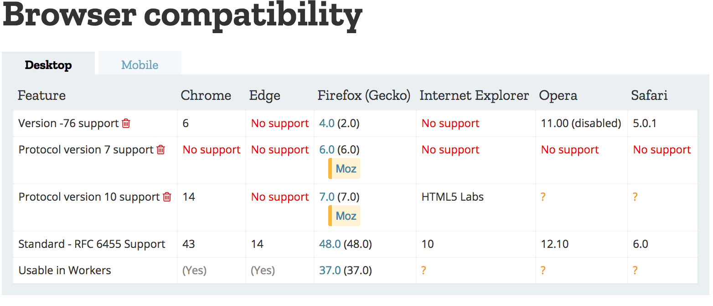

WebSocket API:n suoran käyttämisen sijaan onkin suositeltavaa käyttää [Socket.io](https://socket.io/)-kirjastoa, joka tarjoaa erilaisia automaattisia _fallback_-mahdollisuuksia, jos käytettävässä selaimessa ei ole täyttä WebSocket-tukea.

### Virtual DOM

Reactin yhteydessä mainitaan usein käsite Virtual DOM. Mistä oikein on kyse? Kuten [osassa 0](/osa0#document-object-model-eli-dom) mainittiin, selaimet tarjoavat [DOM API](https://developer.mozilla.org/fi/docs/DOM):n, jota hyväksikäyttäen selaimessa toimiva Javascript voi muokata sivun ulkoasun määritteleviä elementtejä.

Reactia käyttäessä ohjelmoija ei koskaan (tai parempi sanoa yleensä) manipuloi DOM:ia suoraan. React-komponenttien ulkoasun määrittelevä _render_-metodi palauttaa joukon [React-elementtejä](https://reactjs.org/docs/glossary.html#elements). Vaikka osa elementeistä näyttää normaaleilta HTML-elementeiltä

```react
const element = <h1>Hello, world</h1>
```

eivät nekään ole HTML:ää vaan pohjimmiltaan Javascriptiä olevia React-elementtejä.

Sovelluksen komponenttien ulkoasun määrittelevät React-elementit muodostavat [Virtual DOM:in](https://reactjs.org/docs/faq-internals.html#what-is-the-virtual-dom), joka pidetään suorituksen aikana keskusmuistissa.

[ReactDOM](https://reactjs.org/docs/react-dom.html)-kirjaston avulla komponenttien määrittelevä virtuaalinen DOM renderöidään oikeaksi DOM:iksi eli DOM API:n avulla selaimen näytettäväksi:

```react
ReactDOM.render(
  <App />,
  document.getElementById('root')
)
```

Kun sovelluksen tila muuttuu, määrittyy komponenttien render-metodien ansiosta _uusi virtuaalinen DOM_. Reactilla on edellinen versio virtual DOM:ista muistissa ja sensijaan että uusi virtuaalinen DOM renderöitäisiin suoraviivaisesti DOM API:n avulla, React laskee mikä on optimaalisin tapa tehdä DOM:iin muutoksia (eli poistaa, lisätä ja muokata DOM:issa olevia elementtejä) siten, että DOM saadaan vastaamaan uutta Virtual DOM:ia.

### Reactin roolista sovelluksissa

Materiaalissa ei ole tuotu ehkä riittävän selkeästi esille sitä, että React on ensisijaisesti tarkoitettu näkymien luomisesta huolehtivaksi kirjastoksi. Jos ajatellaan perinteistä [Model View Controller](https://en.wikipedia.org/wiki/Model%E2%80%93view%E2%80%93controller) -jaottelua, on Reactin toimialaa juurikin _View_. React on siis sovellusalueeltaan suppeampi kuin esim. [Angular](https://angular.io/), joka on kaiken tarjoava Frontendin MVC-sovelluskehys. Reactia ei kutsutakaan sovelluskehykseksi (framework) vaan kirjastoksi (library).

Pienissä sovelluksissa React-komponenttien tilaan talletetaan sovelluksen käsittelemää dataa, eli komponenttien tilan voi näissä tapaukissa ajatella vastaavan MVC:n modeleita.

React-sovellusten yheydessä ei kuitenkaan yleensä puhuta MVC-arkkitehtuurista ja jos käytössä on Redux niin silloin sovellukset noudattavat [Flux](https://facebook.github.io/flux/docs/in-depth-overview.html#content)-arkkitehtuuria ja Reactin rooliksi jää entistä enemmän pelkkä näkymien muodostaminen. Varsinainen sovelluslogiikka hallitaan Reduxin tilan ja action creatorien avulla. Jos käytössä on osasta 6 tuttu [redux thunk](/osa6#asynkroniset-actionit-ja-redux-thunk), on sovelluslogiikka mahdollista eristää lähes täysin React-koodista.

Koska sekä React että [Flux](https://facebook.github.io/flux/docs/in-depth-overview.html#content) ovat Facebookilla syntyneinä, voi ajatella, että Reactin pitäminen ainoastaan käyttöliittymästä huolehtivana kirjastona on sen oikeaoppista käyttöä. Flux-arkkitehtuurin noudattaminen tuo sovelluksiin tietyn overheadin ja jos on kyse pienestä sovelluksesta tai prototyypistä, saattaa Reatcin "väärinkäyttäminen" olla järkevää, sillä myöskään [overengineering](https://en.wikipedia.org/wiki/Overengineering) ei yleensä johda optimaaliseen tulokseen.

## React/node-sovellusten tietoturva

Emme ole vielä maininneet kurssilla sanaakaan tietoturvaan liittyen. Kovin paljoon ei nytkään ole aikaa, ja onneksi laitoksella on MOOC-kurssi [Securing Software](https://cybersecuritybase.github.io/securing/) tähän tärkeään aihepiiriin.

Katsotaan kuitenkin muutamaa kurssispesifistä seikkaa.

The Open Web Application Security Project eli [OWASP](https://www.owasp.org) julkaisee vuosittain listan Websovellusten yleisimmistä turvallisuusuhista. Tuorein lista on [täällä](https://www.owasp.org/images/7/72/OWASP_Top_10-2017_%28en%29.pdf.pdf). Samat uhat ovat listalla vuodesta toiseen.

Listaykkösenä on _injection_, joka tarkoittaa sitä, että sovellukseen esim. lomakkeen avulla lähetettävä teksti tulkitaankin aivan eri tavalla kun sovelluskehittäjä on tarkoittanut. Kuuluisin injektioiden muoto lienevät [SQL-injektiot](https://stackoverflow.com/questions/332365/how-does-the-sql-injection-from-the-bobby-tables-xkcd-comic-work).

Esim. jos ei-turvallisessa koodissa tehtäisiin seuraavasti muotoiltu SQL-kysely:

```js
let query = "SELECT * FROM Users WHERE name = '" + userName + "';";
```

Oletetaan että hieman ilkeämielinen käyttäjä _Arto Hellas_ nyt määrittelisi nimekseen

<pre>
Arto Hell-as'; DROP TABLE Users; --
</pre>

eli nimi sisältäisi hipsun <code>'</code>, jonka on SQL:ssä merkkijonon aloitus/lopetusmerkki. Tämän seurauksena tulisi suoritetuksi kaksi SQL-operaatiota, joista jälkimmäinen tuhoaisi tietokannan

```sql
SELECT * FROM Users WHERE name = 'Arto Hell-as'; DROP TABLE Users; --'
```

SQL-injektiot estetään [sanitoimalla](https://security.stackexchange.com/questions/172297/sanitizing-input-for-parameterized-queries) syöte, eli tarkastamalla, että kyselyjen parametrit eivät sisällä kiellettyjä merkkejä, kuten tässä tapauksessa hipsun. Jos kiellettyjä merkkejä löytyy, ne korvataan turvallisilla vastineilla [escapettamalla](https://en.wikipedia.org/wiki/Escape_character#JavaScript).

Myös NoSQL-kantoihin tehtävät injektiohyökkäykset ovat mahdollisia. Mongoose kuitenkin estää ne [sanitoimalla](https://zanon.io/posts/nosql-injection-in-mongodb) kyselyt. Lisää aiheesta esim. [täällä](https://blog.websecurify.com/2014/08/hacking-nodejs-and-mongodb.html).

_Cross-site scripting eli XSS_ on hyökkäys, missä sovellukseen on mahdollista injektoida suoritettavaksi vihollismielistä Javascript-koodia. Jos kokeilemme injektoida esim. muistiinpanosovellukseen seuraavan

```html
<script>
  alert('Evil XSS attack');
</script>
```

koodia ei suoriteta, vaan koodi renderöityy sivulle 'tekstinä':


sillä React [huolehtii muuttujissa olevan datan sanitoinnista](https://reactjs.org/docs/introducing-jsx.html#jsx-prevents-injection-attacks). Reactin jotkut versiot [ovat mahdollistaneet](https://medium.com/dailyjs/exploiting-script-injection-flaws-in-reactjs-883fb1fe36c1) XSS-hyökkäyksiä, aukot on toki korjattu, mutta mikään ei takaa etteikö niitä voisi vielä löytyä.

Käytettyjen kirjastojen suhteen tuleekin olla tarkkana, jos niihin tulee tietoturvapäivityksiä, on kirjastot syytä päivittää omissa sovelluksissa. Expressin tietoturvapäivitykset löytyvät [kirjaston dokumentaatiosta](https://expressjs.com/en/advanced/security-updates.html) ja Nodeen liittyvät [blogista](https://nodejs.org/en/blog/).

Riippuvuuksien ajantasaisuuden voi testata komennolla

```bash
npm outdated --depth 0
```

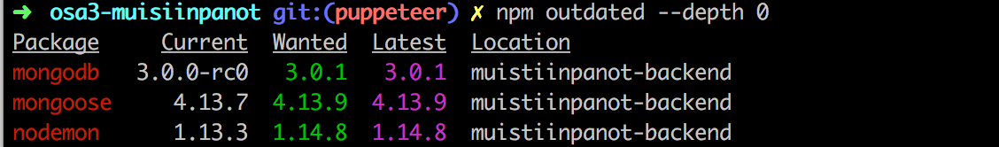

Riippuvuudet saa ajantasaistettua päivittämällä tiedostoa _package.json_ ja suorittamalla komennon _npm install_. Riippuvuuksien vanhat versiot eivät tietenkään välttämättä ole tietoturvariski.

Aiemmissa Noden ja npm:n versioissa [Node Security Platform](https://nodesecurity.io/) valvoi npm:ssä olevien riippuvuuksien turvallisuutta; Noden versiosta 10.0.0 ja npm:n versiosta 6.0.0 alkaen Node Security Platform [on osa npm:ää](https://medium.com/npm-inc/npm-acquires-lift-security-258e257ef639), eli riippuvuuksien turvallisuutta voidaan tarkistaa [_audit_-komennolla](https://docs.npmjs.com/cli/audit) (ja npm tarkistaa sitä automaattisesti kun sovellukselle asetetaan uusia pakkauksia).

Toinen palvelu riippuvuuksien turvallisuuden tarkkailuun on [Snyk](https://snyk.io).

Eräs OWASP:in listan mainitsemista uhista on _Broken Authentication_ ja siihen liittyvä _Broken Access Control_. Käyttämämme token-perustainen autentikointi on kohtuullisen robusti, jos sovellusta käytetään tietoliikenteen salaavalla HTTPS-protokollalla. Access Controlin eli pääsynhallinnan toteuttamisessa on aina syytä muistaa tehdä esim. käyttäjän identiteetin tarkastus selaimen lisäksi myös palvelimella. Huonoa tietoturvaa olisi estää jotkut toimenpiteet ainoastaan piilottamalla niiden suoritusmahdollisuus selaimessa olevasta koodista.

Mozillan MDN:n erittäin hyvä [Website security -guide](https://developer.mozilla.org/en-US/docs/Learn/Server-side/First_steps/Website_security) nostaakin esiin tämän tärkeän seikan:

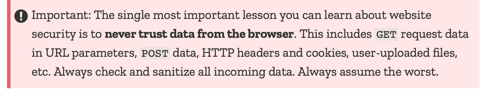

Expressin dokumentaatio sisältää tietoturvaa käsittelevän osan [Production Best Practices: Security](https://expressjs.com/en/advanced/best-practice-security.html) joka kannattaa lukea läpi. Erittäin suositeltavaa on ottaa backendissa käyttöön [Helmet](https://helmetjs.github.io/)-kirjasto, joka sisältää joukon Express-sovelluksista tunnettuja turvallisuusriskejä eliminoivia middlewareja.

Myös ESlintin [security-plugininen](https://github.com/nodesecurity/eslint-plugin-security) käyttöönotto kannattaa.

## Tulevaisuuden trendit

Katsotaan vielä lopuksi muutamaa huomisen tai oikeastaan jo tämän päivän tekniikkaa, ja suuntia joihin Web-sovelluskehitys on kulkemassa.

### Server side rendering, isomorfiset sovellukset ja universaali koodi

Selain ei ole ainoa paikka missä Reactilla määriteltyjä komponentteja voidaan renderöidä. Renderöinti on mahdollista tehdä myös [palvelimella](https://reactjs.org/docs/react-dom-server.html). Tätä hyödynnetäänkin nykyään enenevissä määrin siten, että kun sovellukseen tullaan ensimmäistä kertaa, lähettää palvelin selaimeen jo valmiiksi renderöimänsä Reactilla muodostetun sivun. Tämän jälkeen sovelluksen toiminta jatkuu normaaliin tapaan, eli selain suorittaa Reactia, joka manipuloi selaimen näyttämää DOM:ia. Palvelimella tapahtuvasta renderöinnistä käytetään englanninkielistä nimitystä _server side rendering_.

Eräs motivaatio server side renderingille on Search Engine Optimization eli SEO. Hakukoneet ovat ainakin perinteisesti olleet huonoja tunnistamaan selaimessa Javascriptillä renderöityä sisältöä, ajat saattavat tosin olla muuttumassa, ks. esim. [tämä](https://www.andrewhfarmer.com/react-seo/) ja [tämä](https://medium.freecodecamp.org/seo-vs-react-is-it-neccessary-to-render-react-pages-in-the-backend-74ce5015c0c9).

Server side rendering ei tietenkään ole mikään React- tai edes Javascript-spesifi asia, saman ohjelmointikielen käyttö kaikkialla koodissa tekee konseptista teoriassa helpommin toteutettavan, sillä samaa koodia voidaan suorittaa sekä backendissä että frontendissä.

Palvelimella tapahtuvaan renderöintiin liittyen on alettu puhua _isomorfisista sovelluksista_ ja _universaalista koodista_, termien määritelmistä on kiistelty. Joidenkin [määritelmien](https://medium.com/@ghengeveld/isomorphism-vs-universal-javascript-4b47fb481beb) mukaan isomorfinen web-sovellus on sellainen, joka suorittaa renderöintiä sekä selaimessa että backendissa. Universaalinen koodi taas on koodia, joka voidaan suorittaa useimmissa ympäristöissä eli sekä selaimessa että backendissä.

React ja Node tarjoavatkin varteenotettavan vaihtoehdon isomorfisten sovellusten toteuttamiseen universaalina koodina.

Universaalin koodin kirjoittaminen suoraan Reactin avulla on vielä toistaiseksi melko vaivalloista.
Viime aikoina paljon huomiota saanut Reactin päälle toteutettu [Next.js](https://github.com/zeit/next.js/)-kirjasto on hyvä vaihtoehto universaalien sovellusten tekemiseen.

# Progressive web apps

Viime aikona on myös ruvettu käyttämään Googlen lanseeraamaa termiä [progressive web app](https://developers.google.com/web/progressive-web-apps/) (PWA). Googlen sivuilla oleva määritelmä kuulostaa markkinapuheelta ja sen perusteella on hankala saada selkeää käsitystä mistä on kyse. [Checklista](https://developers.google.com/web/progressive-web-apps/checklist) tuo mukaan konkretiaa.

Tiiviistäen kyse on web-sovelluksista, jotka toimivat mahdollisimman hyvin kaikilla alustoilla ottaen jokaisesta alustasta irti sen parhaat puolet. Mobiililaitteiden pienempi näyttö ei saa heikentää sovellusten käytettävyyttä. PWA-sovellusten tulee myös toimia offline-tilassa tai hitaalla verkkoyhteydellä moitteettomasti. Mobiililaitteilla ne tulee pystyä asentamaan normaalien sovellusten tavoin. Kaiken PWA-sovellusten käyttämän verkkoliikenteen tulee olla salattua.

create-react-app:illa luodut sovellukset ovat oletusarvoisesti [progressiivisia](https://github.com/facebookincubator/create-react-app/blob/master/packages/react-scripts/template/README.md#making-a-progressive-web-app). Jos sovellus käyttää palvelimella olevaa dataa, edellyttää sovelluksen progressiiviseksi tekeminen vaivan näkemistä. Offline-toiminnallisuus toteutetaan yleensä [service workerien](https://developer.mozilla.org/en-US/docs/Web/API/Service_Worker_API) avulla.

# Mikropalveluarkkitehtuuri

Tällä kurssilla olemme tehneet palvelinpuolelle ainoastaan matalan pintaraapaisun. Sovelluksissamme on ollut korkeintaan muutaman API-endpointin tarjoava _monoliittinen_ eli yhdellä palvelimella pyörivä kokonaisuuden muodostava backend.

Sovelluksen kasvaessa suuremmaksi monoliittisen backendin malli alkaa muuttua ongelmalliseksi niin suorituskyvyn kuin jatkokehitettävyydenkin kannalta.

[Mikropalveluarkkitehtuurilla](https://martinfowler.com/articles/microservices.html) (microservice) tarkoitetaan tapaa koostaa sovelluksen backend useista erillisistä autonomisista palveluista, jotka kommunikoivat keskenään verkon yli. Yksittäisen mikropalvelun on tarkoituksena hoitaa tietty looginen toiminnallinen kokonaisuus. Puhdasoppisessa mikropalveluarkkitehtuurissa palvelut eivät käytä jaettua tietokantaa.

Esim. blogilistasovelluksen voisi koostaa kahdesta palvelusta, toinen huolehtisi käyttäjistä ja toinen blogeista. Käyttäjäpalvelun vastuulla olisi käyttäjätunnusten luominen ja käyttäjien autentikointi, blogipalvelu taas huolehtisi blogeihin liittyvistä toimista.

Seuraava kuva havainnollistaa mikropalveluarkkitehtuuriin perustuvan sovelluksen rakennetta perinteiseen monoliittiseen rakenteeseen verrattuna:

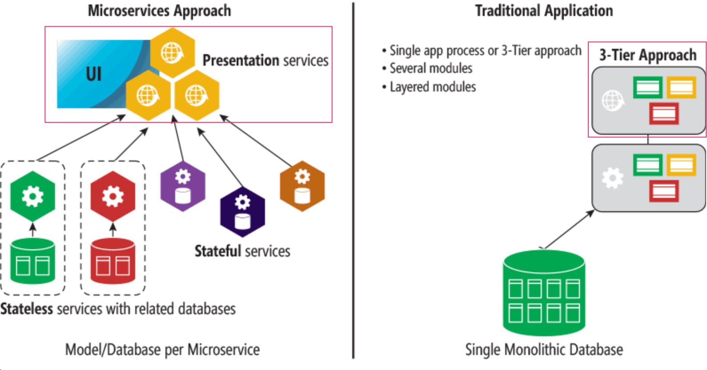

Frontendin (kuvassa neliöitynä) rooli ei välttämättä poikkea malleissa kovinkaan paljoa, mikropalveluiden ja frontendin välissä on usein [API gateway](http://microservices.io/patterns/apigateway) joka tarjoaa frontendille perinteisen kaltaisen, "yhdessä palvelimessa" olevan näkymän backendiin, esim. [Netflix](https://medium.com/netflix-techblog/optimizing-the-netflix-api-5c9ac715cf19) käyttää tätä ratkaisua.

Mikropalveluarkkitehtuurit ovat syntyneet ja kehittyneet suurten internetskaalan sovellusten tarpeisiin. Trendin aloitti Amazon jo kauan ennen termin microservice lanseeraamista. Tärkeä lähtölaukaus oli CEO Jeff Bezosin vuonna 2002 kaikille työntekijöille lähettämä email:

> All teams will henceforth expose their data and functionality through service interfaces.
>
> Teams must communicate with each other through these interfaces.
>
> There will be no other form of inter-process communication allowed: no direct linking, no direct reads of another team’s data store, no shared-memory model, no back-doors whatsoever. The only communication allowed is via service interface calls over the network.
>
> It doesn’t matter what technology you use.
>
> All service interfaces, without exception, must be designed from the ground up to be externalize-able. That is to say, the team must plan and design to be able to expose the interface to developers in the outside world.
>
> No exceptions.
>
> Anyone who doesn’t do this will be fired. Thank you; have a nice day!

Nykyään eräs vahvimmista suunnannäyttäjistä mikropalveluiden suhteen on [Netflix](https://www.infoq.com/presentations/netflix-chaos-microservices).

Mikropalveluista on pikkuhiljaa tullut hype, tämän ajan [silver bullet](https://en.wikipedia.org/wiki/No_Silver_Bullet), jota yritetään tarjota ratkaisuiksi lähes kaikkiin ongelmiin. Mikropalveluarkkitehtuurin soveltamiseen liittyy kuitenkin suuri määrä haasteita ja voi olla järkevämpi lähteä liikeelle [monolith first](https://martinfowler.com/bliki/MonolithFirst.html), eli tehdä aluksi perinteinen kaiken sisältävä backend. Tai sitten [ei](https://martinfowler.com/articles/dont-start-monolith.html). Mielipiteitä on monenlaisia. Molemmat linkit johtavat Martin Fowlerin sivuille, eli viisaimmat eivät ole ihan varmoja kumpi näistä oikeista tavoista on oikeampi.

Emme voi valitettavasti syventyä tällä kurssilla tähän tärkeään aihepiiriin tämän tarkemmin. Jo pintapuolinenkin käsittely vaatisi ainakin 5 viikkoa lisää aikaa.

# Serverless

Loppuvuodesta 2014 tapahtuneen Amazonin [lambda](https://aws.amazon.com/lambda/)-palvelun julkaisun jälkeen alkoi web-sovellusten kehittämiseen nousta jälleen uusi trendi, [serverless](https://serverless.com/).

Kyse on siitä, että lambda ja nyttemmin Googlen [Cloud functions](https://cloud.google.com/functions/) ja [Azuren vastaava toiminnallisuus](https://azure.microsoft.com/en-us/services/functions/) mahdollistavat _yksittäisten funktioiden suorittamisen_ pilvessä, kun ennen tätä pienin pilvessä suoritettava yksikkö oli käytännössä yksittäinen _prosessi_, eli esim. Node-backendiä suorittava ajoympäristö.

Esim. Amazonin [API-gateway](https://aws.amazon.com/api-gateway/):n avulla on mahdollista tehdä "palvelimettomia" sovelluksia, missä määritellyn HTTP API:n kutsuihin vastataan suoraan pilvifunktioilla. Funktiot yleensä operoivat jo valmiiksi pilvipalvelun tietokantoihin talletetun datan avulla.

Serverlessissä ei siis ole kyse siitä että sovelluksissa ei olisi palvelinta, vaan tavasta määritellä palvelin. Sovelluskehittäjät voivat siirtyä ohjelmoinnissa korkeammalle abstraktiotasolle, ei ole enää tarvetta määritellä ohjelmallisesti HTTP-kutsujen reitityksiä, tietokantayhteyksiä ym., pilvi-infrastruktuuri tarjoaa kaiken tämän. Pilvifunktioilla on myös mahdollista saada helposti aikaan hyvin skaalautuvia järjestelmiä, esim. Amazon Lambda pystyy suorittamaan massiivisen määrän pilvifunktioita sekunnissa. Kaikki tämä tapahtuu infrastruktuurin toimesta automaattisesti, ei ole tarvetta käynnistellä uusia palvelimia ym.

# GraphQL

Tälläkin kurssilla moneen kertaan mainittu ja käytetty REST on ollut pitkään vallitseva tapa toteuttaa palvelimen selaimelle tarjoama rajapinta ja yleensäkin verkossa toimivien sovellusten välinen integraatio.

RESTin rinnalle selaimessa (tai mobiililaitteessa) toimivan logiikan ja palvelimien väliseen kommunikointiin on viime vuosina noussut alunperin Facebookin kehittämä [GraphQL](http://graphql.org/).

GraphQL on filosofialtaan todella erilainen RESTiin verrattuna. REST on _resurssipohjainen_, jokaisella resurssilla, esim. _käyttäjällä_ on oma sen identifioiva osoite, esim. _users/10_, ja kaikki resursseille tehtävät operaatiot toteutetaan tekemällä URL:ille kohdistuvia pyyntöjä, joiden toiminta määrittyy käytetyn HTTP-metodin avulla.

RESTin resurssiperustaisuus toimii hyvin useissa tapauksissa, joissain tapauksissa se voi kuitenkin olla hieman kankea.

Oletetaan että blogilistasovelluksemme sisältäisi somemaista toiminnallisuutta ja haluaisimme esim. näyttää sovelluksessa listan, joka sisältää kaikkien seuraamiemme (follow) käyttäjien blogeja kommentoineiden käyttäjien lisäämien blogien nimet.

Jos palvelin toteuttaisi REST API:n, joutuisimme todennäköisesti tekemään monia HTTP-pyyntöjä selaimen koodista, ennen kuin saisimme muodostettua halutun datan. Pyyntöjen vastauksena tulisi myös paljon ylimääräistä dataa ja halutun datan keräävä selaimen koodi olisi todennäköisesti kohtuullisen monimutkainen.

Jos kyseessä olisi usein käytetty toiminnallisuus, voitaisiin sitä varten toteuttaa oma REST-endpoint. Jos vastaavia skeaarioita olisi paljon, esim. kymmeniä, tulisi erittäin työlääksi toteuttaa kaikille toiminnallisuuksille oma REST-endpoint.

GraphQL:n avulla toteutettava palvelin sopii tämänkaltaisiin tilanteisiin hyvin.

GraphQL:ssä periaatteena, on että selaimen koodi muodostaa _kyselyn_, joka kuvailee haluttua dataa ja lähettää sen API:lle HTTP POST -pyynnöllä. Toisin kuin REST:issä, GraphQL:ssä kaikki kyselyt kohdistetaan samaan osoitteeseen ja ovat POST-tyyppisiä.

Edellä kuvatun skenaarion data saataisiin haettua (suurinpiirtein) seuraavan kaltaisella kyselyllä:

```bash
query FetchBlogsQuery {
  user(username: 'mluukkai') {
    followedUsers {
      blogs {
        comments {
          user {
            blogs {
              title
            }
          }
        }
      }
    }
  }
}
```

Palvelimen vastaus pyyntöön olisi suunnilleen seuraavanlainen JSON-olio:

```bash
{
  data: {
    followedUsers: {
      blogs: {
        comments: {
          user: {
            blogs: [
              'Goto considered harmful',
              'End to End Testing with Puppeteer and Jest',
              'Navigating your transition to GraphQL',
              'From REST to GraphQL'
            ]
          }
        }
      }
    }
  }
}
```

Sovelluslogiikka säilyy yksinkertaisena ja selaimen koodi saa täsmälleen haluamansa datan yksittäisellä kyselyllä.

GraphQL:ää käytettäessä sovelluksen datasta on määriteltävä [skeema](http://graphql.org/learn/schema/), joka kuvailee datan entiteettejä, eli esimerkkimme tapauksessa käyttäjiä, blogeja ja kommentteja sekä niiden suhteita, ks. lisää esim. blogista [Navigating your transition to GraphQL](https://dev-blog.apollodata.com/navigating-your-transition-to-graphql-28a4dfa3acfb).

GraphQL:n nimi tuleekin siitä, että entiteetit ja niiden suhteet muodostavat usein, etenkin sosiaalisen median tapaisissa sovelluksissa eräänlaisen verkon, missä entiteetit liittyvät toisiin entiteetteihin erilaisten _suhteiden_ kautta.

Nimestään huolimatta GraphQL:llä ei ole suoranaisesti mitään tekemistä tietokantojen kanssa, se ei ota mitään kantaa siihen miten data on tallennettu. GraphQL-periaattella toimivan API:n käyttämä data voi siis olla talletettu relaatiotietokantaan, dokumenttitietokantaan tai muille palvelimille, joita GraphQL-palvelin käyttää vaikkapa REST:in välityksellä. GraphQL on täysin ohjelmointikieliriippumaton, sekä GraphQL-clientien että -servereiden toteuttamisen tueksi on olemassa kirjastoja useilla ohjelmointikielillä.

GraphQL on jo melko iäkäs teknologia, se on ollut Facebookin sisäisessä käytössä jo vuodesta 2012 lähtien, teknologian voi siis todeta olevan "battle tested". Facebook julkaisi GraphQL:n vuonna 2015 ja se on pikkuhiljaa saanut enenevissä määrin huomiota ja nousee ehkä lähivuosina uhmaamaan REST:in valta-asemaa.

Teen kurssille ehkä tulevaisuudessa uuden, GraphQL:ää käsittelevän osan. Tänä keväänä se ei kuitenkaan tule ilmestymään. Jos haluat kulkea etujoukkojen mukana, voikin olla hyvä idea tutustua GraphQL:n [Full Stack -harjoitustyön](https://courses.helsinki.fi/fi/TKT21010/121540755) yhteydessä.

Lisää GraphQL:stä esim. seuraavissa:

- <http://graphql.org/>
- <https://github.com/facebook/graphql>
- [Tutoriaali](https://dev-blog.apollodata.com/full-stack-react-graphql-tutorial-582ac8d24e3b) GraphQL:n käyttöön Reactista [Apollo clientin](https://www.apollographql.com/docs/react/) avulla
- [Why GraphQL is the future](https://dev-blog.apollodata.com/why-graphql-is-the-future-3bec28193807)

# Cloud native app

Viime aikoina on myös yleistynyt termin pilvinatiivi, _cloud native_ käyttö. Termillä ei ole mitään [yhtenäistä määritelmää](https://techcrunch.com/2016/08/03/what-real-cloud-native-apps-will-look-like/).

[Pivotal](https://pivotal.io/cloud-native) määrittelee käsitteen seuraavasti

> Cloud-native is an approach to building and running applications that fully exploits the advantages of the cloud computing delivery model. Cloud-native is about how applications are created and deployed, not where. While today public cloud impacts the thinking about infrastructure investment for virtually every industry, a cloud-like delivery model isn’t exclusive to public environments. It's appropriate for both public and private clouds. Most important is the ability to offer nearly limitless computing power, on-demand, along with modern data and application services for developers. When companies build and operate applications in a cloud-native fashion, they bring new ideas to market faster and respond sooner to customer demands.

Esim. Netflixin koko infrastruktuuria voi pitää pilvinatiivina. Netflixillä ei ole omia palvelimia, kaikki toimii Amazonin alustalla olevissa virtuaalikoneissa.

Pilvinatiiviuteen liittyvät usein äsken mainitut mikropalvelut ja serverless-arkkitehtuuri. Tärkeä teema pilvinatiiveissa sovelluksissa on myös [kontainereiden](https://www.docker.com/what-container), kuten Dockerin hyödyntäminen.

## Hyödyllisiä kirjastoja ja mielenkiintoisia linkkejä

Facebookin ylläpitämä kirjasto [immutable.js](https://github.com/facebook/immutable-js/) tarjoaa muutamista tietorakenteista nimensä mukaisia _muuttumattomia_ toteutuksia. Kirjastosta voi olla hyötyä Reduxia käytettäessä, sillä kuten osasta 5 [muistamme](/osa5/#puhtaat-funktiot-immutable) reducerien on oltava puhtaita funktioita eli ne eivät saa muuttaa storen tilaa vaan niiden on korvattava se muutostilanteissa uudella.

[Redux-saga](https://redux-saga.js.org/) tarjoaa osassa 6 käsitellylle [redux thunkille](/osa6/#asynkroniset-actionit-ja-redux-thunk) vaihtoehtoisen tavan tehdä asynkronisia actioneja. Jotkut hypettää ja tykkää, itse en.

Single page -sovelluksissa analytiikkatietojen kerääminen käyttäjien sivuston kanssa käymästä vuorovaikutuksesta on [haastavampaa](https://developers.google.com/analytics/devguides/collection/analyticsjs/single-page-applications) kuin perinteisissä, kokonaiseen sivun lataamiseen perustuvissa web-sovelluksissa. [React Google Analytics](https://github.com/react-ga/react-ga) -kirjasto tuo tähän avun.

Voit hyödyntää React-osaamistasi myös mobiilisovellusten toteuttamiseen Facebookin erittäin suositun [React Native](https://facebook.github.io/react-native/) -kirjaston avulla.

Javascript-projektien projektinhallintaan ja bundlaamiseen käytettyjen työkalujen rintamalla on ollut tuulista, best practicet ovat vaihdelleet nopeasti (vuosiluvut ovat suuntaa-antavia, kukaan ei enää muista noin kauas menneisyyteen):

- 2011 [Bower](https://www.npmjs.com/package/bower)
- 2012 [Grunt](https://www.npmjs.com/package/grunt)
- 2013-14 [Gulp](https://www.npmjs.com/package/gulp)
- 2012-14 [Browserify](https://www.npmjs.com/package/browserify)
- 2015- [Webpack](https://www.npmjs.com/package/webpack)

Hipsterien suurin into työkalukehitykseen näytti pysähtyneen webpackin vallattua markkinat. Uusi tulokas [Parcel](https://parceljs.org) on kuitenkin saanut viime aikoina nopeasti paljon huomiota. Parcel markkinoi olevansa yksinkertainen, sitähän webpack ei missään nimessä ole, ja paljon nopeampi kuin webpack. Parcelin kehitystä kannattaa jäädä seuraamaan.

Sivu <https://reactpatterns.com/> tarjoaa tiiviissä muodossa listan parhaita react-käytänteitä, joista osa on jo tältäkin kurssilta tuttuja. Toinen samankaltainen lista on [react bits](https://vasanthk.gitbooks.io/react-bits/).

Jos tiedät jotain suositeltavia linkkejä tai kirjastoja, tee pull request!

</div>
