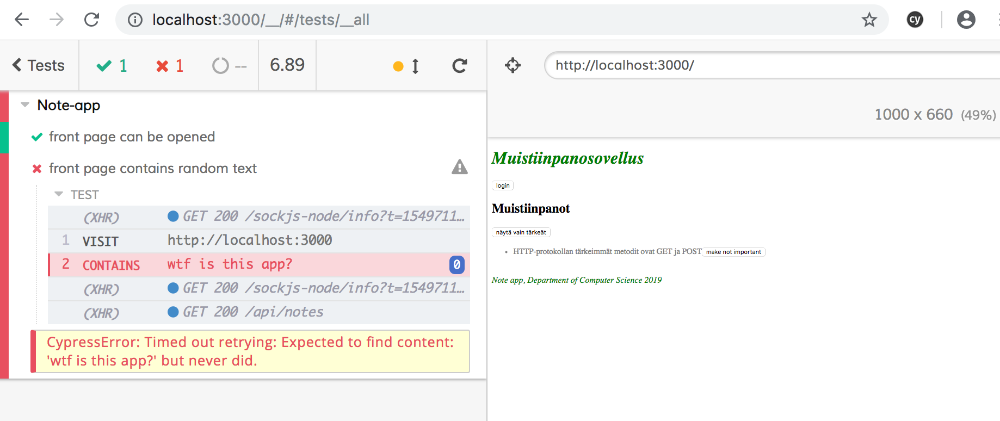
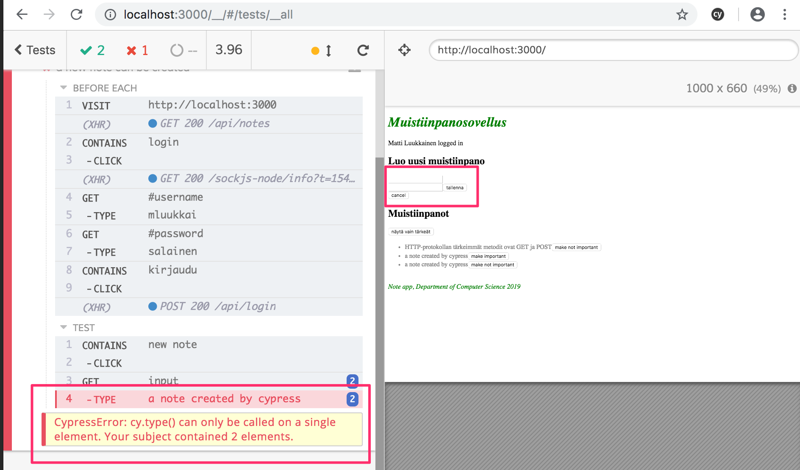

<div class="content">

Olemme käyttäneet kurssilla ainoastaan Javascript-funktioina määriteltyjä React-komponentteja. Tämä ei ollut mahdollista ennen Reactiin versiossa 16.8. tullutta [hook](https://reactjs.org/docs/hooks-intro.html)-toiminnallisuutta, tällöin esimerkiksi tilaa käyttävät komponentit oli pakko määritellä käyttäen Javascriptin [Class](https://reactjs.org/docs/state-and-lifecycle.html#converting-a-function-to-a-class)-syntaksia.

Class-, eli luokkakomponentit on syytä tuntea ainakin jossain määrin, sillä maailmassa on suuri määrä vanhaa React-koodia, mitä ei varmaankaan koskaan tulla kokonaisuudessaan uudelleenkirjoittamaan uudella syntaksilla.

### Luokkakomponentit

Tutustutaan nyt luokkakomponenttien tärkeimpiin ominaisuuksiin toteuttamalla jälleen kerran jo niin tuttu anekdoottisovellus. Talletetaan anekdootit <i>json-serveriä</i> hyödyntäen tiedostoon <i>db.json</i>. Tiedoston sisältö otetaan [täältä](https://github.com/fullstack-hy2019/misc/blob/master/anecdotes.json).

Luokkakomponentin ensimmäinen versio näyttää seuraavalta

```js
import React from 'react'

class App extends React.Component {
  constructor(props) {
    super(props)
  }

  render() {
    return (
      <div>
        <h1>anecdote of the day</h1>
      </div>
    )
  }
}

export default App
```

Komponentilla on nyt [konstruktori](https://reactjs.org/docs/react-component.html#constructor) missä ei toistaiseksi tehdä mitään sekä metodi [render](https://reactjs.org/docs/react-component.html#render). Kuten arvata saattaa, _render_ määrittelee sen miten komponentti piirtyy ruudulle.

Määritellään komponenttiin tila anekdoottien listalle sekä näkyvissä olevalle anekdootille. Toisin kuin [useState](https://reactjs.org/docs/hooks-state.html)-hookia käytettäessä, luokkakomponenteilla on ainoastaan yksi tila. Eli jos tila koostuu useista "osista", tulee osat tallettaa tilan kenttiin.  Tila alustetaan konstruktorissa:

```js
class App extends React.Component {
  constructor(props) {
    super(props)

    // highlight-start
    this.state = {
      anecdotes: [],
      current: 0
    }
    // highlight-end
  }

  render() {
    if (this.state.anecdotes.length == 0 ) { // highlight-line
      return <div>no anecdotes...</div>
    }

    return (
      <div>
        <h1>anecdote of the day</h1>
        <div>
          {this.state.anecdotes[this.state.current].content} // highlight-line
        </div>
        <button>next</button>
      </div>
    )
  }
}
```

Komponentin tila on siis instanssimuuttujassa _this.state_. Tila on olio, jolla on kaksi kenttää. <i>this.state.anecdotes</i> on anekdoottien lista ja <i>this.state.current</i> on näytettävän anekdootin indeksi.

Funktionaalisten komponenteille oikea paikka hakea palvelimella olevaa dataa ovat [effect hookit](https://reactjs.org/docs/hooks-effect.html), jotka suoritetaan aina komponentin renderöitymisen yhteydessä tai tarvittaessa harvemmin, esim. ainoastaan ensimmäisen renderöinnin yhteydessä.

Luokkakomponenttien [elinkaarimetodit](https://reactjs.org/docs/state-and-lifecycle.html#adding-lifecycle-methods-to-a-class) tarjoavat vastaavan toiminnallisuuden. Oikea paikka käynnistää tietojen haku palvelimelta on  elinkaarimetodi [componentDidMount](https://reactjs.org/docs/react-component.html#componentdidmount), joka suoritetaan kertaalleen heti komponentin ensimmäisen renderöitymisen jälkeen:

```js
class App extends React.Component {
  constructor(props) {
    super(props)

    this.state = {
      anecdotes: [],
      current: 0
    }
  }

  // highlight-start
  componentDidMount = () => {
    axios.get('http://localhost:3001/anecdotes').then(response => {
      this.setState({ anecdotes: response.data })
    })
  }
  // highlight-end

  // ...
}
```

HTTP-pyynnön takaisinkutsufunktio päivittää komponentin tilaa metodilla [setState](https://reactjs.org/docs/react-component.html#setstate). Metodi toimii siten, että se koskee tilassa ainoastaan niihin avaimiin, mitä parametrina olevassa oliossa on määritelty. Avain <i>current</i> jää siis entiseen arvoonsa.

Metodin setState kutsuminen aiheuttaa aina luokkakomponentin uudelleenrenderöinnin, eli metodin _render_ kutsun.

Viimeistellään vielä komponentti siten, että näytettävä anekdootti on mahdollista vaihtaa. Seuraavassa koko komponentin koodi, lisäys korostettuna:

```js
class App extends React.Component {
  constructor(props) {
    super(props)

    this.state = {
      anecdotes: [],
      current: 0
    }
  }

  componentDidMount = () => {
    axios.get('http://localhost:3001/anecdotes').then(response => {
      this.setState({ anecdotes: response.data })
    })
  }

  // highlight-start
  handleClick = () => {
    const current = Math.round(
      Math.random() * this.state.anecdotes.length
    )
    this.setState({ current })
  }
  // highlight-end

  render() {
    if (this.state.anecdotes.length === 0 ) {
      return <div>no anecdotes...</div>
    }

    return (
      <div>
        <h1>anecdote of the day</h1>
        <div>{this.state.anecdotes[this.state.current].content}</div>
        <button onClick={this.handleClick}>next</button> // highlight-line
      </div>
    )
  }
}
```

Vertailun vuoksi sama sovellus funktionaalisena komponenttina:

```js
const App = () => {
  const [anecdotes, setAnecdotes] = useState([])
  const [current, setCurrent] = useState(0)

  useEffect(() =>{
    axios.get('http://localhost:3001/anecdotes').then(response => {
      setAnecdotes(response.data)
    })
  },[])

  const handleClick = () => {
    setCurrent(Math.round(Math.random() * anecdotes.length))
  }

  if (anecdotes.length === 0) {
    return <div>no anecdotes...</div>
  }

  return (
    <div>
      <h1>anecdote of the day</h1>
      <div>{anecdotes[current].content}</div>
      <button onClick={handleClick}>next</button>
    </div>
  )
}
```

Esimerkkimme tapauksessa erot eivät ole suuret. Suurin ero funktionaalisissa ja luokkakompontenteissa lienee se, että luokkakomponentin tila on aina yksittäinen olio, ja tilaa muutetaan metodin _setState_ avulla kun taas funktionaalisessa komponentissa tila voi koostua useista muuttujista, joilla kaikilla on oma päivitysfunktio.

Hieman edistyneemmissä käyttöskenaarioissa effect hookit tarjoavat huomattavasti paremman mekanismin sivuvaikutusten hallintaan verrattuna luokkakomponenttien elinkaarimetodeihin.

Merkittävä etu funktionaalisille komponenttien käytössä on se, että paljon harmia tuottavaa Javascriptin olioon itseensä viittaavaa _this_-viitettä ei tarvite käsitellä ollenkaan.

Oman ja suuren enemmistön mielestä luokkakomponenteilla ei ole oikeastaan mitään etuja hookeilla rikastettuihin funktionaalisiin komponentteihin verrattuna, poikkeuksen tähän muodostaa ns. [error boundary](https://reactjs.org/docs/error-boundaries.html) -mekanismi, joka ei ole toistaiseksi (7.2.2019) funktionaalisten komponenttien käytössä.

Kun kirjoitat uutta koodia, [ei siis ole mitään rationaalista syytä käyttää luokkakomponentteja](https://reactjs.org/docs/hooks-faq.html#should-i-use-hooks-classes-or-a-mix-of-both) jos projektissa on käytössä Reactista vähintään versio 16.8. Toisaalta kaikkea vanhaa Reactia [ei ole toistaiseksi mitään syytä uudelleenkirjoittaa](https://reactjs.org/docs/hooks-faq.html#do-i-need-to-rewrite-all-my-class-components) funktionaalisina komponentteina.

### Sovelluksen end to end -testaus

Palataan vielä hetkeksi testauksen pariin. Aiemmissa osissa teimme sovelluksille yksikkötestejä sekä integraatiotestejä. Katsotaan nyt erästä tapaa tehdä [järjestelmää kokonaisuutena](https://en.wikipedia.org/wiki/System_testing) tutkivia <i>End to End (E2E) -testejä</i>.

Web-sovellusten E2E-testaus tapahtuu käyttäen selainta jonkin kirjaston avulla. Ratkaisuja on tarjolla useita, esim. [Selenium](http://www.seleniumhq.org/), joka mahdollistaa testien automatisoinnin lähes mitä tahansa selainta käyttäen.

Tämän kurssin kurssin [edellisessä versiossa](https://fullstackopen.github.io/osa7/) E2E-testeihin käytettiin [puppeteer](https://pptr.dev/)-kirjastoa, joka tarjoaa suoran rajapinnan [chrome](https://developers.google.com/web/updates/2017/04/headless-chrome)-selaimen käyttöön ns. [headless](https://en.wikipedia.org/wiki/Headless_browser)-moodissa eli siten että selain ei näytä ollenkaan ollenkaan graafista käyttöliittymää.

Vaikka Websovellusten E2E on ollut teknologioiden puolesta mahdollista jo yli kymmenen vuotta, erityisesti Single Page App(SPA) -periaatteella toteutettujen sovellusten testaaminen on ollut valitettavan hankalaa. SPA-testit ovat usein olleet epäluotettavia eli englanniksi [flaky](https://hackernoon.com/flaky-tests-a-war-that-never-ends-9aa32fdef359): osa testeistä on mennyt välillä läpi ja välillä ei, vaikka koodi olisi ollut muuttumaton.

Vuoden 2018 aikana [Cypress](https://www.cypress.io/)-niminen kirjasto on nopeasti kasvattanut suosiotaan E2E-testauksessa. Cypress on poikkeuksellisen helppokäyttöinen, tunkkauksen määrä esim. Seleniumin käyttöön verrattuna on lähes olematon. Cypressin toimintaperiaate poikkeaa radikaalisti useimmista E2E-testaukseen sopivista kirjastoista, sillä Cypress-testit ajetaan kokonaisuudessaan selaimen sisällä. Muissa lähestymistavoissa testit suoritetaan Node-prosessissa, joka on yhteydessä selaimeen sen tarjoamien ohjelmointirajapintojen kautta.


Tehdään muutamia testejä osissa 2-5 kehitetylle muistiinpanosovellukselle.

Asennetaan cypress

```js
npm install --save-dev cypress
```

ja määritellään npm-skripti käynnistämistä varten.

```js
{
  // ...
  "scripts": {
    "start": "react-scripts start",
    "build": "react-scripts build",
    "test": "react-scripts test",
    "eject": "react-scripts eject",
    "server": "json-server -p3001 db.json",
    "cypress:open": "cypress open"  // highlight-line
  },
  // ...
}
```

Cypress-testit olettavat että testattava järjestelmä on käynnissä kun testit suoritetaan.

Tehdään backendille npm-skripti jonka avulla se saadaan käynnistettyä siten, että <i>NODE\_ENV</i> saa arvon <i>test</i>

```js
{
  // ...
  "scripts": {
    "start": "cross-env NODE_ENV=production node index.js",
    "start:test": "cross-env NODE_ENV=test node index.js", // highlight-line
    "watch": "cross-env NODE_ENV=development nodemon index.js",
    "test": "cross-env NODE_ENV=test jest --verbose --runInBand",
    "lint": "eslint ."
  },
  // ...
}
```

Kun backend ja frontend ovat käynnissä, voidaan käynnistää Cypress komennolla


```js
npm run cypress:open
```

Sovellukselle tulee hakemisto <i>cypress</i> jonka alihakemistoon <i>integrations</i> on tarkoitus sijoittaa testit. Cypress luo valmiiksi joukon esimerkkitestejä, poistetaan ne ja luodaan ensimmäinen oma testi tiedostoon <i>note_app_spec.js</i>:

```js
describe('Note ', function() {
  it('front page can be opened', function() {
    cy.visit('http://localhost:3000')
    cy.contains('Muistiinpanosovellus')
  })
})
```

Testin suoritus avaa selaimen ja näyttää miten sovellus käyttäytyy testin edetessä:


Testi näyttää rakenteen puolesta melko tutulta. <i>describe</i>-lohkoja käytetään samaan tapaan kuin Jestissä ryhmittelemään yksittäisiä testitapauksia, jotka on määritelty <i>it</i>-metodin avulla. Nämä osat Cypress on lainannut sisäisesti käyttämältään [Mocha](https://mochajs.org/)-testikirjastolta. Mocha oli testikirjastojen vanha hallitsija, se on edelleen suosittu, mutta Jest on mennyt selvästi edelle. [visit](https://docs.cypress.io/api/commands/visit.html#Syntax) ja[contains](https://docs.cypress.io/api/commands/contains.html#Syntax) taas ovat Cypressin komentoja, joiden merkitys on aika ilmeinen.

Olisimme voineet määritellä testin myös käyttäen nuolifunktioita

```js
describe('Note app', () => { // highlight-line
  it('front page can be opened', () => { // highlight-line
    cy.visit('http://localhost:3000')
    cy.contains('Muistiinpanosovellus')
  })
})
```

Mochan dokumentaatio kuitenkin [suosittelee](https://mochajs.org/#arrow-functions) että nuolifunktioita ei käytetä, ne saattavat aiheuttaa ongelmia joissain tilanteissa.

Jos contains ei löydä sivulta etsimäänsä tekstiä, testi ei mene läpi. Eli jos lisäämme seuraavan testin

```js
describe('Note app', function() {
  it('front page can be opened',  function() {
    cy.visit('http://localhost:3000')
    cy.contains('Muistiinpanosovellus')
  })

// highlight-start
  it('front page contains random text', function() {
    cy.visit('http://localhost:3000')
    cy.contains('wtf is this app?')
  })
// highlight-end
})
```

havaitsee Cypress ongelman



Laajennetaan testiä siten, että testi yrittää kirjautua sovellukseen. Aloitetaan kirjautumislomakkeen avaamisella.

```js
describe('Note app',  function() {
  // ...

  it('login form can be opened', function() {
    cy.visit('http://localhost:3000')
    cy.contains('login')
      .click()
  })
})
```

Testi hakee ensin napin sen sisällön perusteella ja klikaa nappia komennolla [click](https://docs.cypress.io/api/commands/click.html#Syntax).

Koska molemmat testit aloittavat samalla tavalla, eli avaamalla sivun <i>http://localhost:3000</i>, kannattaa yhteinen osa eristää ennen jokaista testiä suoritettavaan <i>beforeEach</i>-lohkoon:

```js
describe('Note app', function() {
  // highlight-start
  beforeEach(function() {
    cy.visit('http://localhost:3000')
  })
  // highlight-end

  it('front page can be opened', function() {
    cy.contains('Muistiinpanosovellus')
  })

  it('login form can be opened', function() {
    cy.contains('login')
      .click()
  })
})
```

Ilmoittautumislomake sisältää kaksi <i>input</i>-kenttää, joihin testin tulisi kirjoittaa.

Komento [get](https://docs.cypress.io/api/commands/get.html#Syntax) mahdollistaa elementtien etsimisen CSS-selektorien avulla.

Voimme hakea lomakkeen ensimmäisen ja viimeisen input-kentän ja kirjoittaa niihin komennolla [type](https://docs.cypress.io/api/commands/type.html#Syntax) seuraavasti:

```js
it('user can login', function() {
  cy.contains('login')
    .click()
  cy.get('input:first')
    .type('mluukkai')
  cy.get('input:last')
    .type('salainen')
  cy.contains('kirjaudu')
    .click()
  cy.contains('Matti Luukkainen logged in')
})
```

Testi toimii mutta on kuitenkin sikäli ongelmallinen, että jos sovellukseen tulee jossain vaiheessa lisää input-kenttiä testi saattaa hajota, sillä se luottaa tarvitsemiensa kenttien olevan ensimmäisenä ja viimeisenä.

Parempi (mutta ei kuitenkaan dokumentaation mukaan täysin [optimaali](https://docs.cypress.io/guides/references/best-practices.html#Selecting-Elements)) ratkaisu on määritellä kentille yksilöivät <i>id</i>-attribuutit ja hakea kentät testeissä niiden perusteella. Eli laajennetaan kirjautumislomaketta seuraavasti

```js
const LoginForm = ({ ... }) => {
  return (
    <div>
      <h2>Kirjaudu</h2>
      <form onSubmit={handleSubmit}>
        <div>
          käyttäjätunnus
          <input
            id='username'  // highlight-line
            value={username}
            onChange={handleUsernameChange}
          />
        </div>
        <div>
          salasana
          <input
            id='password' // highlight-line
            type="password"
            value={password}
            onChange={handlePasswordChange}
          />
      </div>
        <button type="submit">kirjaudu</button>
      </form>
    </div>
  )
}
```

Testi muuttuu muotoon

```js
describe('Note app',  function() {
  // ..
  it('user can login', function() {
    cy.contains('login')
      .click()
    cy.get('#username')  // highlight-line
      .type('mluukkai')
    cy.get('#password')  // highlight-line
      .type('salainen')
    cy.contains('kirjaudu')
      .click()
    cy.contains('Matti Luukkainen logged in')
  })
})
```

Luodaan vielä testi, joka lisää sovellukseen uuden muistiinpanon:

```js
describe('Note app', function() {
  // ..
  describe('when logged in', function() {
    beforeEach(function() {
      cy.contains('login')
        .click()
      cy.get('#username')
        .type('mluukkai')
      cy.get('#password')
        .type('salainen')
      cy.contains('kirjaudu')
        .click()
    })

    it('name of the user is shown', function() {
      cy.contains('Matti Luukkainen logged in')
    })

    // highlight-start
    it('a new note can be created', function() {
      cy.contains('new note')
        .click()
      cy.get('input')
        .type('a note created by cypress')
      cy.contains('tallenna')
        .click()
      cy.contains('a note created by cypress')
    })
    // highlight-end
  })
})
```

Koska kaksi testeistä luottaa siihen että käyttäjä on kirjautunut, on niiden yhteinen osa jälleen eriytetty <i>beforeEach</i> osaan. Testi luottaa siihen, että uutta muistiinpanoa luotaessa sivulla on ainoastaan yksi input-kenttä, eli se hakee kentän seuraavasti

```js
cy.get('input')
```

jos kenttiä on useampia, testi hajoaa



Tämän takia olisi jälleen parempi lisätä lomakkeen kentälle <i>id</i> ja hakea kenttä testissä id:n perusteella.

### Tietokannan tilan kontrollointi

Jos testatessa on tarvetta muokata tietokantaa, muuttuu tilanne heti haastavammaksi. Ideaalitilanteessa testauksen tulee aina lähteä liikkeelle samasta alkutilasta, jotta testeistä saadaan luotettavia ja helposti toistettavia.

Yleinen ratkaisu on nollata tietokanta ja mahdollisesti alustaa se sopivasti aina ennen testien suorittamista. E2E-testauksessa lisähaasteen luo se, että testeistä ei ole mahdollista päästä suoraan käsiksi tietokantaan.


Ratkaistaan ongelma luomalla backendiin testejä varten API endpoint, jonka avulla testit voivat tarvittaessa nollata kannan. Tehdään testejä varten oma <i>router</i>

```js
const router = require('express').Router()
const Note = require('../models/note')
const User = require('../models/user')

router.post('/reset', async (request, response) => {
  await Note.deleteMany({})
  await User.deleteMany({})

  response.status(204).end()
})

module.exports = router
```

ja lisätään se backendiin ainoastaan <i>jos sovellusta suoritetaan test-moodissa</i>:

```js
// ...

app.use('/api/login', loginRouter)
app.use('/api/users', usersRouter)
app.use('/api/notes', notesRouter)

// highlight-start
if (process.env.NODE_ENV === 'test') {
  const testingRouter = require('./controllers/testing')
  app.use('/api/testing', testingRouter)
}
// highlight-end

app.use(middleware.unknownEndpoint)
app.use(middleware.errorHandler)

module.exports = app
```

eli lisäyksen jälkeen HTTP POST -operaatio backendin endpointiin <i>/api/testing/reset</i> tyhjentää tietokannan.

Backendin testejä varten muokattu koodi on kokonaisuudessaan [githubissa](https://github.com/fullstack-hy2019/part3-notes-backend/tree/part7-1), branchissä <i>part7-1</i>.

Tällä hetkellä sovelluksen käyttöliittymän ei ole mahdollista luoda käyttäjiä järjestelmään. Testien alustuksessa on siis suoraan luotava testikäyttäjä backendiin.

```js
describe('Note app', function() {
  beforeEach(function() {
    cy.request('POST', 'http://localhost:3001/api/testing/reset') // highlight-line
    const user = {
      name: 'Matti Luukkainen',
      username: 'mluukkai',
      password: 'salainen'
    }
    cy.request('POST', 'http://localhost:3001/api/users/', user)  // highlight-line
    cy.visit('http://localhost:3000')
  })

  it('front page can be opened', function() {
    cy.contains('Muistiinpanosovellus')
  })
})
```

Testi tekee alustuksen aikana HTTP-pyyntöjä backendiin komennolla [request](https://docs.cypress.io/api/commands/request.html). Siirretään aiemmin tehty uuden muistiinpanon testi uuteen testipohjaan:

```js
describe('Note app', function() {
  // ...

  describe('when logged in', function() {
    beforeEach(function() {
      cy.contains('login')
        .click()
      cy.get('#username')
        .type('mluukkai')
      cy.get('#password')
        .type('salainen')
      cy.contains('kirjaudu')
        .click()
    })

    it('name of the user is shown', function() {
      cy.contains('Matti Luukkainen logged in')
    })

    it('a new note can be created', function() {
      cy.contains('new note')
        .click()
      cy.get('input')
        .type('a note created by cypress')
      cy.contains('tallenna')
        .click()
      cy.contains('a note created by cypress')
    })
  })
})
```

Toisin kuin aiemmin, nyt testaus alkaa aina samasta tilasta, eli tietokannassa on yksi käyttäjä ja ei yhtään muistinpanoa.

Tehdään vielä testi, joka tarkastaa että muistiinpanojen tärkeyttä voi muuttaa.  Muutetaan ensin sovelluksen frontendia siten, että uusi muistiinpano on oletusarvoisesti epätärkeä, eli kenttä <i>important</i> saa arvon <i>false</i>:

```js
const App = () => {
  // ...
  const addNote = (event) => {
    event.preventDefault()
    noteFormRef.current.toggleVisibility()
    const noteObject = {
      content: newNote,
      important: false  // highlight-line
    }

    noteService
      .create(noteObject).then(returnedNote => {
        setNotes(notes.concat(returnedNote))
        setNewNote('')
      })
  }

  // ...
}
```

On useita eri tapoja testata asia. Seuraavassa etsitään ensin muistiinpano ja klikataan sen nappia <i>make important</i>. Tämän jälkeen tarkistetaan että muistiinpano sisältää napin <i>make not important</i>.

```js
describe('Note app', function() {
  // ...

  describe('when logged in', function() {
    // ...

    describe('and a note is created', function () {
      beforeEach(function () {
        cy.contains('new note')
          .click()
        cy.get('input')
          .type('another note cypress')
        cy.contains('tallenna')
          .click()
      })

      it('it can be made important', function () {
        cy.contains('another note cypress')
          .contains('make important')
          .click()

        cy.contains('another note cypress')
          .contains('make not important')
      })
    })
  })
})
```

Testit ja frontendin koodi on kokonaisuudessaan [githubissa](https://github.com/fullstack-hy2019part2-notes/tree/part7-1), branchissa <i>part7-1</i>.

Cypress tarjoaa melko hyvät mahdollisuudet testien [debuggaamiseen](https://docs.cypress.io/guides/getting-started/writing-your-first-test.html#Debugging). Testin kunkin vaiheen aikaista sovelluksen DOM:in tilaa on erittäin helppo tarkastella:


Itselläni ei ole kovin paljoa kokemusta Cypressistä. Se kuitenkin jo tässä vaiheessa vaikuttaa ylivoimaisesti parhaalta E2E-testauskirjastolta mihin olen törmännyt. Muilta kuulemani kommentitkin ovat olleet pääasiassa erittäin positiivisia.

Cypressin dokumentaatio on poikkeuksellisen hyvä. Suosittelenkin lämpimästi Cypressin kokeilemista!

</div>

<div class="tasks">

### Tehtäviä

End to end -testaukseen liittyvät tehtävät ovat osan lopun [blogilistaa laajentavassa tehtäväsarjassa](/osa7/tehtavia_blogilistan_laajennus).

</div>
