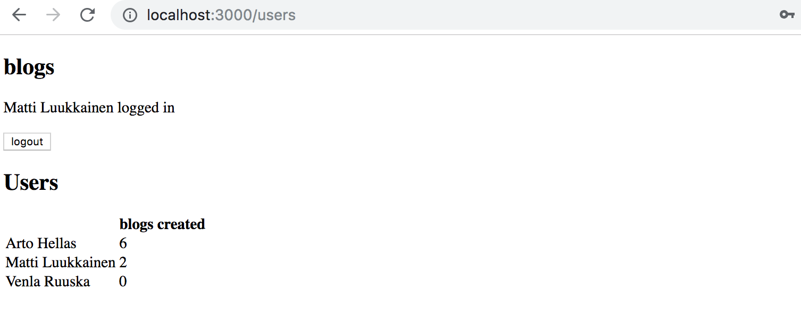
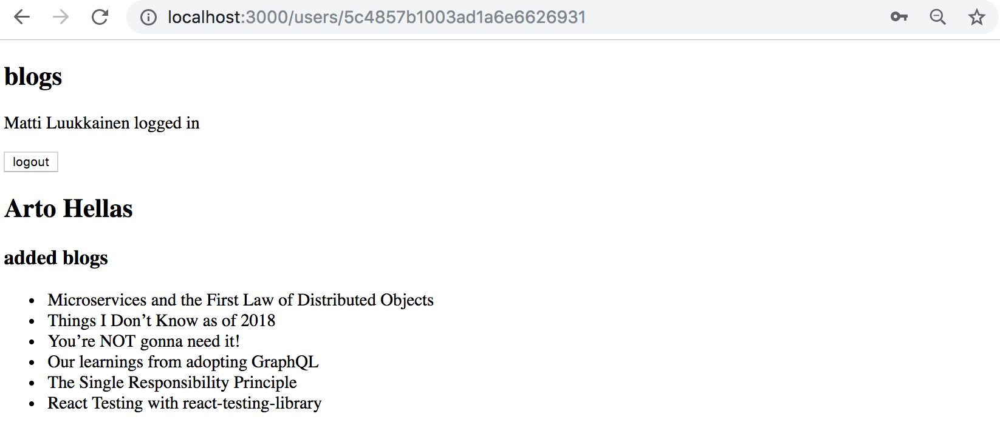
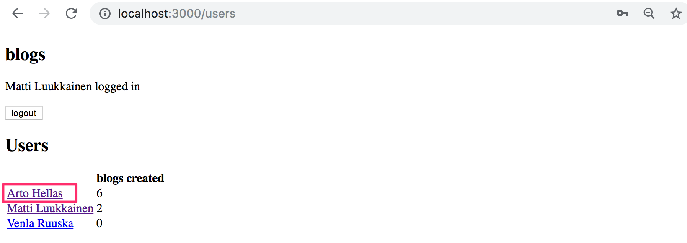
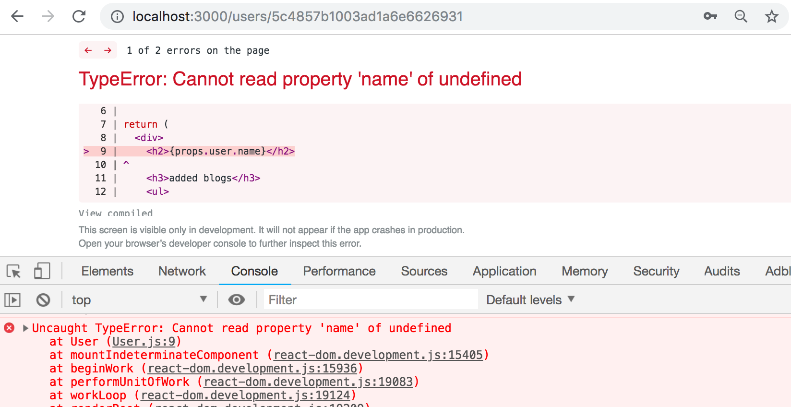
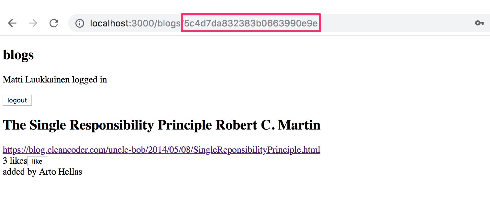
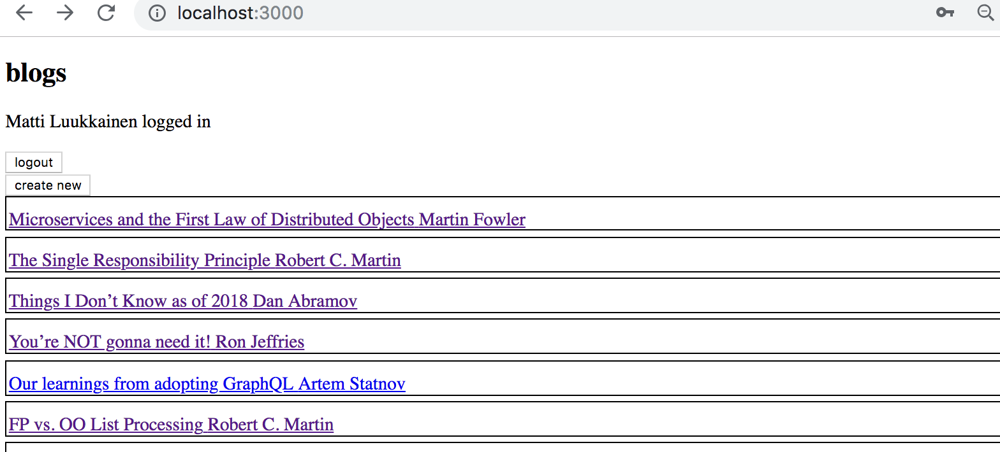
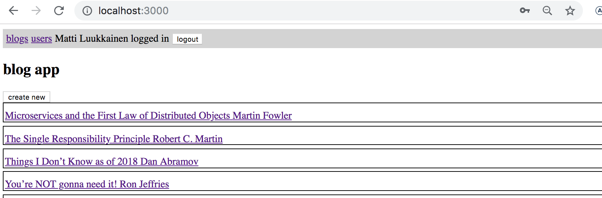
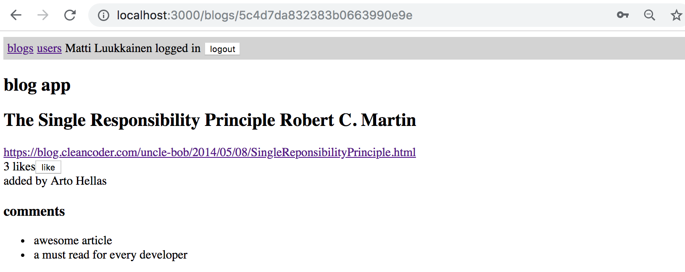
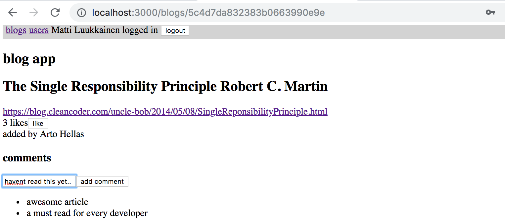

<div class="content">

Kurssin seitsemännessä osassa on luvun [React router](/osa7/react_router) kolmen tehtävän lisäksi 17 tehtävää, joissa jatketaan osissa 4 ja 5 tehtyä Bloglist-sovellusta.  Osa seuraavassa olevista tehtävistä on toisistaan riippumattomia "featureita", eli tehtäviä ei tarvitse tehdä järjestyksessä, voit jättää osan aivan hyvin toteuttamatta.

Voit ottaa pohjaksi oman sovelluksesi sijaan myös mallivastauksen koodin.

Useimmat tämän osan tehtävistä vaativat olemassaolevan koodin refaktoroimista. Tämä on tilanne käytännössä aina sovelluksia laajennettaessa, eli vaikka refaktorointi voi olla hankalaa ja ikävääkin, on kyseessä oleellinen taito.

Hyvä neuvo niin refaktorointiin kuin uudenkin koodin kirjoittamiseen on <i>pienissä askelissa eteneminen</i>, koodia ei kannata hajottaa totaalisesti refaktorointia tehdessä pitkäksi aikaa, se on käytännössä varma resepti hermojen menettämiseen.

</div>

<div class="tasks">

### Tehtäviä

#### 7.4: redux, step1

Siirry käyttämään React-komponenttien tilan sijaan Reduxia sovelluksen tilan hallintaan.

Muuta tässä tehtävässä notifikaatio käyttämään Reduxia.

#### 7.5 redux, step2

Siirrä blogien tietojen talletus Reduxiin.

Kirjautumisen ja uuden blogin luomisen lomakkeiden tilaa voit halutessasi hallita edelleen Reactin tilan avulla. 

Tämä ja seuraava osa ovat kohtuullisen työläitä, mutta erittäin opettavaisia.

#### 7.6 redux, step3

Siirrä myös kirjautuneen käyttäjän tietojen talletus Reduxiin.

#### 7.7 käyttäjien näkymä

Tee sovellukseen näkymä, joka näyttää kaikkiin käyttäjiin liittyvät perustietot:



#### 7.8 yksittäisen käyttäjän näkymä

Tee sovellukseen yksittäisen käyttäjän näkymä, jolta selviää mm. käyttäjän lisäämät blogit



Näkymään päästään klikkaamalla nimeä kaikkien käyttäjien näkymästä



<i>**Huom1:**</i> jos sovelluksesi käyttää tilanhallintaan Reduxia, saattaa tässä tehtävässä olla hyödyksi käyttää funktion _mapStateToProps_ toista parametria [ownPropsia](https://react-redux.js.org/api/connect#mapstatetoprops-state-ownprops-object), joka on dokumentaation hienoisesta kryptisyydestä huolimatta aika [helppokäyttöinen](https://stackoverflow.com/questions/41198842/what-is-the-use-of-the-ownprops-arg-in-mapstatetoprops-and-mapdispatchtoprops).

<i>**Huom2:**</i> törmäät tätä tehtävää tehdessäsi lähes varmasti seuraavaan virheeseen



vika ilmenee jos uudelleenlataat sivun ollessasi yksittäisen käyttäjän sivulla. 

Vian syynä on se, että jos mennään suoraan jonkin käyttäjän sivulle, eivät käyttäjien tiedot ole vielä ehtineet palvelimelta React-sovellukseen. Ongelman voi kiertää ehdollisella renderöinnillä esim. seuraavasti:

```js
const User = (props) => {
  // highlight-start
  if ( props.user === undefined) { 
    return null
  }
  // highlight-end

  return (
    <div>
      <h2>{props.user.name}</h2>

      <h3>added blogs</h3>
      // ...
    </div>
  )
}
```

#### 7.9 blogin näkymä

Toteuta sovellukseen oma näkymä yksittäisille blogeille. Näkymä voi näyttää seuraavalta



Näkymään päästään klikkaamalla blogin nimeä kaikkien blogien näkymästä



Tämän tehtävän jälkeen tehtävässä 5.6 toteutettua toiminnallisuutta ei enää tarvita, eli kaikkien blogien näkymässä yksittäisten blogien detaljien ei enää tarvitse avautua klikattaessa.

#### 7.10 navigointi

Tee sovellukseen navigaatiomenu



#### 7.11 kommentit, step1

Tee sovellukseen mahdollisuus blogien kommentointiin:



Kommentit ovat anonyymejä, eli ne eivät liity järjestelmän käyttäjiin.

Tässä tehtävässä riittää, että frontend osaa näyttää blogilla olevat backendin kautta lisätyt kommentit.

Sopiva rajapinta kommentin luomiseen on osoitteeseen <i>api/blogs/:id/comments</i> tapahtuva HTTP POST -pyyntö.

#### 7.12 kommentit, step2

Laajenna sovellusta siten, että kommentointi onnistuu frontendista käsin:



#### 7.13 tyylit, step1

Tee sovelluksesi ulkoasusta tyylikkäämpi jotain kurssilla esiteltyä tapaa käyttäen

#### 7.14 tyylit, step2

Jos käytät tyylien lisäämiseen noin tunnin aikaa, merkkaa myös tämä tehtävä tehdyksi.

#### 7.15 ESLint

Konfiguroi frontend käyttämään ESLintiä

#### 7.16 Webpack

Tee sovellukselle sopiva webpack-konfiguraatio

#### 7.17 End to end -testaus, step1

Tee sovellukselle ainakin kaksi E2E-testiä [Cypress-kirjaston](/osa7/luokkakomponentit_e_2_e_testaus#sovelluksen-end-to-end-testaus) avulla. Sopiva testattava asia on esim. käyttäjän kirjautuminen sovellukseen.

Tämän tehtävän testeissä voit olettaa, että tietokannan tila on testien kannalta sopiva, eli että tietokannassa on olemassa ainakin yksi käyttäjä. 

Kannattanee käyttää hetki aikaa Cypressin dokumentaation silmäilemiseen, erityisesti 
[best practices](https://docs.cypress.io/guides/references/best-practices.html) sisältää monia asioita, joita on hyvä pitää mielessä testejä kirjoittaessa.

#### 7.18 End to end -testaus, step2

Laajenna E2E-testejä siten, että testit [alustavat tietokannan](/osa7/luokkakomponentit_e_2_e_testaus#tietokannan-tilan-kontrollointi) aina ennen testien suorittamista. Tee myös ainakin yksi testi, joka muokkaa sovelluksen tietokantaa, esim. lisää sovellukseen blogin.

#### 7.19 End to end -testaus, step3

Laajenna vielä E2E-testejäsi. Voit merkitä tehtävän, jos käytät laajentamiseen vähintään 30 minuuttia aikaa.

#### 7.20 Kurssipalaute

Anna kurssille palautetta Moodlessa.

</div>
