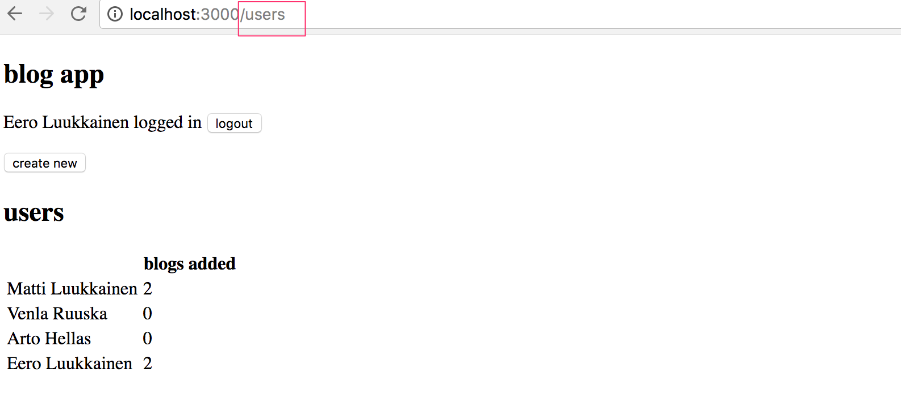
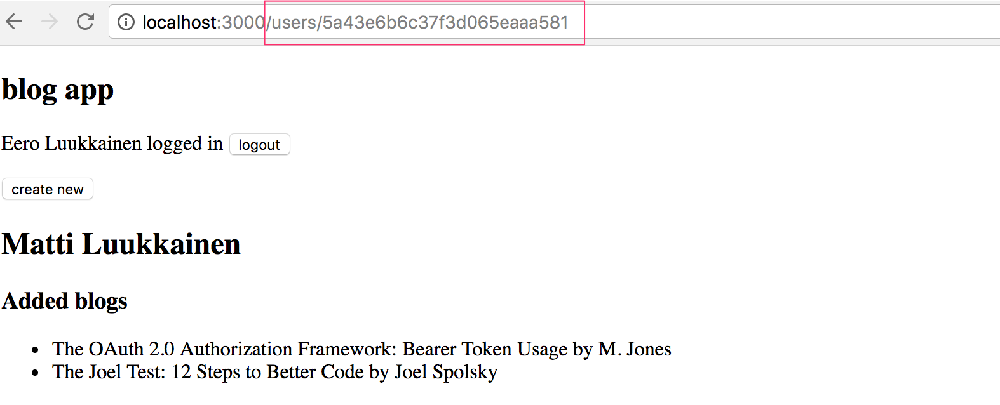
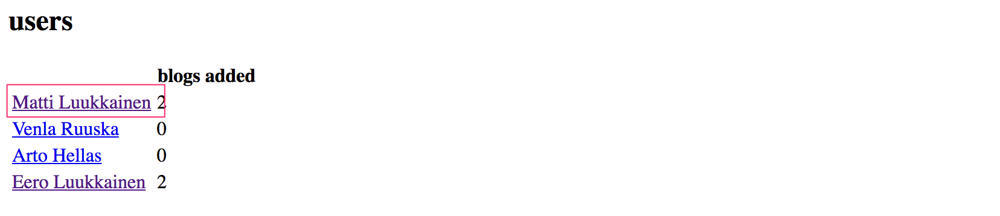
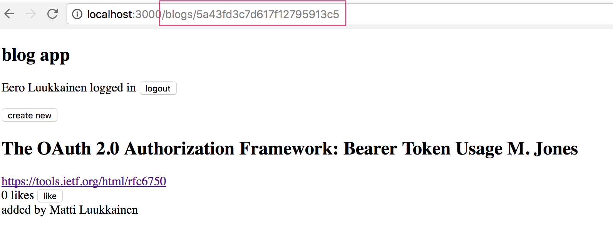
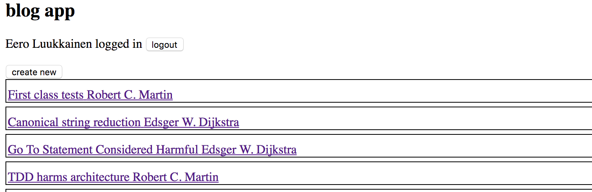
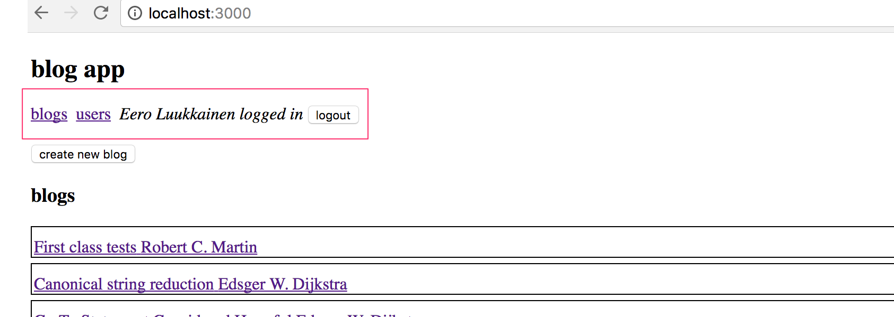
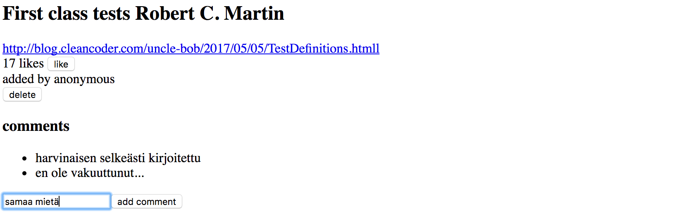
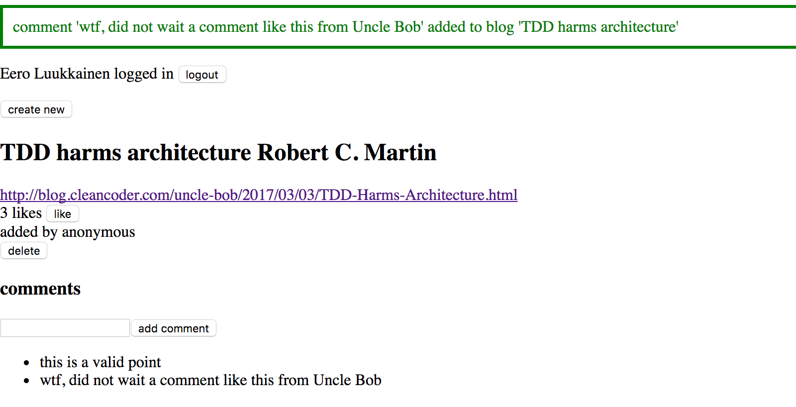

Tässä osassa luvun [React router](/osa7/react_router) kolmen tehtävän lisäksi 19 tehtävää, joissa jatketaan osissa 4 ja 5 tehtyä Bloglist-sovellusta.  Osa tämän seuraavassa olevista tehtävistä on toisistaan riippumattomia "featureita", eli tehtäviä ei tarvitse tehdä järjestyksessä, voit jättää osan aivan hyvin toteuttamatta.

Voit ottaa pohjaksi oman sovelluksesi sijaan myös mallivastauksen koodin.

Useimmat tämän osan tehtävistä vaativat olemassaolevan koodin refaktoroimista. Tämä on tilanne käytännössä aina sovelluksia laajennettaessa, eli vaikka refaktorointi voi olla hankalaa ja ikävääkin, on kyseessä oleellinen taito.

Hyvä neuvo niin refaktorointiin kuin uudenkin koodin kirjoittamiseen on <i>pienissä askelissa eteneminen</i>, koodia ei kannata hajottaa totaalisesti refaktorointia tehdessä pitkäksi aikaa, se on käytännössä varma resepti hermojen menettämiseen.

### Tehtäviä

### 7.4: redux, step1

Siirry käyttämään React-komponenttien tilan eli sijaan Reduxia.

Muuta tässä tehtävässä notifikaatio käyttämään Reduxia.

### 7.5 redux, step2

Siirrä kaikkien käyttäjien tietojen talletus Reduxiin. Varmista, että sekä kaikkien käyttäjien että yksittäisen käyttäjän näkymät toimivat edelleen.

Tässä tehtävässä saattaa olla hyödyksi käyttää metodin _mapStateToProps_ toista parametria
[ownPropsia](https://github.com/reactjs/react-redux/blob/master/docs/api.md#inject-todos-of-a-specific-user-depending-on-props) joka on dokumentaation hienoisesta kryptisyydestä huolimatta [aika simppeli](https://stackoverflow.com/questions/41198842/what-is-the-use-of-the-ownprops-arg-in-mapstatetoprops-and-mapdispatchtoprops) asia.

### 7.6 redux, step3

Siirrä myös blogien tietojen talletus Reduxiin.

Uuden blogin luomislomakkeen tilaa voit halutessasi hallita edelleen reactin tilan avulla.

Tämä ja seuraava osa ovat kohtuullisen työläitä, mutta erittäin opettavaisia.

### 7.7 redux, step4

Siirrä myös kirjautuneen käyttäjän tietojen talletus Reduxiin.

### 7.8 käyttäjien näkymä

Tee sovellukseen näkymä, joka näyttää kaikkiin käyttäjiin liittyvät perustietot:

### 7.9 yksittäisen käyttäjän näkymä, step1

Tee sovellukseen yksittäisen käyttäjän näkymä, jolta selviää mm. käyttäjän lisäämät blogit

Näkymään päästään klikkaamalla nimeä kaikkien käyttäjien näkymästä

### 7.10 yksittäisen käyttäjän näkymä step2

Merkkaa tämä tehtävä tehdyksi jos toteuttamasi yksittäisen käyttäjän näkymä toimii oikein myös siinä tilanteessa että menet urliin suoraan tai refreshaat selaimen ollessasi käyttäjän näkymässä.

### 7.11 blogin näkymä

Toteuta sovellukseen oma näkymä yksittäisille blogeille. Näkymä voi näyttää seuraavalta

Näkymään päästään klikkaamalla blogin nimeä kaikkien blogien näkymästä

Tämän tehtävän jälkeen tehtävässä 5.6 toteutettua toiminnallisuutta ei enää tarvita, eli kaikkien blogien näkymässä yksittäisten blogien detaljien ei enää tarvitse avautua klikatessa.

### 7.12 navigointi

Tee sovellukseen navigaatiomenu

### 7.13 kommentit, step1

Tee sovellukseen mahdollisuus blogien kommentointiin:

Kommentit ovat anonyymejä, eli ne eivät liity järjestelmän käyttäjiin.

Tässä tehtävässä riittää, että frontend osaa näyttää blogilla olevat backendin kautta lisätyt kommentit.

Sopiva rajapinta kommentin luomiseen on osoitteeseen _api/blogs/:id/comments_ tapahtuva HTTP POST -pyyntö.

### 7.14 kommentit, step2

Laajenna sovellusta siten, että kommentointi onnistuu frontendista käsin:

### 7.15 tyylit, step1

Tee sovelluksesi ulkoasusta tyylikkäämpi jotain kurssilla esiteltyä tapaa käyttäen

### 7.16 tyylit, step2

Jos käytät tyylien lisäämiseen yli tunnin aikaa, merkkaa myös tämä tehtävä tehdyksi.

### 7.17 ESLint

Konfiguroi frontend käyttämään Lintiä

### 7.18 Webpack

Tee sovellukselle sopiva webpack-konfiguraatio

### 7.19 End to end -testaus, step1

Tee sovellukselle ainakin kaksi E2E-testiä [Cypress-kirjaston](/osa7/luokkakomponentit_e_2_e_testaus#sovelluksen-end-to-end-testaus) avulla. Sopiva testattava asia on esim. käyttäjän kirjautuminen sovellukseen.

Tämän tehtävän testeissä voit olettaa, että tietokannan tila on testien kannalta sopiva, eli että tietokannassa on olemassa ainakin yksi käyttäjä. 

### 7.20 End to end -testaus, step2

Laajenna E2E-testejä siten, että testit [alustavat tietokannan](/osa7/luokkakomponentit_e_2_e_testaus#tietokannan-tilan-kontrollointi) aina ennen testien suorittamista. Tee myös ainakin yksi testi, joka muokkaa sovelluksen tietokantaa, esim. lisää sovellukseen blogin.

### 7.21 End to end -testaus, step3

Laajenna vielä E2E-testejäsi. Voit merkitä tehtävän, jos käytätä laajentamiseen vähintään 30 minuuttia aikaa.

### 7.22 Kurssipalaute

Anna kurssille palautetta weboodissa.

