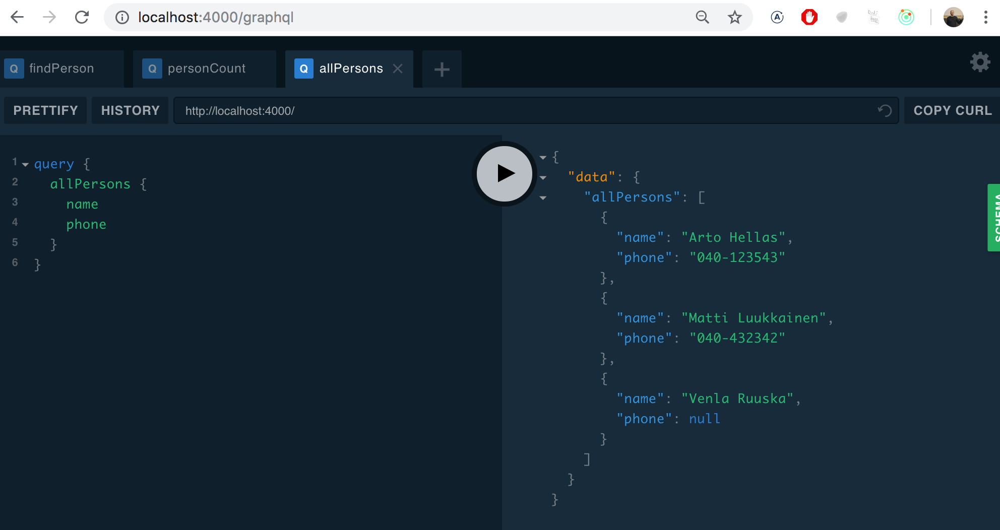
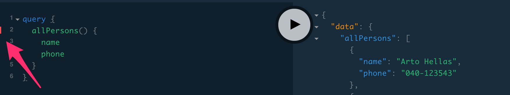
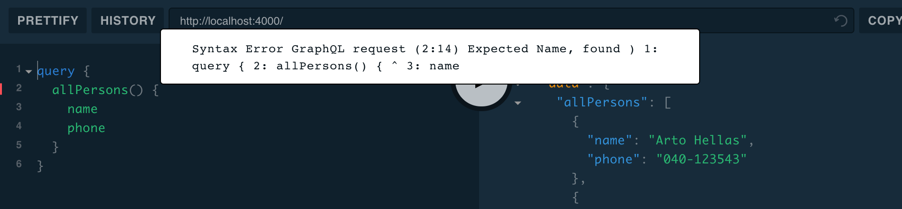
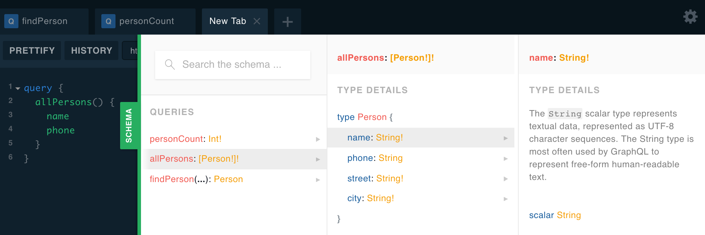
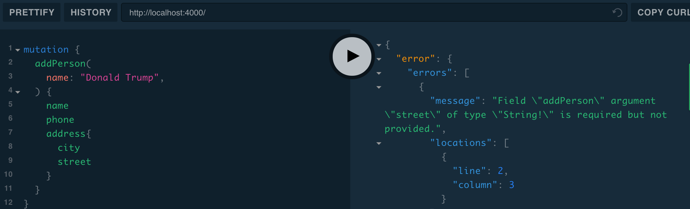
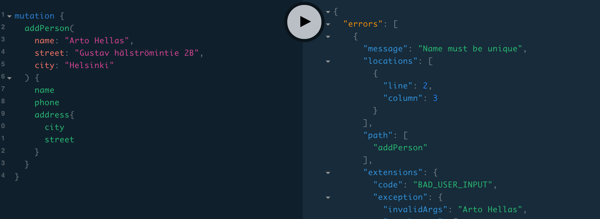
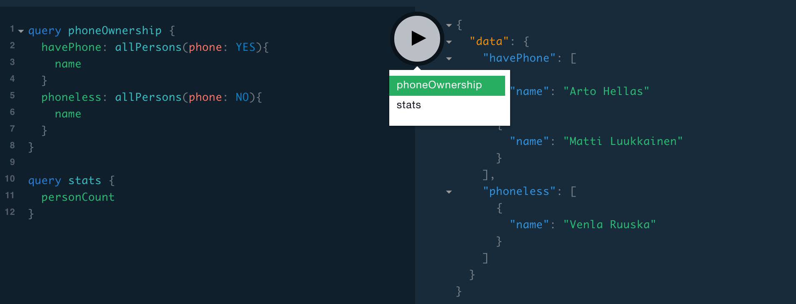

<div class="content">

Tälläkin kurssilla moneen kertaan käytetty REST on ollut pitkään vallitseva tapa toteuttaa palvelimen selaimelle tarjoama rajapinta ja yleensäkin verkossa toimivien sovellusten välinen integraatio.

RESTin rinnalle selaimessa ja mobiililaitteessa toimivan logiikan ja palvelimien väliseen kommunikointiin on viime vuosina noussut alunperin Facebookin kehittämä [GraphQL](http://graphql.org/).

GraphQL on filosofialtaan todella erilainen RESTiin verrattuna. REST on <i>resurssipohjainen</i>. Jokaisella resurssilla, esim. <i>käyttäjällä</i> on oma sen identifioiva osoite, esim. <i>/users/10</i> ja kaikki resursseille tehtävät operaatiot toteutetaan tekemällä URL:ille kohdistuvia pyyntöjä, joiden toiminta määrittyy käytetyn HTTP-metodin avulla.

RESTin resurssiperustaisuus toimii hyvin useissa tapauksissa, joissain tapauksissa se voi kuitenkin olla hieman kankea.

Oletetaan että blogilistasovelluksemme sisältäisi somemaista toiminnallisuutta ja haluaisimme esim. näyttää sovelluksessa listan, joka sisältää kaikkien seuraamiemme (follow) käyttäjien blogeja kommentoineiden käyttäjien lisäämien blogien nimet.

Jos palvelin toteuttaisi REST API:n, joutuisimme todennäköisesti tekemään monia HTTP-pyyntöjä selaimen koodista, ennen kuin saisimme muodostettua halutun datan. Pyyntöjen vastauksena tulisi myös paljon ylimääräistä dataa ja halutun datan keräävä selaimen koodi olisi todennäköisesti kohtuullisen monimutkainen.

Jos kyseessä olisi usein käytetty toiminnallisuus, voitaisiin sitä varten toteuttaa oma REST-endpoint. Jos vastaavia skeaarioita olisi paljon, esim. kymmeniä, tulisi erittäin työlääksi toteuttaa kaikille toiminnallisuuksille oma REST-endpoint.

GraphQL:n avulla toteutettava palvelin sopii tämänkaltaisiin tilanteisiin hyvin.

GraphQL:ssä periaatteena on, että selaimen koodi muodostaa <i>kyselyn</i>, joka kuvailee halutun datan ja lähettää sen API:lle HTTP POST -pyynnöllä. Toisin kuin REST:issä, GraphQL:ssä kaikki kyselyt kohdistetaan samaan osoitteeseen ja ovat POST-tyyppisiä.

Edellä kuvatun skenaarion data saataisiin haettua (suurinpiirtein) seuraavan kaltaisella kyselyllä:

```bash
query FetchBlogsQuery {
  user(username: "mluukkai") {
    followedUsers {
      blogs {
        comments {
          user {
            blogs {
              title
            }
          }
        }
      }
    }
  }
}
```


Palvelimen vastaus pyyntöön olisi suunnilleen seuraavanlainen JSON-olio:

```bash
{
  "data": {
    "followedUsers": [
      {
        "blogs": [
          {
            "comments": [
              {
                "user": {
                  "blogs": [
                    {
                      "title": "Goto considered harmful"
                    },
                    {
                      "title": "End to End Testing with Puppeteer and Jest"
                    },
                    {
                      "title": "Navigating your transition to GraphQL"
                    },
                    {
                      "title": "From REST to GraphQL"
                    }
                  ]
                }
              }
            ]
          }
        ]
      }
    ]
  }
}
```

Sovelluslogiikka säilyy yksinkertaisena ja selaimen koodi saa täsmälleen haluamansa datan yksittäisellä kyselyllä.

### Skeema ja kyselyt

Tutustutaan GraphQL:n peruskäsitteistöön toteuttamalla GraphQL-version osien 2 ja 3 puhelinluettelosovelluksesta.

Jokaisen GraphQL-sovelluksen ytimessä on [skeema](https://graphql.org/learn/schema/), joka määrittelee minkä muotoista dataa sovelluksessa vaihdetaan clientin ja palvelimen välillä. Puhelinluettelon alustava skeema on seuraavassa:

```js
type Person {
  name: String!
  phone: String
  street: String!
  city: String!
  id: ID! 
}

type Query {
  personCount: Int!
  allPersons: [Person!]!
  findPerson(name: String!): Person
}
```

Skeema määrittelee kaksi [tyyppiä](https://graphql.org/learn/schema/#type-system). Tyypeistä ensimmäinen <i>Person</i> määrittelee, että henkilöillä on viisi kenttää. Kentistä neljä on tyyppiä <i>String</i>, joka on yksi GraphQL:n määrittelemistä [valmiista tyypeistä](https://graphql.org/learn/schema/#scalar-types). String-arvoisista kentistä muilla paitsi puhelinnumerolla (<i>phone</i>) on oltava arvo, tämä on merkitty skeemaan huutomerkillä. Kentän <i>id</i> tyyppi on <i>ID</i>. Arvoltaan <i>ID</i>-tyyppiset kentät ovat merkkijonoja, mutta GraphQL takaa, että ne ovat uniikkeja.

Toinen skeeman määrittelemistä tyypeistä on [Query](https://graphql.org/learn/schema/#the-query-and-mutation-types). Käytännössä jokaisessa GraphQL-skeemassa määritellään tyyppi Query, joka kertoo mitä kyselyjä API:iin voidaan tehdä. 

Puhelinluettelo määrittelee kolme erilaista kyselyä ja _personCount_ palauttaa kokonaisluvun. _allPersons_ palauttaa listan <i>Person</i>-tyyppisiä olioita. <i>findPerson</i> saa merkkijonomuotoisen parametrin ja palauttaa <i>Person</i>-olion. 

Queryjen paluuarvon ja parametrin määrittelyssä on jälleen käytetty välillä huutomerkkiä merkkaamaan <i>pakollisuutta</i>, eli _personCount_ palauttaa varmasti kokonaisluvun. Kyselylle _findPerson_ on pakko antaa parametriksi merkkijono. Kysely palauttaa <i>Person</i>-olion tai arvon <i>null</i>. _allPersons_ palauttaa listan <i>Person</i>-olioita, listalla ei ole <i>null</i>-arvoja. 

Skeema siis määrittelee mitä kyselyjä client pystyy palvelimelta tekemään, minkälaisia parametreja kyselyillä voi olla sekä sen, minkä muotoista kyselyjen palauttama data on.

Kyselyistä yksinkertaisin _personCount_ näyttää seuraavalta

```js
query {
  personCount
}
```

Olettaen että sovellukseen olisi talletettu kolmen henkilön tiedot, vastaus kyselyyn näyttäisi seuraavalta:

```js
{
  "data": {
    "personCount": 3
  }
}
```

Kaikkien henkilöiden tiedot hakeva _allPersons_ on hieman monimutkaisempi. Koska kysely palauttaa listan <i>Person</i>-olioita, on kyselyn yhteydessä määriteltävä <i>mitkä kentät</i> kyselyn [halutaan palauttavan](https://graphql.org/learn/queries/#fields): 

```js
query {
  allPersons {
    name
    phone
  }
}
```

Vastaus voisi näyttää seuraavalta:


```js
{
  "data": {
    "allPersons": [
      {
        "name": "Arto Hellas",
        "phone": "040-123543"
      },
      {
        "name": "Matti Luukkainen",
        "phone": "040-432342"
      },
      {
        "name": "Venla Ruuska",
        "phone": null
      }
    ]
  }
}
```

Kysely voi määritellä palautettavaksi mitkä tahansa skeemassa mainitut kentät, esim. seuraava olisi myös mahdollista:

```js
query {
  allPersons{
    name
    city
    street
  }
}
```

Vielä esimerkki parametria edellyttävästä kyselystä, joka hakee yksittäisen henkilön tiedot palauttavasta kyselystä.

```js
query {
  findPerson(name: "Arto Hellas") {
    phone 
    city 
    street
    id
  }
}
```

Kyselyn parametri siis annetaan suluissa, ja sen jälkeen määritellään aaltosuluissa paluuarvona tulevan olion halutut kentät. 

Vastaus on muotoa:

```js
{
  "data": {
    "findPerson": {
      "phone": "040-123543",
      "city": "Espoo",
      "street": "Tapiolankatu 5 A"
      "id": "3d594650-3436-11e9-bc57-8b80ba54c431"
    }
  }
}
```

Kyselyn paluuarvoa ei oltu merkitty pakolliseksi, eli jos etsitään tuntematonta henkilöä

```js
query {
  findPerson(name: "Donald Trump") {
    phone 
  }
}
```

vastaus on <i>null</i>

```js
{
  "data": {
    "findPerson": null
  }
}
```

Kuten huomaamme, GraphQL kyselyn ja siihen vastauksena tulevan JSON:in muodoilla on vahva yhteys, voidaan ajatella että kysely kuvailee sen minkälaista dataa vastauksena halutaan. Ero REST:issä tehtäviin pyyntöihin on suuri, REST:iä käytettäessä pyynnon url ja sen tyyppi (GET, POST, PUT, DELETE) ei kerro mitään palautettavan datan muodosta. 

GraphQL:n skeema kuvaa ainoastaan palvelimen ja sitä käyttävien clientien välillä liikkuvan tiedon muodon. Tieto voi olla organisoituna ja talletettuna palvelimeen ihan missä muodossa tahansa.

Nimestään huolimatta GraphQL:llä ei itseasiassa ole mitään tekemistä tietokantojen kanssa, se ei ota mitään kantaa siihen miten data on tallennettu. GraphQL-periaattella toimivan API:n käyttämä data voi siis olla talletettu relaatiotietokantaan, dokumenttitietokantaan tai muille palvelimille, joita GraphQL-palvelin käyttää vaikkapa REST:in välityksellä. 

### Apollo server

Toteuteaan nyt GraphQL-palvelin tämän hetken johtavaa kirjastoa [Apollo -serveriä](https://www.apollographql.com/docs/apollo-server/) käyttäen. 

Luodaan uusi npm-projekti komennolla _npm init_ ja asennetaan tarvittavat riippuvuuet

```js
npm install --save apollo-server graphql
```

Alustava toteutus on seuraavassa

```js
const { ApolloServer, gql } = require('apollo-server')

let persons = [
  {
    name: "Arto Hellas",
    phone: "040-123543",
    street: "Tapiolankatu 5 A",
    city: "Espoo",
    id: "3d594650-3436-11e9-bc57-8b80ba54c431"
  },
  {
    name: "Matti Luukkainen",
    phone: "040-432342",
    street: "Malminkaari 10 A",
    city: "Helsinki",
    id: '3d599470-3436-11e9-bc57-8b80ba54c431'
  },
  {
    name: "Venla Ruuska",
    street: "Nallemäentie 22 C",
    city: "Helsinki",
    id: '3d599471-3436-11e9-bc57-8b80ba54c431'
  },
]

const typeDefs = gql`
  type Person {
    name: String!
    phone: String
    street: String!
    city: String! 
    id: ID!
  }

  type Query {
    personCount: Int!
    allPersons: [Person!]!
    findPerson(name: String!): Person
  }
`

const resolvers = {
  Query: {
    personCount: () => persons.length,
    allPersons: () => persons,
    findPerson: (root, args) =>
      persons.find(p => p.name === args.name)
  }
}

const server = new ApolloServer({
  typeDefs,
  resolvers,
})

server.listen().then(({ url }) => {
  console.log(`Server ready at ${url}`)
})
```

Toteutuksen ytimessä on _ApolloServer_, joka saa kaksi parametria 

```js
const server = new ApolloServer({
  typeDefs,
  resolvers,
})
```

parametreista ensimmäinen _typeDefs_ sisältää sovelluksen käyttämän GraphQL-skeeman. 

Toinen parametri on olio, joka sisältää palvelimen [resolverit](https://www.apollographql.com/docs/apollo-server/essentials/data.html#resolver-map), eli käytännössä koodin, joka määrittelee <i>miten</i> GraphQL-kyselyihin vastataan.

Resolverien koodi on seuraavassa:

```js
const resolvers = {
  Query: {
    personCount: () => persons.length,
    allPersons: () => persons,
    findPerson: (root, args) =>
      persons.find(p => p.name === args.name)
  }
}
```

kuten huomataan, vastaavat resolverit rakenteeltaan skeemassa määriteltyjä kyseilyitä:

```js
type Query {
  personCount: Int!
  allPersons: [Person!]!
  findPerson(name: String!): Person
}
```

eli jokaista skeemassa määriteltyä kyselyä kohti on määritelty oma kentän <i>Query</i> alle tuleva kenttänsä.

Kyselyn 

```js
query {
  personCount
}
```

resolveri on funktio

```js
() => persons.length
```

eli kyselyyn palautetaan vastauksena henkilöt tallentavan taulukon _persons_ pituus. 

Kaikki luettelossa olevat henkilöt hakevan kyselyn 

```js
query {
  allPersons {
    name
  }
}
```

resolveri on funktio, joka palauttaa <i>kaikki</i> taulukon _persons_ oliot

```js
() => persons
```

### GraphQL-playground

Kun Apollo -serveriä suoritetaan sovelluskehitysmoodissa, käynnistää se osoitteeseen [http://localhost:4000/graphql](http://localhost:4000/graphql) sovelluskehittäjälle erittäin hyödyllisen [GraphQL-playground](https://www.apollographql.com/docs/apollo-server/features/graphql-playground.html) näkymän, joka avulla on mahdollista tehdä kyselyjä palvelimelle.

Kokeillaan 



Playgroundin kanssa pitää olla välillä tarkkana. Jos kysely on syntaktisesti virheellinen, on virheilmoitus aika huomaamaton ja kyselyn suoritusnappia painamalla ei tapahdu mitään:



Edellisen kyselyn tulos näkyy edelleen playgroundin oikeassa osassa kyselyn virheellisyydestä huolimatta. 

Osoittamalla oikeaa kohtaa virheelliseltä riviltä saa virheilmoituksen näkyville



Jos Playground vaikuttaa olevan jumissa, niin sivun reloadaaminen yleensä auttaa.

Klikkaamalla oikean reunan tekstiä <i>schema</i> näyttää Playground palvelimen GraphQL-skeeman.



### Resolverin parametrit

Yksittäisen henkilön hakevan kyselyn

```js
query {
  findPerson(name: "Arto Hellas") {
    phone 
    city 
    street
  }
}
```

resolveri on funktio, joka poikkeaa kahdesta aiemmasta resolverista siinä että se saa <i>kaksi parametria</i>:

```js
(root, args) => persons.find(p => p.name === args.name)
```

Parametreista toinen _args_ sisältää kyselyn parametrit. Resolveri siis palauttaa taulukosta
 _persons_ henkilön, jonka nimi on sama kuin <i>args.name</i> arvo. Ensimmäisenä olevaa parametria _root_ resolveri ei tarvitse.

 Itseasiassa kaikki resolverifunktiot saavat [neljä parametria](https://www.apollographql.com/docs/graphql-tools/resolvers.html#Resolver-function-signature). Javascriptissa parametrit voidaan kuitenkin jättää määrittelemättä, jos niitä ei tarvita. Tulemme käyttämään resolverien ensimmäistä ja kolmatta parametria vielä myöhemmin tässä osassa.

### Oletusarvoinen resolveri

Kun teemme kyselyn, esim

```js
query {
  findPerson(name: "Arto Hellas") {
    phone 
    city 
    street
  }
}
```

osaa palvelin liittää vastaukseen täsmälleen ne kentät, joita kysely pyytää. Miten tämä tapahtuu?

GraphQL-palvelimen tulee määritellä resolverit <i>jokaiselle</i> skeemassa määritellyn tyypin kentälle. Olemme nyt määritelleet resolverit ainoastaan tyypin <i>Query</i> kentille, eli kaikille sovelluksen tarjoamille kyselyille. 

Koska skeemassa olevan tyypin <i>Person</i> kentille ei ole määritelty resolvereita, Apollo on määritellyt niille [oletusarvoisen resolverin](https://www.apollographql.com/docs/graphql-tools/resolvers.html#Default-resolver), joka toimii samaan tapaan kuin seuraavassa itse määritelty resolveri:


```js
const resolvers = {
  Query: {
    personCount: () => persons.length,
    allPersons: () => persons,
    findPerson: (root, args) => persons.find(p => p.name === args.name)
  },
  // highlight-start
  Person: {
    name: (root) => root.name,
    phone: (root) => root.phone,
    street: (root) => root.street,
    city: (root) => root.city,
    id: (root) => root.id
  }
  // highlight-end
}
```

Oletusarvoinen resolveri siis palauttaa olion vastaavan kentän arvon. Itse olioon se pääsee käsiksi resolverin ensimmäisen parametrin _root_ kautta. 

Jos oletusarvoisen resolverin toiminnallisuus riittää, ei omaa resolveria tarvitse määritellä. On myös mahdollista määritellä ainoastaan joillekin tyypin yksittäiselle kentille oma resolverinsa ja antaa oletusarvoisen resolverin hoitaa muut kentät.

Voisimme esimerkiksi määritellä, että kaikkien henkilöiden osoitteeksi tulisi <i>Manhattan New York</i> kovakoodaamalla seuraavat tyypin <i>Person</i> kenttien street ja city resolvereiksi:

```js
Person: {
  street: (root) => "Manhattan",
  city: (root) => "New York"
}
```

### Olion sisällä olio

Muutetaan skeemaa hiukan

```js
  // highlight-start
type Address {
  street: String!
  city: String! 
}
  // highlight-end

type Person {
  name: String!
  phone: String
  address: Address!   // highlight-line
  id: ID!
}

type Query {
  personCount: Int!
  allPersons: [Person!]!
  findPerson(name: String!): Person
}
```

eli henkilöllä on nyt kenttä, jonka tyyppi on <i>Address</i>, joka koostuu kadusta ja kaupungista. 

Osoitetta tarvitsevat kyselyt muuttuvat muotoon

```js
query {
  findPerson(name: "Arto Hellas") {
    phone 
    address {
      city 
      street
    }
  }
}
```

vastauksena on henkilö-olio, joka <i>sisältää</i> osoite-olion:

```js
{
  "data": {
    "findPerson": {
      "phone": "040-123543",
      "address":  {
        "city": "Espoo",
        "street": "Tapiolankatu 5 A"
      }
    }
  }
}
```

Talletetaan henkilöt palvelimella edelleen samassa muodossa kuin aiemmin.

```js
let persons = [
  {
    name: "Arto Hellas",
    phone: "040-123543",
    street: "Tapiolankatu 5 A",
    city: "Espoo",
    id: "3d594650-3436-11e9-bc57-8b80ba54c431"
  },
  // ...
]
```

Nyt siis palvelimen tallettamat henkilö-oliot eivät ole muodoltaan täysin samanlaisia kuin GraphQL-skeeman määrittelemät tyypin <i>Person</i> -oliot. 

Toisin kuin tyypille <i>Person</i> ei tyypille <i>Address</i> ole määritelty <i>id</i>-kenttää, sillä osoitteita ei ole talletettu palvelimella omaan tietorakenteeseensa.

Koska taulukkoon talletetuilla olioilla ei ole kenttää <i>address</i> oletusarvoinen resolveri ei enää riitä. Lisätään resolveri tyypin <i>Person</i> kentälle <i>address</i>:

```js
const resolvers = {
  Query: {
    personCount: () => persons.length,
    allPersons: () => persons,
    findPerson: (root, args) =>
      persons.find(p => p.name === args.name)
  },
  // highlight-start
  Person: {
    address: (root) => {
      return { 
        street: root.street,
        city: root.city
      }
    }
  }
  // highlight-end
}
```

Eli aina palautettaessa <i>Person</i>-oliota, palautetaan niiden kentät <i>name</i>, <i>phone</i> sekä <i>id</i> käyttäen oletusarvoista resolveria, kenttä <i>address</i> muodostetaan itse määritellyn resolverin avulla. Resolverifunktion parametrina _root_ on käsittelyssä oleva henkilö-olio, eli osoitteen katu ja kaupunki saadaan sen kentistä.

Sovelluksen tämänhetkinen koodi on kokonaisuudessaan [githubissa](https://github.com/fullstack-hy2019/graphql-phonebook-backend/tree/part8-1), branchissa <i>part8-1</i>.

### Mutaatio

Laajennetaan sovellusta siten, että puhelinluetteloon on mahdollista lisätä uusia henkilöitä. GraphQL:ssä kaikki muutoksen aiheuttavat operaatiot tehdään [mutaatioiden](https://graphql.org/learn/queries/#mutations) avulla. Mutaatiot määritellään skeemaan tyypin <i>Mutation</i> avaimina.

Käyttäjän lisäävä mutaation skeema näyttää seuraavalta

```js
type Mutation {
  addPerson(
    name: String!
    phone: String
    street: String!
    city: String!
  ): Person
}
```

Mutaatio siis saa parametreina käyttäjän tiedot. Parametreista <i>phone</i> on ainoa, jolle ei ole pakko asettaa arvoa. Mutaatioilla on parametrien lisäksi paluuarvo. Paluuarvo on nyt tyyppiä <i>Person</i>, ideana on palauttaa operaation onnistuessa lisätyn henkilön tiedot ja muussa tapauksessa <i>null</i>. Mutaatiossa ei anneta parametrina kentän <i>id</i> arvoa, sen luominen on parempi jättää palvelimen vastuulle.

Myös mutaatioita varten on määriteltävä resolveri:

```js
const uuid = require('uuid/v1')

// ...

const resolvers = {
  // ...
  Mutation: {
    addPerson: (root, args) => {
      if (persons.find(p => p.name === args.name)) {
        throw new UserInputError('Name must be unique', {
          invalidArgs: args.name,
        })
      }

      const person = { ...args, id: uuid() }
      persons = persons.concat(person)
      return person
    }
  }
}
```

Mutaatio siis lisää parametreina _args_ saamansa olion taulukkoon _persons_ ja palauttaa lisätyn olion. 

Kentälle <i>id</i> saadaan luotua uniikki tunniste kirjaston [uuid](https://github.com/kelektiv/node-uuid#readme) avulla. 

Uusi henkilö voidaan lisätä seuraavalla mutaatiolla

```js
mutation {
  addPerson(
    name: "Pekka Mikkola"
    phone: "045-2374321"
    street: "Vilppulantie 25"
    city: "Helsinki"
  ) {
    name
    phone
    address{
      city
      street
    }
    id
  }
}
```

Kannattaa huomata, että lisättävä henkilö talletetaan taulukkoon _persons_ muodossa

```js
{
  name: "Pekka Mikkola",
  phone: "045-2374321",
  street: "Vilppulantie 25",
  city: "Helsinki",
  id: "2b24e0b0-343c-11e9-8c2a-cb57c2bf804f"
}
```

Vastaus mutaatioon on kuitenkin

```js
{
  "data": {
    "addPerson": {
      "name": "Pekka Mikkola",
      "phone": "045-2374321",
      "address": {
        "city": "Helsinki",
        "street": "Vilppulantie 25"
      },
      "id": "2b24e0b0-343c-11e9-8c2a-cb57c2bf804f"
    }
  }
}
```

eli tyypin <i>Person</i> kentän <i>address</i> resolveri muotoilee vastauksena palautettavan olion oikean muotoiseksi.

### Virheiden käsittely

Jos yritämme luoda uuden henkilön, mutta parametrit eivät vastaa skeemassa määriteltyä (esim. katuosoite puuttuu), antaa palvelin virheilmoituksen: 



GraphQL:n [validoinnin](https://graphql.org/learn/validation/) avulla pystytään siis jo automaattisesi hoitamaan osa virheenkäsittelyä. 

Kaikkea GraphQL ei kuitenkaan pysty hoitamaan automaattisesti. Esimerkiksi tarkemmat säännöt mutaatiolla lisättävän datan kenttien muodolle on lisättävä itse. Niistä aiheutuvat virheet tulee hoitaa [GraphQL:n poikkeuskäsittelymekanismilla](https://www.apollographql.com/docs/apollo-server/features/errors.html).

Estetään saman nimen lisääminen puhelinluetteloon useampaan kertaan:

```js
const { ApolloServer, UserInputError, gql } = require('apollo-server') // highlight-line

// ...

const resolvers = {
  // ..
  Mutation: {
    addPerson: (root, args) => {
      // highlight-start
      if (persons.find(p => p.name === args.name)) {
        throw new UserInputError('Name must be unique', {
          invalidArgs: args.name,
        })
      }
      // highlight-end

      const person = { ...args, id: uuid() }
      persons = persons.concat(person)
      return person
    }
  }
}
```

Eli jos lisättävä nimi on jo luettelossa heitetään poikkeus _UserInputError_.



Sovelluksen tämänhetkinen koodi on kokonaisuudessaan [githubissa](https://github.com/fullstack-hy2019/graphql-phonebook-backend/tree/part8-2), branchissa <i>part8-2</i>.

### Enum

Tehdään sovellukseen vielä sellainen lisäys, että kaikki henkilöt palauttavaa kyselyä voidaan säädellä parametrilla <i>phone</i> siten, että kysely palauttaa vain henkilöt, joilla on puhelinnumero

```js
query {
  allPersons(phone: YES) {
    name
    phone 
  }
}
```

tai henkilöt, joilla ei ole puhelinnumeroa

```js
query {
  allPersons(phone: NO) {
    name
  }
}
```

Skeema laajenee seuraavasti:

```js
// highlight-start
enum YesNo {
  YES
  NO
}
// highlight-end

type Query {
  personCount: Int!
  allPersons(phone: YesNo): [Person!]! // highlight-line
  findPerson(name: String!): Person
}
```

Tyyppi <i>YesNo</i> on GraphQL:n [enum](https://graphql.org/learn/schema/#enumeration-types), eli lueteltu tyyppi, jolla on kaksi mahdollista arvoa, <i>YES</i> ja <i>NO</i>. Kyselyssä _allPersons_ parametri _phone_ on tyypiltään <i>YesNo</i>, mutta sen arvo ei ole pakollinen.

Resolveri muuttuu seuraavasti

```js
Query: {
  personCount: () => persons.length,
  // highlight-start
  allPersons: (root, args) => {
    if (!args.phone) {
      return persons
    }

    const byPhone = (person) =>
      args.phone === 'YES' ? person.phone : !person.phone

    return persons.filter(byPhone)
  },
  // highlight-end
  findPerson: (root, args) =>
    persons.find(p => p.name === args.name)
},
```

### Numeron muutos

Tehdään sovellukseen myös mutaatio, joka mahdollistaa henkilön puhelinnumeron muuttamisen. Mutaation skeema näyttää seuraavalta

```js
type Mutation {
  addPerson(
    name: String!
    phone: String
    street: String!
    city: String!
  ): Person
  // highlight-start
  editNumber(
    name: String!
    phone: String!
  ): Person
  // highlight-end
}
```

ja sen toteuttaa seuraava resolveri:

```js
Mutation: {
  // ...
  editNumber: (root, args) => {
    const person = persons.find(p => p.name === args.name)
    if (!person) {
      return null
    }

    const updatedPerson = { ...person, phone: args.phone }
    persons = persons.map(p => p.name === args.name ? updatedPerson : p)
    return updatedPerson
  }   
}
```

Mutaatio hakee siis hakee kentän <i>name</i> perusteella henkilön, jonka numero päivitetään.

Sovelluksen tämänhetkinen koodi on kokonaisuudessaan [githubissa](https://github.com/fullstack-hy2019/graphql-phonebook-backend/tree/part8-3), branchissa <i>part8-3</i>.

### Lisää kyselyistä

GraphQL:ssä on yhteen kyselyyn mahdollista yhdistää monia tyypin <i>Query</i> kenttiä, eli "yksittäisiä kyselyitä". Esim. seuraava kysely palautta puhelinluettelon henkilöiden lukumäärän sekä nimet:

```js
query {
  personCount
  allPersons {
    name
  }
}
```

Vastaus näyttää seuraavalta

```js
{
  "data": {
    "personCount": 3,
    "allPersons": [
      {
        "name": "Arto Hellas"
      },
      {
        "name": "Matti Luukkainen"
      },
      {
        "name": "Venla Ruuska"
      }
    ]
  }
}
```

Yhdistetty kysely voi myös viitata useampaan kertaan samaan kyselyyn. Tällöin erillisille kyselyille on kuitenkin annettava vaihtoehtoiset nimet kaksoispistesyntaksilla

```js
query {
  havePhone: allPersons(phone: YES){
    name
  }
  phoneless: allPersons(phone: NO){
    name
  }
}
```

Vastaus on muotoa

```js
{
  "data": {
    "havePhone": [
      {
        "name": "Arto Hellas"
      },
      {
        "name": "Matti Luukkainen"
      }
    ],
    "phoneless": [
      {
        "name": "Venla Ruuska"
      }
    ]
  }
}
```

Joissain tilanteissa voi myös olla hyötyä nimetä kyselyt. Näin on erityisesti tilanteissa, joissa kyselyillä tai mutaatiolla on [parametreja](https://graphql.org/learn/queries/#variables). Tutustumme parametreihin pian.

Jos kyselyitä on useita, pyytää Playground valitsemaan mikä niistä suoritetaan:



</div>

<div class="tasks">

### Tehtäviä

Tehtävissä toteutetaan yksinkertaisen kirjaston GraphQL:ää tarjoava backend. Ota sovelluksesi lähtökohtaksi [tämä tiedosto](https://github.com/fullstack-hy2019/misc/blob/master/library-backend.js). Muista _npm init_ ja riippuvuuksien asentaminen!

#### 8.1: kirjojen ja kirjailijoiden määrä

Toteuta kyselyt _bookCount_ ja _authorCount_ jotka palauttavat kirjojen ja kirjailijoiden lukumäärän.

Kyselyn 

```js
query {
  bookCount
  authorCount
}
```

pitäisi alustavalla datalla tuottaa vastaus

```js
{
  "data": {
    "bookCount": 7,
    "authorCount": 5
  }
}
```

#### 8.2: kaikki kirjat ja kirjailijat

Toteuta kysely _allBooks_,  joka palauttavat kaikki kirjat.

Seurava kysely siis pitäisi pystyä tekemään

```js
query {
  allBooks { 
    title 
    author
    published 
    genres
  }
}
```

#### 8.3: kaikki kirjailijat

Toteuta kysely _allAuthors_ joka palauttaa kaikki kirjailijat. Kyselyn vastauksessa kirjailijoilla tulee myös olla kenttä _bookCount_ joka kertoo kirjailijan tekemien kirjojen määrän.

Esim. kyselyn

```js
query {
  allAuthors {
    name
    bookCount
  }
}
```

vastauksen tulisi näyttää seuraavalta

```js
{
  "data": {
    "allAuthors": [
      {
        "name": "Robert Martin",
        "bookCount": 2
      },
      {
        "name": "Martin Fowler",
        "bookCount": 1
      },
      {
        "name": "Fyodor Dostoevsky",
        "bookCount": 2
      },
      {
        "name": "Joshua Kerievsky",
        "bookCount": 1
      },
      {
        "name": "Sandi Metz",
        "bookCount": 1
      }
    ]
  }
}
```

#### 8.4: kirjailijan kirjat

Laajenna kyselyä _allBooks_ siten, että sille voi antaa optionaalisen parametrin <i>author</i>, joka rajoittaa kirjalistan niihin, joiden author on parametrina annettu kirjailija.

Esim. kyselyn

```js
query {
  allBooks(author: "Robert Martin") {
    title
  }
}
```

tulisi palauttaa

```js
{
  "data": {
    "allBooks": [
      {
        "title": "Clean Code"
      },
      {
        "title": "Agile software development"
      }
    ]
  }
}
```

#### 8.5: genren kirjat

Laajenna kyselyä _allBooks_ siten, että sille voi antaa optionaalisen parametrin <i>genre</i>, joka rajoittaa kirjalistan niihin, joiden genrejen joukossa on parametrina annettu genre.

Esim. kyselyn

```js
query {
  allBooks(genre: "refactoring") {
    title
    author
  }
}
```

tulisi palauttaa

```js
{
  "data": {
    "allBooks": [
      {
        "title": "Clean Code",
        "author": "Robert Martin"
      },
      {
        "title": "Refactoring, edition 2",
        "author": "Martin Fowler"
      },
      {
        "title": "Refactoring to patterns",
        "author": "Joshua Kerievsky"
      },
      {
        "title": "Practical Object-Oriented Design, An Agile Primer Using Ruby",
        "author": "Sandi Metz"
      }
    ]
  }
}
```

Kyselyn pitää toimia myös siinä tapauksessa, että se saa molemmat optionaaliset parametrit:

```js
query {
  allBooks(author: "Robert Martin", genre: "refactoring") {
    title
    author
  }
}
```

#### 8.6: Kirjan lisäys

Toteuta mutaatio _addBook_, jota voi käyttää seuraavasti

```js
mutation {
  addBook(
    title: "NoSQL Distilled",
    author: "Martin Fowler",
    published: 2012,
    genres: ["database", "nosql"]
  ) {
    title,
    author
  }
}
```

Mutaatio toimii myös niissä tilanteissa, joissa kirjoittaja ei ole ennestään palvelimen tiedossa:

```js
mutation {
  addBook(
    title: "Pimeyden tango",
    author: "Reijo Mäki",
    published: 1997,
    genres: ["crime"]
  ) {
    title,
    author
  }
}
```

Jos näin on, lisätään uusi kirjailija järjestelmään. Kirjailijan syntymävuodesta ei ole tässä vaiheessa tietoa, eli kysely

```js
query {
  allAuthors {
    name
    born
    bookCount
  }
}
```

palauttaa

```js
{
  "data": {
    "allAuthors": [
      // ...
      {
        "name": "Reijo Mäki",
        "born": null,
        "bookCount": 1
      }
    ]
  }
}
```

#### 8.7: Kirjailijan syntymävuoden päivitys

Toteuta mutaatio _editAuthor_ jonka avulla on mahdollista asettaa kirjailijalle syntymävuosi. Mutaatiota käytetään seuraavasti

```js
mutation {
  editAuthor(name: "Reijo Mäki", setBornTo: 1958) {
    name
    born
  }
}
```

Jos kirjailija löytyy, palauttaa operaatio editoidun kirjailijan:

```js
{
  "data": {
    "editAuthor": {
      "name": "Reijo Mäki",
      "born": 1958
    }
  }
}
```

Olemattoman kirjailijan syntymävuoden editointiin reagoidaan palauttamalla <i>null</i>:

```js
{
  "data": {
    "editAuthor": null
  }
}
```

</div>
