<div class="content">

Toteutetaan seuraavaksi React-sovellus, joka käyttää toteuttamaamme GraphQL-palvelinta. Palvelimen tämänhetkinen koodi on kokonaisuudessaan [githubissa](https://github.com/fullstack-hy2019/graphql-phonebook-backend/tree/part8-3), branchissa <i>part8-3</i>.

GraphQL:ää on periaatteessa mahdollista käyttää HTTP POST -pyyntöjen avulla. Seuraavassa esimerkki Postmanilla tehdystä kyselystä.

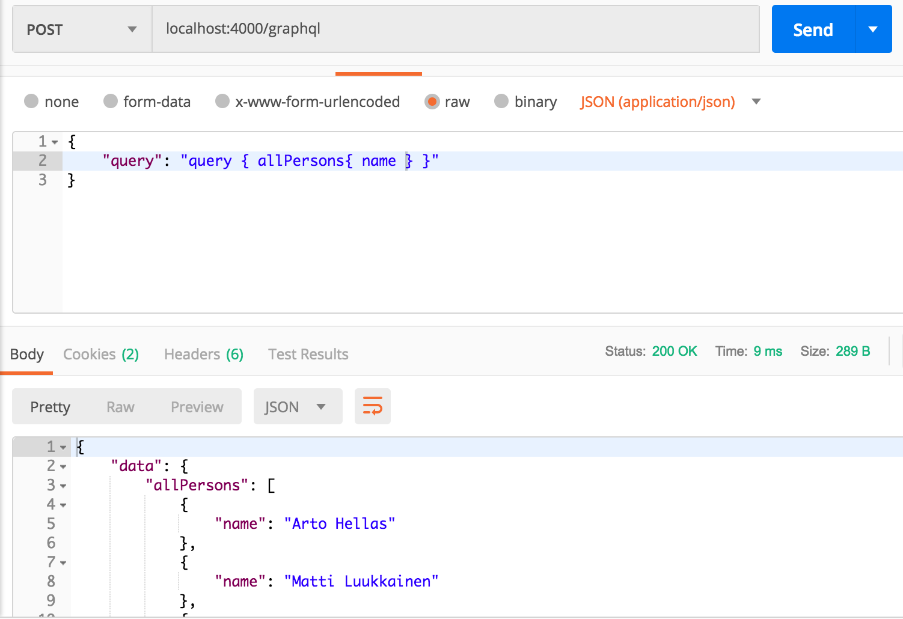

Kommunikointi tapahtuu siis osoitteeseen http://localhost:4000/graphql kohdistuvina POST-pyyntöinä, ja itse kysely lähetetään pyynnön mukana merkkijonona avaimen <i>query</i> arvona.

Voisimmekin hoitaa React-sovelluksen ja GraphQL:n kommunikoinnin Axiosilla. Tämä ei kuitenkaan ole useimmiten järkevää ja on parempi idea käyttää korkeamman tason kirjastoa, joka pystyy abstrahoimaan kommunikoinnin turhia detaljeja. Tällä hetkellä järkeviä vaihtoehtoja on kaksi: Facebookin [Relay](https://facebook.github.io/relay/) ja
[Apollo Client](https://www.apollographql.com/docs/react/). Näistä Apollo on ylivoimaisesti suositumpi ja myös meidän valintamme.

### Apollo client

Luodaan uusi React-sovellus ja asennetaan siihen [Apollo clientin](https://www.apollographql.com/docs/react/essentials/get-started.html#installation) vaatimat riippuvuudet.

```js
npm install apollo-boost react-apollo graphql --save
```

Aloitetaan seuraavalla ohjelmarungolla.

```js
import React from 'react'
import ReactDOM from 'react-dom'

import ApolloClient, { gql } from 'apollo-boost'

const client = new ApolloClient({
  uri: 'http://localhost:4000/graphql'
})

const query = gql`
{
  allPersons  {
    name,
    phone,
    address {
      street,
      city
    }
    id
  }
}
`

client.query({ query })
  .then((response) => {
    console.log(response.data)
  })

const App = () => {
  return <div>
    test
  </div>
}

ReactDOM.render(<App />, document.getElementById('root'))
```

Koodi aloittaa luomalla [client](https://www.apollographql.com/docs/react/essentials/get-started.html#creating-client)-olion, jonka avulla se lähettää kyselyn palvelimelle:

```js
client.query({ query })
  .then((response) => {
    console.log(response.data)
  })
```

Palvelimen palauttama vastaus tulostuu konsoliin:

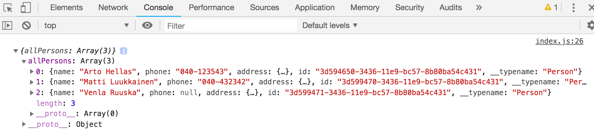

Sovellus pystyy siis kommunikoimaan GraphQL-palvelimen kanssa olion _client_ välityksellä. Client saadaan sovelluksen kaikkien komponenttien saataville käärimällä komponenttti <i>App</i> komponentin [ApolloProvider](https://www.apollographql.com/docs/react/essentials/get-started.html#creating-provider) lapseksi:

```js
import React from 'react'
import ReactDOM from 'react-dom'
import App from './App' // highlight-line
import ApolloClient, { gql } from 'apollo-boost'
import { ApolloProvider } from 'react-apollo' // highlight-line

const client = new ApolloClient({
  uri: 'http://localhost:4000/graphql'
})

ReactDOM.render(
  // highlight-start
  <ApolloProvider client={client} >
    <App />
  </ApolloProvider>, 
  // highlight-end
  document.getElementById('root')
)
```

### Query-komponentti

Olemme valmiina toteuttamaan sovelluksen päänäkymän, joka listaa kaikkien henkilöiden puhelinnumerot. 

Apollo Client tarjoaa muutaman vaihtoehtoisen tavan kyselyjen tekemiselle.
Tämän hetken (tämä osa on kirjoitettu 17.2.2019) vallitseva käytäntö on komponentin [Query](https://www.apollographql.com/docs/react/essentials/queries.html) käyttäminen.

Kyselyn tekevän komponentin <i>App</i> koodi näyttää seuraavalta:

```js
import React from 'react'
import { Query } from 'react-apollo'
import { gql } from 'apollo-boost'

const ALL_PERSONS = gql`
{
  allPersons  {
    name
    phone
    id
  }
}
`

const App = () => {
  return <Query query={ALL_PERSONS}>
    {(result) => { 
      if ( result.loading ) {
        return <div>loading...</div>
      }
      return (
        <div>
          {result.data.allPersons.map(p => p.name).join(', ')}
        </div>
      )
    }}
  </Query>
}

export default App
```

Koodi vaikuttaa hieman sekavalta. Koodin ytimessä on komponentti <i>Query</i>, joka saa parametrina <i>query</i> suoritettavan kyselyn joka on muuttujassa <em>ALL\_PERSONS</em>. Komponentin <i>Query</i> tagien sisällä on <i>funktio</i>, joka palauttaa varsinaisen renderöitävän JSX:n. Funktion parametri <i>results</i> sisältää GraphQL-kyselyn tuloksen.

Tuloksella eli parametrissa _results_ olevalla oliolla on [useita kenttiä](https://www.apollographql.com/docs/react/essentials/queries.html#render-prop). Kenttä <i>loading</i> on arvoltaan tosi, jos kyselyyn ei ole saatu vielä vastausta. Tässä tilanteessa renderöitävä koodi on 

```js
if ( result.loading ) {
  return <div>loading...</div>
}
```

Kun tulos on valmis, otetaan tuloksen kentästä <i>data</i> kyselyn <i>allPersons</i> vastaus ja renderöidään luettelossa olevat nimet ruudulle.

```js
<div>
  {result.data.allPersons.map(p => p.name).join(', ')}
</div>
```

Saadaksemme ratkaisua hieman siistimmäksi, eriytetään henkilöiden näyttäminen omaan komponenttiin <i>Persons</i>. Komponentti <i>App</i> muuttuu seuraavasti:

```js
const App = () => {
  return (
    <Query query={ALL_PERSONS}>
      {(result) => <Persons result={result} />}
    </Query>
  )
}
```

Eli <i>App</i> välittää kyselyn tuloksen komponentille <i>Persons</i> propsina:

```js
const Persons = ({ result }) => {
  if (result.loading) {
    return <div>loading...</div>
  }

  const persons = result.data.allPersons 

  return (
    <div>
      <h2>Persons</h2>
      {persons.map(p =>
        <div key={p.name}>
          {p.name} {p.phone}
        </div>  
      )}
    </div>
  )
}
```

### Nimetyt kyselyt ja muuttujat

Toteutetaan sovellukseen ominaisuus, jonka avulla on mahdollisuus nähdä yksittäisen henkilön osoitetiedot. Palvelimen tarjoama kysely <i>findPerson</i> sopii hyvin tarkoitukseen. 

Edellisessä luvussa tekemissämme kyselyissä parametri oli kovakoodattuna kyselyyn:

```js
query {
  findPerson(name: "Arto Hellas") {
    phone 
    city 
    street
    id
  }
}
```

Kun teemme kyselyjä ohjelmallisesti, on kyselyn parametrit pystyttävä antamaan dynaamisesti. 

Tähän tarkoitukseen sopivat GraphQL:n [muuttujat](https://graphql.org/learn/queries/#variables). Muuttujia käyttääksemme on kysely myös nimettävä.

Sopiva muoto kyselylle on seuraava:

```js
query findPersonByName($nameToSearch: String!) {
  findPerson(name: $nameToSearch) {
    name
    phone 
    address {
      street
      city
    }
  }
}
```

Kyselyn nimenä on <i>findPersonByName</i>, ja se saa yhden merkkijonomuotoisen parametrin <i>$nameToSearch</i>. 

Myös GraphQL Playground mahdollistaa muuttujia sisältävän kyselyjen tekemisen. Tällöin muuttujille on annettava arvot kohdassa <i>Query variables</i>:

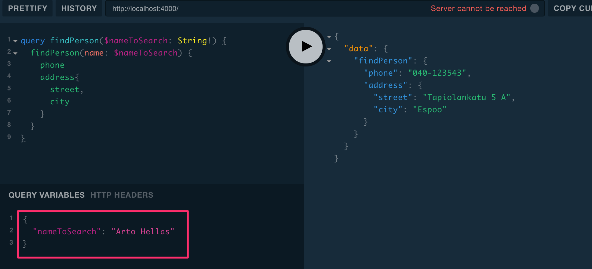

Äsken käyttämämme komponentti <i>Query</i> ei sovellu optimaalisella tavalla tarkoitukseen sillä haluaisimme tehdä kyselyn vasta siinä vaiheessa kun käyttäjä haluaa nähdä jonkin henkilön tiedot. 

Eräs tapa on käyttää suoraan <i>client</i> -olion metodia <i>query</i>. Sovelluksen komponentit pääsevät käsiksi query-olioon komponentin [ApolloConsumer](https://www.apollographql.com/docs/react/essentials/queries.html#manual-query) avulla.

Muutetaan komponenttia <i>App</i> siten, että se hakee <i>ApolloConsumerin</i> avulla viitteen _query_-olioon ja välittää sen komponentille <i>Persons</i>.

```js
import { Query, ApolloConsumer } from 'react-apollo' // highlight-line

// ...

const App = () => {
  return (
    <ApolloConsumer>
      {(client => 
        <Query query={ALL_PERSONS}>
          {(result) => 
            <Persons result={result} client={client} /> 
          }
        </Query> 
      )}
    </ApolloConsumer>
  )
}
```

Komponentti <i>Persons</i> muuttuu seuraavasti:

```js
// highlight-start
const FIND_PERSON = gql`
query findPersonByName($nameToSearch: String!) {
  findPerson(name: $nameToSearch) {
    name
    phone 
    id
    address {
      street
      city
    }
  }
}
`
// highlight-end

const Persons = ({ result, client }) => {
  if (result.loading) {
    return <div>loading...</div>
  }

// highlight-start
  const [person, setPerson] = useState(null)
// highlight-end

// highlight-start
  const showPerson = async (name) => {
    const { data } = await client.query({
      query: FIND_PERSON,
      variables: { nameToSearch: name }
    })
    setPerson(data.findPerson)
  }
// highlight-end

// highlight-start
  if (person) {
    return(
      <div>
        <h2>{person.name}</h2>
        <div>{person.address.street} {person.address.city}</div>
        <div>{person.phone}</div>
        <button onClick={() => setPerson(null)}>close</button>
      </div>
    )
  }
// highlight-end

  return (
    <div>
      <h2>Persons</h2>
      {result.data.allPersons.map(p =>
        <div key={p.name}>
          {p.name} {p.phone}
          // highlight-start
          <button onClick={() => showPerson(p.name)} >
            show address
          </button> 
          // highlight-end
        </div>  
      )}
    </div>
  )
}
```

Jos henkilön yhteydessä olevaa nappia painetaan, tekee komponentti GraphQL-kyselyn henkilön tiedoista ja tallettaa vastauksen komponentin tilaan <i>person</i>:

```js
const showPerson = async (name) => {
  const { data } = await client.query({
    query: FIND_PERSON,
    variables: { nameToSearch: name }
  })

  setPerson(data.findPerson)
}
```

Jos tilalla _person_ on arvo, näytetään kaikkien henkilöiden sijaan yhden henkilön tarkemmat tiedot:

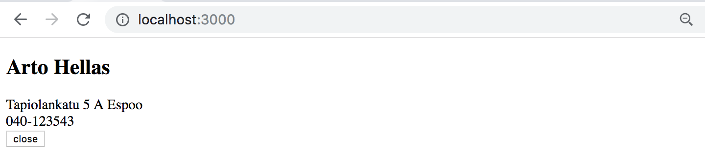

Ratkaisu ei ole siistein mahdollinen mutta saa kelvata meille.

Sovelluksen tämänhetkinen koodi on kokonaisuudessaan [githubissa](https://github.com/fullstack-hy2019/graphql-phonebook-frontend/tree/part8-1), branchissa <i>part8-1</i>.

### Välimuisti

Kun haemme monta kertaa esim. Arto Hellaksen tiedot, huomaamme mielenkiintoisen asian: kysely backendiin tapahtuu ainoastaan tietojen ensimmäisellä katsomiskerralla. Tämän jälkeen, siitäkin huolimatta, että koodi tekee saman kyselyn uudelleen, ei kyselyä lähetetä backendille:

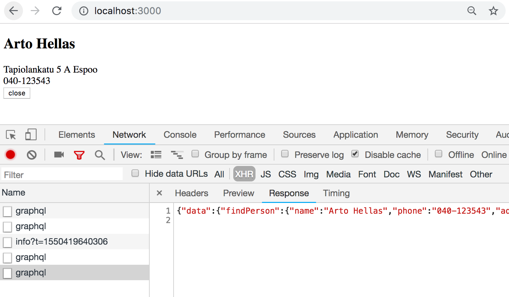

Apollo client tallettaa kyselyjen tulokset cacheen eli [välimuistiin](https://www.apollographql.com/docs/react/advanced/caching.html) ja optimoi suoritusta siten, että jos kyselyn vastaus on jo välimuistissa, ei kyselyä lähetetä ollenkaan palvelimelle.

Chromeen on mahdollista asentaa lisäosa [Apollo Client devtools](https://chrome.google.com/webstore/detail/apollo-client-developer-t/jdkknkkbebbapilgoeccciglkfbmbnfm/related), jonka avulla voidaan tarkastella mm. välimuistin tilaa

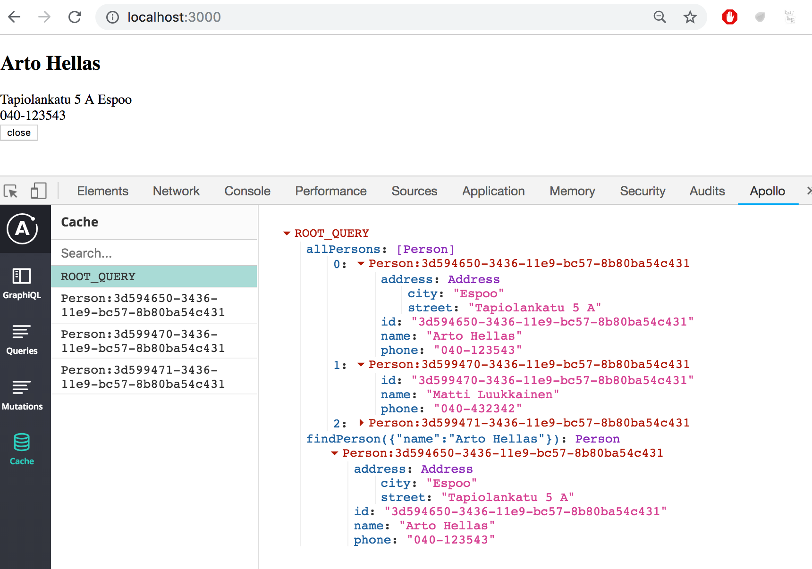

Tieto on organisoitu välimuistiin kyselykohtaisesti. Koska <i>Person</i>-tyypin olioilla on identifioiva kenttä <i>id</i>, jonka tyypiksi on määritelty <i>ID</i>, osaa Apollo yhdistää kahden eri kyselyn palauttaman saman olion. Tämän ansiosta Arto Hellaksen osoitetietojen hakeminen kyselyllä <i>findPerson</i> on päivittänyt välimuistia Arton osoitetietojen osalta myös kyselyn <i>allPersons</i> alta.

### Mutation-komponentti

Toteutetaan sovellukseen mahdollisuus uusien henkilöiden lisäämiseen. Sopivan toiminnallisuuden tarjoaa komponentti [mutation](https://www.apollographql.com/docs/react/essentials/mutations.html#basic). Edellisessä luvussa kovakoodasimme mutaatioiden parametrit. Tarvitsemme nyt [muuttujia](https://graphql.org/learn/queries/#variables) käyttävän version henkilön lisäävästä mutaatiosta:

```js
const CREATE_PERSON = gql`
mutation createPerson($name: String!, $street: String!, $city: String!, $phone: String) {
  addPerson(
    name: $name,
    street: $street,
    city: $city,
    phone: $phone
  ) {
    name
    phone
    id
    address {
      street
      city
    }
  }
}
`
```

Komponentti <i>App</i> muuttuu seuraavasti:

```js
const App = () => {
  return (
    <div>
      <ApolloConsumer>
        {(client) => 
          <Query query={ALL_PERSONS}>
            {(result) => 
              <Persons result={result} client={client} />
            }
          </Query> 
        }
      </ApolloConsumer>
      // highlight-start
      <h2>create new</h2>
      <Mutation mutation={CREATE_PERSON}>
        {(addPerson) =>
          <PersonForm
            addUser={addPerson}
          />
        }
      </Mutation>
      // highlight-end
    </div>
  )
}
```

Komponentin <i>Mutation</i> tagien sisällä on <i>funktio</i>, joka palauttaa varsinaisen renderöitävän lomakkeen muodostaman komponentin <i>PersonForm</i>. Parametrina tuleva <i>addPerson</i> on funktio, jota kutsumalla mutaatio suoritetaan.

Lomakkeen muodostama komponentti ei sisällä mitään ihmeellistä.

```js
const PersonForm = (props) => {
  const [name, setName] = useState('')
  const [phone, setPhone] = useState('')
  const [street, setStreet] = useState('')
  const [city, setCity] = useState('')

  const submit = async (e) => {
    e.preventDefault()
    await props.addUser({
      variables: { name, phone, street, city }
    })

    setName('')
    setPhone('')
    setStreet('')
    setCity('')
  }

  return (
    <div>
      <form onSubmit={submit}>
        <div>
          name <input
            value={name}
            onChange={({ target }) => setName(target.value)}
          />
        </div>
        <div>
          phone <input
            value={phone}
            onChange={({ target }) => setPhone(target.value)}
          />
        </div>
        <div>
          street <input
            value={street}
            onChange={({ target }) => setStreet(target.value)}
          />
        </div>
        <div>
          city <input
            value={city}
            onChange={({ target }) => setCity(target.value)}
          />
        </div>
        <button type='submit'>add!</button>
      </form>
    </div>
  )
}
```

Lisäys kyllä toimii, mutta sovelluksen näkymä ei päivity. Syynä tälle on se, että Apollo Client ei osaa automaattisesti päivittää sovelluksen välimuistia, se sisältää edelleen ennen lisäystä olevan tilanteen. Saisimme kyllä uuden käyttäjän näkyviin uudelleenlataamalla selaimen, sillä Apollon välimuisti nollautuu uudelleenlatauksen yhteydessä. Tilanteeseen on kuitenkin pakko löytää joku järkevämpi ratkaisu.

### Välimuistin päivitys

Ongelma voidaan ratkaista muutamallakin eri tavalla. Eräs tapa on määritellä kaikki henkilöt hakeva kysely [pollaamaan](https://www.apollographql.com/docs/react/essentials/queries.html#refetching) palvelinta, eli suorittamaan kysely palvelimelle toistuvasti tietyin väliajoin. 

Muutos on pieni, määritellään pollausväliksi kaksi sekuntia:

```js
const App = () => {
  return (
    <div>
      <ApolloConsumer>
        {(client) => 
          <Query query={ALL_PERSONS} pollInterval={2000}> // highlight-line
            {(result) =>
              <Persons result={result} client={client} />
            }
          </Query> 
        }
      </ApolloConsumer>

      <h2>create new</h2>
      <Mutation mutation={createPerson} >
        {(addPerson) =>
          <PersonForm
            addUser={addPerson}
          />
        }
      </Mutation>
    </div>
  )
}
```

Yksinkertaisuuden lisäksi ratkaisun hyvä puoli on se, että aina kun joku käyttäjä lisää palvelimelle uuden henkilön, se ilmestyy pollauksen ansiosta heti kaikkien sovelluksen käyttäjien selaimeen.

Ikävänä puolena pollauksessa on tietenkin sen aiheuttama turha verkkoliikenne.

Toinen helppo tapa välimuistin synkronoimiseen on määritellä <i>Mutation</i>-komponentin [refetchQueries](https://www.apollographql.com/docs/react/essentials/mutations.html#props)-propsin avulla että kysely <i>ALL_PERSONS</i> tulee suorittaa uudelleen henkilön lisäyksen yhteydessä:

```js
const App = () => {
  return (
    <div>
      <ApolloConsumer>
        {(client) => 
          <Query query={allPersons}>
            {(result) =>
              <Persons result={result} client={client} 
            />}
          </Query> 
        }
      </ApolloConsumer>

      <h2>create new</h2>
      <Mutation
        mutation={CREATE_PERSON} 
        refetchQueries={[{ query: ALL_PERSONS }]}  // highlight-line
      >
        {(addPerson) =>
          <PersonForm
            addUser={addPerson}
          />
        }
      </Mutation>
    </div>
  )
}
```

Edut ja haitat tällä ratkaisulla ovat melkeimpä päinvastauset pollaukseen. Verkkoliikennettä ei synny kuin tarpeen vaatiessa, eli kyselyjä ei tehdä varalta. Jos joku muu käyttäjä päivittää palvelimen tilaa, muutokset eivät kuitenkaan siirry nyt kaikille käyttäjille.

Muitakin tapoja välimuistin tilan päivittämiseksi on, niistä lisää myöhemmin tässä osassa.

**HUOM** Apollo Client devtools vaikuttaa olevan hieman buginen, se lopettaa jossain vaiheessa välimuistin tilan päivittämisen. Jos törmäät ongelmaan, avaa sovellus uudessa välilehdessä.

Sovelluksen tämänhetkinen koodi on kokonaisuudessaan [githubissa](https://github.com/fullstack-hy2019/graphql-phonebook-frontend/tree/part8-2), branchissa <i>part8-2</i>.

#### Mutaatioiden virheiden käsittely

Jos yritämme luoda epävalidia henkilöä, seurauksena on poikkeus.

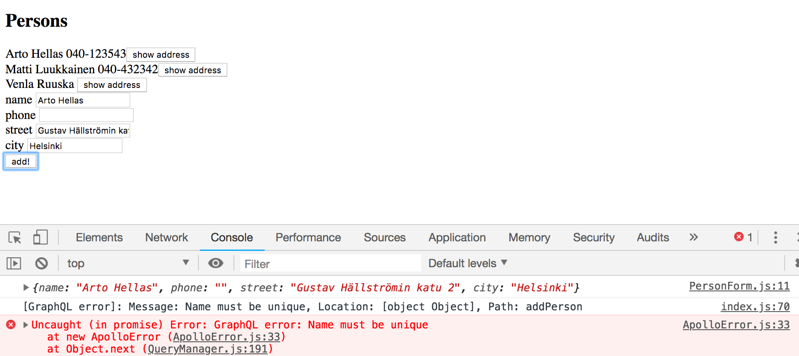

Poikkeus on syytä käsitellä. Eräs tapa poikkeusten käsittelyyn on rekisteröidä mutaatiolle poikkeuksenkäsittelijä [onError](https://www.apollographql.com/docs/react/essentials/mutations.html#props)-propsin avulla:

```js
const App = () => {
  // highlight-start
  const [errorMessage, setErrorMessage] = useState(null)

  const handleError = (error) => {
    setErrorMessage(error.graphQLErrors[0].message)
    setTimeout(() => {
      setErrorMessage(null)
    }, 10000)
  }
  // highlight-end

  return (
    <div>
    // highlight-start
      {errorMessage&&
        <div style={{color: 'red'}}>
          {errorMessage}
        </div>
      }
      // highlight-end
      <ApolloConsumer>
        // ...
      </ApolloConsumer>

      <h2>create new</h2>
      <Mutation
        mutation={createPerson} 
        refetchQueries={[{ query: allPersons }]}
        onError={handleError} // highlight-line
      >
        {(addPerson) =>
          <PersonForm
            addUser={addPerson}
          />
        }
      </Mutation>
    </div>
  )
}
```

Poikkeuksesta tiedotetaan nyt käyttäjälle yksinkertaisella notifikaatiolla.

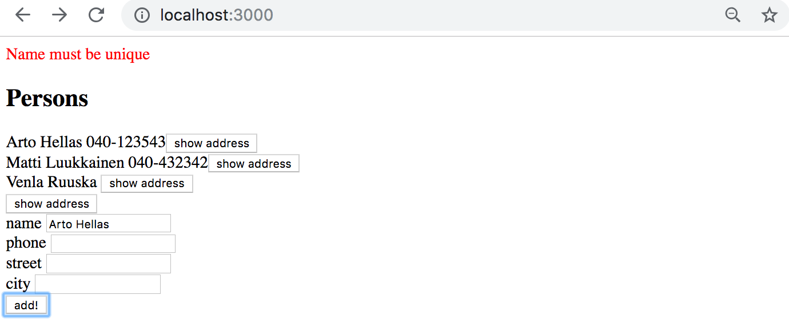

Sovelluksen tämänhetkinen koodi on kokonaisuudessaan [githubissa](https://github.com/fullstack-hy2019/graphql-phonebook-frontend/tree/part8-3), branchissa <i>part8-3</i>.

### Puhelinnumeron päivitys

Tehdään sovellukseen mahdollisuus vaihtaa henkilöiden puhelinnumeroita. Ratkaisu on lähes samanlainen kuin uuden henkilön lisäykseen käytetty.

Mutaatio edellyttää jälleen muuttujien käyttöä.

```js
const EDIT_NUMBER = gql`
mutation editNumber($name: String!, $phone: String!) {
  editNumber(name: $name, phone: $phone)  {
    name
    phone
    address {
      street
      city
    }
    id
  }
}
`
```

Tehdään lisäys <i>App</i>-komponenttiin:

```js

const App = () => {
  // ...
  return (
    <div>
      {errorMessage && ... }
      <ApolloConsumer>
        // ...
      </ApolloConsumer>
      
      <h2>create new</h2>
      <Mutation mutation={CREATE_PERSON}>
        // ...
      </Mutation>

      // highlight-start
      <h2>change number</h2>
      <Mutation
        mutation={EDIT_NUMBER}
      >
        {(editNumber) =>
          <PhoneForm
            editNumber={editNumber}
          />
        }
      </Mutation>   
      // highlight-end    
    </div>
  )
}
```

Muutoksen suorittava komponentti <i>PhoneForm</i> on suoraviivainen, se kysyy lomakkeen avulla henkilön nimeä ja uutta puhelinnumeroa, ja kutsuu mutaation tekevää funktiota _editNumber_:

```js
const PersonForm = (props) => {
  const [name, setName] = useState('')
  const [phone, setPhone] = useState('')

  const submit = async (e) => {
    e.preventDefault()

    await props.editNumber({
      variables: { name, phone }
    })

    setName('')
    setPhone('')
  }

  return (
    <div>
      <form onSubmit={submit}>
        <div>
          name <input
            value={name}
            onChange={({ target }) => setName(target.value)}
          />
        </div>
        <div>
          phone <input
            value={phone}
            onChange={({ target }) => setPhone(target.value)}
          />
        </div>
        <button type='submit'>change number</button>
      </form>
    </div>
  )
}
```

Ulkoasu on karu mutta toimiva:

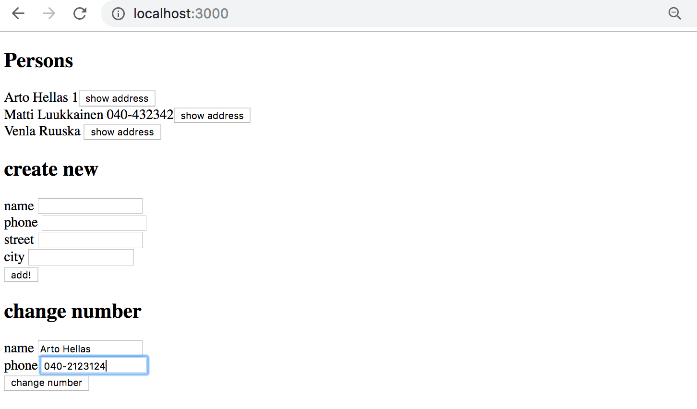

Kun numero muutetaan, päivittyy se hieman yllättäen automaattisesti komponentin <i>Persons</i> renderöimään nimien ja numeroiden listaan. Tämä johtuu kahdesta seikasta. Ensinnäkin koska henkilöillä on identifioiva, tyyppiä <i>ID</i> oleva kenttä, päivittyy henkilö välimuistissa uusilla tiedoilla päivitysoperaation yhteydessä. Toinen syy näkymän päivittymiselle on se, että komponentin <i>Query</i> avulla tehdyn kyselyn palauttama data huomaa välimuistiin tulleet muutokset ja päivittää itsensä automaattisesti. Tämä koskee ainoastaan kyselyn alunperin palauttamia olioita, ei välimuistiin lisättäviä kokonaan uusia olioita, jotka uudelleen tehtävä kysely palauttaisi.

Jos yritämme vaihtaa olemattomaan nimeen liittyvän puhelinnumeron, ei mitään näytä tapahtuvan. Syynä tälle on se, että jos nimeä vastaavaa henkilöä ei löydy, vastataan kyselyyn <i>null</i>:

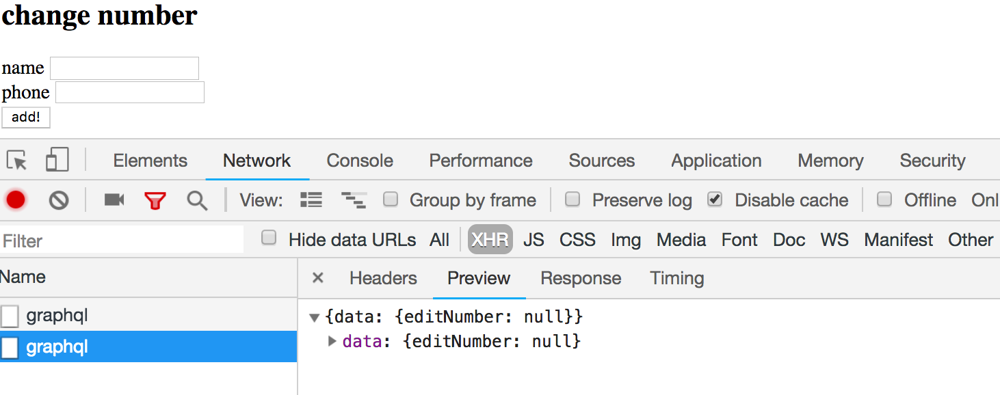

Sovelluksen tämänhetkinen koodi on kokonaisuudessaan [githubissa](https://github.com/fullstack-hy2019/graphql-phonebook-frontend/tree/part8-4), branchissa <i>part8-4</i>.

### Apollo Client ja sovelluksen tila

Esimerkissämme sovelluksen tilan käsittely on siirtynyt suurimmaksi osaksi Apollo Clientin vastuulle. Tämä onkin melko tyypillinen ratkaisu GraphQL-sovelluksissa. Esimerkkimme käyttää Reactin komponenttien tilaa ainoastaan lomakkeen tilan hallintaan sekä virhetilanteesta kertovan notifikaation näyttämiseen. GraphQL:ää käytettäessä voikin olla, että ei ole enää kovin perusteltuja syitä siirtää sovelluksen tilaa ollenkaan Reduxiin. 

Apollo mahdollistaa tarvittaessa myös sovelluksen paikallisen tilan tallettamisen [Apollon välimuistiin](https://www.apollographql.com/docs/react/essentials/local-state.html).

### Render props

GraphQL:n <i>Query</i>, <i>Mutation</i> ja <i>ApolloConsumer</i> komponentit noudattavat periaatetta, joka kulkee nimellä [render props](https://reactjs.org/docs/render-props.html). Periaatetta noudattava komponentti saa propsina tai tagiensa välissä lapsina (joka on teknisesti ottaen myös props) <i>funktion</i>, joka määrittelee miten komponentin renderöinti tapahtuu. Render props -periaatten avulla on mahdollista siirtää renderöinnistä huolehtivalle komponentille joko dataa tai funktioviitteitä.

Render props -periaate on ollut viime aikoina melko suosittu, mm. osassa 7 käsittelemämme [react router](/osa7/react_router) käyttää sitä. React routerin komponentin <i>Route</i> avulla määritellään mitä sovellus renderöi selaimen ollessa tietyssä urlissa. Seuraavassa määritellään, että jos selaimen url on <i>/notes</i>, renderöidään komponentti <i>Notes</i>, jos taas selaimen url on esim. <i>/notes/10</i>, renderöidään komponentti <i>Note</i>, joka saa propsina muistiinpano-olion, jonka id on 10.

```js
<Router>
  <div>
    // ...
    <Route exact path='/notes' render={() => 
      <Notes notes={notes} />
    } />    
    <Route exact path='/notes/:id' render={({ match }) =>
      <Note note={noteById(match.params.id)} />
    } />
  </div>
</Router>
```

Urleja vastaavat komponentit on määritelty render propseina. Render props -funktion avulla renderöitävälle komponentille on mahdollista välittää tietoa, esim. yksittäisen muistiinpanon sivu saa propsina urliaan vastaavan muistiinpanon.

Itse en ole suuri render propsien fani. React routerin yhteydessä ne vielä menettelevät, mutta erityisesti GraphQL:n yhteydessä niiden käyttö tuntuu erittäin ikävältä. 

Joudumme esimerkissämme käärimään komponentin <i>Persons</i> ikävästi kahden render props -komponentin sisälle:

```js
<ApolloConsumer>
  {(client) => 
    <Query query={allPersons}>
      {(result) => <Persons result={result} client={client} />}
    </Query> 
  }
</ApolloConsumer>
```

Muutaman kuukauden kuluessa asiaan on kuitenkin odotettavissa muutoksia ja Apollo Clientiin tullaan lisäämään rajapinta, jonka avulla kyselyjä ja mutaatioita on mahdollista tehdä [hookien avulla](https://github.com/apollographql/react-apollo/issues/2539). 

Yleisemminkin trendinä on se, että hookeilla tullaan useissa tapauksissa korvaamaan tarve render propsien käyttöön.

### react-apollo-hooks

Jo tällä hetkellä on olemassa kirjasto [react-apollo-hooks](https://github.com/trojanowski/react-apollo-hooks), joka mahdollistaa Apollo clientin käytön hookien avulla. Asennetaan kirjasto.

```js
npm install --save react-apollo-hooks
```

Otetaan nyt apollo-hookit käyttöön sovelluksessa. Muutetaan <i>index.js</i> ensin muotoon, joka mahdollistaa yhtäaikaisen hookien ja Query- sekä Mutation-komponenttien käytön:

```js
import ApolloClient from 'apollo-boost'
import { ApolloProvider } from 'react-apollo'
import { ApolloProvider as ApolloHooksProvider } from 'react-apollo-hooks' // highlight-line

const client = new ApolloClient({
  uri: 'http://localhost:4000/graphql'
})

ReactDOM.render(
  <ApolloProvider client={client}>
    <ApolloHooksProvider client={client}> // highlight-line
      <App />
    </ApolloHooksProvider> // highlight-line
  </ApolloProvider>,
  document.getElementById('root')
)
```

Muutetaan komponenttia <i>Persons</i> siten, että se käyttää _useApolloClient_-hookia.

```js
import React,  {useState } from 'react'
import { gql } from 'apollo-boost'
import { useApolloClient } from 'react-apollo-hooks' // highlight-line

// ...

const Persons = ({ result }) => { // highlight-line
  const client = useApolloClient() // highlight-line
  // ...
}
```

Komponentti <i>App</i> yksinkertaistuu, render props -komponentti <i>ApolloConsumer</i> voidaan poistaa:

```js
const App = () => {

  return(
    <div>
      {errorMessage &&
        <div style={{ color: 'red' }}>
          {errorMessage}
        </div>
      }
      // highlight-start
      <Query query={ALL_PERSONS}>
        {(result) => <Persons result={result} />}
      </Query> 
      // highlight-end
      // ...
    </div>
  )
}
```

Hankkiudutaan seuraavaksi eroon komponentista <i>Query</i> hookin _useQuery_ avulla. Komponentti <i>App</i> yksinkertaistuu edelleen:

```js
import { useQuery } from 'react-apollo-hooks' // highlight-line

const App = () => {
  const result = useQuery(ALL_PERSONS) // highlight-line

  // ...

  return (
    <div>
      {errorMessage &&
        <div style={{ color: 'red' }}>
          {errorMessage}
        </div>
      }

      <Persons result={result} /> // highlight-line

      <Mutation
        mutation={createPerson} 
        refetchQueries={[{ query: allPersons }]}
        onError={handleError}
      >
        {(addPerson) =>
          <PersonForm
            addUser={addPerson}
          />
        }
      </Mutation>
      // ...
    </div>
  )
}
```

<i>Mutation</i>-komponentit saadaan korvattua hookin _useMutation_ avulla. Komponentin <i>App</i> lopullinen muoto on seuraava:

```js
import { useQuery, useMutation } from 'react-apollo-hooks' // highlight-line

const App = () => {
  const result = useQuery(ALL_PERSONS)

  const [errorMessage, setErrorMessage] = useState(null)

  const handleError = (error) => {
    // ...
  }

  // highlight-start
  const addPerson = useMutation(CREATE_PERSON, {
    onError: handleError,
    refetchQueries: [{ query: ALL_PERSONS }]
  })
  // highlight-end

  // highlight-start
  const editNumber = useMutation(EDIT_NUMBER)
  // highlight-end

  return (
    <div>
      {errorMessage &&
        <div style={{ color: 'red' }}>
          {errorMessage}
        </div>
      }
      <Persons result={result} />

      <h2>create new</h2>
      <PersonForm addPerson={addPerson} /> // highlight-line

      <h2>change number</h2>
      <PhoneForm editNumber={editNumber} /> // highlight-line  
    </div>
  )
}
```

Lopputulos on todellakin monin verroin selkeämpi kuin render props -komponentteja käyttävä sotku. Voimme yhtyä Ryan Florencen React Confissa 2018 esittämään mielipiteeseen [90% Cleaner React With Hooks](https://www.youtube.com/watch?v=wXLf18DsV-I).

Apollo-tiimi on lupaillut että suora hook-tuki ilmestyy kevään aikana. Ennen suoran tuen toteuttamista voi jo melko turvallisin mielin käyttää kirjastoa [react-apollo-hooks](https://github.com/trojanowski/react-apollo-hooks).

Koska render props -komponenteista on päästy kokonaan eroon, yksinkertaistuu <i>index.js</i> seuraavasti

```js
import React from 'react'
import ReactDOM from 'react-dom'
import App from './App'

import ApolloClient from 'apollo-boost'
import { ApolloProvider } from 'react-apollo-hooks'

const client = new ApolloClient({
  uri: 'http://localhost:4000/graphql'
})

ReactDOM.render(
  <ApolloProvider client={client}>
    <App />
  </ApolloProvider>,
  document.getElementById('root')
)
```

Sovelluksen kirjastoa react-apollo-hooks käyttävä koodi on kokonaisuudessaan [githubissa](https://github.com/fullstack-hy2019/graphql-phonebook-frontend/tree/part8-5), branchissa <i>part8-5</i>.


</div>

<div class="tasks">

### Tehtäviä

Tehtävissä toteutetaan edellisen osan tehtävissä tehdylle backendille frontend.

Ota sovelluksesi lähtökohdaksi [tämä projekti](https://github.com/fullstack-hy2019/library-frontend).

Voit tehdä sovelluksesi joko käyttäen Apollo Clientin render prop -komponentteja <i>Query</i> ja <i>Mutation</i> tai käyttää kirjastoa [react-apollo-hooks](https://github.com/trojanowski/react-apollo-hooks).

#### 8.8: Kirjailijoiden näkymä

Toteuta kirjailijoiden näkymä, eli näytä sivulla kaikkien kirjailijoiden tiedot esim. seuraavasti:

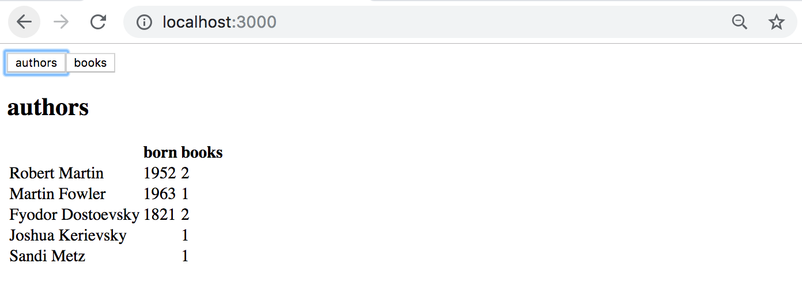

#### 8.9: Kirjojen näkymä

Toteuta kirjojen näkymä, eli näytä sivulla kirjoista muut tiedot paitsi genret.


#### 8.10: Kirjan lisäys

Toteuta sovellukseen mahdollisuus uusien kirjojen lisäämiseen.

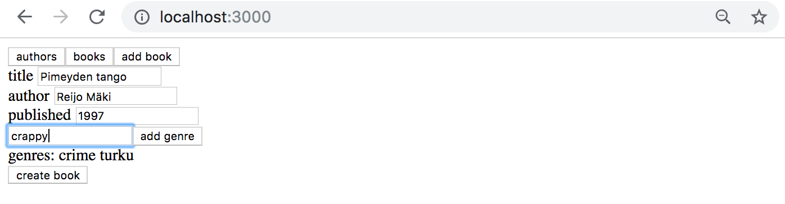

Huolehdi siitä, että kirjailijoiden ja kirjojen näkymä pysyy ajantasaisena lisäyksen jälkeen.

#### 8.11: Kirjailijan syntymävuosi

Tee sovellukseen mahdollisuus asettaa kirjailijalle syntymävuosi. Voit tehdä syntymävuoden asettamista varten oman näkymän tai sijoittaa sen kirjailijat näyttävälle sivulle:

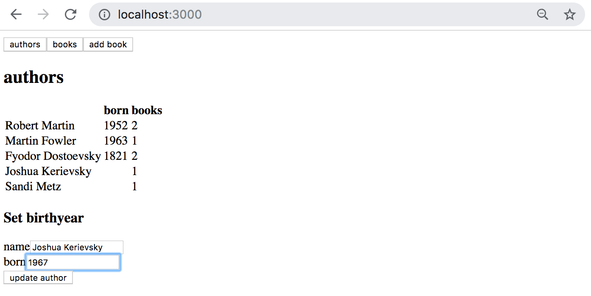

Huolehdi siitä, että kirjailijoiden näkymä pysyy ajantasaisena lisäyksen jälkeen.

#### 8.12: Kirjailijan syntymävuosi advanced

Tee syntymävuoden asetuslomakkeesta [select-tagin](https://reactjs.org/docs/forms.html#the-select-tag), kirjaston [react-select](https://github.com/JedWatson/react-select) tai jonkun muun mekanismin avulla sellainen, että syntymävuoden voi asettaa ainoastaan olemassaolevalle kirjailijalle.

react-select-kirjastoa hyödyntävä ratkaisu näyttää seuraavalta

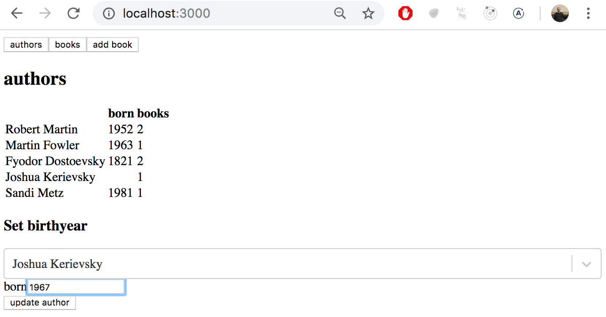

</div>
