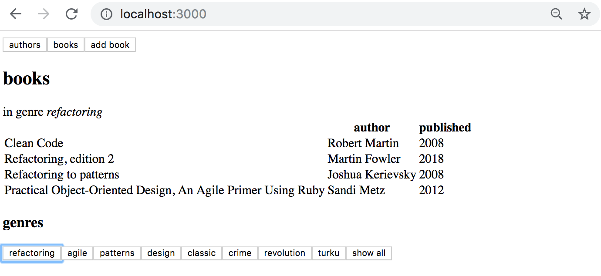

### kanta

### blogisovllus

### vouttaus

### laikkaus

### cachen päivitys

### authi

### paginatio

### subscriptiot

### Frontti

GraphQL on jo melko iäkäs teknologia, se on ollut Facebookin sisäisessä käytössä jo vuodesta 2012 lähtien, teknologian voi siis todeta olevan "battle tested". Facebook julkaisi GraphQL:n vuonna 2015 ja se on pikkuhiljaa saanut enenevissä määrin huomiota ja nousee ehkä lähivuosina uhmaamaan REST:in valta-asemaa.

### Tehtäviä

#### DEPRECATED: Genren kirjat

Laajenna sovellustasi siten, että kirjojen näkymästä voidaan rajata näytettävä kirjalista ainoastaan niihin jotka kuuluvat valittuun genreen. Toteutuksesi voi näyttää seuraavalta:

#### DEPRECATED: Genren kirjat GraphQL:llä

Tietyn genren kirjoihin rajoittamisen voi tehdä kokonaan React-sovelluksen puolella. Voit merkitä tämän tehtävän, jos rajaat näytettävät kirjat tahtävässä 8.5 palvelimeen toteutetun suoran GraphQ-kyselyn avulla. 

Tämä tehtävä voi olla haastava ja niin kurssin tässä vaiheessa jo kuuluukin olla. Muutama vihje
- komponetin <i>Query</i> tai hookin <i>useQuery</i> käyttö kannattaa kirjalistan osalta sillä kysely on pystyttävä tekemään käyttäjän valitessa haluamansa genren
- GraphQL-kyselyjen tuloksia kannatta joskus tallentaan komponentin tilaan
- huomaa, että voit tehdä GraphQL-kyselyjä <i>useEffect</i>-hookissa
- <i>useEffect</i>-hookin [toisesta parametrista](https://reactjs.org/docs/hooks-reference.html#conditionally-firing-an-effect) voi olla tehtävässä apua, se tosin riippuu käyttämästäsi lähestymistavasta.

