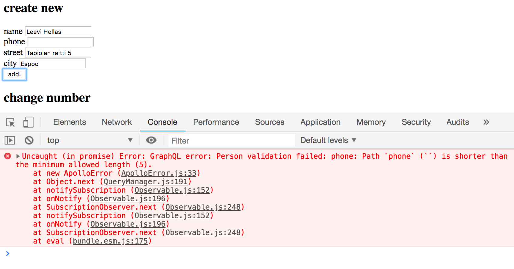

<div class="content">

Sovelluksen frontend toimii puhelinluettelon näyttämisen osalta päivitetyn palvelimen kanssa. Jotta luetteloon voitaisiin lisätä henkilöitä, tulee backendiin toteuttaa kirjautuminen.

### Käyttäjän kirjautuminen

Lisätään sovelluksen tilaan muuttuja _token_, joka tallettaa tokenin siinä vaiheessa kun käyttäjä on kirjautunut. Jos _token_ ei ole määritelty, näytetään kirjautumisesta huolehtiva komponentti <i>LoginForm</i>, joka saa parametriksi mutaation tekevän funktion _login_:

```js
const LOGIN = gql`
  mutation login($username: String!, $password: String!) {
    login(username: $username, password: $password)  {
      value
    }
  }
`

const App = () => {
  const [token, setToken] = useState(null)

  // ...

  const login = useMutation(LOGIN)

  const errorNotification = () => errorMessage &&
    <div style={{ color: 'red' }}>
      {errorMessage}
    </div>

  if (!token) {
    return (
      <div>
        {errorNotification()}
        <h2>Login</h2>
        <LoginForm
          login={login}
          setToken={(token) => setToken(token)}
          handleError={handleError}
        />
      </div>
    )
  }

  return (
    // ...
  )
}
```

Jos kirjautuminen onnistuu, eli funktio _login_ ei heitä poikkeusta, talletetaan funktion palauttama <i>token</i> komponentin <i>App</i> tilaan. Token talletetaan myös <i>local storageen</i>, näin siihen on helpompi päästä käsiksi siinä vaiheessa kun haluamme asettaa tokenin <i>Authorization</i>-headeriin.

Jos operaatio epäonnistuu, kutsutaan propsina saatua funktiota, joka asettaa komponentin <i>App</i> tilaan käyttäjälle näytettävän virheilmoituksen:

```js
import React, { useState } from 'react'

const LoginForm = (props) => {
  const [username, setUsername] = useState('')
  const [password, setPassword] = useState('')

  const submit = async (event) => {
    event.preventDefault()

    try {
      const result = await props.login({
        variables: { username, password }
      })

      const token = result.data.login.value

      props.setToken(token)
      localStorage.setItem('phonenumbers-user-token', token)
    } catch(error){
      props.handleError(error)
    }
  }

  return (
    <div>
      <form onSubmit={submit}>
        <div>
          username <input
            value={username}
            onChange={({ target }) => setUsername(target.value)}
          />
        </div>
        <div>
          password <input
            type='password'
            value={password}
            onChange={({ target }) => setPassword(target.value)}
          />
        </div>
        <button type='submit'>login</button>
      </form>
    </div>
  )
}

export default LoginForm
```

Lisätään sovellukselle myös nappi, jonka avulla kirjautunut käyttäjä voi kirjautua ulos. Napin klikkauskäsittelijässä asetetaan  _token_ tilaan null, poistetaan token local storagesta ja resetoidaan Apollo clientin välimuisti. Tämä on [tärkeää](https://www.apollographql.com/docs/react/recipes/authentication.html#login-logout), sillä joissain kyselyissä välimuistiin on saatettu hakea dataa, johon vain kirjaantuneella käyttäjällä on oikeus päästä käsiksi.


```js
const App = () => {
  const client = useApolloClient()

  // ...

  const logout = () => {
    setToken(null)
    localStorage.clear()
    client.resetStore()
  }

  // ...
}

```

Sovelluksen tämän vaiheen koodi [githubissa](https://github.com/fullstack-hy2019/graphql-phonebook-frontend/tree/part8-6), branchissa <i>part8-6</i>.

### Tokenin lisääminen headeriin

Backendin muutosten jälkeen uusien henkilöiden lisäys puhelinluetteloon vaatii sen, että käyttäjän token lähetetään pyynnön mukana. Jotta saamme tokenin lähetettyä pyyntöjen mukana, joudumme hieman muuttamaan tapaa, jonka avulla määrittelemme _ApolloClient_-olion tiedostossa <i>index.js</i>

```js
import React from 'react'
import ReactDOM from 'react-dom'
import App from './App'
import ApolloClient from 'apollo-boost' // highlight-line
import { ApolloProvider } from 'react-apollo-hooks'

// highlight-start
const client = new ApolloClient({
  uri: "http://localhost:4000/graphql"
})
// highlight-end

ReactDOM.render(
  <ApolloProvider client={client}>
    <App />
  </ApolloProvider>,
  document.getElementById('root')
)
```

Määrittely käyttää apunaan [apollo-boost](https://github.com/apollographql/apollo-client/tree/master/packages/apollo-boost)-kirjastoa, joka dokumentaationsa mukaan

> <i>Apollo Boost is a zero-config way to start using Apollo Client. It includes some sensible defaults, such as our recommended InMemoryCache and HttpLink, which come configured for you with our recommended settings.</i>

Eli apollo-boost tarjoaa helpon tavan konfiguroida _ApolloClient_ useisiin tilanteisiin riittävillä oletusasetuksilla. 

Vaikka apollo-boostilla olisi myös mahdollista konfiguroida pyyntöihin asetettavat headerit, luovutaan nyt apollo-boostin käytöstä ja tehdään konfiguraatio kokonaan itse.

Konfiguraatio on seuraavassa:

```js
import { ApolloClient } from 'apollo-client'
import { createHttpLink } from 'apollo-link-http'
import { InMemoryCache } from 'apollo-cache-inmemory'
import { setContext } from 'apollo-link-context'

const httpLink = createHttpLink({
  uri: 'http://localhost:4000/graphql',
})

const authLink = setContext((_, { headers }) => {
  const token = localStorage.getItem('phonenumbers-user-token')
  return {
    headers: {
      ...headers,
      authorization: token ? `bearer ${token}` : null,
    }
  }
})

const client = new ApolloClient({
  link: authLink.concat(httpLink),
  cache: new InMemoryCache()
})
```

Konfiguraatio edellyttää kahden kirjaston asentamista:

```js
npm install --save apollo-link apollo-link-context
```

_client_ muodostetaan nyt kirjaston [apollo-link](https://www.apollographql.com/docs/link/index.html) tarjoaman konstruktorifunktion [ApolloClient](https://www.apollographql.com/docs/react/api/apollo-client.html#apollo-client). Parametreja on kaksi, _link_ ja _cache_. Näistä jälkimmäinen määrittelee, että sovelluksen käyttöön tulee keskusmuistissa toimiva välimuisti [InMemoryCache](https://www.apollographql.com/docs/react/advanced/caching.html#smooth-scroll-top). 

Ensimmäinen parametri _link_ määrittelee sen, miten client ottaa yhteyttä palvelimeen, jonka pohjalla on [httpLink](https://www.apollographql.com/docs/link/links/http.htm), eli normaali HTTP:n yli tapahtuva yhteys, jota on höystetty siten, että pyyntöjen mukaan [asetetaan headerille](https://www.apollographql.com/docs/react/recipes/authentication.html#Header) <i>authorization</i> arvoksi localStoragessa mahdollisesti oleva token.

Uusien henkilöiden lisäys ja numeroiden muuttaminen toimii taas. Sovellukseen jää kuitenkin yksi ongelma. Jos yritämme lisätä puhelinnumerotonta henkilöä, se ei onnistu.



Validointi epäonnistuu, sillä frontend lähettää kentän _phone_ arvona tyhjän merkkijonon. 

Muutetaan uuden henkilön luovaa funktiota siten, että se asettaa kentälle _phone_  arvon _null_, jos käyttäjä ei ole syöttänyt kenttään mitään:

```js
const PersonForm = (props) => {
  // ...
  const submit = async (e) => {
    e.preventDefault()

    await props.addPerson({ 
      variables: { 
        name, street, city, // highlight-line
        phone: phone.length>0 ? phone : null // highlight-line
      } 
    })

  // ...
  }

  // ...
}
```

Sovelluksen tämän vaiheen koodi [githubissa](https://github.com/fullstack-hy2019/graphql-phonebook-frontend/tree/part8-7), branchissa <i>part8-7</i>.

### Välimuistin päivitys revisited

Uusien henkilöiden lisäyksen yhteydessä on siis 
[päivitettävä](/osa8/react_ja_graph_ql#valimuistin-paivitys) Apollo clientin välimuisti. Päivitys tapahtuu määrittelemällä mutaation yhteydessä option _refetchQueries_ avulla, että kysely <em>ALL\_PERSONS</em> on suoritettava uudelleen:


```js 
const App = () => {
  // ...

  const addPerson = useMutation(CREATE_PERSON, {
    onError: handleError,
    refetchQueries: [{ query: ALL_PERSONS }]
  })

  // ..
}
```

Lähestymistapa on kohtuullisen toimiva, ikävänä puolena on toki se, että päivityksen yhteydessä suoritetaan aina myös kysely. 

Ratkaisua on mahdollista optimoida hoitamalla välimuistin päivitys itse. Tämä tapahtuu määrittelemällä mutaatiolle sopiva [update](https://www.apollographql.com/docs/react/advanced/caching.html#after-mutations)-callback, jonka Apollo suorittaa mutaation päätteeksi: 


```js 
const App = () => {
  // ...

  const addPerson = useMutation(CREATE_PERSON, {
    onError: handleError,
    // highlight-start
    update: (store, response) => {
      const dataInStore = store.readQuery({ query: ALL_PERSONS })
      dataInStore.allPersons.push(response.data.addPerson)
      store.writeQuery({
        query: ALL_PERSONS,
        data: dataInStore
      })
    }
    // highlight-end
  })
 
  // ..
}  
```

Callback-funktio saa parametriksi viitteen välimuistiin sekä mutaation mukana palautetun datan, eli esimerkkimme tapauksessa lisätyn käyttäjän.

Koodi lukee funktion [readQuery](https://www.apollographql.com/docs/react/advanced/caching.html#readquery) avulla kyselyn <em>ALL\_PERSONS</em> välimuistiin talletetun tilan ja päivittää välimuistin funktion [writeQuery](https://www.apollographql.com/docs/react/advanced/caching.html#writequery-and-writefragment) avulla lisäten henkilöiden joukkoon mutaation lisäämän henkilön.

On myös olemassa tilanteita, joissa ainoa järkevä tapa saada välimuisti pidettyä ajantasaisena on _update_-callbackillä tehtävä päivitys. 

Tarvittaessa välimuisti on mahdollista kytkeä pois päältä joko koko sovelluksesta tai yksittäisiltä kyselyiltä määrittelemällä välimuistin käyttöä kontrolloivalle [fetchPolicy](https://www.apollographql.com/docs/react/api/react-apollo.html#query-props):lle arvo <em>no-cache</em>. 

Voisimme määritellä, että yksittäisen henkilön osoitetietoja ei tallenneta välimuistiin:

```js 
const Persons = ({ result }) => {
  // ...
  const show = async (name) => {
    const { data } = await client.query({
      query: FIND_PERSON,
      variables: { nameToSearch: name },
      fetchPolicy: 'no-cache' // highlight-line
    })
    setPerson(data.findPerson)
  }

  // ...
}
``` 

Jätämme kuitenkin koodin ennalleen. 

Välimuistin kanssa kannattaa olla tarkkana. Välimuistissa oleva epäajantasainen data voi aiheuttaa vaikeasti havaittavia bugeja. Kuten tunnettua, välimuistin ajantasalla pitäminen on erittäin haastavaa. Koodareiden joukossa kulkevan kansanviisauden mukaan 

> <i>There are only two hard things in Computer Science: cache invalidation and naming things.</i> Katso lisää [täältä](https://www.google.com/search?q=two+hard+things+in+Computer+Science&oq=two+hard+things+in+Computer+Science).


Sovelluksen tämän vaiheen koodi [githubissa](https://github.com/fullstack-hy2019/graphql-phonebook-frontend/tree/part8-8), branchissa <i>part8-8</i>.

</div>

<div class="tasks">

### Tehtäviä

#### 8.17 Kirjojen lista

Backendin muutosten jälkeen kirjojen lista ei enää toimi. Korjaa se.

#### 8.18 Kirjautuminen

Kirjojen lisäys ja kirjailijan syntymävuoden muutos eivät toimi, sillä ne edellyttävät kirjautumista. 

Toteuta sovellukseesi kirjautuminen ja korjaa mutaatiot.

Sovelluksesi ei ole pakko käsitellä validointivirheitä järkevästi.

Voit päättää itse miltä kirjautuminen näyttää käyttöliittymässä. Eräs mahdollinen ratkaisu on tehdä kirjautumislomakkeesta erillinen näkymä jonne pääsee sovelluksen navigaatiomenusta:


Kirjatumislomake


Kun käyttäjä on kirjautuneena, muutetaan navigaatio näyttämään ne toiminnot, jotka ovat vain kirjautuneen käytettävissä


#### 8.19 genren kirjat, osa 1

Laajenna sovellustasi siten, että kirjojen näkymästä voidaan rajata näytettävä kirjalista ainoastaan niihin, jotka kuuluvat valittuun genreen. Toteutuksesi voi näyttää seuraavalta:


#### 8.20 genren kirjat

Tee sovellukseen näkymä, joka näyttää kirjautuneelle käyttäjälle käyttäjän lempigenreen kuuluvat kirjat.


#### 8.21 genren kirjat GraphQL:llä

Tietyn genren kirjoihin rajoittamisen voi tehdä kokonaan React-sovelluksen puolella. Voit merkitä tämän tehtävän, jos rajaat näytettävät kirjat tahtävässä 8.5 palvelimelle toteutetun suoran GraphQL-kyselyn avulla. 

Tämä **tehtävä on haastava** ja niin kurssin tässä vaiheessa jo kuuluukin olla. Muutama vihje
- Komponetin <i>Query</i> tai hookin <i>useQuery</i> käytön sijaan saattaa olla parempi tehdä kyselyitä suoraan _client_-oliolla, jonhon päästään käsiksi komponentin [ApolloConsumer](https://www.apollographql.com/docs/react/essentials/queries.html#manual-query) tai hookilla [useApolloClient](https://github.com/trojanowski/react-apollo-hooks#useapolloclient), katso lisää [täältä](/osa8/react_ja_graph_ql#nimetyt-kyselyt-ja-muuttujat).
- GraphQL-kyselyjen tuloksia kannattaa joskus tallentaan komponentin tilaan.
- Huomaa, että voit tehdä GraphQL-kyselyjä <i>useEffect</i>-hookissa.
- <i>useEffect</i>-hookin [toisesta parametrista](https://reactjs.org/docs/hooks-reference.html#conditionally-firing-an-effect) voi olla tehtävässä apua, se tosin riippuu käyttämästäsi lähestymistavasta.

#### 8.22 kirjasuositukset, välimuistin ajantasaisuus

Jos haet kirjasuositukset GraphQL:llä, varmista jollain tavalla se, että kirjojen näkymä säilyy ajantasaisena. Eli kun lisäät uuden kirjan, päivittyy se kirjalistalle **viimeistään** siinä vaiheessa kun painat jotain genrevalintanappia. Ilman uuden genrevalinnan tekemistä, ei näkymän ole pakko päivittyä. 

</div>
